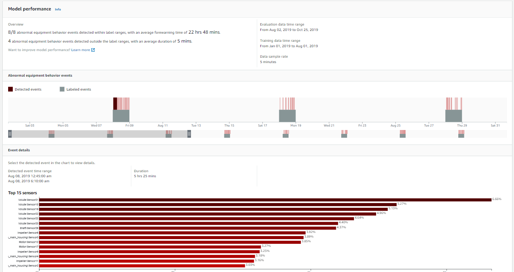

On October 7, 2026, AWS will discontinue support for
Amazon Lookout for Equipment. After October 7, 2026, you will no longer be
able to access the Lookout for Equipment console or resources. For more
information,
[see the following](https://aws.amazon.com/blogs/machine-learning/preserve-access-and-explore-alternatives-for-amazon-lookout-for-equipment/ "https://aws.amazon.com/blogs/machine-learning/preserve-access-and-explore-alternatives-for-amazon-lookout-for-equipment/").

# Evaluating your model

You can view the ML models you've trained on the datasets containing the data from
your equipment. If you've used part of your dataset for training and the other part for
evaluation, you can see and evaluate the model's performance. You can also see which
sensors were used to create a model. If you need better performance, you can use
different sensors for training your next model.

Amazon Lookout for Equipment provides an overview of the model's performance and detailed information
about abnormal equipment behavior events. An abnormal equipment behavior event is a
situation where the model detected an anomaly in the sensor data that could lead to your
asset malfunctioning or failing. You can see how well the model performed in detecting
those events.

If you've provided Amazon Lookout for Equipment with [label](understanding-labeling.md "understanding-labeling.md") data
for your dataset, you can see how the model's predictions compare to the label data. It
shows the average forewarning time across all true positives. Forewarning time is the
average length of time between when the model first finds evidence that something might be
going wrong and when it actually detects the equipment abnormality.

For example, you can have a circumstance where Amazon Lookout for Equipment detects six of the seven
abnormal behavior events in your labeled evaluation data. In six out of the seven
events, on average, it might have provided an indication that something was off 32 hours
before it detected an abnormality. For this situation, we would say that Lookout for Equipment averaged
32 hours of forewarning.

Amazon Lookout for Equipment also reports the results where it incorrectly identified an abnormal
behavior event in the label data. The label data that you provide when you create a
dataset has a time range for abnormal equipment events. You specify the duration of the
abnormal events in the label data. In the evaluation data, the model used by Lookout for Equipment could
incorrectly identify abnormal events outside of the equipment range. You can see how
often the model identifies these events when you evaluate the model's
performance.

Pointwise model diagnostics for an Amazon Lookout for Equipment model provides an evaluation of the model's
performance at the individual events level. You can use the AWS SDK to get the pointwise
model diagnostics for a model.

###### Topics

- [Viewing the results for a model](#view-model-console "#view-model-console")
- [Getting pointwise model diagnostics for a model (SDK)](#evaluate-model-point-wise "#evaluate-model-point-wise")

## Viewing the results for a model

###### Note

You can get the evaluation results for a Lookout for Equipment model [with the SDK](SDK-examples.md#view-model-sdk "SDK-examples.md#view-model-sdk").

###### To view the results for a model:

You can use this procedure to view model metrics in the console. To evaluate
how the model performed, you must provide data labels. If you provide data labels,
you can see when the model detected abnormal equipment behavior events.

1. Sign in to AWS Management Console and open the Amazon Lookout for Equipment console at [Amazon Lookout for Equipment
   console](https://console.aws.amazon.com/lookoutequipment/home "https://console.aws.amazon.com/lookoutequipment/home").
2. Choose a dataset.
3. Choose a model. You can see whether the model is ready to monitor the
   equipment.
4. Navigate to **Training and evaluation**.

In the following image, you can see metrics related to the performance. You can
see how many times the model identified abnormal equipment behavior events
incorrectly. You can also see which sensors played the largest role in the model
identifying the abnormal equipment behavior events. The console displays the top 15
sensors that contributed to the model identifying an abnormal equipment behavior
event.



## Getting pointwise model diagnostics for a model (SDK)

Pointwise model diagnostics for an Amazon Lookout for Equipment model is an evaluation of the model
performance at the individual events. During training, Amazon Lookout for Equipment generates an
anomaly score and sensor contribution diagnostics for each row in the input dataset. A higher anomaly
score indicates a higher likelihood of an abnormal event.

You get pointwise diagnostics when you train a model with [CreateModel](API_CreateModel.md "API_CreateModel.md"). The period for which
Lookout for Equipment generates model diagnostics depends on the following:

- If you specify the `EvaluationDataStartTime` and
  `EvaluationDataEndTime` request
  parameters, Lookout for Equipment generates model diagnostics for the period of time between `EvaluationDataStartTime` and
  `EvaluationDataEndTime`.
- If you supply `TrainingDataStartTime` and `TrainingDataEndTime`, but don't supply
  `EvaluationDataEndTime` and `EvaluationDataStartTime`,
  Lookout for Equipment generates model diagnostics for the period between `TrainingDataStartTime` and
  `TrainingDataEndTime`.
- If you don't specify an
  Evaluation or Training time range, Lookout for Equipment generates model diagnostics for the entire ingested
  data range in the input dataset.

If you want pointwise diagnostics for an existing model, use [UpdateModel](API_UpdateModel.md "API_UpdateModel.md") to provide the model
diagnostics configuration. Lookout for Equipment then creates pointwise diagnostics for the entire
retraining period.

For both `CreateModel` and `UpdateModel` operations, you need to
specify the [ModelDiagnosticsOutputConfiguration](API_ModelDiagnosticsOutputConfiguration.md "API_ModelDiagnosticsOutputConfiguration.md") request parameter. The
`S3OutputConfiguration` field specifies the Amazon S3 location where you want
Lookout for Equipment to save the pointwise model diagnostics for the training period. If you don't
specify `ModelDiagnosticsOutputConfiguration`, Lookout for Equipment doesn't create pointwise
model diagnostics for the model.

If you update `ModelDiagnosticsOutputConfiguration` with `UpdateModel`,
Lookout for Equipment only generates pointwise model diagnostics for future model versions.

You must specify an IAM role in the `RoleArn` request parameter with
permission to access the Amazon S3 bucket that you reference in
`ModelDiagnosticsOutputConfiguration`.

Amazon Lookout for Equipment creates pointwise model diagnostics for a model as a JSON format file.
Lookout for Equipment stores the JSON file as a compressed file (`model_diagnostics_results.json.gz`)
in the location you specify in `ModelDiagnosticsOutputConfiguration`.

The following is example JSON for a model evaluation.

```
{"timestamp": "2021-03-11T22:24:00.000000", "prediction": 0, "prediction_reason": "MACHINE_OFF"}
{"timestamp": "2021-03-11T22:25:00.000000", "prediction": 1, "prediction_reason": "ANOMALY_DETECTED", "anomaly_score": 0.72385, "diagnostics": [{"name": "component_5feceb66\\sensor0", "value": 0.02346}, {"name": "component_5feceb66\\sensor1", "value": 0.10011}, {"name": "component_5feceb66\\sensor2", "value": 0.11162}, {"name": "component_5feceb66\\sensor3", "value": 0.14419}, {"name": "component_5feceb66\\sensor4", "value": 0.12219}, {"name": "component_5feceb66\\sensor5", "value": 0.14936}, {"name": "component_5feceb66\\sensor6", "value": 0.17829}, {"name": "component_5feceb66\\sensor7", "value": 0.00194}, {"name": "component_5feceb66\\sensor8", "value": 0.05446}, {"name": "component_5feceb66\\sensor9", "value": 0.11437}]}
{"timestamp": "2021-03-11T22:26:00.000000", "prediction": 0, "prediction_reason": "NO_ANOMALY_DETECTED", "anomaly_score": 0.41227, "diagnostics": [{"name": "component_5feceb66\\sensor0", "value": 0.03533}, {"name": "component_5feceb66\\sensor1", "value": 0.24063}, {"name": "component_5feceb66\\sensor2", "value": 0.06327}, {"name": "component_5feceb66\\sensor3", "value": 0.08303}, {"name": "component_5feceb66\\sensor4", "value": 0.18598}, {"name": "component_5feceb66\\sensor5", "value": 0.10839}, {"name": "component_5feceb66\\sensor6", "value": 0.08721}, {"name": "component_5feceb66\\sensor7", "value": 0.06792}, {"name": "component_5feceb66\\sensor8", "value": 0.1309}, {"name": "component_5feceb66\\sensor9", "value": 0.07735}]}
{"timestamp": "2021-03-11T22:27:00.000000", "prediction": 0, "prediction_reason": "NO_ANOMALY_DETECTED", "anomaly_score": 0.10541, "diagnostics": [{"name": "component_5feceb66\\sensor0", "value": 0.02533}, {"name": "component_5feceb66\\sensor1", "value": 0.34063}, {"name": "component_5feceb66\\sensor2", "value": 0.07327}, {"name": "component_5feceb66\\sensor3", "value": 0.03303}, {"name": "component_5feceb66\\sensor4", "value": 0.18598}, {"name": "component_5feceb66\\sensor5", "value": 0.10839}, {"name": "component_5feceb66\\sensor6", "value": 0.08721}, {"name": "component_5feceb66\\sensor7", "value": 0.06792}, {"name": "component_5feceb66\\sensor8", "value": 0.1309}, {"name": "component_5feceb66\\sensor9", "value": 0.07735}]}
{"timestamp": "2021-03-11T22:28:00.000000", "prediction": 0, "prediction_reason": "NO_ANOMALY_DETECTED", "anomaly_score": 0.24867, "diagnostics": [{"name": "component_5feceb66\\sensor0", "value": 0.04533}, {"name": "component_5feceb66\\sensor1", "value": 0.14063}, {"name": "component_5feceb66\\sensor2", "value": 0.08327}, {"name": "component_5feceb66\\sensor3", "value": 0.07303}, {"name": "component_5feceb66\\sensor4", "value": 0.18598}, {"name": "component_5feceb66\\sensor5", "value": 0.10839}, {"name": "component_5feceb66\\sensor6", "value": 0.08721}, {"name": "component_5feceb66\\sensor7", "value": 0.06792}, {"name": "component_5feceb66\\sensor8", "value": 0.1309}, {"name": "component_5feceb66\\sensor9", "value": 0.07735}]}
{"timestamp": "2021-03-11T22:29:00.000000", "prediction": 1, "prediction_reason": "ANOMALY_DETECTED", "anomaly_score": 0.79376, "diagnostics": [{"name": "component_5feceb66\\sensor0", "value": 0.04533}, {"name": "component_5feceb66\\sensor1", "value": 0.14063}, {"name": "component_5feceb66\\sensor2", "value": 0.08327}, {"name": "component_5feceb66\\sensor3", "value": 0.07303}, {"name": "component_5feceb66\\sensor4", "value": 0.18598}, {"name": "component_5feceb66\\sensor5", "value": 0.10839}, {"name": "component_5feceb66\\sensor6", "value": 0.08721}, {"name": "component_5feceb66\\sensor7", "value": 0.06792}, {"name": "component_5feceb66\\sensor8", "value": 0.1309}, {"name": "component_5feceb66\\sensor9", "value": 0.07735}]}
```

The JSON fields are as follows:

- **timestamp** – The date and time (in ISO
  8601 format) that the event occurred.
- **prediction** – The prediction that the
  model made for the event. `0` for a normal event. `1` for
  an abnormal event.
- **prediction_reason** – The reason for the
  prediction. Valid values are `ANOMALY_DETECTED`,
  `NO_ANOMALY_DETECTED`, `MACHINE_OFF`.
- **anomaly_score** – The anomaly score for
  the event. `anomaly_score` is a float value (0-1) where higher values
  indicate a higher likelihood that the event is abnormal.
- **diagnostics** – diagnostics information
  for the event.

###### Note

The model evaluation JSON format is the same as the JSON file in which Lookout for Equipment
returns inference results. For more information, see [Reviewing inference results in a JSON file](understanding-results-json.md "understanding-results-json.md").

If you have previously created pointwise model diagnostics, you can get the Amazon S3
location of the model diagnostics files by calling the [DescribeModel](API_DescribeModel.md "API_DescribeModel.md") or [DescribeModelVersion](API_DescribeModelVersion.md "API_DescribeModelVersion.md") operations and checking the
`ModelDiagnosticsOutputConfiguration` response field. If you have not
previously created an evaluation for the model, the operations don't return the
`ModelDiagnosticsOutputConfiguration` field.
