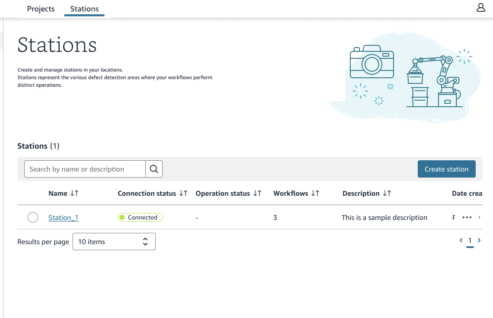
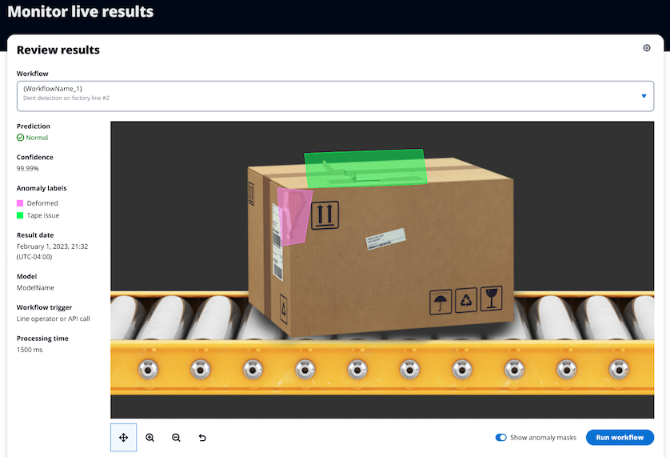

Defect Detection App is in preview release and is subject to change.

# Defect Detection App components

The components of Defect Detection App quality inspection solution are as follows:

###### Topics

- [Tenants](#dda-component-tenants "#dda-component-tenants")
- [Edge device](#dda-component-edge-device "#dda-component-edge-device")
- [Defect Detection App Console](#dda-component-dda "#dda-component-dda")
- [Defect Detection Station App](#dda-component-ddainf "#dda-component-ddainf")
- [Camera](#dda-component-camera "#dda-component-camera")
- [Image source](#dda-component-image-source "#dda-component-image-source")
- [Station](#dda-component-station "#dda-component-station")
- [Workflow](#dda-component-workflow "#dda-component-workflow")
- [Amazon Lookout for Vision model](#dda-component-model "#dda-component-model")
- [Dataset](#dda-component-dataset "#dda-component-dataset")

## Tenants

Defect Detection App provides a software as a service delivery model where resellers can
manage their Defect Detection App customers as tenants. Each tenant can use the Defect Detection App
web app to train models, deploy models to stations, and process images analyzed by
models. A tenant line operator uses the Station App to process images analyzed by the model.

## Edge device

An edge device is an Industrial PC (IPC) that hosts a Defect Detection App [station](#dda-component-station "#dda-component-station"). The edge device is located where
you need to analyze images, such as a production line where you want to find
manufacturing flaws on completed circuit boards. The edge device has one or more
attached cameras that provide images for analysis with the model.

## Defect Detection App Console

You use the Defect Detection App Console to manage the [stations](#dda-component-station "#dda-component-station"), [datasets](#dda-component-dataset "#dda-component-dataset"), and [models](#dda-component-model "#dda-component-model") that you use on an edge device. To
use the Defect Detection App Console you need an internet connection.

## Defect Detection Station App

The Defect Detection Station App (Station App) is an application that is available from a station.
You use the Station App to configure the workflows and image sources that you need to
analyze and process images. Line operators use the Station App to run workflows and
inspect the analysis results from the model.

You can also use the Station App set up camera positions and to collect images for
your dataset.

You don't need an internet connection to use the Station App.

## Camera

A station can use a camera to capture images for analysis with a model and
to collect images for a dataset. The Station App finds the cameras that are accessible to the station.
You then use the Station App to specify the camera as an image source, which can be used in a workflow or
to configure the camera settings.

To work with Station App, a camera must support either the [GeniCam](https://www.emva.org/standards-technology/genicam/ "https://www.emva.org/standards-technology/genicam/")
interface standard or the [GigE Vision](https://en.wikipedia.org/wiki/GigE_Vision "https://en.wikipedia.org/wiki/GigE_Vision")
interfaces standard.

## Image source

An image source is the location from where a workflow gets images for analysis
with model. An image source can be a camera on the same network as the edge device,
or an image folder on the edge device. If the image source is a camera, you can also
use the image source to capture images for your datasets.

## Station

A station is where you use a model to analyze images captured from your production
line and process the results. A station does the following:

- Hosts a machine learning [model](#dda-component-model "#dda-component-model")
  that you train. You deploy a trained model to the station.
- Manages the cameras that are attached to the edge device.
- Analyzes images with the model.
- Hosts the [Station App](#dda-component-ddainf "#dda-component-ddainf") that line operators use to run workflows.

A station is hosted on an [edge
device](#dda-component-edge-device "#dda-component-edge-device") and is designed for environments that don't have an internet
connection. You don't need an internet connection to analyze images with your model,
or to use the Station App. You do need an internet connection to create a station on an
edge device. You create a station with the Defect Detection App.

## Workflow

Workflows define the steps taken to analyze an image and process the analysis results. The steps are:

- Getting an image from an [image source](#dda-component-image-source "#dda-component-image-source").
- Analyzing the image for anomalies with a [model](#dda-component-model "#dda-component-model") that you create. You can
  manually analyze an image or use a digital signal to trigger the automatic
  analysis of an image.
- Performing output tasks based on the analysis results. For example, you
  can trigger an output device if the model predicts an anomaly within an
  image.

## Amazon Lookout for Vision model

A machine learning model trained to find visual defects in industrial products.
You train a model by using the Defect Detection App. To train a model, you need a [dataset](#dda-component-dataset "#dda-component-dataset"). The edge device needs a
connection to the internet. After you train a model, you can deploy the model to a
station.

You can train three types of model:

###### Topics

- [Image classification model](#dda-ud-image-classification "#dda-ud-image-classification")
- [Image segmentation model](#dda-ud-image-segmentation "#dda-ud-image-segmentation")
- [Heatmap model](#dda-ud-image-segmentation-heatmap "#dda-ud-image-segmentation-heatmap")

### Image classification model

If you only need to know if an image contains an anomaly, but don’t need to know
its location, create an image classification model. An image classification model
makes a prediction of whether an image contains an anomaly. The prediction includes
the model's confidence in the accuracy of the prediction. The model doesn’t provide
any information about the location of any anomalies found on the image.

### Image segmentation model

If you need to know the location of an anomaly, such as the location of a scratch,
create an image segmentation model. The model uses _semantic
segmentation_ to identify the pixels on an image where the types of
anomalies (such as a scratch or a missing part) are present.

###### Note

A semantic segmentation model locates different types of
anomaly. It doesn't provide instance information for individual anomalies. For
example, if an image contains two _dents_, The model returns
information about both dents in a single entity representing the
_dent_ anomaly type.

A segmentation model predicts the following:

#### Classification

The model returns a classification for an analyzed image (normal/anomaly),
which includes the model's confidence in the prediction. Classification
information is calculated separately from segmentation information and you
shouldn't assume a relationship between them.

#### Segmentation

The model returns an image mask that marks the pixels where anomalies occur on
the image. Different types of anomaly are color coded according to the color
assigned to the _anomaly label_ in the dataset. An anomaly
label represents the type of an anomaly. For example, the blue mask in the
following image marks the location of a _scratch_ anomaly
type found on a car.

The model returns the color code for each anomaly label in the mask.
The model also returns the percentage covering of the image that an anomaly label has.

After training a model, Defect Detection App provides metrics that you
can use to evaluate and improve your trained model. If you decide that the model performance
is acceptable, deploy the model to an edge device. You also need to map the camera on the device
to the deployed model.

With the Defect Detection App you deploy the model to an edge device that's located where you want to
analyze images for anomalies.

To get the predictions that your model makes, you use the Station App at the station to analyze images
and view the results.

### Heatmap model

An anomaly heatmap is a graphical representation used in anomaly detection to visualize and
identify defects. A Defect Detection App heatmap model is a form of [image
segmentation model](#dda-ud-image-segmentation "#dda-ud-image-segmentation") that visualizes heatmaps as masks. Each mask covers a single anomalous area found
on an image. The heatmap identifies any type of anomaly found on the image. Unlike an image segmentation
model, a heatmap model doesn't distinguish between different anomaly types.

Starting your project with a heatmap model is a quick
way get an initial evaluation for a model. You can create a heatmap model with
as few as 20 normal and 10 anomalous images. You also don't need to annotate
your training images with anomaly labels and masks for each type of anomaly. You only need to
classify the images as normal or anomalous.

A heatmap model will likely optimize for [recall](dda-performance-metrics.md#dda-recall-metric "dda-performance-metrics.md#dda-recall-metric") over [precision](dda-performance-metrics.md#dda-precision-metric "dda-performance-metrics.md#dda-precision-metric").
If your use case requires high precision, we recommend that you create a
segmentation model as the anomaly label annotations benefit the training of a segmentation
model. Heatmap models typically perform slower than segmentation models.

If the evaluation results for a heatmap model are poor and aren't improved by adding
more training images, we recommend training an image segmentation model.

A heatmap model works best if the background behind objects on
the image are static. This helps the model distinguish between normal and
anomalous images. If your images have differing backgrounds, we recommend
creating an image segmentation model.

## Dataset

You provide the images that Defect Detection App uses to train and test your model. You
manage the images in a _Dataset_. To collect images for your dataset,
you use the [Station App](#dda-component-ddainf "#dda-component-ddainf").
To create a dataset, you use Defect Detection App web app. You label the dataset images according to
the type of model that you want to create ([image classification](#dda-ud-image-classification "#dda-ud-image-classification") or [image
segmentation](#dda-ud-image-segmentation "#dda-ud-image-segmentation")). For more information, see [Annotating dataset images](dda-label-dataset-images.md "dda-label-dataset-images.md").
