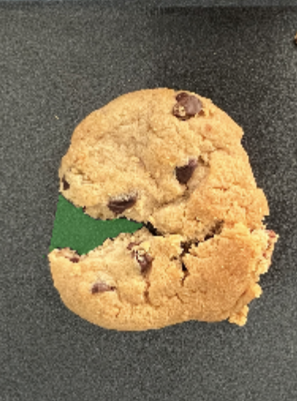
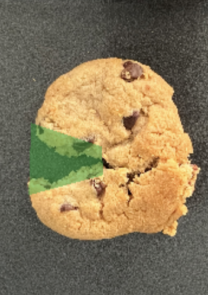
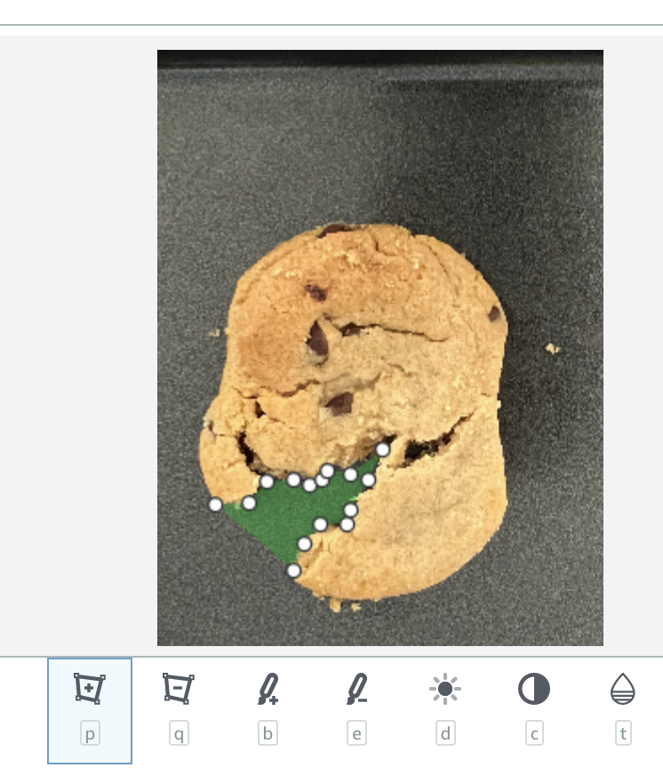
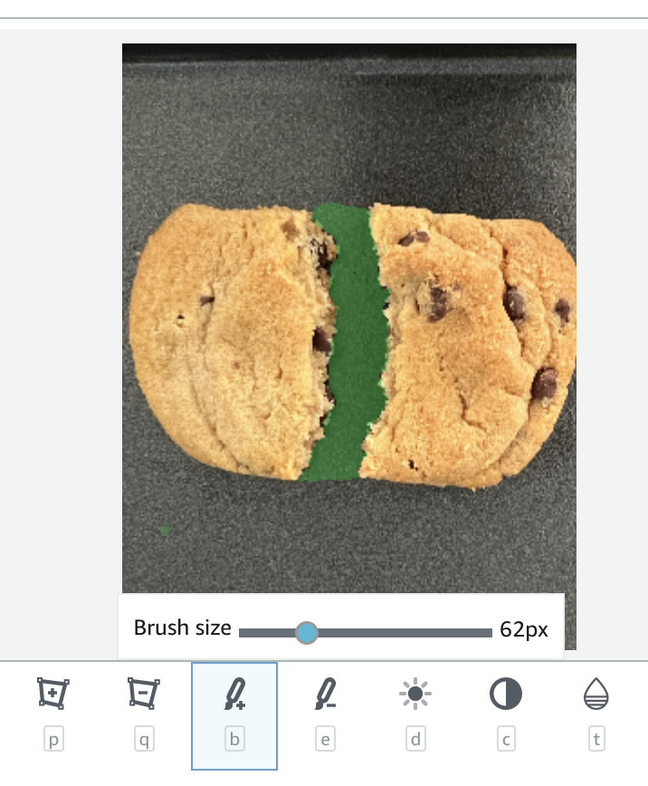

Defect Detection App is in preview release and is subject to change.

# Annotating dataset images

Before you can train a model, you annotate the images in your dataset according to the type
of model that you want to create ([image
classification](dda-components.md#dda-ud-image-classification "dda-components.md#dda-ud-image-classification") or [image segmentation](dda-components.md#dda-ud-image-segmentation "dda-components.md#dda-ud-image-segmentation")).
If you want to create a model that generates [heatmaps](dda-components.md#dda-ud-image-segmentation-heatmap "dda-components.md#dda-ud-image-segmentation-heatmap"), you only need to classify the images in the dataset.

To create an image classification model, see [Classifying images](#dda-classify-images "#dda-classify-images"). To create an image segmentation model, see [Annotating images for an image segmentation model](#dda-segment-image "#dda-segment-image").

###### Topics

- [Classifying images](#dda-classify-images "#dda-classify-images")
- [Annotating images for an image segmentation model](#dda-segment-image "#dda-segment-image")

## Classifying images

To create an image classification or model or a heatmap model, you classify images
as normal or anomalous.

You use the Defect Detection App Console to classify images in a dataset as **normal** or
an **anomaly**. If you classified the images when you created the dataset, you won't need
to classify the images again. Unclassified images aren’t used to train your model.

###### To classify your images

1. If you're not on the project details page, do the following:
   1. [Sign in](dda-signin-dda-web-app.md "dda-signin-dda-web-app.md") to the Defect Detection App Console.
   2. In the top navigation pane, choose **Projects**.
   3. On the projects page, choose the project. The console opens the project details page.

2. In the **Images** panel, choose **Edit classification and labels**.
3. Select every normal image on the page and choose **Label as normal**.
4. Select every anomalous image on the page and choose **Label as
   anomaly**.
5. At the bottom of the image gallery choose the number of the next page. If none are
   available go to step 7.
6. Repeat steps 3-5.
7. Close the **Images selected** bar.
8. Choose **Save and exit**.
9. If you are ready to apply the changes to your dataset, choose
   **Apply edits to dataset**. If not, continue to make
   changes or choose **Save and exit draft** to make changes
   later. If you want to discard all the changes that you have made, choose
   **Discard draft**.
10. Next step: [Training your model](dda-train-model.md "dda-train-model.md").

## Annotating images for an image segmentation model

To create an image segmentation model, you annotate dataset images by classifying each
image as normal or anomalous. For each anomalous image, you also specify a pixel mask that
tightly covers each anomalous area on the image and an anomaly label for the type of anomaly
within the pixel mask. This is known as image segmentation. For example, the blue mask in the
following image marks the location of a scratch anomaly type on a car. You can specify more than
one type of anomaly label in an image.

An image can have multiple masks and anomaly labels, but you can only assign 1
anomaly label to an individual mask.

###### Note

If you are creating a model that generates heatmaps, you need to classify images,
but you don't need to specify anomaly labels and masks.

###### Topics

- [Segmenting an image](#dda-segment-image-label "#dda-segment-image-label")
- [Drawing masks with the annotation
  tool](#dda-segment-image-annotation-tool "#dda-segment-image-annotation-tool")

### Segmenting an image

This procedure shows you one way to classify and segment each anomalous image in the
dataset. Alternatively, you can classify all anomalous images in the same way as you classify
images in [Classifying images](#dda-classify-images "#dda-classify-images"). Then use
the filter tool to show anomalous images and use the segmentation tool to
draw masks and assign anomaly labels to images.

###### To label an image

1. If you're not on the project details page, do the following:
   1. [Sign in](dda-signin-dda-web-app.md "dda-signin-dda-web-app.md") to the Defect Detection App Console.
   2. In the top navigation pane, choose **Projects**.
   3. On the projects page, choose the project. The console opens the project details page.

2. On the dataset details page, choose **Edit classification and labels**.
3. Select every normal image on the image gallery page and choose **Label as normal**. If
   every image is normal, you change choose **Select page** and then
   choose **Label as normal**.
4. Choose the first anomalous image to open the annotation tool. If there isn't an anomalous image on the image gallery page,
   choose the number of the next page at the bottom of the image gallery, if available.
5. In **Classify as**, choose **Anomaly** to label the image as anomalous.
   If you change your mind about the classification, you can classify the image as **Normal**.
6. In **Anomaly labels**, choose the anomaly label that you
   want to mark. If you haven't previously added any anomaly labels to the dataset, add anomaly
   labels by doing the following:
   1. Choose **Add anomaly labels**.
   2. Enter the anomaly label that you want to add and choose **Add anomaly
      label**.
   3. Repeat the previous step until you have entered every anomaly label that you want your
      model to find.
   4. Choose **Save** to save your labels.

7. Choose the anomaly label that you want to assign to an anomalous area (mask).
8. Underneath the image, choose a drawing tool and draw masks that tightly cover
   anomalous areas for the anomaly label. For more information, see [Drawing masks with the annotation
   tool](#dda-segment-image-annotation-tool "#dda-segment-image-annotation-tool").
9. Choose **Submit**.
10. Choose the next anomalous image on the page and repeat steps 5-9. Do this until
    all anomalous images on the page are classified and segmented.
11. At the bottom of the image gallery choose the number of the next page. If none are
    available go to step 13.
12. Repeat steps 3-11 for each page in the dataset.
13. If you are ready to apply the changes to your dataset, choose
    **Apply edits to dataset**. If not, continue to make
    changes or choose **Save and exit draft** to make changes
    later. If you want to discard all the changes that you have made, choose
    **Discard draft**.
14. Next step: [Training your model](dda-train-model.md "dda-train-model.md").

### Drawing masks with the annotation

tool

You use the annotation tool to segment an image by tightly marking anomalous areas with a
mask.

The following image is an example of a mask that
tightly covers an anomaly.

The following is an example of a poor mask that doesn't tightly cover an anomaly.

The annotation tool includes tools for marking areas of an image with polygons or with a
paint brush. It also includes tools for zooming into an image and moving around a zoomed image.

###### Topics

- [Drawing masks with the polygon tool](#polygon-tool "#polygon-tool")
- [Drawing masks with the paint tool](#paint-tool "#paint-tool")

#### Drawing masks with the polygon tool

You can use the polygon tool to mark anomalies on an image.

###### To mark an anomaly with the polygon tool

1. Choose the polygon tool in the toolbox.
2. Click the mouse on the location on the image where you want to start marking an anomaly.
3. Move the mouse to the location where you want to draw a line too and then click the mouse.
4. Repeat the previous step until you surround the anomaly. Make sure that the polygon tightly surround the anomaly.
5. Make the final click on the location of the first click.

 6. Press enter to complete the polygon. 7. If you make a mistake, you can use the polygon eraser tool (next to the polygon tool
button) to remove areas of a mask with a polygon. You might find it easier to use the paint
eraser tool (next to the paint tool button) to remove parts of the mask. Pressing CTRL + Z
will also remove previous changes.

#### Drawing masks with the paint tool

You can use the paint tool to mark anomalies on an image. You can choose which font size to use. A smaller
font size is useful for filling smaller areas.

###### To mark an anomaly with the polygon tool

1. Choose the paint tool in the toolbox.
2. Use the slider tool to choose the font size that want to paint with.
3. Mark an anomalous area by clicking and holding the mouse button whilst moving the mouse
   over an anomalous area.

 4. If you make a mistake, you can use the paint eraser tool (next to the paint tool
button) in the same way to remove parts of the mask. Pressing CTRL + Z will also remove
previous changes.
