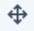
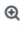
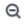
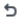
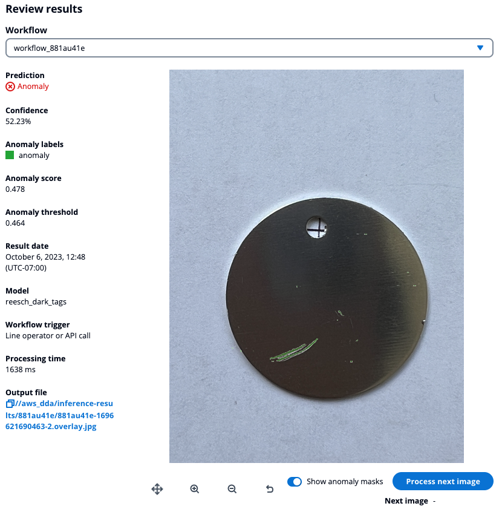

Defect Detection App is in preview release and is subject to change.

# Running a workflow manually

You can manually run a workflow from within the Station App. The workflow
analyzes an image from the configured image source.

To configure a workflow, see
[Configuring a workflow](dda-configure-workflow.md "dda-configure-workflow.md").

Use the following procedure to manually run a workflow with the Station App.

###### To manually analyze an image (Station App)

1.  Open the Station App on your edge device by opening a browser and navigating to
    `x.x.x.x`:3000. Change `x.x.x.x` to the IP address of
    your edge device.
2.  On the left of the application, choose **Results** and then **Monitor live results**.
3.  In the **Live results** section, choose the workflow that you want to use.
4.  Choose **Run workflow** to run the workflow. If the image source is a folder, the
    workflow analyzes the oldest image in the folder that hasn't yet been analyzed. If the
    image source is a camera, the workflow takes an image from the camera and analyzes that
    image.
5.  View the analysis results for the results of the workflow.

        * **Prediction** is the classification that the model predicts
         for the image (**Normal** for a normal
         image, **Anomaly** for an anomalous image).
        * **Confidence** is the model's confidence in the
         accuracy of the **Prediction**.
        * **Anomaly score** quantifies how much anomalies
         predicted for the image deviate from an images without anomalies.
         **anomaly\_score** is a float value ranging from
         `0.0` to (lowest deviation from a normal image) to `1.0`
         (highest deviation from a normal image).
        * **Anomaly threshold** is a number in the anomaly
         score range that determines the boundary between an anomalous image or a
         normal image. The model predicts the image is anomalous if the **anomaly
         score** is higher than the **anomaly threshold**. The
         value is calculated during the training of the model and you are not able to can't set a
         specific value for a model.
        * If the model is a [segmentation](dda-components.md#dda-ud-image-segmentation "dda-components.md#dda-ud-image-segmentation") model or a [heatmap](dda-components.md#dda-ud-image-segmentation-heatmap "dda-components.md#dda-ud-image-segmentation-heatmap") model,
         **Anomaly labels** lists the types of predicted
         anomalies and draws masks around the anomalies on the image. Each type
         of anomaly is shown in a different color. With a heatmap model the
         anomaly label is alway **Anomaly**.

        You can show or hide the masks
         with the **Show anomaly masks** toggle.
        * The name of the model that analyzed the image.
        * **Result date** is the date and time that the model
         analyzed the image.
        * **Model** is the name of the model that analyzed the
         image.
        * **Workflow trigger** is the trigger that made the
         workflow run (Line operater/API call or line input).
        * **processing time** is the time, in milliseconds, that
         it took to run the workflow with the image.
        * **Output file** is the location where the workflow
         saves the analyzed image file.

    You can use the following commands to pan and zoom the image.

        * Pan image — Choose the pan button (
        
        ). Click and hold the mouse button and then drag the
         mouse to pan across the image.
        * Zoom image — Zoom in an out of the image with the zoom in button (
        
        ) and the zoom out button
        
        . Double-click the image to zoom 2x into to the
         image. Use the mouse scroll wheel to zoom in and out of the image. The
         mouse cursor position is the center position for zooming (in or
         out).
        * Reset image size — Choose the reset button (
        
        ) or press Ctrl + 0.

 6. Choose **Run workflow** to get the next image, if available.
