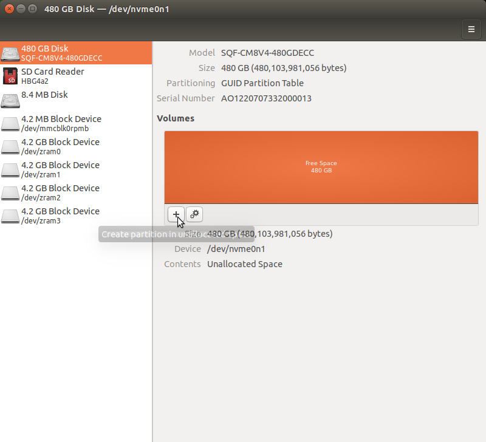
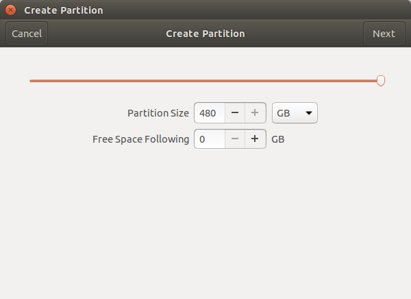
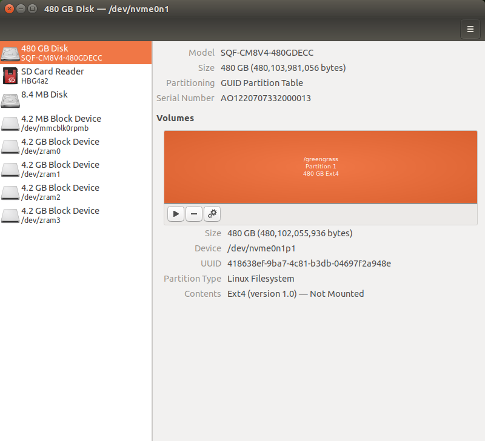
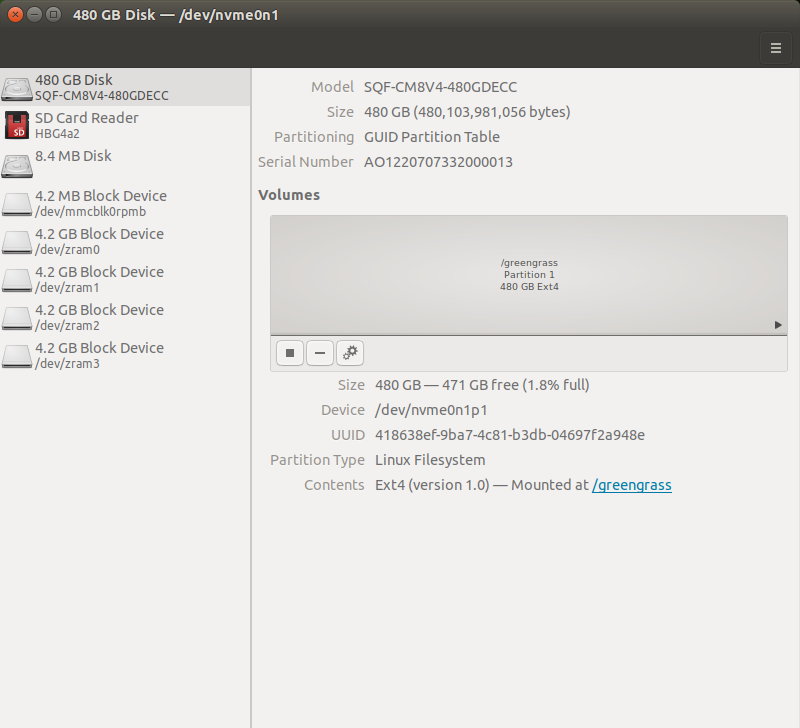

Defect Detection App is in preview release and is subject to change.

# Setting up an edge device

An edge device is an Industrial PC (IPC) that hosts a Defect Detection App [station](dda-components.md#dda-component-station "dda-components.md#dda-component-station"). The edge device is located where
you need to analyze images, such as a production line where you want to find
manufacturing flaws on completed circuit boards. The edge device has one or more
attached cameras that provide images for analysis with the model.

###### Topics

- [Required hardware](#dda-required-hardware "#dda-required-hardware")
- [Required software](#dda-required-software "#dda-required-software")
- [Install and configure the solid state drive](#dda-set-up-ssd "#dda-set-up-ssd")
- [Installing the cameras on the edge device](#dda-set-up-camera "#dda-set-up-camera")

## Required hardware

Installing Defect Detection App on an edge device requires the following hardware:

- Personal Computer (PC).
- Edge device — x86 or ARM64 CPU architecture, such as the Advantech
  MIC-730AI-10A1. Install an NVME Solid State Ddrive (SSD) with 100GB or
  greater.
- (Optional) Graphics Processing Unit (GPU) installed on the edge device. On edge devices with ARM64 CPUs, we support
  NVIDIA Jetson Xavier Series GPUs. On edge devices with X86_64 CPUs, we support Generic Linux x86 NVIDIA GPUs.
- Ethernet cables.
- POE network switch.
- GigE cameras.
- USB thumb Drive 8GB or greater.

## Required software

We have tested Defect Detection App with the following software configurations:

### Operating system

We have tested Defect Detection App with the following CPU and operating system configurations.

- ARM64 CPU — Ubuntu 18.04 with and without a GPU.
- X86_64 CPU — Ubuntu 20.04 with and without a GPU.

### Graphic Processing Unit (GPU) for accelerated workflows

Optionally, you can use a GPU to accelerate the workflows that analyze images
on the edge device.

You can use NVIDIA Jetson Xavier GPUs or X86_64 NVIDIA GPUs. We have tested workflows with the
following configurations:

#### NVIDIA Jetson-AGX GPU

```

 L4T 32.6.1 [ JetPack 4.6 ]
  Ubuntu 18.04.6 LTS
  Kernel Version: 4.9.253-tegra
 CUDA 10.2.300
  CUDA Architecture: NONE
 OpenCV version: 4.1.1
  OpenCV Cuda: NO
 CUDNN: 8.2.1.32
 TensorRT: 8.0.1.6
 Vision Works: 1.6.0.501
 VPI: 1.1.12
 Vulcan: 1.2.70
```

#### X86_64 NVIDIA GPU

```
 CUDA 10.2.89
 CUDA Architecture: NONE
 CUDNN: 7.6.5.32
 TensorRT: 7.0.0.11
```

## Install and configure the solid state drive

You need to install a solid state drive (SSD) into the edge device that hosts the Defect Detection App software.

The following instructions show how install, partition, and mount a M.2 NVME SSDrive on an Advantech MIC-730AI-10A1 edge device.

Before installing the SSD, we recommend that you read the [manual](https://www.advantech.com/en/support/details/manual?id=1-263CGZH "https://www.advantech.com/en/support/details/manual?id=1-263CGZH") for the MIC-730AI.

###### To install the SSD

1. Install the SSD into the edge device by following the instructions in section 2.2.9 on Pg. 15 of the MIC-730AI [manual](https://www.advantech.com/en/support/details/manual?id=1-263CGZH "https://www.advantech.com/en/support/details/manual?id=1-263CGZH") .

###### Important

Remember to use an anti-static strap when handling the SSD. 2. 3. Boot into Ubuntu on the edge device. 4. Open a terminal window. 5. Confirm that the SSD is installed by entering the following command.

```
sudo lshw -class disk -short
```

You should see the SSD listed as `/dev/nvme0n1` . 6. Create a GUID Partition Table (GPT) by entering the following command.

```
sudo parted /dev/nvme0n1 mklabel gpt
```

7. In the Ubuntu desktop, open the _Disks_ application.
8. In the left navigation pane, choose the SSD.
9. In the Volumes section, choose the **+** button to start creating a partition.

 10. In the **Create partition** dialog, Leave the **Partition Size** unchanged to use the entire disk space for the partition.
Leave **Free Space Following** unchanged.

 11. Choose **Next** 12. In **Format Volume** do the following

    1. In **Volume Name** enter
     `/aws_dda`.
    2. Set **Erase** to the **OFF**
     position.
    3. For **Type**, select **Internal disk for use
     with Linux systems only (Ext4)**. Don't select
     **Password protect volume (LUKS)**.
    4. Choose **Create** to create the disk
     partition.


    The Disks app should look like following image.


    

13. Back in the terminal window, mount the partition by entering the following commands.

```
sudo mkdir /aws_dda
sudo mount /dev/nvme0n1p1 /aws_dda
sudo chmod 755 /aws_dda
```

Once the disk is mounted, return to the Disks app. The mounted mounted disk should be shown, as in the following image.

 14. Note the uuid value for the SSD. You need it in the next step. 15. Make the disk mount persistent through system reboots by doing the following

    1. Backup the existing fstab by entering the following command.


    ```
    sudo cp /etc/fstab /etc/fstab_bak
    ```
    2. Open fstab for editing by entering the following command.


    ```
    sudo nano /etc/fstab
    ```

    The fstab file opens as follows


    ```
    # Copyright (c) 2019, NVIDIA CORPORATION.  All rights reserved.
    #
    # NVIDIA CORPORATION and its licensors retain all intellectual property
    # and proprietary rights in and to this software, related documentation
    # and any modifications thereto.  Any use, reproduction, disclosure or
    # distribution of this software and related documentation without an express
    # license agreement from NVIDIA CORPORATION is strictly prohibited.
    #
    # /etc/fstab: static file system information.
    #
    # These are the filesystems that are always mounted on boot, you can
    # override any of these by copying the appropriate line from this file into
    # /etc/fstab and tweaking it as you see fit.  See fstab(5).
    #
    # <file system> <mount point>             <type>          <options>                               <dump> <pass>
    /dev/root            /                     ext4           defaults                                     0 1
    ```
    3. Add the following line to the end of the file. Change uuid to the value you noted in the previous step.


    ```
    UUID=<`uuid`> /aws_dda  ext4  defaults  0  2
    ```

    The file should look similar to the following


    ```
    # Copyright (c) 2019, NVIDIA CORPORATION.  All rights reserved.
    #
    # NVIDIA CORPORATION and its licensors retain all intellectual property
    # and proprietary rights in and to this software, related documentation
    # and any modifications thereto.  Any use, reproduction, disclosure or
    # distribution of this software and related documentation without an express
    # license agreement from NVIDIA CORPORATION is strictly prohibited.
    #
    # /etc/fstab: static file system information.
    #
    # These are the filesystems that are always mounted on boot, you can
    # override any of these by copying the appropriate line from this file into
    # /etc/fstab and tweaking it as you see fit.  See fstab(5).
    #
    # <file system> <mount point>             <type>          <options>                               <dump> <pass>
    /dev/root            /                     ext4           defaults                                     0 1
    UUID= 418638ef-4c81-b3db-04697f2a948e /greengrass  ext4  defaults  0  2
    ```
    4. Save the updated fstab file.
    5. Unmount and remount the SSD.


    ```
    sudo umount /aws_dda
    sudo mount -a
    ```

16. Next step: [Installing the cameras on the edge device](#dda-set-up-camera "#dda-set-up-camera").

## Installing the cameras on the edge device

The edge device hosts one or more cameras that capture images for analysis with a
Defect Detection App model. Later, you specify the same amount of cameras when you [create a station](dda-set-up-station.md "dda-set-up-station.md") for the edge device. You also
map the cameras to image streams that the station creates for each camera.

The camera must must support either the [GeniCam](https://www.emva.org/standards-technology/genicam/ "https://www.emva.org/standards-technology/genicam/")
interface standard or the [GigE Vision](https://en.wikipedia.org/wiki/GigE_Vision "https://en.wikipedia.org/wiki/GigE_Vision")
interfaces standard.

###### To set up the cameras on your edge device

1. Connect your camera to the edge device, either through a LAN connection, direct ethernet,
   or USB.
2. Install your camera using the software that comes with your camera. This includes image settings, such as exposure and gain.
3. Next step: [Signing into the Defect Detection App Console](dda-signin-dda-web-app.md "dda-signin-dda-web-app.md").
