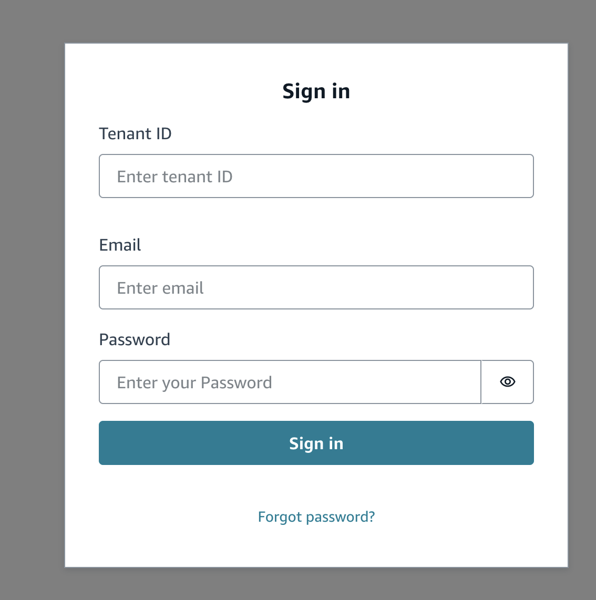
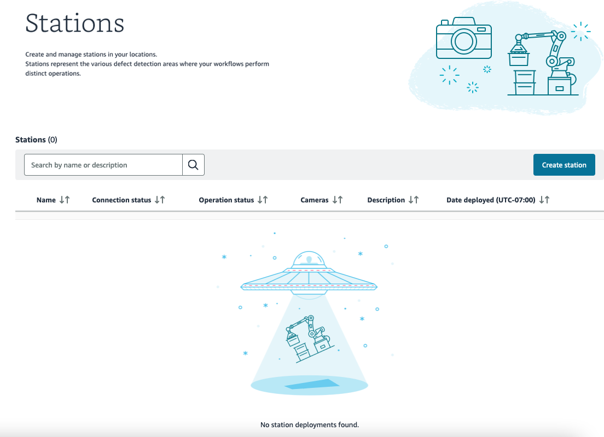

Defect Detection App is in preview release and is subject to change.

# Signing into the Defect Detection App Console

You use the Defect Detection App Console to create the stations, datasets, and models that you want to use with your edge device.

###### Important

To use Defect Detection App you need a Defect Detection App tenant account. Contact support if you don't have a tenant account. When your account is created,
you receive an email that incudes your tenant ID, account email, a temporary password and sign in link.

We recommend creating a station by accessing the Defect Detection App from the edge device. This means you won't have to copy station configuration
files to the edge device and dataset images from the edge device to your computer.

###### To sign in to the Defect Detection App Console

1. In a browser, open the **App link** link in the email sent to you.
2. In the sign in page, enter your tenant ID, Email, and password.
3. Choose **Sign in**.

 4. If this is the first time that you using the Defect Detection App Console, update your password and choose **Change password**.
Otherwise you should see the Defect Detection App Console.

 5. Next step: [Creating the station for your edge device](dda-set-up-station.md "dda-set-up-station.md").
