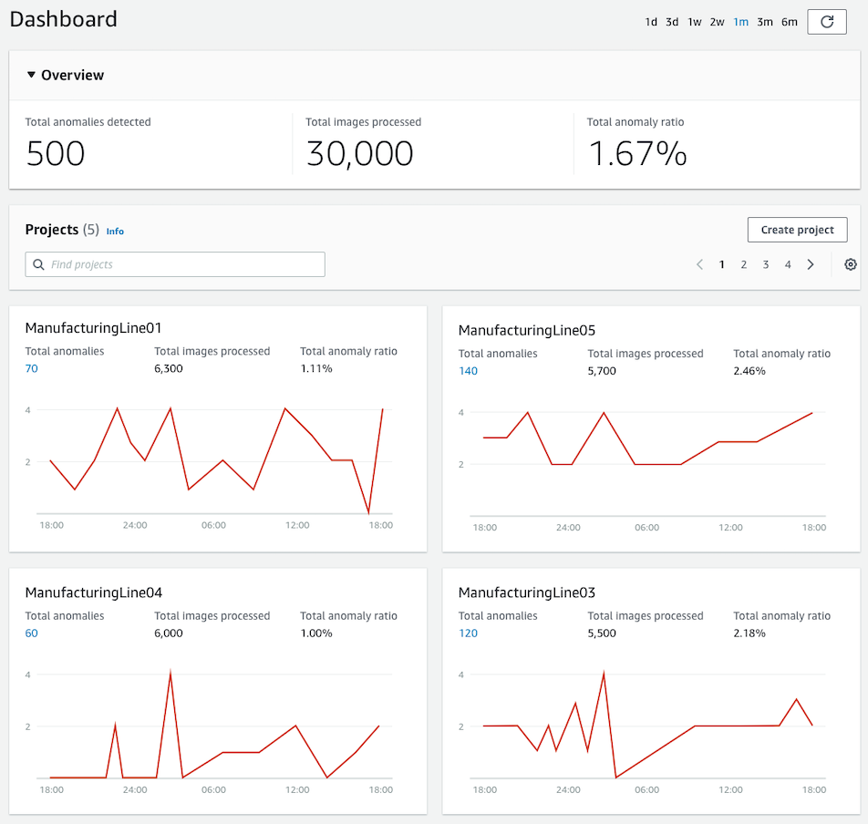
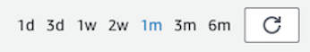
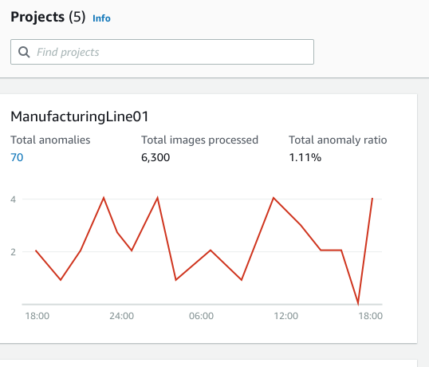

End of support notice: On October 31, 2025, AWS
will discontinue support for Amazon Lookout for Vision. After October 31, 2025, you will
no longer be able to access the Lookout for Vision console or Lookout for Vision resources.
For more information, visit this [blog post](https://aws.amazon.com/blogs/machine-learning/exploring-alternatives-and-seamlessly-migrating-data-from-amazon-lookout-for-vision "https://aws.amazon.com/blogs/machine-learning/exploring-alternatives-and-seamlessly-migrating-data-from-amazon-lookout-for-vision").

# Using the Amazon Lookout for Vision dashboard

The dashboard provides an overview of metrics for your Amazon Lookout for Vision projects, such as the
total number of anomalies detected over the last week. With the dashboard you get an
overview for all of your projects and an overview for each individual project. You can
choose the timeline over which metrics are shown. You can also use the dashboard to create a
new project.

The **Overview** section shows the total number of projects, total number of images, and the total
number of images detected by all of your projects.

The **Projects** section shows the following overview information for
individual projects:

- The total number or anomalies detected.
- The total number of images processed.
- The total anomaly ratio (that is, the percentage of images detected with an anomaly).
- A graph shows the anomaly detections over the chosen time frame.
  You can also get further information about a project.

###### To use your dashboard

1.  Open the Amazon Lookout for Vision console at [https://console.aws.amazon.com/lookoutvision/](https://console.aws.amazon.com/lookoutvision/ " https://console.aws.amazon.com/lookoutvision/").
2.  Choose **Get started**.
3.  In the left navigation pane, choose **Dashboard**.
4.  To view metrics over a specific time frame, do the following:

        1. Choose the time frame in the upper-right side of the dashboard.
        2. Choose the refresh button to show the dashboard with the new timeline.

    

5.  To get further details about a project, choose the project name in the
    **Projects** section (for example,
    `ManufacturingLine01`).

 6. To create a project, choose **Create project** in the **Projects** section.
