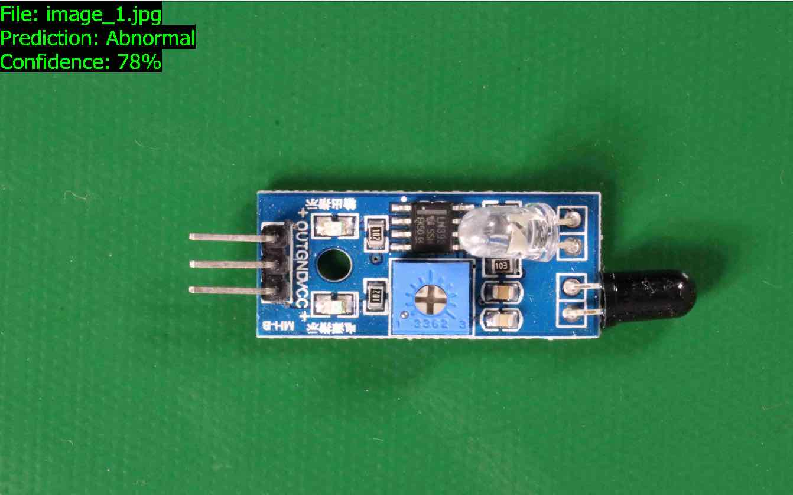

End of support notice: On October 31, 2025, AWS
will discontinue support for Amazon Lookout for Vision. After October 31, 2025, you will
no longer be able to access the Lookout for Vision console or Lookout for Vision resources.
For more information, visit this [blog post](https://aws.amazon.com/blogs/machine-learning/exploring-alternatives-and-seamlessly-migrating-data-from-amazon-lookout-for-vision "https://aws.amazon.com/blogs/machine-learning/exploring-alternatives-and-seamlessly-migrating-data-from-amazon-lookout-for-vision").

# Example datasets

The following are example datasets that you can use with Amazon Lookout for Vision.

###### Topics

- [Image segmentation datasets](#example-datasets-segmentation "#example-datasets-segmentation")
- [Image classification
  dataset](#example-datasets-classification "#example-datasets-classification")

## Image segmentation datasets

[Getting started with Amazon Lookout for Vision](getting-started.md "getting-started.md") provides a
dataset of broken cookies that you can use to create an [image segmentation](understanding.md#ud-image-segmentation "understanding.md#ud-image-segmentation") model.

For another dataset that creates an image segmentation model, see [Identify the location of anomalies using Amazon Lookout for Vision at the edge
without using a GPU](https://aws.amazon.com/blogs/machine-learning/identify-the-location-of-anomalies-using-amazon-lookout-for-vision-at-the-edge-without-using-a-gpu/ "https://aws.amazon.com/blogs/machine-learning/identify-the-location-of-anomalies-using-amazon-lookout-for-vision-at-the-edge-without-using-a-gpu/").

## Image classification

dataset

Amazon Lookout for Vision provides example images of circuit boards that you can use to create an
[image classification](understanding.md#ud-image-classification "understanding.md#ud-image-classification")
model.



You can copy the images from the [https://github.com/aws-samples/amazon-lookout-for-vision](https://github.com/aws-samples/amazon-lookout-for-vision "https://github.com/aws-samples/amazon-lookout-for-vision") GitHub
repository. The images are in the `circuitboard` folder.

The `circuitboard` folder has the following folders.

- `train` – Images you can use in a training
  dataset.
- `test` – Images you can use in a test
  dataset.
- `extra_images` – Images you can use to run a
  trial detection or to try out your trained model with the [DetectAnomalies](../APIReference/API_DetectAnomalies.md "../APIReference/API_DetectAnomalies.md")
  operation.

The `train` and `test` folders each have a
subfolder named `normal` (contains images that are normal) and a
subfolder named `anomaly` (contains images with anomalies).

###### Note

Later, when you create a dataset with the console, Amazon Lookout for Vision can use the
folder names (`normal` and `anomaly`) to
label the images automatically. For more information, see [Creating a dataset using images stored in an
Amazon S3 bucket](create-dataset-s3.md "create-dataset-s3.md").

###### To prepare the dataset

images

1. Clone the [https://github.com/aws-samples/amazon-lookout-for-vision](https://github.com/aws-samples/amazon-lookout-for-vision "https://github.com/aws-samples/amazon-lookout-for-vision")
   repository to your computer. For more information, see [Cloning a repository](https://docs.github.com/en/github/creating-cloning-and-archiving-repositories/cloning-a-repository "https://docs.github.com/en/github/creating-cloning-and-archiving-repositories/cloning-a-repository").
2. Create an Amazon S3 bucket. For more information, see [How do I create an S3 Bucket?](../../../AmazonS3/latest/user-guide/create-bucket.md "../../../AmazonS3/latest/user-guide/create-bucket.md").
3. At the command prompt, enter the following command to copy the dataset
   images from your computer to your Amazon S3 bucket.

```
aws s3 cp --recursive `your-repository-folder`/circuitboard s3://`your-bucket`/circuitboard
```

After uploading the images, you can create a model. You can automatically classify
the images by adding the images from the Amazon S3 location that you previously uploaded
the circuit board images to. Remember that you are charged for each successful
training of a model and for the amount of time that a model is running
(hosted).

###### To create a classification model

1. Do [Creating a project (console)](model-create-project.md#create-project-console "model-create-project.md#create-project-console").
2. Do [Creating a dataset using images stored in an
   Amazon S3 bucket](create-dataset-s3.md "create-dataset-s3.md").
   - For step 6, choose the **Separate training and test
     datasets** tab.
   - For step 8a, enter the S3 URI for the training images you uploaded
     in [To prepare
     the dataset images](#getting-started-classification-example "#getting-started-classification-example"). For example
     `s3://`your-bucket`/circuitboard/train`.
     For step 8b, enter the S3 URI for the test dataset. For example,
     `s3://`your-bucket`/circuitboard/test`.
   - Be sure to do step 9.

3. Do [Training a model (console)](model-train.md#create-model-console "model-train.md#create-model-console").
4. Do [Starting your model (console)](run-start-model.md#start-model-console "run-start-model.md#start-model-console").
5. Do [Detecting anomalies in an image](inference-detect-anomalies.md "inference-detect-anomalies.md"). You can use images from
   the `test_images` folder.
6. When you're finished with the model, do [Stopping your model (console)](run-stop-model.md#stop-model "run-stop-model.md#stop-model").
