End of support notice: On October 31, 2025, AWS
will discontinue support for Amazon Lookout for Vision. After October 31, 2025, you will
no longer be able to access the Lookout for Vision console or Lookout for Vision resources.
For more information, visit this [blog post](https://aws.amazon.com/blogs/machine-learning/exploring-alternatives-and-seamlessly-migrating-data-from-amazon-lookout-for-vision "https://aws.amazon.com/blogs/machine-learning/exploring-alternatives-and-seamlessly-migrating-data-from-amazon-lookout-for-vision").

# Getting started with Amazon Lookout for Vision

Before starting these _Getting started_ instructions, we recommend that
you read [Understanding Amazon Lookout for Vision](understanding.md "understanding.md").

The Getting Started instructions show you how to use create an example [image segmentation model](understanding.md#ud-image-segmentation "understanding.md#ud-image-segmentation"). If you want to create
an example [image classification](understanding.md#ud-image-segmentation-classification "understanding.md#ud-image-segmentation-classification")
model, see [Image classification
dataset](example-datasets.md#example-datasets-classification "example-datasets.md#example-datasets-classification").

If you want to quickly try an example model, we provide example training images and mask
images. We also provide a Python script that creates an [image segmentation manifest file](manifest-file-segmentation.md "manifest-file-segmentation.md"). You use
the manifest file to create a dataset for your project and you don't need to label the
images in the dataset. When you create a model with your own images, you must label the
images in the dataset. For more information, see [Creating your dataset](model-create-dataset.md "model-create-dataset.md").

The images we provide are of normal and anomalous cookies. An anomalous cookie has a crack
across the cookie shape. The model you train with the images predicts a classification
(normal or anomalous) and finds the area (mask) of cracks in an anomalous cookie, as shown
in the following example.

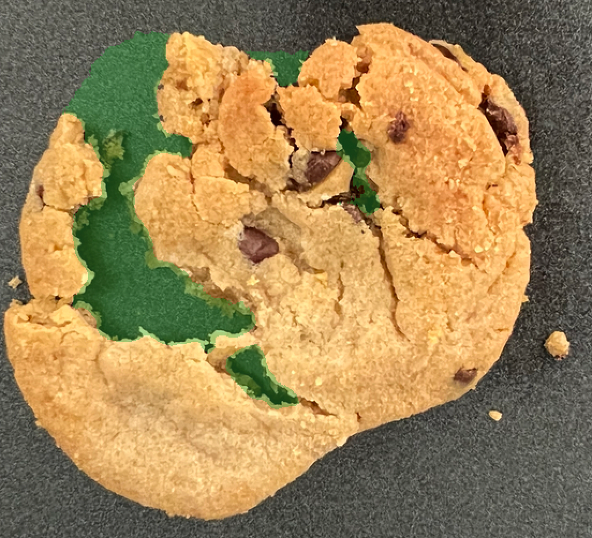

###### Topics

- [Step 1: Create the manifest file and upload images](#getting-started-prepare-files "#getting-started-prepare-files")
- [Step 2: Create the model](#getting-started-create-model "#getting-started-create-model")
- [Step 3: Start the model](#getting-started-analyze-image-start-model "#getting-started-analyze-image-start-model")
- [Step 4: Analyze an image](#getting-started-analyze-image-analyze-image "#getting-started-analyze-image-analyze-image")
- [Step 5: Stop the model](#getting-started-analyze-image-stop-model "#getting-started-analyze-image-stop-model")
- [Next steps](#getting-started-next-steps "#getting-started-next-steps")

## Step 1: Create the manifest file and upload images

In this procedure, you clone the Amazon Lookout for Vision documentation repository to your computer.
You then use a Python (version 3.7 or higher) script to create a manifest file and upload the training images
and mask images to an Amazon S3 location that you specify. You use the manifest file to
create your model. Later, you use test images in the local repository to try your model.

###### To create the manifest file and upload images

1. Set up Amazon Lookout for Vision by following the instructions at [Setup Amazon Lookout for Vision](su-set-up.md "su-set-up.md"). Be sure to install the [AWS SDK for Python](https://boto3.amazonaws.com/v1/documentation/api/latest/guide/quickstart.html#installation "https://boto3.amazonaws.com/v1/documentation/api/latest/guide/quickstart.html#installation").
2. In the AWS Region in which you want to use Lookout for Vision, [create an S3
   bucket](../../../AmazonS3/latest/userguide/create-bucket-overview.md "../../../AmazonS3/latest/userguide/create-bucket-overview.md").
3. In the Amazon S3 bucket, [create a folder](../../../AmazonS3/latest/userguide/using-folders.md#create-folder "../../../AmazonS3/latest/userguide/using-folders.md#create-folder") named `getting-started`.
4. Note the Amazon S3 URI and Amazon Resource name (ARN) for the folder. You use them to set up permissions and to run the script.
5. Make sure that the user calling the script has permissions to call the `s3:PutObject` operation. You
   can use the following policy. To assign permissions, see [Assigning permissions](su-sdk-permissions.md#su-sdk-assign-permissions "su-sdk-permissions.md#su-sdk-assign-permissions").

JSON

```
`{
 "Version":"2012-10-17",
 "Statement": [{
 "Sid": "Statement1",
 "Effect": "Allow",
 "Action": [
 "s3:PutObject"
 ],
 "Resource": [
 "`arn:aws:s3::: ARN for S3 folder in step 4`/*"
 ]
 }]
}`

```

6. Make sure that you have a local profile named
   `lookoutvision-access` and that the profile user has the
   permission from the previous step. For more information, see [Using a profile on your local computer](su-sdk-programmatic-access.md#su-sdk-programmatic-access-lookoutvision-examples "su-sdk-programmatic-access.md#su-sdk-programmatic-access-lookoutvision-examples").
7. Download the zip file,
   [getting-started.zip](samples/getting-started.md "samples/getting-started.md").
   The zip file contains the getting started dataset and set up script.
8. Unzip the file `getting-started.zip`.
9. At the command prompt, do the following:
   1. Navigate to the `getting-started` folder.
   2. Run the following command to create a manifest file and upload the
      training images and image masks to the Amazon S3 path you noted in step 4.

   ```
   python getting_started.py `S3-URI-from-step-4`
   ```

   3. When the script completes, note the path to the `train.manifest` file that the script displays
      after `Create dataset using manifest file:`. The path should be similar to
      `s3://`path to getting started folder`/manifests/train.manifest`.

## Step 2: Create the model

In this
procedure,
you create a project and dataset using the images and manifest file that you previously
uploaded to your Amazon S3 bucket. You then create the model and view the evaluation results
from model training.

Because you create the dataset from the getting started manifest file, you don't need
to label the dataset's images. When you create a dataset with your own images, you do
need to label images. For more information, see [Labeling images](model-labelling-overview.md "model-labelling-overview.md").

###### Important

You are charged for a successful training of a model.

###### To create a model

1. Open the Amazon Lookout for Vision console at [https://console.aws.amazon.com/lookoutvision/](https://console.aws.amazon.com/lookoutvision/ " https://console.aws.amazon.com/lookoutvision/").
2. Make sure you are in the same AWS Region that you created the Amazon S3 bucket in [Step 1: Create the manifest file and upload images](#getting-started-prepare-files "#getting-started-prepare-files"). To change the Region,
   choose the name of the currently displayed Region in the navigation bar. Then
   select the Region to which you want to switch.
3. Choose **Get started**.

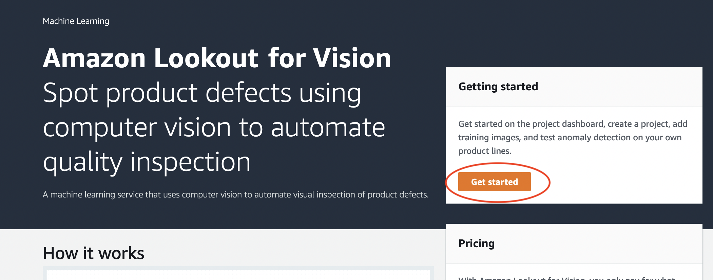 4. In the **Projects** section, choose **Create project**.

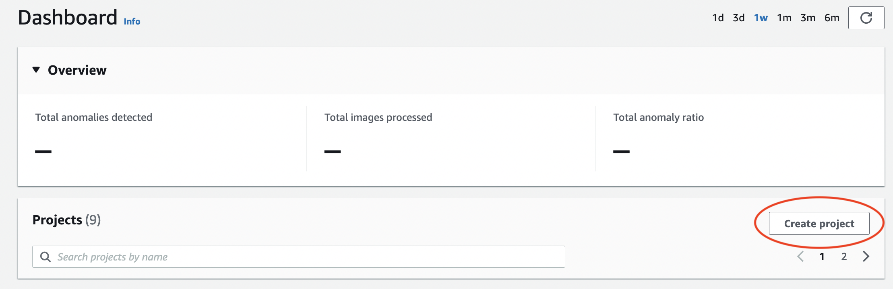 5. On the **Create project** page, do the following:

    1. In **Project name**, enter `getting-started`.
    2. Choose **Create project**.

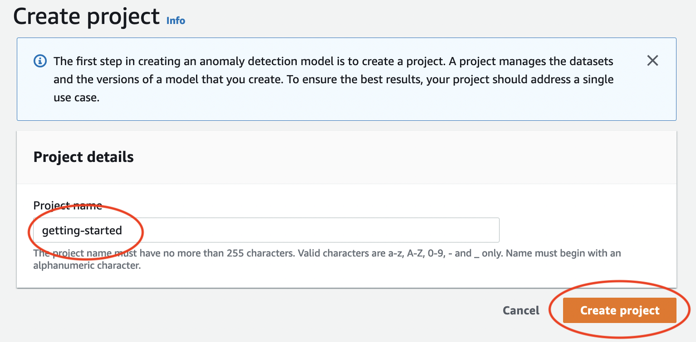 6. On the project page, in the **How it works** section, choose
**Create dataset**.

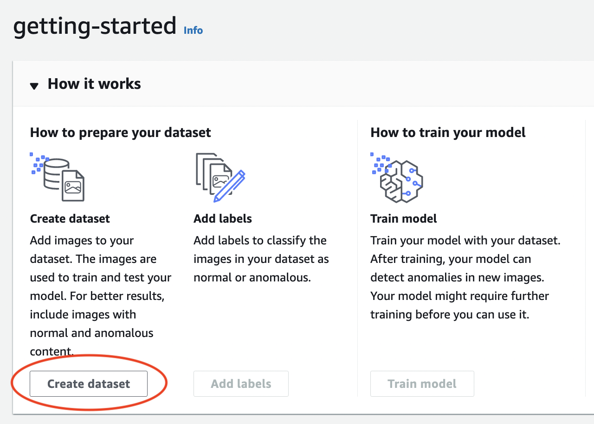 7. On the **Create dataset** page, do the following:

    1. Choose **Create a single dataset**.
    2. In the **Image source configuration** section, choose
     **Import images labeled by SageMaker Ground
     Truth**.
    3. For **.manifest file location**, enter the Amazon S3
     location of the manifest file that you noted in step 6.c. of [Step 1: Create the manifest file and upload images](#getting-started-prepare-files "#getting-started-prepare-files"). The Amazon S3 location
     should be similar to `s3://`path to getting started
     folder`/manifests/train.manifest`
    4. Choose **Create dataset**.

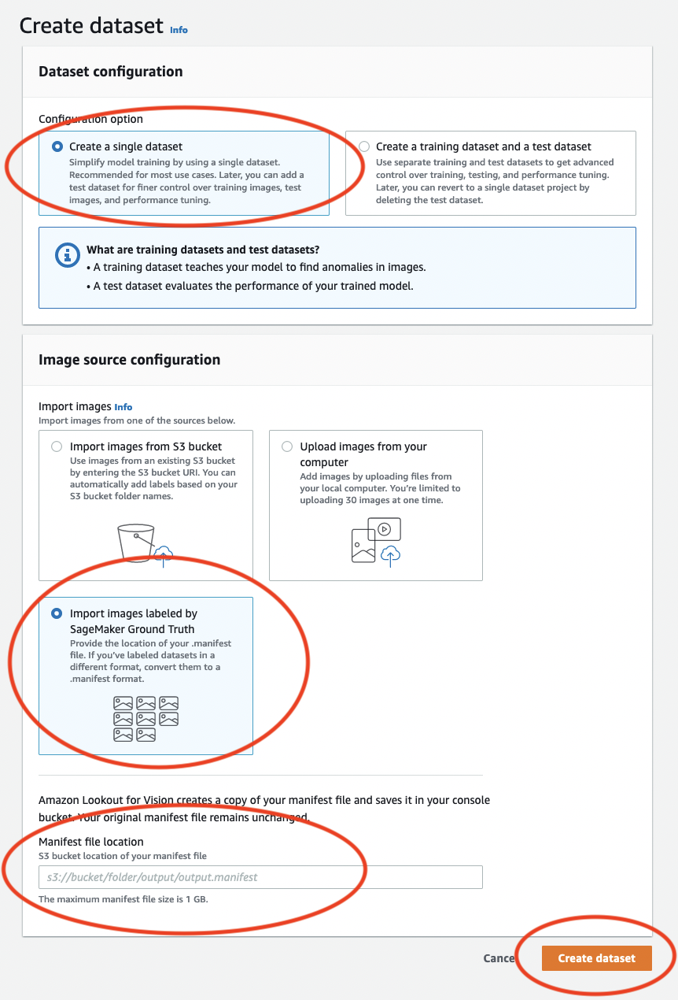 8. On the project details page, in the **Images** section, view
the dataset images. You can view the classification and image segmentation
information (mask and anomaly labels) for each dataset image. You can also
search for images, filter images by labeling status (labeled/unlabeled), or
filter images by the anomaly labels assigned to them.

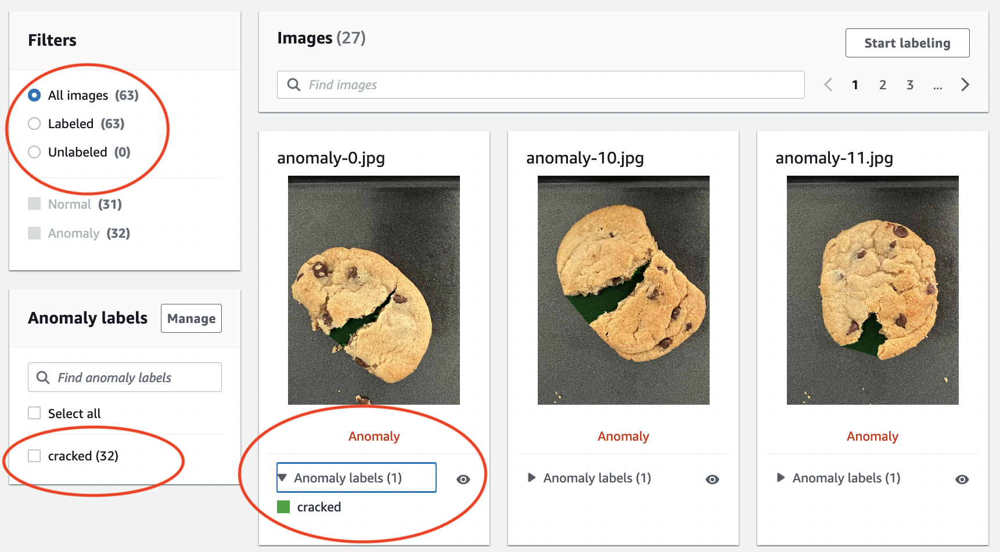 9. On the project details page, choose **Train model**.

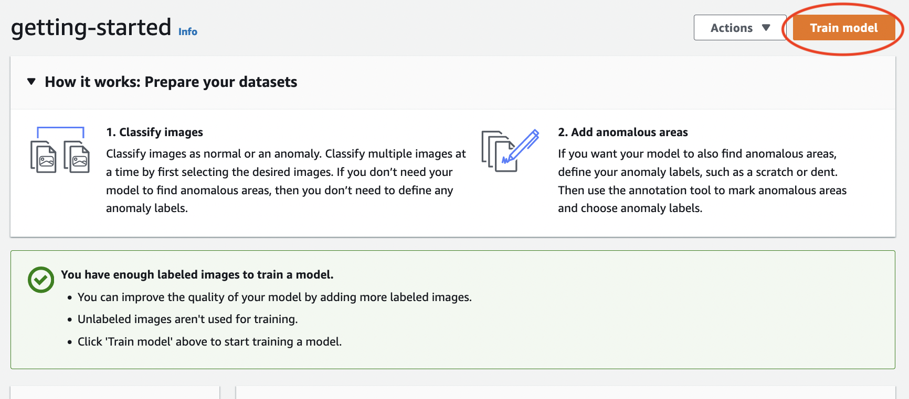 10. On the **Train model** details page, choose **Train model**. 11. In the **Do you want to train your model?** dialog box,
choose **Train model**. 12. In the project **Models** page, you can see that training has
started. Check the current status by viewing the **Status**
column for the model version. Training the model takes at least 30 minutes to
complete. Training has successfully finished when the status changes to
**Training complete**. 13. When training finishes, choose the model **Model 1** in the **Models**
page.

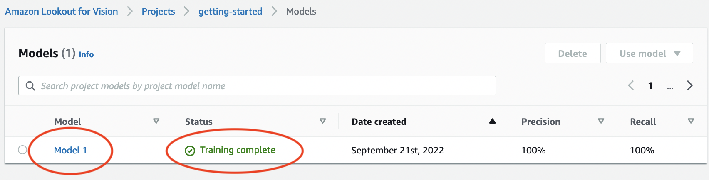 14. In the model's details page, view the evaluation results in the **Performance metrics**
tab. There are metrics for the following:

    * Overall model performance metrics ([precision](improve.md#precision-metric "improve.md#precision-metric"), [recall](improve.md#recall-metric "improve.md#recall-metric"),
     and [F1 score](improve.md#f1-metric "improve.md#f1-metric")) for the classification predictions made by the model.


    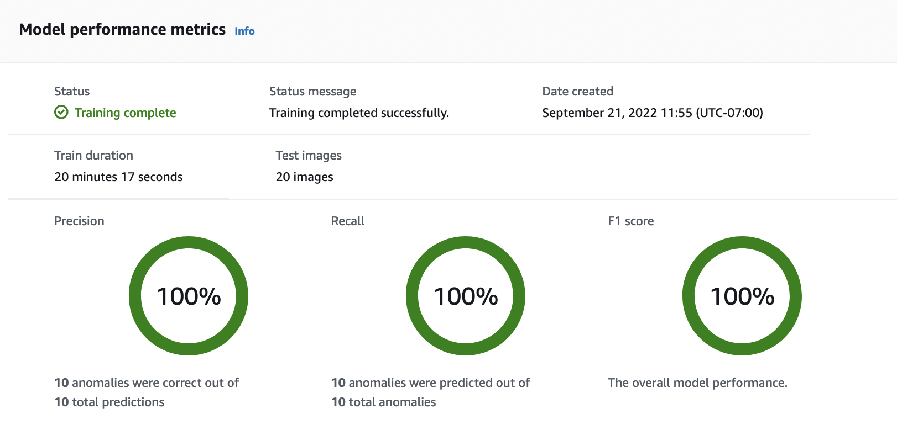
    * Performance metrics for anomaly labels found in the test images
     ([Average IoU](improve.md#iou-metric "improve.md#iou-metric"), F1 score)


    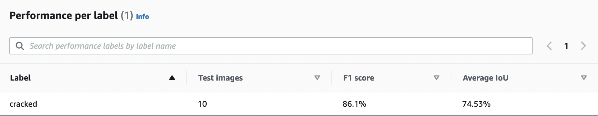
    * Predictions for [test images](improve.md#test-results "improve.md#test-results") (classification,
     segmentation masks, and anomaly labels)


    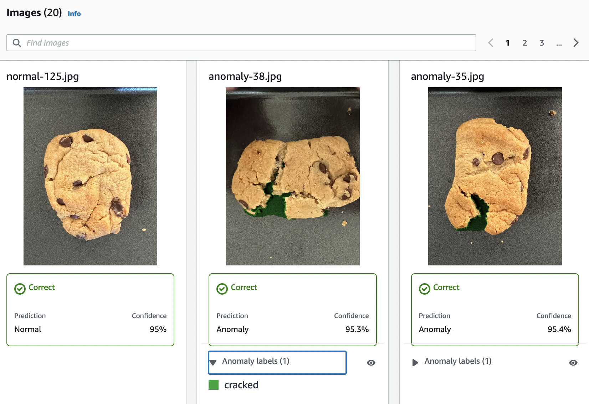

As model training is non-deterministic, your evaluation results might differ from the results on shown on this page. For more information, see [Improving your Amazon Lookout for Vision model](improve.md "improve.md").

## Step 3: Start the model

In this step, you start hosting the model so that it is ready to analyze images. For more information,
see [Running your trained Amazon Lookout for Vision model](running-model.md "running-model.md").

###### Note

You are charged for the amount of time that your model runs. You stop your model
in [Step 5: Stop the model](#getting-started-analyze-image-stop-model "#getting-started-analyze-image-stop-model").

###### To start the model.

1. On the model's details page, choose **Use model**
   and then choose **Integrate API to the cloud**.

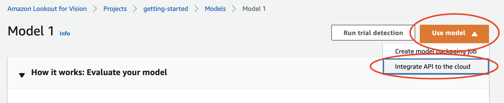 2. In the **AWS CLI commands** section, copy the `start-model` AWS CLI
command.

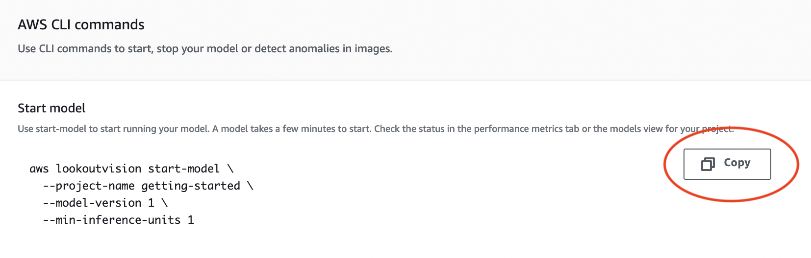 3. Make sure that the AWS CLI is configured to run in the same AWS Region in
which you are using the Amazon Lookout for Vision console. To change the AWS Region that the
AWS CLI uses, see [Install the AWS SDKS](su-awscli-sdk.md#sdk-install-sdk "su-awscli-sdk.md#sdk-install-sdk"). 4. At the command prompt, start the model by entering the
`start-model` command. If you are using the
`lookoutvision` profile to get credentials, add the
`--profile lookoutvision-access` parameter. For example:

```
aws lookoutvision start-model \
  --project-name getting-started \
  --model-version 1 \
  --min-inference-units 1 \
  --profile lookoutvision-access
```

If the call is successful, the following output is displayed:

```
{
    "Status": "STARTING_HOSTING"
}
```

5. Back in the console, choose **Models** in the navigation pane.

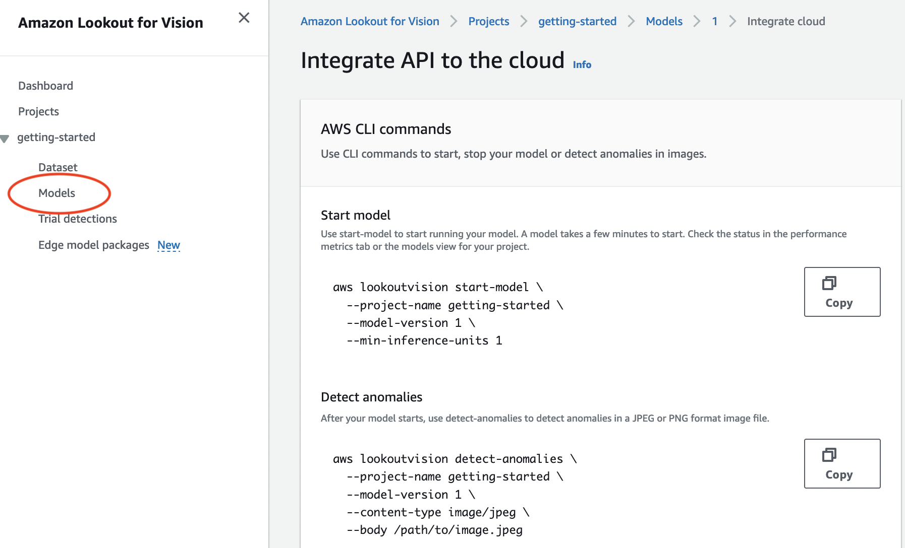 6. Wait until the status of the model (Model 1) in the **Status** column
displays **Hosted**. If you've previously trained a model in
the project, wait for the latest model version to complete.

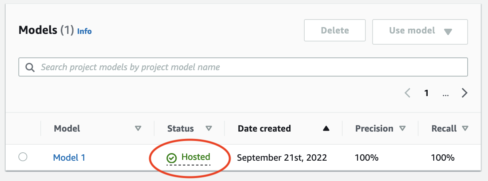

## Step 4: Analyze an image

In this step, you analyze an image with your model. We provide example images that you
can use in the getting started `test-images` folder in the Lookout for Vision
documentation repository on your [computer](#getting-started-prepare-files "#getting-started-prepare-files"). For more information, see [Detecting anomalies in an image](inference-detect-anomalies.md "inference-detect-anomalies.md").

###### To analyze an image

1. On the **Models** page, choose the model **Model
   1**.

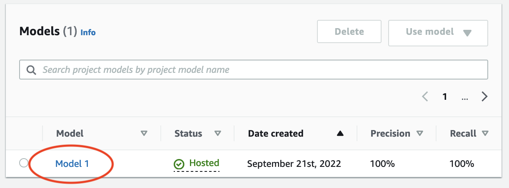 2. On the model's details page, choose **Use model** and then
choose **Integrate API to the cloud**.

 3. In the **AWS CLI commands** section, copy the
`detect-anomalies` AWS CLI command.

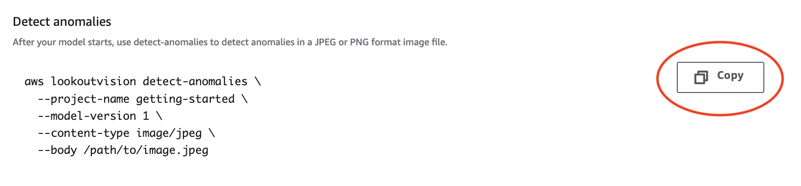 4. At the command prompt, analyze an anomalous image by entering the
`detect-anomalies` command from the previous step. For the
`--body` parameter, specify an anomalous image from the getting
started `test-images` folder on your
[computer](#getting-started-prepare-files "#getting-started-prepare-files"). If you are using the
`lookoutvision` profile to get credentials, add the
`--profile lookoutvision-access` parameter. For example:

```
aws lookoutvision detect-anomalies \
  --project-name getting-started \
  --model-version 1 \
  --content-type image/jpeg \
  --body `/path/to/test-images/test-anomaly-1.jpg` \
  --profile lookoutvision-access
```

The output should look similar to the following:

```
{
    "DetectAnomalyResult": {
        "Source": {
            "Type": "direct"
        },
        "IsAnomalous": true,
        "Confidence": 0.983975887298584,
        "Anomalies": [
            {
                "Name": "background",
                "PixelAnomaly": {
                    "TotalPercentageArea": 0.9818974137306213,
                    "Color": "#FFFFFF"
                }
            },
            {
                "Name": "cracked",
                "PixelAnomaly": {
                    "TotalPercentageArea": 0.018102575093507767,
                    "Color": "#23A436"
                }
            }
        ],
        "AnomalyMask": "iVBORw0KGgoAAAANSUhEUgAAAkAAAAMACA......"
    }
}
```

5.  In the output, note the following:

        * `IsAnomalous` is a Boolean for the predicted
         classification. `true` if the image is anomalous, otherwise
         `false`.
        * `Confidence` is a float value representing the confidence
         that Amazon Lookout for Vision has in the prediction. 0 is the lowest confidence, 1 is
         the highest confidence.
        * `Anomalies` is a list of anomalies found in the image.
         `Name` is the anomaly label. `PixelAnomaly`
         includes the total percentage area of the anomaly
         (`TotalPercentageArea`) and a color (`Color`)
         for the anomaly label. The list also includes a "background" anomaly
         that covers the area outside of anomalies found on the image.
        * `AnomalyMask` is a mask image that shows the location of
         the anomalies on the analyzed image.

    You can use information in the response to display a blend of the analyzed
    image and anomaly mask, as shown in the following example. For example code, see
    [Showing classification and segmentation information](inference-display-information.md "inference-display-information.md").

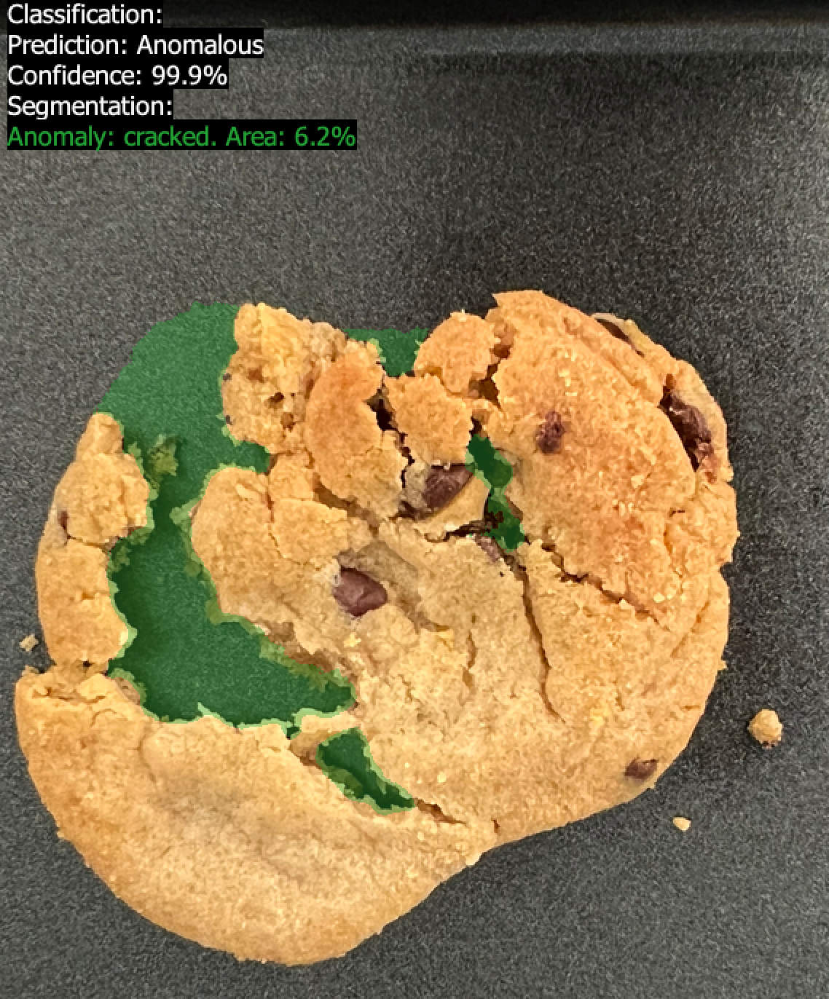 6. At the command prompt, analyze a normal image from the getting started
`test-images` folder. If you are using the
`lookoutvision` profile to get credentials, add the
`--profile lookoutvision-access` parameter. For example:

```
aws lookoutvision detect-anomalies \
  --project-name getting-started \
  --model-version 1 \
  --content-type image/jpeg \
  --body `/path/to/test-images/test-normal-1.jpg` \
  --profile lookoutvision-access
```

The output should look similar to the following:

```
{
    "DetectAnomalyResult": {
        "Source": {
            "Type": "direct"
        },
        "IsAnomalous": false,
        "Confidence": 0.9916400909423828,
        "Anomalies": [
            {
                "Name": "background",
                "PixelAnomaly": {
                    "TotalPercentageArea": 1.0,
                    "Color": "#FFFFFF"
                }
            }
        ],
        "AnomalyMask": "iVBORw0KGgoAAAANSUhEUgAAAkAAAA....."
    }
}
```

7. In the output, note that the `false` value for
   `IsAnomalous` classifies the image as having no anomalies. Use
   `Confidence` to help decide your confidence in the
   classification. Also, the `Anomalies` array only has the
   `background` anomaly label.

## Step 5: Stop the model

In this step, you stop hosting the model. You are charged for the amount of time your
model is running. If you aren't using the model, you should stop it. You can restart the model when you
next need it. For more information, see [Starting your Amazon Lookout for Vision model](run-start-model.md "run-start-model.md").

###### To stop the model.

1. Choose **Models** in the navigation pane.

 2. In the **Models** page, choose the model **Model 1**.

 3. On the model's details page, choose **Use model**
and then choose **Integrate API to the cloud**.

 4. In the **AWS CLI commands** section, copy the `stop-model` AWS CLI command.

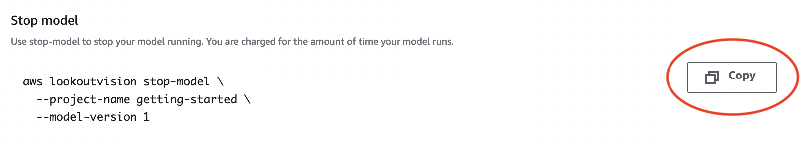 5. At the command prompt, stop the model by entering the `stop-model`
AWS CLI command from the previous step. If you are using the
`lookoutvision` profile to get credentials, add the
`--profile lookoutvision-access` parameter. For example:

```
aws lookoutvision stop-model \
  --project-name getting-started \
  --model-version 1 \
  --profile lookoutvision-access
```

If the call is successful, the following output is displayed:

```
{
    "Status": "STOPPING_HOSTING"
}
```

6. Back in the console, choose **Models** in the left navigation page.
7. The model has stopped when the status of the model in the **Status** column is
   **Training complete**.

## Next steps

When you are ready create a model with your own images, start by following the
instructions in [Creating your project](model-create-project.md "model-create-project.md"). The instructions include steps for creating
a model with the Amazon Lookout for Vision console and with the AWS SDK.

If you want to try other example datasets, see [Example code and datasets](examples.md "examples.md").
