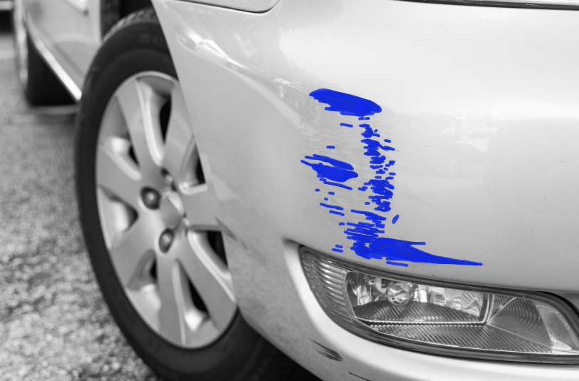
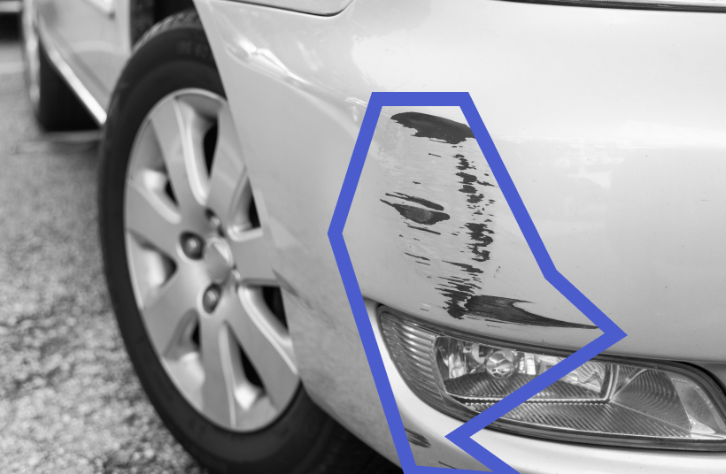

End of support notice: On October 31, 2025, AWS
will discontinue support for Amazon Lookout for Vision. After October 31, 2025, you will
no longer be able to access the Lookout for Vision console or Lookout for Vision resources.
For more information, visit this [blog post](https://aws.amazon.com/blogs/machine-learning/exploring-alternatives-and-seamlessly-migrating-data-from-amazon-lookout-for-vision "https://aws.amazon.com/blogs/machine-learning/exploring-alternatives-and-seamlessly-migrating-data-from-amazon-lookout-for-vision").

# Segmenting images (console)

If you're creating an image segmentation model, you must classify images as normal
or anomaly. You must also add segmentation information to anomalous images. To
specify segmentation information, you first specify anomaly labels for each type of anomaly,
such as a dent or scratch, that you want your model to find. Then you specify an anomaly mask
and anomaly label for each anomaly on anomalous images in your dataset.

###### Note

If you're creating an image classification model, you don't need to segment images and
you don't need to specify anomaly labels.

###### Topics

- [Specifying anomaly labels](#segment-image-anomaly-types "#segment-image-anomaly-types")
- [Labeling an image](#segment-image-label "#segment-image-label")
- [Segmenting an image with the annotation tool](#segment-image-annotation-tool "#segment-image-annotation-tool")

## Specifying anomaly labels

You define an anomaly label for each type of anomaly that's in the dataset images.

###### Specify anomaly labels

1. Open the Amazon Lookout for Vision console at [https://console.aws.amazon.com/lookoutvision/](https://console.aws.amazon.com/lookoutvision/ " https://console.aws.amazon.com/lookoutvision/").
2. In the left navigation pane, choose **Projects**.
3. In the **Projects** page, choose the project that you want to
   use.
4. In the left navigation pane of your project, choose
   **Dataset**.
5. In **Anomaly labels** choose **Add anomaly
   labels**. If you've previously added an anomaly label, choose **Manage**.
6. In the dialog box, do the following:
   1. Enter the anomaly label that you want to add and choose **Add anomaly label**.
   2. Repeat the previous step until you have entered every anomaly label that you want your model to find.
   3. (Optional) Choose the edit icon to change the label name.
   4. (Optional) Choose the delete icon to delete a new anomaly label. You can't delete anomaly types that your dataset is currently using using.

7. Choose **Confirm** to add the new anomaly labels to the dataset.

After you specify the anomaly labels, label the images by doing [Labeling an image](#segment-image-label "#segment-image-label").

## Labeling an image

To label an image for image segmentation, classify the image as normal or an
anomaly. Then, use the annotation tool to segment the image by drawing masks
that tightly cover the areas for each type of anomaly present in the
image.

###### To label an image

1. If you have separate training and test datasets, choose the tab for the
   dataset that you want to use.
2. If you haven't already, specify the anomaly types for your dataset by
   doing [Specifying anomaly labels](#segment-image-anomaly-types "#segment-image-anomaly-types").
3. Choose **Start labeling**.
4. Choose **Select all images on this page**.
5. If the images are normal, choose **Classify as normal**,
   otherwise choose **Classify as anomaly**.
6. To change the label for a single image, choose **Normal** or **Anomaly** under the image.

###### Note

You can filter image labels by choosing the desired label, or label state, in the
**Filters** section. You can sort by confidence
score in the **Sorting options** section. 7. For each anomalous image, choose the image to open the annotation tool.
Add segmentation information by doing
[Segmenting an image with the annotation tool](#segment-image-annotation-tool "#segment-image-annotation-tool"). 8. Choose **Save changes**. 9. If you've finished labeling your images, you can [train](model-train.md "model-train.md") your model.

## Segmenting an image with the annotation tool

You use the annotation tool to segment an image by marking anomalous areas with a mask.

###### To segment an image with the annotation tool

1. Open the annotation tool by selecting the image in the dataset gallery. If necessary, choose **Start labeling**
   to enter labeling mode.
2. In the **Anomaly labels** section choose the anomaly label that you want to mark.
   If necessary, choose **Add anomaly labels** to add a new anomaly label.
3. Choose a drawing tool at the bottom of the page and draw masks that tightly covers anomalous areas for the anomaly label.
   The following image is an example of a mask that tightly covers an anomaly.

The following is an example of a poor mask that doesn't tightly cover an anomaly.

 4. If you have more images to segment, choose **Next** and repeat steps 2 and 3. 5. Choose **Submit and close** to finish segmenting images.
