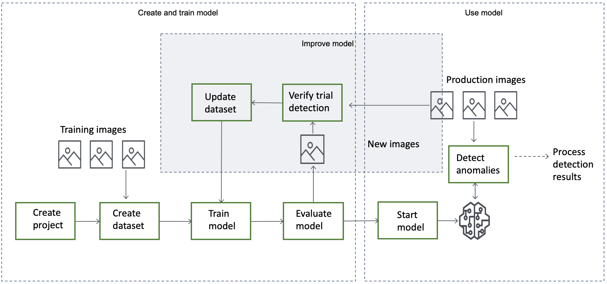
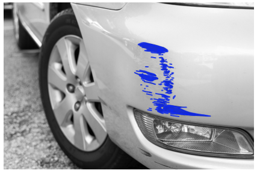

End of support notice: On October 31, 2025, AWS
will discontinue support for Amazon Lookout for Vision. After October 31, 2025, you will
no longer be able to access the Lookout for Vision console or Lookout for Vision resources.
For more information, visit this [blog post](https://aws.amazon.com/blogs/machine-learning/exploring-alternatives-and-seamlessly-migrating-data-from-amazon-lookout-for-vision "https://aws.amazon.com/blogs/machine-learning/exploring-alternatives-and-seamlessly-migrating-data-from-amazon-lookout-for-vision").

# Understanding Amazon Lookout for Vision

You can use Amazon Lookout for Vision to find visual defects in industrial products, accurately and at scale,
for tasks such as:

- **Detecting damaged parts** – Spot damage to a product’s
  surface quality, color, and shape during the fabrication and assembly process.
- **Identifying missing components** – Determine
  missing components based on the absence, presence, or placements of objects. For example,
  a missing capacitor on a printed circuit board.
- **Uncovering process issues** – Detect defects
  with repeating patterns, such as repeated scratches in the same spot on a silicon
  wafer.
  With Lookout for Vision you create a computer vision model that predicts the presence of anomalies in an image. You
  provide the images that Amazon Lookout for Vision uses to train and test your model. Amazon Lookout for Vision provides metrics that you
  can use to evaluate and improve your trained model. You can host the trained model in the AWS cloud or
  you can deploy the model to an edge device. A simple API operation returns the predictions that your model makes.

The general workflow for creating, evaluating, and using a model is as follows:

###### Topics

- [Choose your model type](#ud-choose-model-type "#ud-choose-model-type")
- [Create your model](#ud-general-create-model "#ud-general-create-model")
- [Evaluate your model](#ud-evaluate-model "#ud-evaluate-model")
- [Use your model](#ud-use-model "#ud-use-model")
- [Use your model on an edge device](#ud-edge-device "#ud-edge-device")
- [Use your dashboard](#ud-dashboard "#ud-dashboard")

## Choose your model type

Before you can create a model, you must decide which type of model you want.
You can create two types of model, _image classification_ and
_image segmentation_. You decide which type of model to create
based on your use case.

### Image classification model

If you only need to know if an image contains an anomaly, but don’t need to know
its location, create an image classification model. An image classification model
makes a prediction of whether an image contains an anomaly. The prediction includes
the model's confidence in the accuracy of the prediction. The model doesn’t provide
any information about the location of any anomalies found on the image.

### Image segmentation model

If you need to know the location of an anomaly, such as the location of a scratch,
create an image segmentation model. Amazon Lookout for Vision models use _semantic
segmentation_ to identify the pixels on an image where the types of
anomalies (such as a scratch or a missing part) are present.

###### Note

A semantic segmentation model locates different types of
anomaly. It doesn't provide instance information for individual anomalies. For
example, if an image contains two _dents_, Lookout for Vision returns
information about both dents in a single entity representing the
_dent_ anomaly type.

An Amazon Lookout for Vision
segmentation model predicts the following:

#### Classification

The model returns a classification for an analyzed image (normal/anomaly),
which includes the model's confidence in the prediction. Classification
information is calculated separately from segmentation information and you
shouldn't assume a relationship between them.

#### Segmentation

The model returns an image mask that marks the pixels where anomalies occur on
the image. Different types of anomaly are color coded according to the color
assigned to the _anomaly label_ in the dataset. An anomaly
label represents the type of an anomaly. For example, the blue mask in the
following image marks the location of a _scratch_ anomaly
type found on a car.

The model returns the color code for each anomaly label in the mask.
The model also returns the percentage covering of the image that an anomaly label has.

With a Lookout for Vision segmentation model, you can use various criteria to analyze the
analysis results from the model. For example:

- Anomaly location – If you need to know the location of anomalies,
  use segmentation information to see masks that cover anomalies.
- Types of anomaly – Use segmentation information to decide if an
  image contains more than an acceptable number of anomaly types.
- Area of coverage – Use segmentation information to decide if an
  anomaly type covers more than an acceptable area of an image.
- Image classification – If you don't need to know the location of
  anomalies, use classification information to determine if an image contains
  anomalies.

For example code, see [Detecting anomalies in an image](inference-detect-anomalies.md "inference-detect-anomalies.md").

After you decide which type of model you want, you create a project and a dataset to
manage your model. Using Labels, you can classify images as normal or an anomaly.
Labels also identify segmentation information such as masks and anomaly types. How you
label the images in your dataset determines the type of model that Lookout for Vision creates for
you.

Labeling an image segmentation model is more complex than labeling an image
classification model. To train a segmentation model, you have to classify the training
images as normal or anomalous. You also have to define anomaly masks and anomaly types
for each anomalous image. A classification model only requires you to identify training
images as normal or anomalous.

## Create your model

The steps to create a model are creating a project, creating a dataset, and training the model
are as follows:

### Create a project

Create a project to manage the datasets and the models that you create.
A project should be used for a single use case, such as detecting anomalies in a single
type of machine part.

You can use the dashboard to get an overview of your projects. For more
information, see [Using the Amazon Lookout for Vision dashboard](dashboard.md "dashboard.md").

**More information**: [Create your project](model-create-project.md "model-create-project.md").

### Create a dataset

To train a model Amazon Lookout for Vision needs images of normal and anomalous
objects for your use case. You supply these images in a
_dataset_.

A dataset is a set of images and labels that describe those images. The images
should represent a single type of object on which anomalies can occur. For more
information, see [Preparing images for a dataset](model-create-dataset.md#model-prepare-images "model-create-dataset.md#model-prepare-images").

With Amazon Lookout for Vision you can have a project that uses a single dataset, or a project
that has separate training and test datasets. We recommend using a single dataset
project unless you want finer control over training, testing, and performance
tuning.

You create a dataset by importing the images. Depending on how you import the images,
the images might be also be labeled. If not, you use the console to label the images.

#### Importing images

If you create the dataset with the Lookout for Vision console, you can import the images in
one of the following ways:

- [Import images from your
  local computer](create-dataset-computer-upload.md "create-dataset-computer-upload.md"). The images aren't labeled.
- [Import images from an S3
  bucket](create-dataset-s3.md "create-dataset-s3.md"). Amazon Lookout for Vision can classify the images using the folder
  names that contain the images. Use `normal` for normal
  images. Use `anomaly` for anomalous images. You can't
  automatically assign segmentation labels.
- [Import an Amazon SageMaker AI Ground
  Truth manifest file](create-dataset-ground-truth.md "create-dataset-ground-truth.md"). Images in a manifest file are labeled.
  You can create and import your own manifest file. If you have many
  images, consider using the SageMaker AI Ground Truth labeling service. You then
  import the output manifest file from the Amazon SageMaker AI Ground Truth job.

#### Labeling images

Labels describe an image in a dataset. Labels specify if an image is normal or
anomalous (classification). Labels also describe the location of anomalies on an
image (segmentation).

If your images aren't labeled, you can use the console to label them.

The labels you assign to images in your dataset determines the type of
model that Lookout for Vision creates:

##### Image classification

To create an image classification model, use the Lookout for Vision
[console](model-label.md "model-label.md") to
classify images in the dataset as normal or an anomaly.

You can also use the `CreateDataset` operation to create a dataset
from a manifest file that includes [classification](manifest-file-classification.md "manifest-file-classification.md") information.

##### Image segmentation

To create an image segmentation model, use the Lookout for Vision [console](segment-image.md "segment-image.md") to classify images in the dataset
as normal or an anomaly. You also specify pixel masks for anomalous
areas on the image (if they exist) as well as an anomaly label for
individual anomaly masks.

You can also use the `CreateDataset` operation to create a
dataset from a manifest file that includes [segmentation and
classification](manifest-file-segmentation.md "manifest-file-segmentation.md") information.

If your project has separate training and test datasets, Lookout for Vision
uses the training dataset to learn and determine the model type.
You should label the images in your test dataset in
the same way.

**More information**: [Creating your dataset](model-create-dataset.md "model-create-dataset.md").

### Train your model

Training creates a model and trains it to predict the presence of anomalies
in images. A new version of your model is created each time you train.

At the start of training, Amazon Lookout for Vision chooses the most suitable algorithm to train
your model with. The model is trained and then tested. In
[Getting started with Amazon Lookout for Vision](getting-started.md "getting-started.md"), you train a single dataset
project, the dataset is internally split to create a training dataset and a test
dataset. You can also create a project that has separate training and test datasets.
In this configuration, Amazon Lookout for Vision trains your model with the training dataset and tests
the model with the test dataset.

###### Important

You are charged for the amount of time that it takes to successfully train your model.

**More information**: [Train your model](model-train.md "model-train.md").

## Evaluate your model

Evaluate the performance of your model by using the performance metrics created during testing.

Using performance metrics, you can better understand the performance of your
trained model, and decide if you're ready to use it in production.

**More information**: [Improving your model](improve.md "improve.md").

If the performance metrics indicate that improvements are needed, you can add more
training data by running a trial detection task with new images. After the task
completes,
you can verify the results and add the verified images to your training dataset.
Alternatively, you can add new training images directly to the dataset. Next, you
retrain your model and recheck the performance metrics.

**More information**: [Verifying your model with a trial detection task](trial-detection.md "trial-detection.md") .

## Use your model

Before you can use your model in the AWS cloud, you start the model with the [StartModel](../APIReference/API_StartModel.md "../APIReference/API_StartModel.md") operation.
You can get the `StartModel` CLI command for your model from the console.

**More information**: [Start your model](run-start-model.md "run-start-model.md").

A trained Amazon Lookout for Vision model predicts whether an input image contains normal or
anomalous content. If your model is a segmentation model, the prediction includes
an anomaly
mask that marks the pixels where anomalies are found.

To make a prediction with your model, call the [DetectAnomalies](../APIReference/API_DetectAnomalies.md "../APIReference/API_DetectAnomalies.md") operation and pass
an input image from your local computer.

You can get the CLI command that calls `DetectAnomalies`
from the console.

**More information**: [Detect anomalies in an image](inference-detect-anomalies.md "inference-detect-anomalies.md").

###### Important

You are charged for the time that your model is running.

If you are no longer using your model, use the [StopModel](../APIReference/API_StopModel.md "../APIReference/API_StopModel.md") operation to stop the model. You
can get the CLI command from the console.

**More information**: [Stop your model](run-stop-model.md "run-stop-model.md").

## Use your model on an edge device

You can use a Lookout for Vision model on an AWS IoT Greengrass Version 2 core device.

**More information**: [Using your Amazon Lookout for Vision model on an edge device](models-devices.md "models-devices.md").

## Use your dashboard

You can use the dashboard to get an overview of all your projects and overview information for individual
projects.

**More information**: [Use your dashboard](dashboard.md "dashboard.md").
