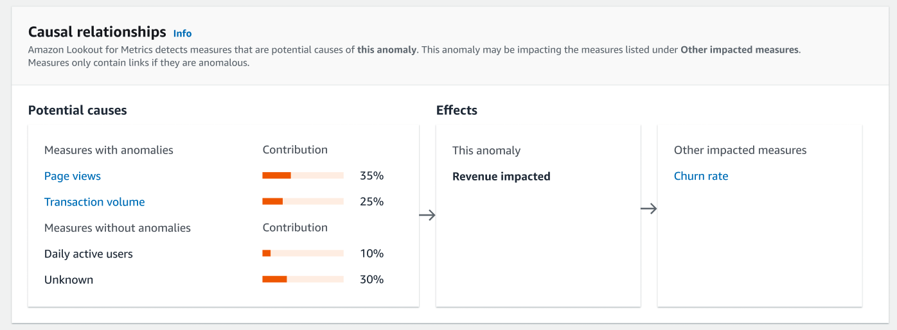
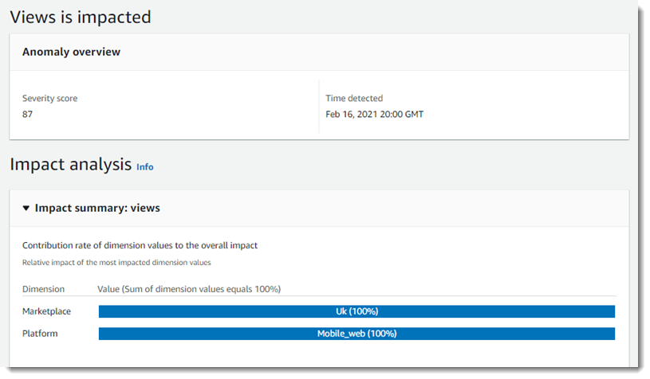
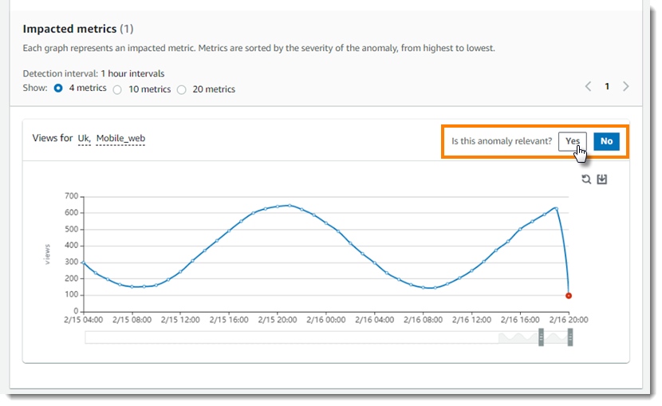
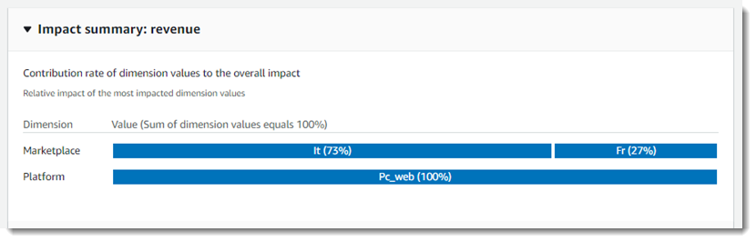

Amazon Lookout for Metrics is no longer available to new customers. Existing Amazon Lookout for Metrics customers will be able to use the service until September 12, 2025, when we will end support for Amazon Lookout for Metrics. To help transition off of Amazon Lookout for Metrics, please read [Transitioning off Amazon Lookout for Metrics](https://aws.amazon.com/blogs/machine-learning/transitioning-off-amazon-lookout-for-metrics/ "https://aws.amazon.com/blogs/machine-learning/transitioning-off-amazon-lookout-for-metrics/").

# Working with anomalies

An _anomaly_ is a data point that the detector doesn't
expect based on its understanding of your data. An anomaly isn't necessarily good or bad, it's
just unexpected. A detector learns over time to more accurately identify anomalies based on
patterns that it finds in your data.

Lookout for Metrics organizes anomalies that affect the same [measure](gettingstarted-concepts.md#gettingstarted-concepts-metrics "gettingstarted-concepts.md#gettingstarted-concepts-metrics") during the same interval groups and
displays them as a single event. To get details about anomalies, view them in the Amazon Lookout for Metrics
console.

###### To view anomalies

1. Open the [Lookout for Metrics console Detectors](https://console.aws.amazon.com/lookoutmetrics/home#detectors "https://console.aws.amazon.com/lookoutmetrics/home#detectors") page.
2. Choose a detector.
3. Choose **Anomalies**.
4. Use the options on the page to sort and filter the list of anomalies.
   - **Search bar** – To filter the list of anomalies
     by title, enter the name of a measure.
   - **Severity threshold** – To filter out
     lower-severity anomalies but maintain the display order, use the severity threshold
     slider.
   - **Sort columns** – To sort by title, severity
     score, or timestamp, choose the name of the relevant column.

5. For details, choose an anomaly from the list.
   The detector assigns a severity score between 0 and 100. The severity score indicates how
   far the data point is outside of the expected range based on the data that the detector has
   analyzed. The higher the severity score, the more unexpected the anomaly is.

###### Topics

- [Causal relationships](#detectors-anomalies-causes "#detectors-anomalies-causes")
- [Affected measures](#detectors-anomalies-impact "#detectors-anomalies-impact")
- [Providing feedback](#detectors-anomalies-feedback "#detectors-anomalies-feedback")
- [Contributing metrics](#detectors-anomalies-contribution "#detectors-anomalies-contribution")

## Causal relationships

The Causal relationships section identifies the measures in your datasets that are
potentially causing anomalies at specific time points, and also identifies other measures that
may be impacted by the anomaly.

During anomaly detection periods, Lookout for Metrics identifies measures that are
likely causing particular anomalies, determines the direction of influence, and quantifies the
level of contribution.

Causal relationships is divided into two sections: Potential causes and Effects. Potential
causes are measures that are potentially causing the inspected anomaly. The Effects section
shows the inspected anomaly and any measures that may be impacted by the anomaly.

### Potential causes

All measures listed under Potential causes are contributing to the anomaly.
**Measures with anomalies** are anomalous measures, and you can use the
links to learn more about those anomalies. **Measures without anomalies**
are measures that do not contain anomalies, but still contribute to the anomaly you are
inspecting.

You can gauge the impact each measure had in causing the anomaly by comparing the
contribution percentages of the listed measures.

The unexplained portion of the anomaly is represented as “Unknown”. This is the
contribution of factors that are not captured in the measures.

### Effects

The Effects section shows the anomaly you are reviewing and any measures that may be
impacted by the anomaly.

The anomaly you are reviewing is listed under **This anomaly**, and any
measures that may be impacted by this anomaly are listed under **Other impacted
measures**. You can use the links to learn more about the anomalies within those
measures.

## Affected measures

The title of an anomaly indicates the measure that was affected. If your dataset has
dimensions, the values of each dimension are also part of the metric. In the following
example, the number of `views` recorded was anomalous. The dataset has two
dimensions, `marketplace` and `platform`, with values that indicate
where the metric was recorded and the kind of device that was in use. The number of views was
found to be affected only in the UK marketplace (**Uk**) on mobile platforms
(**Mobile_web**). The **100%** for each dimension value
indicates that the anomaly was only observed for one value within each dimension.

Below the impact summary, there is a graph of the affected metric over time. In this
example, the number of mobile views in the UK dropped sharply between 7 PM and 8 PM. This drop
was unexpected considering the marketplace, platform, and time of day.

## Providing feedback

This drop could indicate an issue in the marketplace and platform, or an external factor
that isn't represented in the data. To indicate whether the anomaly is relevant, use the
feedback buttons above the graph. When the detector finds similar anomalies later, it will
consider the feedback as it determines the severity score.

## Contributing metrics

If the detector finds anomalies in multiple metrics for the same measure, it groups them
together into a single event. In the following example, metrics for `revenue` on
the PC platform are affected on PC in both Italy and France, but to a greater degree in Italy.

In this case, _revenue on PC in Italy_ is one metric, and
_revenue on PC in France_ is a second. If mobile revenue was also
affected in both marketplaces, there would be four metrics, and the platform dimension would
show the impact of PC vs mobile revenue.
