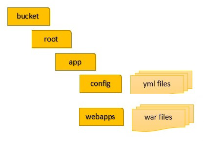

AWS Mainframe Modernization Service (Managed Runtime Environment experience) will no longer be open to new customers starting on November 7, 2025. If you would like to use the service, please sign up prior to November 7, 2025. For capabilities similar to AWS Mainframe Modernization Service (Managed Runtime Environment experience) explore AWS Mainframe Modernization Service (Self-Managed Experience). Existing customers can continue to use the service as normal. For more information, see
[AWS Mainframe Modernization availability change](mainframe-modernization-availability-change.md "mainframe-modernization-availability-change.md").

# Structure of AWS Blu Age managed

applications

If you use the AWS Blu Age refactoring pattern, the AWS Blu Age runtime engine expects the following
structure inside the `application-name` folder in your S3 bucket:



**config**

Contains the YAML files for your project. These are the YAML files specific to your
application, typically named something like `application-planetsdemo.yaml`
and not the `application-main.yaml` file that AWS Mainframe Modernization supplies and sets up
automatically for you.

**webapps**

Contains the `war` files for your application. Those files are an output of the
modernization process.

An application can also have the following optional folders:

jics/sql

Contains the `initJics.sql` script that initializes the JICS database for your
application.

scripts

Contains application scripts, which you can also supply directly inside the
`war` files.

sql

Contains application SQL files, which you can also supply directly inside the
`war` files.

lnk

Contains application LNK files, which you can also supply directly inside the
`war` files.

extra

Contains jars that can provide additional capabilities for the modernized application.

## Managing an application's Java

options

To manage
some
java options for the application, add a properties file named
`tomcat.properties` to the `application-name` folder. This
file can have
three
properties: `xms`, which specifies the minimum Java memory consumption,
`xmx`,
which specifies the maximum Java memory
consumption, and
`dnscachettl`, that manages the cache duration for dns resolutions.
The following is an example of the contents of a valid `tomcat.properties`
file.

```
xms=512M
xmx=1G
dnscachettl=5
```

The values that you specify for
the
first two properties can be in any of the following units:

- Bytes: don't specify a unit.
- Kilobytes: append a K to the value.
- Megabytes: append an M to the value.
- Gigabytes: append a G to the value.

The value for the third property represents the cache duration in seconds, and can have
value of -1 (cache forever), or can range from 0 (never cache) to 999. In the context of managed
application deployments, the default value is -1.
