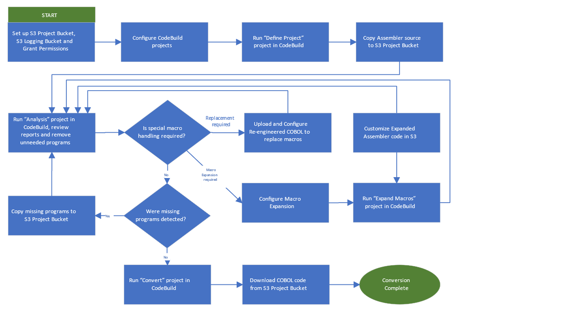

AWS Mainframe Modernization Service (Managed Runtime Environment experience) will no longer be open to new customers starting on November 7, 2025. If you would like to use the service, please sign up prior to November 7, 2025. For capabilities similar to AWS Mainframe Modernization Service (Managed Runtime Environment experience) explore AWS Mainframe Modernization Service (Self-Managed Experience). Existing customers can continue to use the service as normal. For more information, see
[AWS Mainframe Modernization availability change](mainframe-modernization-availability-change.md "mainframe-modernization-availability-change.md").

# Understand components and processes for Code conversion

AWS Mainframe Modernization Code conversion process includes various components such as AWS Mainframe Modernization container,
S3 project bucket, and Log file locations.

###### Topics

- [AWS Mainframe Modernization container](#assembler-conversion-components-container "#assembler-conversion-components-container")
- [S3 project bucket](#assembler-conversion-components-s3 "#assembler-conversion-components-s3")
- [Log file locations](#assembler-conversion-components-log "#assembler-conversion-components-log")
- [Process overview](#assembler-conversion-process "#assembler-conversion-process")

## AWS Mainframe Modernization container

AWS Mainframe Modernization Code conversion container runs in the AWS CodeBuild project, and provides
commands to set up the project directories and configuration files, assess Assembler
code, expand Assembler macros, and convert Assembler code to COBOL.

You will have access to the following AWS ECR
Repository:`381492161314.dkr.ecr.us-east-1.amazonaws.com/aws-mlogica-codebuild-prod`.

To use the images, you can follow either of the two options:

- Use the latest tag when consuming the image via AWS CodeBuild. When using the
  image, you will use this path:
  `381492161314.dkr.ecr.us-east-1.amazonaws.com/aws-mlogica-codebuild-prod`.
  This means that AWS CodeBuild will pick up whichever was the last pushed image into
  the repository.
- Listing the version and selecting from that. To do this use the following
  command via CLI to list the different versions in the repository:

```
aws ecr describe-images \
  --registry-id 381492161314 \
  --repository-name aws-mlogica-codebuild-prod \
  --query 'imageDetails[*].{ImagePushedAt: imagePushedAt, ImageTags: imageTags}' \
  --output json | jq '[.[] | {ImageURI: (.ImageTags[] | "381492161314.dkr.ecr.us-east-1.amazonaws.com/aws-mlogica-codebuild-prod:" + .), ImagePushedAt: .ImagePushedAt}] | sort_by(.ImagePushedAt) | reverse'
```

This will list all the images with the associated tag on each image, and the
time when a particular image was released to the repository. Based on the above
code, you will get a list of images where the tag on the image represents the
version of the code conversion utility. You can select the appropriate image
based on your requirements.

## S3 project bucket

The input and output code, code updated with expanded Macros, and the reports generated by AWS Mainframe Modernization Code conversion
are stored in the project bucket you create in your AWS Account Management.
You provide AWS Mainframe Modernization Code conversion with access to the bucket by granting permissions to an AWS service role.

## Log file locations

Log files are written in two locations during each CodeBuild project execution:

- Log files with high-level results of each CodeBuild step are written to log
  files in the Logging bucket configured in the CodeBuild. These files appear as gzip
  archives with a GUID- type file name generated by the CodeBuild framework (e.g.,
  `0c03e183-ab40-4fe0-ba77- bc1d87e73b14.gz`). Each archive
  contains the log generated by the execution of a CodeBuild project. If a CodeBuild
  project execution fails, this log file will contain important troubleshooting
  information.
- Log files with detailed execution results at a component level are written to
  the log files in the main Project bucket path with the filename pattern
  `<Project_Bucket_name>_.log` (e.g. `project-
bucket_202406131200.log`). These logs provide:
  - A configuration summary noting input and output locations.
  - A log of each Assembler or Macro component processed with the target
    filename.
  - A list of reports generated with file locations.
  - For conversion executions, a list of the run-time copybooks
    supplied.

## Process overview

The following diagram illustrates the process of converting Assembler to COBOL:


