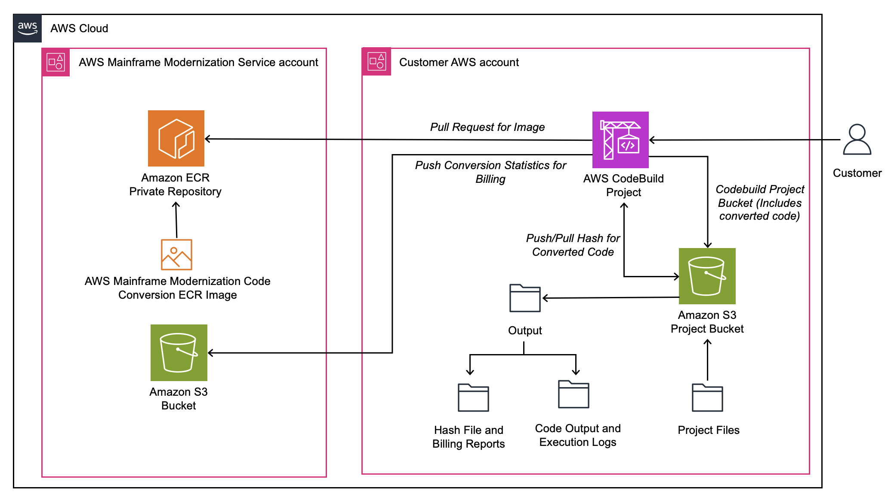

AWS Mainframe Modernization Service (Managed Runtime Environment experience) will no longer be open to new customers starting on November 7, 2025. If you would like to use the service, please sign up prior to November 7, 2025. For capabilities similar to AWS Mainframe Modernization Service (Managed Runtime Environment experience) explore AWS Mainframe Modernization Service (Self-Managed Experience). Existing customers can continue to use the service as normal. For more information, see
[AWS Mainframe Modernization availability change](mainframe-modernization-availability-change.md "mainframe-modernization-availability-change.md").

# What is Assembler Conversion with mLogica?

AWS Mainframe Modernization Code Conversion with mLogica (Code conversion) automatically converts z/OS
mainframe Assembler code to COBOL. The service runs within your AWS account and doesn't
transmit or store Assembler or COBOL source code outside the AWS account. Code conversion
allows your authorized account to pull an assembler image using the AWS CodeBuild service for
your intended code conversion.

AWS Mainframe Modernization provides you with the ability to set up builds and continuous
integration/continuous delivery (CI/CD) pipelines for your migrated applications. These
builds and pipelines use AWS CodeBuild and Amazon S3 to provide this feature. AWS CodeBuild is a fully
managed build service that compiles your source code, runs unit tests, and produces
artifacts that are ready to deploy. Amazon S3 is an object storage service that offers industry-
leading scalability, data availability, security, and performance.

###### Topics

- [Code conversion compilers](assembler-conversion-what-is.md#assembler-conversion-compilers "assembler-conversion-what-is.md#assembler-conversion-compilers")
- [Code conversion architecture](assembler-conversion-what-is.md#assembler-conversion-architecture "assembler-conversion-what-is.md#assembler-conversion-architecture")
- [Automation approach](assembler-conversion-what-is.md#assembler-conversion-automation "assembler-conversion-what-is.md#assembler-conversion-automation")
- [Security](assembler-conversion-what-is.md#assembler-conversion-security "assembler-conversion-what-is.md#assembler-conversion-security")
- [Additional resources](assembler-conversion-what-is.md#assembler-conversion-additional-resources "assembler-conversion-what-is.md#assembler-conversion-additional-resources")

## Code conversion compilers

Code conversion can be configured to emit COBOL suitable for
compilation and running in several target environments with different compilers.
Some of these include:

- M2 Re-platforming with Rocket Software (formerly Micro Focus) and other Rocket Enterprise Server environments
- M2 Re-platforming with NTT DATA Enterprise COBOL (UniKix)
- mLogica LIBER\*COBOL
- z/OS Mainframe using IBM Enterprise COBOL
- Veryant isCOBOL

## Code conversion architecture

The following is an architectural diagram for the Code conversion process:

## Automation approach

To use Code conversion with CodeBuild, the Assembler code needs to be uploaded to an Amazon S3
bucket, to later configure conversion parameters and invoke a CodeBuild project to perform
each step in the conversion process. The target COBOL code is automatically stored in a
specified path in the Amazon S3 bucket.

## Security

AWS Mainframe Modernization Code conversion enables conversion while keeping all source and target code
in your AWS account. Source Assembler code, target COBOL code, and configuration files
are stored in your Amazon S3 bucket. The automated conversion tool runs as a container in
the CodeBuild environment in your AWS account. The code stays in your account at all times.

To enable the Conversion tool to access your Amazon S3 bucket, you grant permissions to
the bucket to an AWS service role. When you configure CodeBuild, you will set this service
role so that CodeBuild can access the container image and access your Amazon S3 bucket.

## Additional resources

Along with the [Tutorial: Convert code from Assembler to COBOL
in AWS Mainframe Modernization](assembler-conversion-steps.md "assembler-conversion-steps.md"), here are some additional
resources where you can learn about creating the AWS CloudFormation templates and other information
about converting Assembler to COBOL.

- Workshop link for Automated Code conversion from Assembler to COBOL: [https://catalog.workshops.aws/awsm2ccm-assembler-cobol/en-US](https://catalog.workshops.aws/awsm2ccm-assembler-cobol/en-US "https://catalog.workshops.aws/awsm2ccm-assembler-cobol/en-US").
- Blog post: [https://aws.amazon.com/blogs/migration-and-modernization/unlocking-new-potential-transform-your-assembler-programs-to-cobol-with-aws-mainframe-modernization/](https://aws.amazon.com/blogs/migration-and-modernization/unlocking-new-potential-transform-your-assembler-programs-to-cobol-with-aws-mainframe-modernization/ "https://aws.amazon.com/blogs/migration-and-modernization/unlocking-new-potential-transform-your-assembler-programs-to-cobol-with-aws-mainframe-modernization/").
