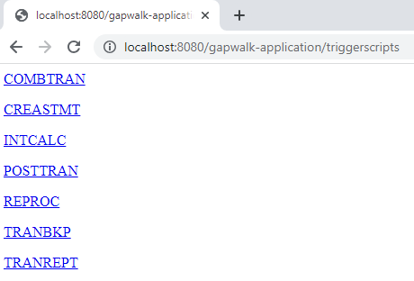
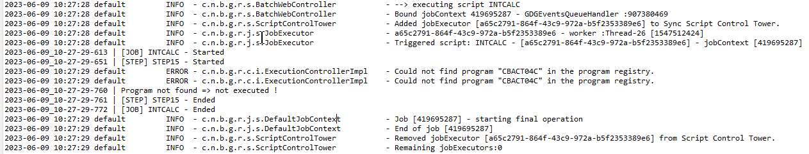

AWS Mainframe Modernization Service (Managed Runtime Environment experience) is no longer open to new customers. For
capabilities similar to AWS Mainframe Modernization Service (Managed Runtime Environment experience) explore AWS Mainframe Modernization Service (Self-Managed
Experience). Existing customers can continue to use the service as normal. For more information, see [AWS Mainframe Modernization
availability change](mainframe-modernization-availability-change.md "mainframe-modernization-availability-change.md").

# Endpoints for Gapwalk application in AWS Blu Age

In this topic, learn about the endpoints for the Gapwalk web application. These use the root
path `/gapwalk-application`.

###### Topics

- [Batch jobs (modernized JCLs and alike) related
  endpoints](#ba-endpoints-gapwalk-batch "#ba-endpoints-gapwalk-batch")
- [Metrics endpoints](#ba-endpoints-gapwalk-metrics "#ba-endpoints-gapwalk-metrics")
- [Other endpoints](#ba-endpoints-gapwalk-other "#ba-endpoints-gapwalk-other")
- [Job queues related endpoints](#ba-endpoints-gapwalk-jobq "#ba-endpoints-gapwalk-jobq")

## Batch jobs (modernized JCLs and alike) related

endpoints

Batch jobs can be run either synchronously or asynchronously (see details below). Batch jobs
are being executed using groovy scripts that are the results of the modernization of legacy
scripts (JCL).

###### Topics

- [List deployed scripts](#ba-list-deployed-scripts "#ba-list-deployed-scripts")
- [Launch a script synchronously](#ba-launch-script-synchronously "#ba-launch-script-synchronously")
- [Launch a script asynchronously](#ba-launch-script-asynchronously "#ba-launch-script-asynchronously")
- [Listing triggered scripts](#ba-launch-script-triggered "#ba-launch-script-triggered")
- [Retrieving job execution details](#ba-retrieve-job-execution-details "#ba-retrieve-job-execution-details")
- [Listing asynchronously launched scripts that can be
  killed](#ba-list-async-scripts "#ba-list-async-scripts")
- [Listing synchronously launched scripts that can be
  killed](#ba-list-sync-scripts "#ba-list-sync-scripts")
- [Killing a given job execution](#ba-kill-job-execution "#ba-kill-job-execution")
- [Listing existing checkpoints for
  restartability](#ba-list-existing-checkpoints "#ba-list-existing-checkpoints")
- [Restarting a job (synchronously)](#ba-restart-job-sync "#ba-restart-job-sync")
- [Restarting a job (asynchronously)](#ba-restart-job-async "#ba-restart-job-async")
- [Setting thread limit for asynchronous job
  executions](#ba-set-thread-limit "#ba-set-thread-limit")

### List deployed scripts

- Supported method: GET

Requires authentication and one of the following roles: ROLE_ADMIN, ROLE_SUPER_ADMIN, ROLE_USER

- Path: `/scripts`
- Arguments: none
- This endpoint returns the list of deployed groovy scripts on the server, as a String.
  This endpoint is primarily intended to be used from a web browser, since the resulting String
  is a HTML page, with active links (a link per launchable script -- see sample below).

Sample response:

```
<p><a href=./script/COMBTRAN>COMBTRAN</a></p><p><a href=./script/CREASTMT>CREASTMT</a></p><p><a href=./script/INTCALC>INTCALC</a></p><p><a href=./script/POSTTRAN>POSTTRAN</a></p><p><a href=./script/REPROC>REPROC</a></p><p><a href=./script/TRANBKP>TRANBKP</a></p><p><a href=./script/TRANREPT>TRANREPT</a></p><p><a href=./script/functions>functions</a></p>
```

###### Note

The links represent the url to use to launch each listed script **synchronously**.

- Supported method: GET / POST

Requires authentication and one of the following roles: ROLE_ADMIN, ROLE_SUPER_ADMIN, ROLE_USER

- Path: `/triggerscripts`
- Arguments: none
- This endpoint returns the list of deployed groovy scripts on the server, as a String.
  This endpoint is primarily intended to be used from a web browser, since the resulting String
  is a HTML page, with active links (a link per launch-able script -- see sample below).

As opposed to the previous endpoint response, the links represent the url to use to
launch each listed script **asynchronously**.



### Launch a script synchronously

This endpoint has two variants with dedicated paths for GET and POST usage (see
below).

- Supported method: GET

Requires authentication and one of the following roles: ROLE_ADMIN, ROLE_SUPER_ADMIN, ROLE_USER

- Path: `/script/{scriptId:.+}`
- Supported method: POST

Requires authentication and one of the following roles: ROLE_ADMIN, ROLE_SUPER_ADMIN, ROLE_USER

- Path: `/post/script/{scriptId:.+}`
- Arguments:
  - identifier of the script to launch **Input validation**: Script ID must not be blank,
    cannot exceed 255 characters, and must match the pattern: `^[a-zA-Z0-9._-]+$`
  - optionally: parameters to pass to the script, using request parameters (seen as a
    `Map<String,String>`). The given parameters will be automatically added to
    the [bindings](https://docs.groovy-lang.org/latest/html/api/groovy/lang/Binding.html "https://docs.groovy-lang.org/latest/html/api/groovy/lang/Binding.html") of the invoked groovy script. **Input validation**:
    Parameter map cannot exceed 50 entries.

- The call executes the script (identified by scriptId) with optional parameters and waits for completion before returning a `ResponseEntityString` with either:
  - HTTP 200: "Done." or JSON success message on successful execution
  - HTTP 200: A JSON error message with execution failure details. Additional information available in server logs.

  ###### Note

  Runtime now supports returning HTTP 500 status code for failed job executions. See
  [Available
  properties for the main application](ba-runtime-key-value.md#ba-runtime-key-value-main "ba-runtime-key-value.md#ba-runtime-key-value-main") to configure this response code.
  - **Input Validation**: Invalid script ID or parameters will return HTTP 400 Bad Request with validation error details.

  ```
  {
      "exitCode": -1,
      "stepName": "STEP15",
      "program": "CBACT04C",
      "status": "Error"
  }
  ```

  Looking at the server logs, we can figure out that this a deployment issue (the
  expected program has not been properly deployed, so it cannot be found, making job execution
  fail):

  

###### Note

The synchronous calls should be reserved for short time running jobs. Long times running
jobs should rather be launched asynchronously (see dedicated endpoint below).

### Launch a script asynchronously

- Supported methods: GET / POST

Requires authentication and one of the following roles: ROLE_ADMIN, ROLE_SUPER_ADMIN, ROLE_USER

- Path: `/triggerscript/{scriptId:.+}`
- Arguments:
  - identifier of the script to launch **Input validation**: Script ID must not be blank,
    cannot exceed 255 characters, and must match the pattern: `^[a-zA-Z0-9._-]+$`
  - optionally: parameters to pass to the script, using request parameters (seen as a
    `Map<String,String>`). The given parameters will be automatically added to
    the [bindings](https://docs.groovy-lang.org/latest/html/api/groovy/lang/Binding.html "https://docs.groovy-lang.org/latest/html/api/groovy/lang/Binding.html") of the invoked groovy script. **Input validation**:
    Parameter map cannot exceed 50 entries.

- As opposed to the synchronous mode above, the endpoint is not waiting for the job
  execution to finish to send a response. The job execution is launched at once, if an available
  thread can be found to do so, and a response is sent immediately to caller, with the job
  execution id, a unique identifier representing the job execution, that can be used to query
  job execution status or force kill a job execution that is supposed to be malfunctioning. The
  format of the response is:

```
Triggered script <script identifier> [unique job execution id] @ <date and time>
```

- Since the job asynchronous execution relies on a fixed limited number of threads, the job
  execution might not be launched if no available thread could be found. In that case, the
  returned message will rather look like:

```
Script [<script identifier>] NOT triggered - Thread limit reached (<actual thread limit>) - Please retry later or increase thread limit.
```

See the `settriggerthreadlimit` endpoint below to learn how to increase the
thread limit.

Sample response:

```
Triggered script INTCALC [d43cbf46-4255-4ce2-aac2-79137573a8b4] @ 06-12-2023 16:26:15
```

The unique job execution identifier permits to quickly retrieve related log entries in the
server logs if required. It is also used by several other endpoints detailed below.

### Listing triggered scripts

- Supported methods: GET / POST

Requires authentication and one of the following roles: ROLE_ADMIN, ROLE_SUPER_ADMIN, ROLE_USER

- Paths: `/triggeredscripts/{status:.+}`,
  `/triggeredscripts/{status:.+}/{namefilter}`
- Arguments:
  - Status (mandatory): the status of the triggered scripts to retrieve. **Input validation**:
    Status must not be blank and cannot exceed 50 characters. Possibles values are:
    - `all` : show all job execution details, whether the jobs are still running
      or not.
    - `running`: only show jobs details for jobs that are currently
      running.
    - `done`: only show jobs details for jobs whose execution is over.
    - `killed`: only show jobs details for jobs whose execution has been
      forcefully killed using the dedicated endpoint (see below).
    - `triggered`: only show jobs details for jobs which have been triggered but
      not yet launched.
    - `failed`: only show jobs details for jobs whose execution has been marked
      as failed.
    - \_namefilter (optional)\_ : retrieve only executions for the given script
      identifier. **Input validation**: Cannot exceed 255 characters

- Returns a collection of job executions details as JSON. For more information, see [Job execution details message structure](ba-endpoints-apx.md#job-execution-details "ba-endpoints-apx.md#job-execution-details").

Sample response:

```
[
    {
      "scriptId": "INTCALC",
      "caller": "127.0.0.1",
      "identifier": "d43cbf46-4255-4ce2-aac2-79137573a8b4",
      "startTime": "06-12-2023 16:26:15",
      "endTime": "06-12-2023 16:26:15",
      "status": "DONE",
      "executionResult": "{ \"exitCode\": -1, \"stepName\": \"STEP15\", \"program\": \"CBACT04C\", \"status\": \"Error\" }",
      "executionMode": "ASYNCHRONOUS"
    }
  ]
```

### Retrieving job execution details

- Supported method: GET

Requires authentication and one of the following roles: ROLE_ADMIN, ROLE_SUPER_ADMIN, ROLE_USER

- Path: `/getjobexecutioninfo/{jobexecutionid:.+}`
- Arguments:
  - jobexecutionid (mandatory): the unique job execution identifier to retrieve the
    corresponding job execution details. **Input validation**: Job execution ID
    must not be blank and cannot exceed 255 characters

- Returns a JSON string representing a single job execution details (see [Job execution details message structure](ba-endpoints-apx.md#job-execution-details "ba-endpoints-apx.md#job-execution-details")) or an empty response
  if no job execution details could be found for the given identifier.

### Listing asynchronously launched scripts that can be

killed

- Supported method: GET

Requires authentication and one of the following roles: ROLE_ADMIN, ROLE_SUPER_ADMIN, ROLE_USER

- Path: `/killablescripts`
- Returns a collection of job execution identifiers of jobs which have been launched
  asynchronously that are still currently running and can be forcefully killed (see the
  `/kill` endpoint below).

### Listing synchronously launched scripts that can be

killed

- Supported method: GET

Requires authentication and one of the following roles: ROLE_ADMIN, ROLE_SUPER_ADMIN, ROLE_USER

- Path: `/killablesyncscripts`
- Returns a collection of job execution identifiers of jobs which have been launched
  synchronously, are still currently running and can be forcefully killed (see the
  `/kill` endpoint below).

### Killing a given job execution

- Supported method: POST

Requires authentication and one of the following roles: ROLE_ADMIN, ROLE_SUPER_ADMIN

- Path: `/kill/{identifier:.+}`
- Argument: job execution identifier (mandatory): the unique job execution identifier to
  point at the job execution to be forcefully killed. **Input validation**:
  Identifier must not be blank and cannot exceed 255 characters
- Returns a textual message detailing the job execution kill attempt outcome; the message
  will contain the script identifier, the job execution unique identifier and the date and time
  at which the execution kill occurred. If no running job execution could be found for the given
  identifier, an error message will be returned instead.

###### Warning

- The runtime makes its best effort to kill the target job execution nicely. Thus, the
  response from the /kill endpoint might take a bit of time to reach the caller, as the AWS Blu Age
  runtime will try to minimize the business impact of killing the job.
- Forcefully killing a job execution should not be done lightly, as it may have direct
  business consequences, including possible data loss or corruption. It should be reserved for
  cases where a given job execution has gone sideways and data remediation means are clearly
  identified.
- Killing a job should lead to further investigations (post-mortem analysis) to figure out
  what went wrong and take proper remediations actions.
- In any case, attempt to kill a running job will be logged in the server logs with
  warning level messages.

### Listing existing checkpoints for

restartability

Job restartability relies on the ability for the scripts to register checkpoints in the
`CheckpointRegistry` to track down the job execution progress. If a job execution
fails to end properly, and restart checkpoints have been registered, one can simply restart the
job execution from the last known registered checkpoint (without having to execute the
predecessor steps above the checkpoint).

- Supported method: POST

Requires authentication and one of the following roles: ROLE_ADMIN, ROLE_SUPER_ADMIN

- Path: `/restarts/{scriptId}/{jobId}`
- Arguments:
  - scriptId (optional - string): the script being restarted.
  - jobId (optional - string): the unique identifier of a job execution.

- Returns a JSON formatted list of existing restart points, that can be used to restart a
  job whose execution did not come to and end properly or trigger a delayed restart by bypassing
  previously executed steps. If no checkpoints were registered by any scripts, the page contents
  will be "No registered checkpoints".

### Restarting a job (synchronously)

- Supported method: POST

Requires authentication and one of the following roles: ROLE_ADMIN, ROLE_SUPER_ADMIN

- Path: `/restart/{hashcode}/{scriptId}/{skipflag}`
- Arguments:
  - hashcode (integer - mandatory): restart the most recent execution of a job, using the
    provided hashcode as checkpoint value (see the `/restarts` endpoint above to
    learn how to retrieve a valid checkpoint value).
  - scriptId (optional - string): the script being restarted.
  - skipflag (optional - boolean): skip execution of selected (checkpoint) step and issue a
    restart from immediate successor step (if any).

- Returns: see `/script` return description above.

### Restarting a job (asynchronously)

- Supported method: GET

Requires authentication and one of the following roles: ROLE_ADMIN, ROLE_SUPER_ADMIN, ROLE_USER

- Path: `/triggerrestart/{hashcode}/{scriptId}/{skipflag}`
- Arguments:
  - hashcode (integer - mandatory): restart the most recent execution of a job, using the
    provided hashcode as checkpoint value (see the `/restarts` endpoint above to
    learn how to retrieve a valid checkpoint value).
  - scriptId (optional - string): the script being restarted.
  - skipflag (optional - boolean): skip execution of selected (checkpoint) step and issue a
    restart from immediate successor step (if any).

- Returns: see `/triggerscript` return description above.

### Setting thread limit for asynchronous job

executions

The job asynchronous execution relies on a dedicated pool of threads in the JVM. That pool
has a fixed limit regarding the number of available threads. The used has the ability to adjust
the limit according to the host capabilities (number of CPUs, available memory, etc...). By
default, the thread limit is set to 5 threads.

- Supported method: POST

Requires authentication and one of the following roles: ROLE_ADMIN, ROLE_SUPER_ADMIN

- Path: `/settriggerthreadlimit/{threadlimit:.+}`
- Argument (integer): the new thread limit to apply. **Input validation**:
  Must be between 1 and 1000 inclusive.
- Returns a message (`String`) giving the new thread limit and the previous one,
  or en error message if the provided thread limit value is not valid (not a strictly positive
  integer).

Sample response:

```
Set thread limit for Script Tower Control to 10 (previous value was 5)
```

#### Counting currently running triggered job

executions

- Supported method: GET

Requires authentication and one of the following roles: ROLE_ADMIN, ROLE_SUPER_ADMIN, ROLE_USER

- Path: `/countrunningtriggeredscripts`
- Returns a message indicating the number of running jobs launched asynchronously and the
  thread limit (that is the maximum number of triggered jobs that can run
  simultaneously).

Sample response:

```
0 triggered script(s) running (limit =10)
```

###### Note

This can be used to check, prior to launching a job, if the thread limit has not been
reached (which would prevent the job from being launched).

#### Purge job executions information

The job executions information remain in the server memory as long as the server is up. It
might be convenient to purge oldest informations from the memory, as they are not relevant
anymore; this is the purpose of this endpoint.

- Supported method: POST

Requires authentication and one of the following roles: ROLE_ADMIN, ROLE_SUPER_ADMIN

- Path: `/purgejobinformation/{age:.+}`
- Arguments: a strictly positive integer value representing the age in hours of
  informations to be purged. **Input validation**:
  Must be between 0 and 365 inclusive.
- Returns a message with the following informations:
  - Name of the purge file where purged job execution informations are being stored for
    archiving purpose.
  - Number of purged job execution informations.
  - Number of remaining job execution informations in memo

## Metrics endpoints

**Input validation**:
All metrics endpoints validate request parameters and return HTTP 400 Bad Request for invalid values.

### JVM

This endpoint returns available metrics related to the JVM.

- Supported method: GET

Requires authentication and one of the following roles: ROLE_ADMIN, ROLE_SUPER_ADMIN, ROLE_USER

- Path: `/metrics/jvm`
- Arguments: none
- Returns a message with the following information:
  - threadActiveCount: Number of active threads.
  - jvmMemoryUsed: Memory actively used by the Java Virtual Machine.
  - jvmMemoryMax: Maximum memory allowed for the Java Virtual Machine.
  - jvmMemoryFree: Available memory not currently in use by the Java Virtual
    Machine.

### Session

This endpoint returns metrics related to currently opened HTTP sessions.

- Supported method: GET

Requires authentication and one of the following roles: ROLE_ADMIN, ROLE_SUPER_ADMIN, ROLE_USER

- Path: `/metrics/session`
- Arguments: none
- Returns a message with the following information:
  - sessionCount: Number of active user sessions currently maintained by the server.

### Batch

- Supported method: GET

Requires authentication and one of the following roles: ROLE_ADMIN, ROLE_SUPER_ADMIN, ROLE_USER

- Path: `/metrics/batch`
- Arguments:
  - startTimestamp (optional, number): Starting timestamp for data filtering.
    **Input validation**: Must be a valid numeric value.
  - endTimestamp (optional, number): Ending timestamp for data filtering.
    **Input validation**: Must be a valid numeric value.
  - page (optional, number): Page number for pagination. **Input validation**:
    Must be a positive integer.
  - pageSize (optional, number): Number of items per page in pagination. **Input validation**:
    Must be a strictly positive integer, maximum 500.
  - **Input validation**: Parameter map cannot exceed 20 entries

- Returns a message with the following information:
  - content: List of batch execution metrics.
  - pageNumber: Current page number in pagination.
  - pageSize: Number of items displayed per page.
  - totalPages: Total number of pages available.
  - numberOfElements: Count of items on the current page.
  - last: Boolean flag for the last page.
  - first: Boolean flag for the first page.

### Transaction

- Supported method: GET

Requires authentication and one of the following roles: ROLE_ADMIN, ROLE_SUPER_ADMIN, ROLE_USER

- Path: `/metrics/transaction`
- Arguments:
  - startTimestamp (optional, number): Starting timestamp for data filtering.
    **Input validation**: Must be a valid numeric value.
  - endTimestamp (optional, number): Ending timestamp for data filtering.
    **Input validation**: Must be a valid numeric value.
  - page (optional, number): Page number for pagination. **Input validation**:
    Must be a positive integer.
  - pageSize (optional, number): Number of items per page in pagination. **Input validation**:
    Must be a strictly positive integer, maximum 500.
  - **Input validation**: Parameter map cannot exceed 20 entries

- Returns a message with the following information:
  - content: List of transaction execution metrics.
  - pageNumber: Current page number in pagination.
  - pageSize: Number of items displayed per page.
  - totalPages: Total number of pages available.
  - numberOfElements: Count of items on the current page.
  - last: Boolean flag for the last page.
  - first: Boolean flag for the first page.

## Other endpoints

Use these endpoints to list list registered programs or services, discover health status,
and manage JICS transactions.

###### Topics

- [Listing registered programs](#ba-list-registered-programs "#ba-list-registered-programs")
- [Listing registered services](#ba-list-registered-services "#ba-list-registered-services")
- [Health status](#ba-health-status "#ba-health-status")
- [Listing available JICS transactions](#ba-list-jics-transactions "#ba-list-jics-transactions")
- [Launch a JICS transaction](#ba-launch-jics-transaction "#ba-launch-jics-transaction")
- [Launch a JICS transaction (alternative)](#ba-launch-jics-transaction-alt "#ba-launch-jics-transaction-alt")
- [List active sessions](#ba-active-session-list "#ba-active-session-list")

### Listing registered programs

- Supported method: GET

Requires authentication and one of the following roles: ROLE_ADMIN, ROLE_SUPER_ADMIN, ROLE_USER

- Path: `/programs`
- Returns the list of registered programs, as a html page. Each program is designated by
  its main program identifier. Both modernized legacy programs and utility programs (IDCAMS,
  IEBGENER, etc ...) are being returned in the list. Please note that the available utility
  programs will depend on the utility web-applications that have been deployed on your tomcat
  server. For instance, z/OS utility support programs might not be available for modernized
  iSeries assets, as they are not relevant.

### Listing registered services

- Supported method: GET

Requires authentication and one of the following roles: ROLE_ADMIN, ROLE_SUPER_ADMIN, ROLE_USER

- Path: `/services`
- Returns the list of registered runtime services, as a html page. The given services are
  brought by the AWS Blu Age runtime as utilities, that can be used for instance in groovy scripts.
  Blusam load services (to create Blusam datasets from legacy datasets) fall into that
  category.

Sample response:

```
<p>BluesamESDSFileLoader</p><p>BluesamKSDSFileLoader</p><p>BluesamRRDSFileLoader</p>
```

### Health status

- Supported method: GET

Requires authentication and one of the following roles: ROLE_ADMIN, ROLE_SUPER_ADMIN, ROLE_USER

- Path: `/`
- Returns a simple message, indicating that the gapwalk-application is up and running
  (`Jics application is running.`)

### Listing available JICS transactions

- Supported method: GET

Requires authentication and one of the following roles: ROLE_ADMIN, ROLE_SUPER_ADMIN, ROLE_USER

- Path: `/transactions`
- Returns a html page listing all available JICS transactions. This only makes sense for
  environments with JICS elements (modernization of legacy CICS elements).

Sample response:

```
<p>INQ1</p><p>MENU</p><p>MNT2</p><p>ORD1</p><p>PRNT</p>
```

### Launch a JICS transaction

- Supported methods: POST

Requires authentication and one of the following roles: ROLE_ADMIN, ROLE_SUPER_ADMIN, ROLE_USER

- Path: `/jicstransrunner/{jtrans:.+}`
- Arguments:
  - JICS transaction identifier (string, required) : identifier of the JICS transaction to
    be launched (8 characters long at max.)
  - required: additional input data to pass to the transaction, as a
    Map<String,Object>. The contents of this map will be used to feed the [COMMAREA](https://www.ibm.com/docs/en/cics-ts/5.4?topic=programs-commarea "https://www.ibm.com/docs/en/cics-ts/5.4?topic=programs-commarea") that
    will be consumed by the JICS transaction. The map can be empty if no data is required to run
    the transaction.
  - optional: Http headers entries, to customize the run environment for the given
    transaction. The following header keys are being supported:
    - `jics-channel`: The name of the JICS CHANNEL to be used by the program
      that will be launched by this transaction launch.
    - `jics-container`: The name of the JICS CONTAINER to be used for this JICS
      transaction launch.
    - `jics-startcode`: the STARTCODE (String, up to 2 characters) to use at
      JICS transaction start. See [STARTCODE](https://www.ibm.com/docs/en/cics-ts/5.5?topic=summary-assign "https://www.ibm.com/docs/en/cics-ts/5.5?topic=summary-assign") for
      possible values (browse down the page).
    - `jicxa-xid` : The XID (X/Open transaction identifier XID structure) of a
      "global transaction" ([XA](https://en.wikipedia.org/wiki/X/Open_XA "https://en.wikipedia.org/wiki/X/Open_XA")),
      initiated by the caller, to which the current JICS transaction launch will
      participate. **Input validation**: XID must not be blank
      and cannot exceed 255 characters.

- Returns a `com.netfective.bluage.gapwalk.rt.shared.web.TransactionResultBean`
  JSON serialization, representing the outcome of the JICS transaction launch.
- **Input validation**: Invalid XID values
  (blank or exceeding 255 characters) will return HTTP 400 Bad Request with validation error details.

For more information about the details of the structure, see [Transaction launch outcome structure](ba-endpoints-apx.md#transaction-outcome "ba-endpoints-apx.md#transaction-outcome").

### Launch a JICS transaction (alternative)

- supported methods: POST

Requires authentication and one of the following roles: ROLE_ADMIN, ROLE_SUPER_ADMIN, ROLE_USER

- path: `/jicstransaction/{jtrans:.+}`
- Arguments:

**JICS transaction identifier (string, required)**

identifier of the JICS transaction to be launched (8 characters long at max.)

**required: additional input data to pass to the transaction, as a
Map<String,Object>**

The contents of this map will be used to feed the [COMMAREA](https://www.ibm.com/docs/en/cics-ts/5.4?topic=programs-commarea "https://www.ibm.com/docs/en/cics-ts/5.4?topic=programs-commarea")
that will be consumed by the JICS transaction. The map can be empty if no data is required
to run the transaction.

**optional: Http headers entries, to customize the run environment for the given
transaction.**

The following header keys are being supported:

    + `jics-channel`: The name of the JICS CHANNEL to be used by the program
     that will be launched by this transaction launch.
    + `jics-container`: The name of the JICS CONTAINER to be used for this JICS
     transaction launch.
    + `jics-startcode`: the STARTCODE (String, up to 2 characters) to use at
     JICS transaction start. For possible values, see [STARTCODE](https://www.ibm.com/docs/en/cics-ts/5.5?topic=summary-assign "https://www.ibm.com/docs/en/cics-ts/5.5?topic=summary-assign")
     (browse down the page).
    + `jicxa-xid` : The XID (X/Open transaction identifier XID structure) of a
     "global transaction" ([XA](https://en.wikipedia.org/wiki/X/Open_XA "https://en.wikipedia.org/wiki/X/Open_XA")),
     initiated by the caller, to which the current JICS transaction launch will
     participate. **Input validation**: XID must not be blank
     and cannot exceed 255 characters.

- Returns a `com.netfective.bluage.gapwalk.rt.shared.web.RecordHolderBean` JSON
  serialization, representing the outcome of the JICS transaction launch. The details of the
  structure can be found in [Transaction launch record outcome structure](ba-endpoints-apx.md#transaction-record-outcome "ba-endpoints-apx.md#transaction-record-outcome").
- **Input validation**: Invalid XID values
  (blank or exceeding 255 characters) will return HTTP 400 Bad Request with validation error details.

### List active sessions

- supported methods: GET

Requires authentication and one of the following roles: ROLE_ADMIN, ROLE_SUPER_ADMIN

- path: `/activesessionlist`
- Arguments: none
- **Input validation**: Parameter map cannot exceed 20 entries
- Returns a list of
  `com.netfective.bluage.gapwalk.application.web.sessiontracker.SessionTrackerObject`
  in JSON serialization, representing the list of active user sessions. When session tracking is
  disabled, an empty list will be returned.

## Job queues related endpoints

Job queues are the AWS Blu Age support for the AS400 jobs submission mechanism. Job queues are
used in AS400 to run job on specific thread pools. A job queue is defined by a name and a maximum
number of threads that corresponds to the maximum number of programs that can be run
simultaneously on that queue. If more jobs are submitted on the queue than the maximum number of
threads, jobs will wait for a thread to be available.

For an exhaustive list of status for a job on a queue, see [Possible status of a job on a queue](ba-endpoints-apx.md#jobs-status "ba-endpoints-apx.md#jobs-status").

Operations on job queues are handled through the following dedicated endpoints. You can
invoke these operations from the Gapwalk Application URL with the following root URL:
`http://`server`:`port`/gapwalk-application/jobqueue`.

###### Topics

- [List available queues](#ba-list-available-queues "#ba-list-available-queues")
- [Start or restart a job queue](#ba-start-restart-queue "#ba-start-restart-queue")
- [Submit a job for launch](#ba-submit-job-launch "#ba-submit-job-launch")
- [List all submitted jobs](#ba-list-scheduled-jobs "#ba-list-scheduled-jobs")
- [Release all jobs that are "on hold"](#ba-release-held-jobs "#ba-release-held-jobs")
- [Release all jobs that are "on hold" for a given job
  name](#ba-release-held-jobs-name "#ba-release-held-jobs-name")
- [Release a given job for a job number](#ba-release-job-number "#ba-release-job-number")
- [Submit a job on repeating schedule](#ba-submit-job-on-repeating-schedule "#ba-submit-job-on-repeating-schedule")
- [List all submitted repeating jobs](#ba-list-all-submitted-repeating-jobs "#ba-list-all-submitted-repeating-jobs")
- [Cancel the scheduling of a repeating
  job](#ba-cancel-scheduling-of-repeating-job "#ba-cancel-scheduling-of-repeating-job")

### List available queues

- Supported method: GET

Requires authentication and one of the following roles: ROLE_ADMIN, ROLE_SUPER_ADMIN, ROLE_USER

- Path: `list-queues`
- Returns the list of available queues along with their status, as a JSON list of
  key-values.

Sample response:

```
{"Default":"STAND_BY","queue1":"STARTED","queue2":"STARTED"}
```

Possible status for a job queue are:

**STAND_BY**

the job queue is waiting to be started.

**STARTED**

the job queue is up and running.

**UNKNOWN**

the job queue status cannot be determined.

### Start or restart a job queue

- Supported method: POST

Requires authentication and one of the following roles: ROLE_ADMIN, ROLE_SUPER_ADMIN

- Path: `/restart/{name}`
- Argument: the name of the queue to be started/restarted, as a String - mandatory.
  **Input validation**: Queue name must not be blank and cannot exceed 255 characters.
- The endpoint does not return anything but rather relies on http status to indicate the
  outcome of the start/restart operation:

**HTTP 200**

the start/restart operation went well: the given job queue is now STARTED.

**HTTP 404**

the job queue does not exist.

**HTTP 503**

an exception occurred during the start/restart attempt (server logs should be
inspected to figure out what went wrong).

### Submit a job for launch

- Supported method: POST

Requires authentication and one of the following roles: ROLE_ADMIN, ROLE_SUPER_ADMIN, ROLE_USER

- Path: `/submit`
- Argument: mandatory as request body, a JSON serialization of a
  `com.netfective.bluage.gapwalk.rt.jobqueue.SubmitJobMessage` object. For more
  information, see [Submit job and schedule job input](ba-endpoints-apx.md#submit-job "ba-endpoints-apx.md#submit-job").
- Returns a JSON containing the original `SubmitJobMessage` and a log indicating
  if the job has been submitted or not.

### List all submitted jobs

- Supported method: GET

Requires authentication and one of the following roles: ROLE_ADMIN, ROLE_SUPER_ADMIN, ROLE_USER

- Path:
  `/list-jobs?status={status}&size={size}&page={page}&sort={sort}`
- Arguments:
  - page: Page number to retrieve (default = 1)
  - size: Size of the page (default = 50, max = 300)
  - sort: The order of the Jobs. (default = “executionId”). “executionId” is currently the
    only supported value
  - status: (optional) If present, it will filter on the status.

- Returns a list of all scheduled jobs, as a JSON string. For a sample response, see [List of scheduled jobs response](ba-endpoints-apx.md#list-scheduled-jobs "ba-endpoints-apx.md#list-scheduled-jobs").

### Release all jobs that are "on hold"

- Supported method: POST

Requires authentication and one of the following roles: ROLE_ADMIN, ROLE_SUPER_ADMIN, ROLE_USER

- Path: `/release-all`
- Returns a message indicating the outcome for the release attempt operation. Two possible
  cases here:
  - HTTP 200 and a message "All job released with success!" if all jobs were successfully
    released.
  - HTTP 503 and a message "Jobs not released. An unknown error occurred. See log for more
    details" if something went wrong with the release attempt.

### Release all jobs that are "on hold" for a given job

name

For a given job name, multiple jobs can be submitted, with different job numbers (the
unicity of a job run is granted by a couple <job name, job number>). The endpoint will
attempt to release all job submissions with the given job name, which are "on hold".

- Supported method: POST

Requires authentication and one of the following roles: ROLE_ADMIN, ROLE_SUPER_ADMIN, ROLE_USER

- Path: `/release/{name}`
- Arguments: the job name to look for, as a string. Mandatory.
- Returns a message indicating the outcome for the release attempt operation. Two possible
  cases here:
  - HTTP 200 and a message "Jobs in group <name> (<number of released jobs>)
    released with success!" jobs were successfully released.
  - HTTP 503 and a message "Jobs in group <name> not released. An unknown error
    occured. See log for more details" if something went wrong with the release attempt.

### Release a given job for a job number

The endpoint will attempt to release the unique job submission which is "on hold", for the
given couple <job name, job number>.

- Supported method: POST

Requires authentication and one of the following roles: ROLE_ADMIN, ROLE_SUPER_ADMIN, ROLE_USER

- Path: `/release/{name}/{number}`
- Arguments:

**name**

the job name to look for, as a string. Mandatory.

**number**

the job number to look for, as an integer. Mandatory.

**returns**

a message indicating the outcome for the release attempt operation. Two possible
cases here:

    + HTTP 200 and a message ""Job <name/number> released with success!" if the job was
     successfully released.
    + HTTP 503 and a message "Job <name/number>>not released. An unknown error
     occured. See log for more details" if something went wrong with the release
     attempt.

### Submit a job on repeating schedule

Schedule a job that will be executed with a repeating schedule.

- Supported method: POST

Requires authentication and one of the following roles: ROLE_ADMIN, ROLE_SUPER_ADMIN, ROLE_USER

- Path: `/schedule`
- Argument: the request body must contain a JSON serialization of a
  `com.netfective.bluage.gapwalk.rt.jobqueue.SubmitJobMessage` object.

### List all submitted repeating jobs

- Supported method: GET

Requires authentication and one of the following roles: ROLE_ADMIN, ROLE_SUPER_ADMIN

- Path:
  `/schedule/list?status={status}&size={size}&page={page}&sort={sort}`
- Arguments:
  1.  page: Page number to retrieve (default = 1)
  2.  size: Size of the page (default = 50, max = 300)
  3.  sort: The order of the Jobs. (default = “id”). “id” is the only supported value for
      now.
  4.  status: (optional) If present, it will filter on the status. Possible values are the
      one mentioned in section 1.
  5.  status: (optional) If present, it will filter on the status. Possible values are the
      one mentioned in section 1.
  6.  Returns a list of all scheduled jobs, as a JSON string.

### Cancel the scheduling of a repeating

job

Removes a job that was created on a repeating schedule. The job scheduling status is set to
INACTIVE.

- Supported method: POST

Requires authentication and one of the following roles: ROLE_ADMIN, ROLE_SUPER_ADMIN

- Path: `/schedule/remove/{schedule_id}`
- Argument: `schedule_id`, the identifier of the scheduled job to remove.
