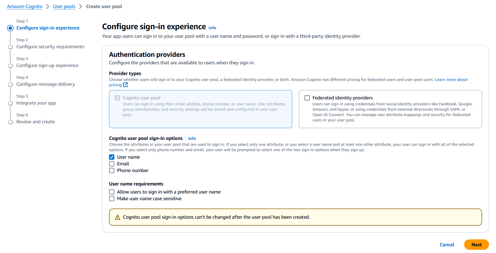
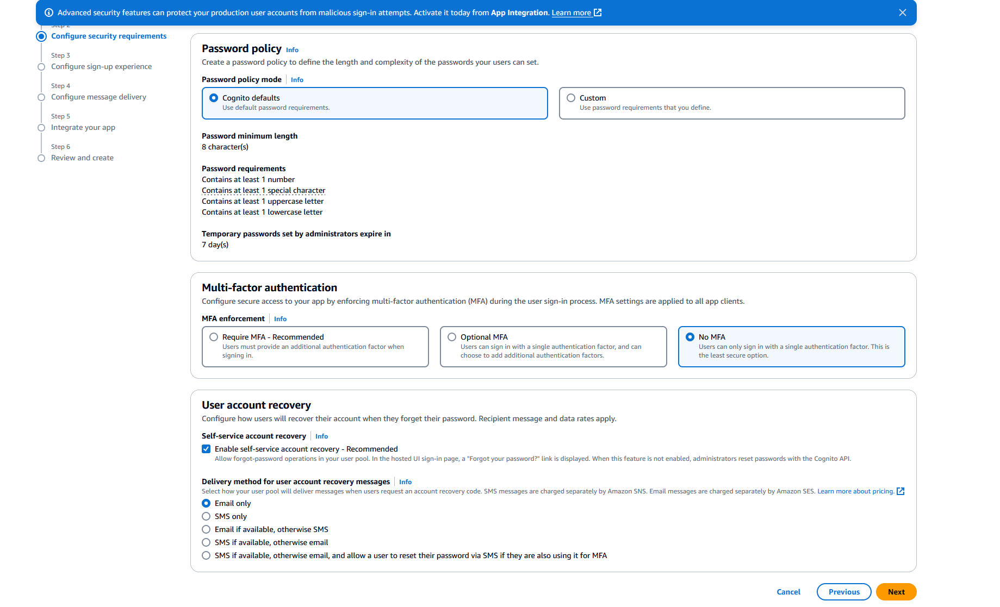
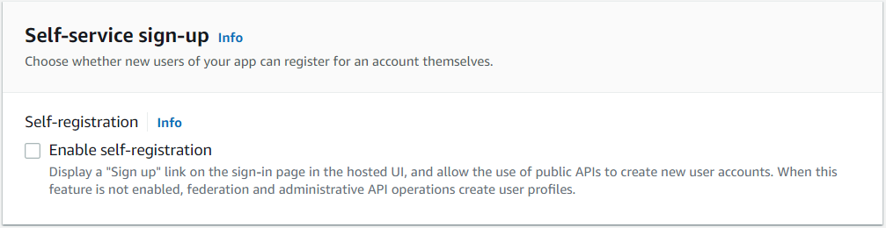
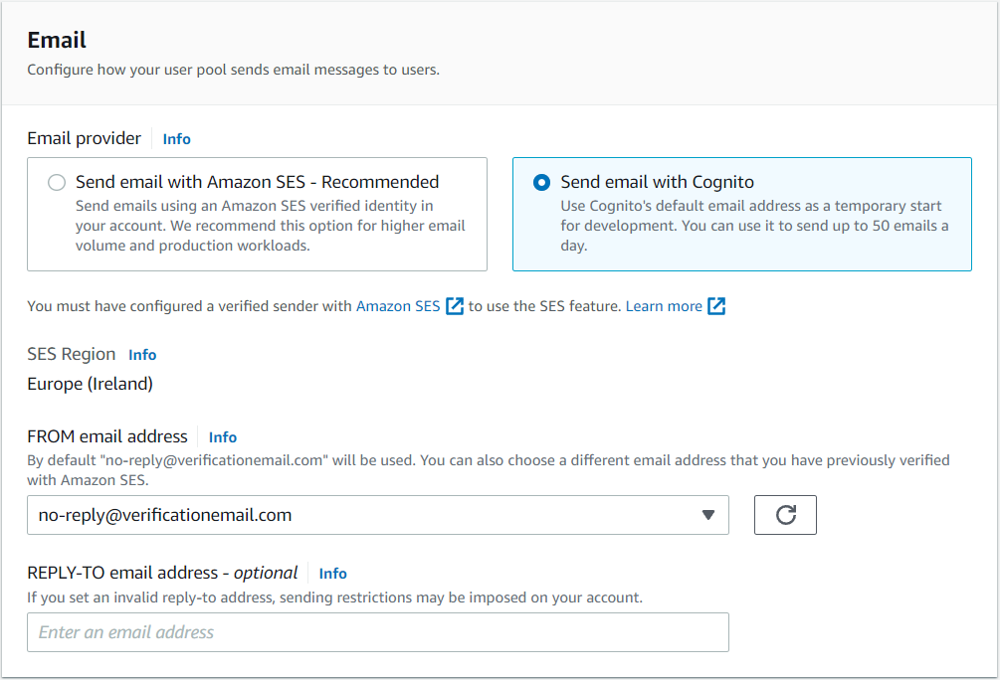
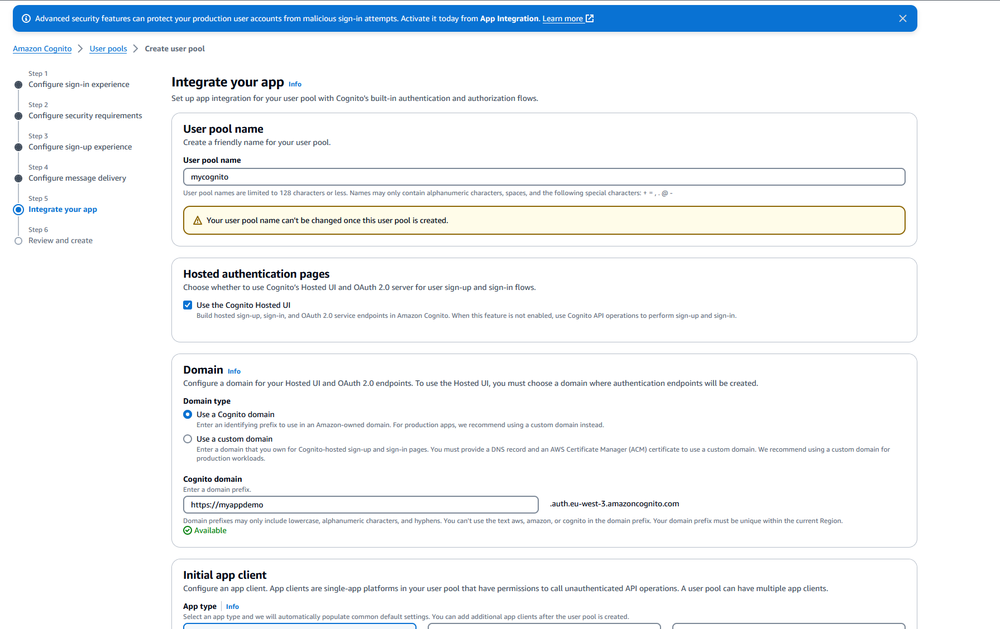
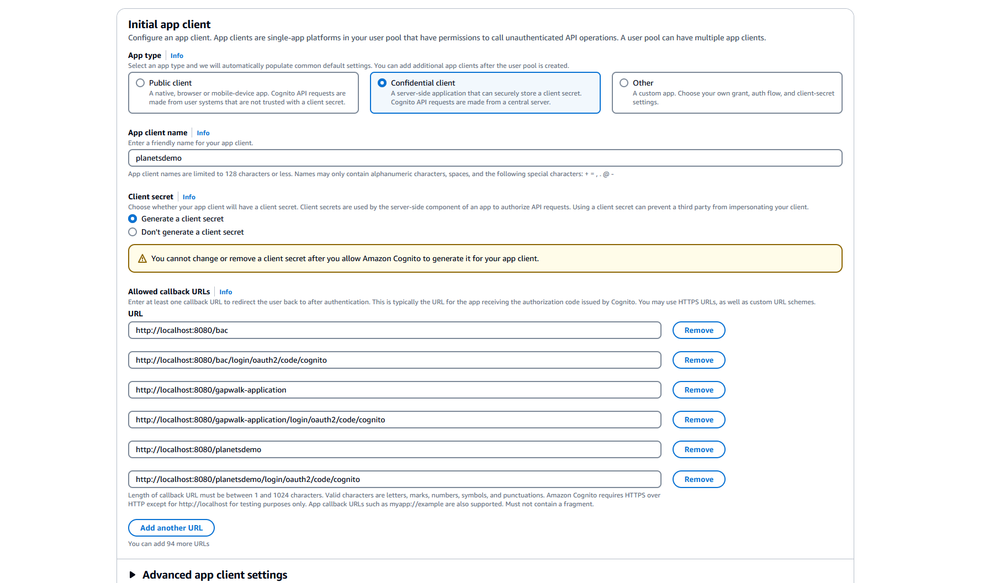

AWS Mainframe Modernization Service (Managed Runtime Environment experience) will no longer be open to new customers starting on November 7, 2025. If you would like to use the service, please sign up prior to November 7, 2025. For capabilities similar to AWS Mainframe Modernization Service (Managed Runtime Environment experience) explore AWS Mainframe Modernization Service (Self-Managed Experience). Existing customers can continue to use the service as normal. For more information, see
[AWS Mainframe Modernization availability change](mainframe-modernization-availability-change.md "mainframe-modernization-availability-change.md").

# Configure Gapwalk OAuth2 authentication with Amazon Cognito

This topic describes how to configure OAuth2 authentication for Gapwalk applications using
Amazon Cognito as an identity provider (IdP).

## Prerequisites

In this tutorial we will use Amazon Cognito as the IdP and PlanetDemo as the modernized
project.

You can use any other external identity provider. The ClientRegistration information must
be obtained from your IdP and is required for Gapwalk authentication. For more information, see
the [Amazon Cognito Developer Guide](../../../cognito/latest/developerguide.md "../../../cognito/latest/developerguide.md").

**The ClientRegistration information:**

client-id

The ID of the ClientRegistration. In our example it will be PlanetsDemo.

client-secret

Your client secret.

authorization endpoint

The authorization endpoint URI for the authorization server.

token endpoint

The token endpoint URI for the authorization server.

jwks endpoint

The URI used to get the JSON Web Key (JWK) that contains the keys for validating the
JSON web signature issued by the authorization server.

redirect URI

The URI to which the authorization server redirects the end-user if access is
granted.

## Amazon Cognito setup

First we will create and configure a Amazon Cognito user pool and user that we will use with our
deployed Gapwalk application for testing purpose.

###### Note

If you are using another IdP, you can skip this step.

###### Create user pool

1. Go to Amazon Cognito in the AWS Management Console and authenticate using your AWS credentials.
2. Choose **User Pools**.
3. Choose **Create a user pool**.
4. In **Configure sign-in experience**, keep the **Cognito user
   pool** default provider type. You can choose one or multiple **Cognito user
   pool sign-in options**; for now, choose **User name**, then choose
   **Next**.

 5. In **Configure security requirements**, keep the defaults and disable
**Multi-factor authentication** by choosing **No MFA**, and
then choose **Next**.

 6. As a security measure, disable **Enable self-registration**, and then
choose **Next**.

 7. Choose **Send email with Cognito**, and then choose
**Next**.

 8. In **Integrate your app**, specify a name for your user pool. In
**Hosted authentication pages**, choose **Use the Cognito Hosted
UI**.

 9. For simplicity, in **Domain**, choose **Use a Cognito
domain** and enter a domain prefix; for example, `https://planetsdemo`.
The demo app must be added as a client.

    1. In **Initial app client**, choose **Confidential
     client**. Enter an app client name, such as `planetsdemo`,
     and then choose **Generate a client secret**.
    2. In **Allowed callback URL** enter the URL to redirect the user to
     after authentication. The URL must end with `/login/oauth2/code/cognito`. For
     example, for our application and backend Gapwalk and BAC applications:


    ```
    http://localhost:8080/bac
          http://localhost:8080/bac/login/oauth2/code/cognito
          http://localhost:8080/gapwalk-application
          http://localhost:8080/gapwalk-application/login/oauth2/code/cognito
          http://localhost:8080/planetsdemo
          http://localhost:8080/planetsdemo/login/oauth2/code/cognito
    ```

    You can edit the URL later.


    
    3. In **Allowed sign-out URLs** enter the URL of the sign-out page that
     you want Amazon Cognito to redirect to when your application signs users out. For example, for
     backend Gapwalk and BAC applications:


    ```
    http://localhost:8080/bac/logout
    http://localhost:8080/gapwalk-application/logout
    http://localhost:8080/planetsdemo/logout
    ```

    You can edit the URL later.
    4. Keep the default values in the **Advanced app client settings** and
     **Attribute read and write permissions** sections.
    5. Choose **Next**.

10. In **Review and create**, verify your choices, and then choose
    **Create user pool**.

For more information, see [Create user
pool](../../../cognito/latest/developerguide/tutorial-create-user-pool.md "../../../cognito/latest/developerguide/tutorial-create-user-pool.md").

**User creation**

Because self-registration is disabled, create a Amazon Cognito user. Navigate to Amazon Cognito in the
AWS Management Console. Choose the user pool you created, and then in **Users** choose
**Create user**.

In **User information**, choose **Send an email
invitation**, enter a user name and an email address, and choose **Generate a
password**. Choose **Create user**.

**Role creation**

In the **Groups** tab, create 3 groups (SUPER_ADMIN, ADMIN, and USER), and
associate your user to one or more of these groups. These roles are later mapped to
ROLE_SUPER_ADMIN, ROLE_ADMIN and ROLE_USER by the Gapwalk application to make it possible to
access some restricted API REST calls.

## Integrate Amazon Cognito into the Gapwalk application

Now that your Amazon Cognito user pool and users are ready, go the
`application-main.yml` file of your modernized application and add the
following code:

```
gapwalk-application.security: enabled
gapwalk-application.security.identity: oauth
gapwalk-application.security.issuerUri: https://cognito-idp.<region-id>.amazonaws.com/<pool-id>
gapwalk-application.security.domainName: <your-cognito-domain>
gapwalk-application.security.localhostWhitelistingEnabled: false

spring:
  security:
    oauth2:
      client:
        registration:
          cognito:
            client-id: <client-id>
            client-name: <client-name>
            client-secret: <client-secret>
            provider: cognito
            authorization-grant-type: authorization_code
            scope: openid
            redirect-uri: "<redirect-uri>"
        provider:
          cognito:
            issuer-uri: ${gapwalk-application.security.issuerUri}
            authorization-uri: ${gapwalk-application.security.domainName}/oauth2/authorize
            jwk-set-uri: ${gapwalk-application.security.issuerUri}/.well-known/jwks.json
            token-uri: ${gapwalk-application.security.domainName}/oauth2/token
            user-name-attribute: username
      resourceserver:
        jwt:
          jwk-set-uri: ${gapwalk-application.security.issuerUri}/.well-known/jwks.json

```

Replace the following placeholders as described:

1. Go to Amazon Cognito in the AWS Management Console and authenticate using your AWS credentials.
2. Choose **User Pools** and choose the user pool that you created. You can
   find your `pool-id` in **User pool ID**.
3. Choose **App integration** where you can find your
   `your-cognito-domain`, and then go to **App clients and
   analytics** and choose your app.
4. In **App client: yourApp** you can find the
   `client-name` , `client-id`, and
   `client-secret` (**Show client secret**).
5. `region-id` corresponds to the AWS Region ID where you created
   your Amazon Cognito user and user pool. Example: `eu-west-3`.
6. For `redirect-uri` enter the URI that you specified for
   **Allowed callback URL**. In our example it is
   `http://localhost:8080/planetsdemo/login/oauth2/code/cognito`.

You can now deploy your Gapwalk application and use the user created previously to sign in
to your app.
