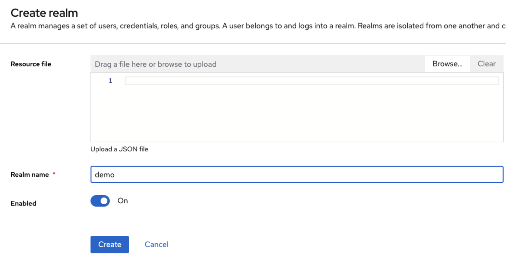
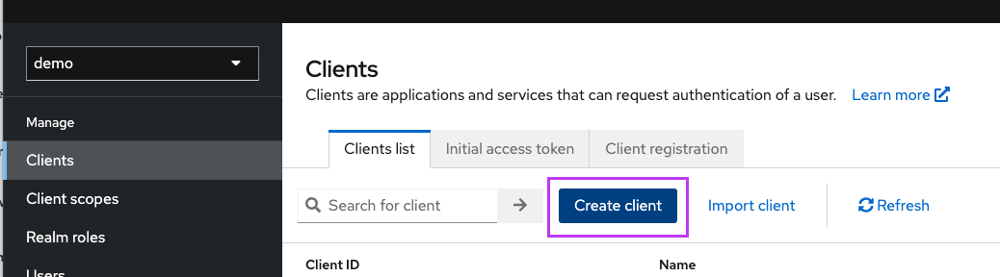
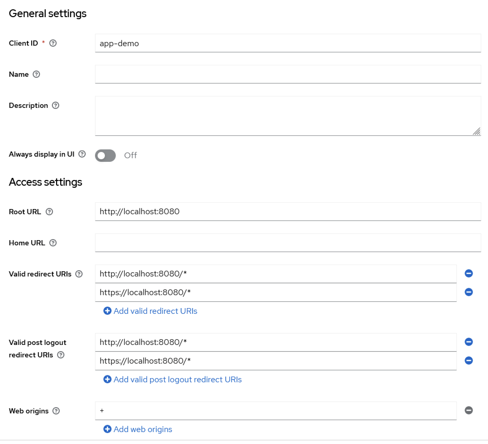
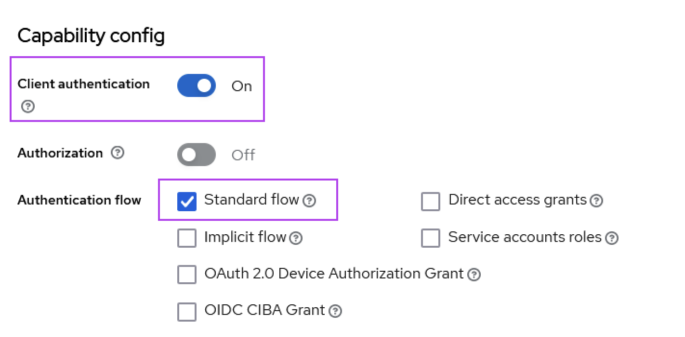
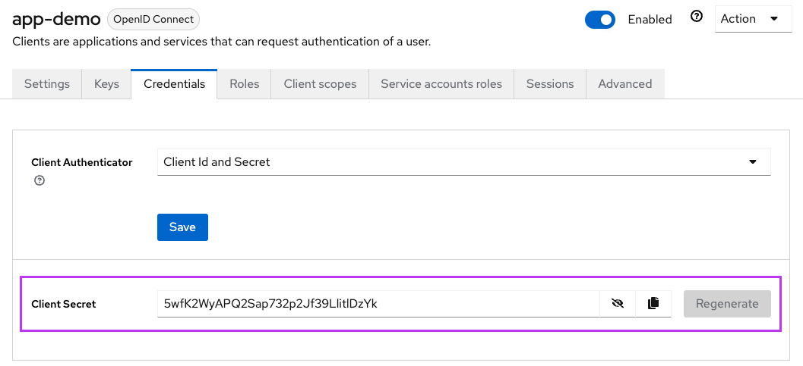
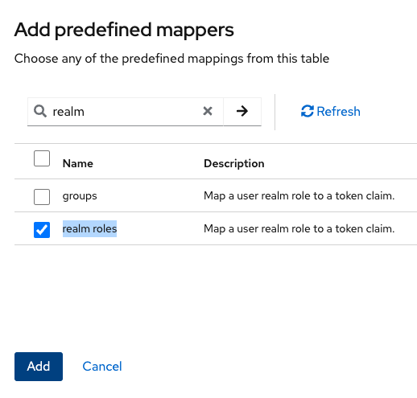
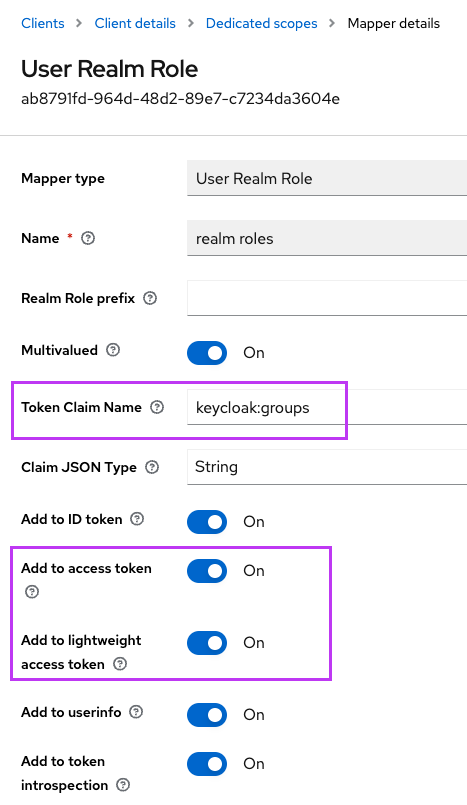
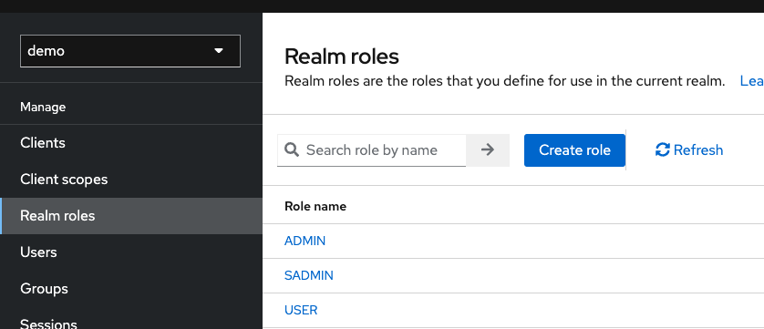
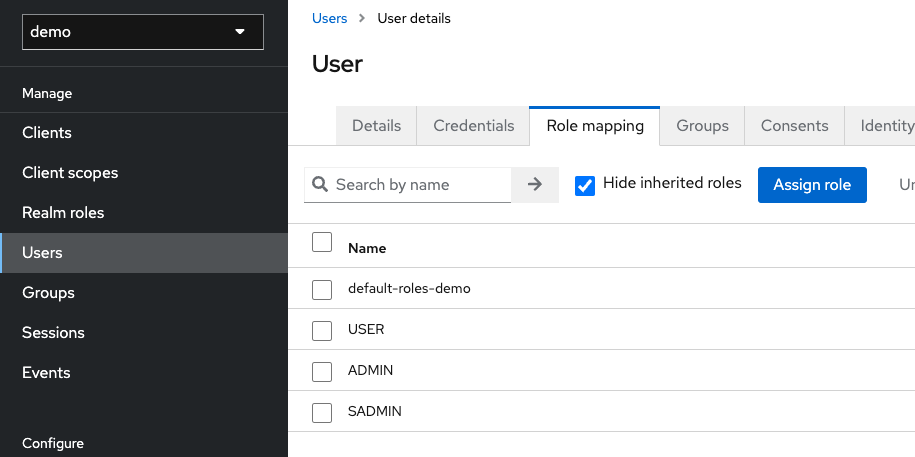

AWS Mainframe Modernization Service (Managed Runtime Environment experience) will no longer be open to new customers starting on November 7, 2025. If you would like to use the service, please sign up prior to November 7, 2025. For capabilities similar to AWS Mainframe Modernization Service (Managed Runtime Environment experience) explore AWS Mainframe Modernization Service (Self-Managed Experience). Existing customers can continue to use the service as normal. For more information, see
[AWS Mainframe Modernization availability change](mainframe-modernization-availability-change.md "mainframe-modernization-availability-change.md").

# Configure Gapwalk OAuth2 authentication with

Keycloak

This topic describes how to configure OAuth2 authentication for Gapwalk applications using
Keycloak as an identity provider (IdP). In this tutorial we use Keycloak 24.0.0.

## Prerequisites

- [Keycloak](https://www.keycloak.org/ "https://www.keycloak.org/")
- Gapwalk application

## Keycloak setup

1. Go to your Keycloak dashboard in your web browser. The default credentials are
   admin/admin. Go to the top left navigation bar, and create a realm with the name
   `demo`, as shown in the following image.

 2. Create a client with the name `app-demo`.



Replace `localhost:8080` with the address of your Gapwalk application



 3. To get your client secret, choose **Clients**, then
**app-demo**, then **Credentials**.

 4. Choose **Clients**, then **Client scopes**, then
**Add predefined mapper**. Choose **realm roles**.

 5. Edit your realm role with the configuration shown in the following image.

 6. Remember the defined **Token Claim Name**. You’ll need this value in the
Gapwalk settings definition for the `gapwalk-application.security.claimGroupName`
property.

 7. Choose **Realms roles**, and create 3 roles:
`SUPER_ADMIN`, `ADMIN`, and
`USER`. These roles are later mapped to `ROLE_SUPER_ADMIN`,
`ROLE_ADMIN`, and `ROLE_USER` by the Gapwalk application to be able to
access some restricted API REST calls.



## Integrate Keycloak into the Gapwalk application

Edit your `application-main.yml` as follows:

```
gapwalk-application.security: enabled
gapwalk-application.security.identity: oauth
gapwalk-application.security.issuerUri: http://<KEYCLOAK_SERVER_HOSTNAME>/realms/<YOUR_REALM_NAME>
gapwalk-application.security.claimGroupName: "keycloak:groups"

gapwalk-application.security.userAttributeName: "preferred_username"
# Use "username" for cognito,
#     "preferred_username" for keycloak
#      or any other string
gapwalk-application.security.localhostWhitelistingEnabled: false

spring:
  security:
    oauth2:
      client:
        registration:
          demo:
            client-id: <YOUR_CLIENT_ID>
            client-name: Demo App
            client-secret: <YOUR_CLIENT_SECRET>
            provider: keycloak
            authorization-grant-type: authorization_code
            scope: openid
            redirect-uri: "{baseUrl}/login/oauth2/code/{registrationId}"
        provider:
          keycloak:
            issuer-uri: ${gapwalk-application.security.issuerUri}
            authorization-uri: ${gapwalk-application.security.issuerUri}/protocol/openid-connect/auth
            jwk-set-uri: ${gapwalk-application.security.issuerUri}/protocol/openid-connect/certs
            token-uri: ${gapwalk-application.security.issuerUri}/protocol/openid-connect/token
            user-name-attribute: ${gapwalk-application.security.userAttributeName}
      resourceserver:
        jwt:
          jwk-set-uri: ${gapwalk-application.security.issuerUri}/protocol/openid-connect/certs

```

Replace `<KEYCLOAK_SERVER_HOSTNAME>`,
`<YOUR_REALM_NAME>`,
`<YOUR_CLIENT_ID>`, and
`<YOUR_CLIENT_SECRET>` with your Keycloak server hostname,
your realm name, your client ID, and your client secret.
