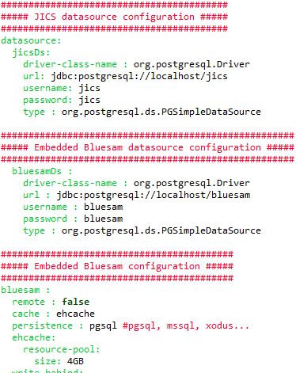
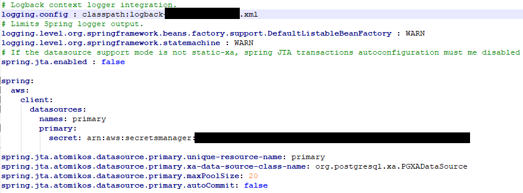

AWS Mainframe Modernization Service (Managed Runtime Environment experience) will no longer be open to new customers starting on November 7, 2025. If you would like to use the service, please sign up prior to November 7, 2025. For capabilities similar to AWS Mainframe Modernization Service (Managed Runtime Environment experience) explore AWS Mainframe Modernization Service (Self-Managed Experience). Existing customers can continue to use the service as normal. For more information, see
[AWS Mainframe Modernization availability change](mainframe-modernization-availability-change.md "mainframe-modernization-availability-change.md").

# Set up configuration for AWS Blu Age Runtime

The AWS Blu Age Runtime and the client code are web applications using the [Spring Boot
framework](https://docs.spring.io/spring-boot/docs/2.5.14/reference/html/ "https://docs.spring.io/spring-boot/docs/2.5.14/reference/html/"). It leverages Spring capabilities to supply configuration, with several
possible locations and precedence rules. There are also similar precedence rules for supplying
many other files, such as groovy scripts, sql, etc.

The AWS Blu Age Runtime also contains additional optional web applications, that can be opted-in if
needed.

###### Topics

- [Application configuration basics](#ba-runtime-config-app-basics "#ba-runtime-config-app-basics")
- [Application precedence](#ba-runtime-config-app-precedence "#ba-runtime-config-app-precedence")
- [JNDI for databases](#ba-runtime-config-app-jndi "#ba-runtime-config-app-jndi")
- [AWS Blu Age Runtime secrets](ba-runtime-config-app-secrets.md "ba-runtime-config-app-secrets.md")
- [Other files (groovy, sql, etc.)](#ba-runtime-config-app-files "#ba-runtime-config-app-files")
- [Additional web application](#ba-runtime-config-app-webapp "#ba-runtime-config-app-webapp")
- [Enable properties for AWS Blu Age Runtime](ba-runtime-key-value.md "ba-runtime-key-value.md")
- [Available Redis cache properties
  in AWS Blu Age Runtime](ba-runtime-redis-configuration.md "ba-runtime-redis-configuration.md")
- [Configure security for Gapwalk
  applications](ba-runtime-security.md "ba-runtime-security.md")

## Application configuration basics

The default way to handle application configuration is through the use of dedicated YAML
files to be supplied in the application server's `config` folder. There are two main
YAML configuration files:

- `application-main.yaml`
- `application-`profile`.yaml` (where
  `profile` value is setup during application
  generation).

The first file configures the framework, i.e. `Gapwalk-application.war`, while
the second one is for additional options specifically for the client application. This works with
the use of spring profiles: the Gapwalk application uses the `main` profile, while the
client application uses the `profile` profile.

The following example shows a typical main YAML file.



The following example shows a typical client YAML file.



For information about the content of the YAML files, see [Enable properties for AWS Blu Age Runtime](ba-runtime-key-value.md "ba-runtime-key-value.md").

## Application precedence

For these configuration files, Spring precedence rules apply. Notably:

- The `application-main` YAML file appears in the Gapwalk main war file
  with default values, and the one in the `config` folder supersedes it.
- The same should be done for the client application configuration
- Additional parameters may be passed on the command line at server launch time. They would
  override the YAML ones.

For more information, see [Official Spring Boot documentation](https://docs.spring.io/spring-boot/docs/2.5.14/reference/html/features.html#features.external-config "https://docs.spring.io/spring-boot/docs/2.5.14/reference/html/features.html#features.external-config").

## JNDI for databases

The database configuration might be supplied with JNDI in the context.xml file in Tomcat.
Any such configuration would override the YAML one. But pay attention that using this will not
allow to wrap your credentials in a secret manager (see below).

The following example shows sample configurations for JICS and Blusam databases.

```
<Resource auth="Container" driverClassName="org.postgresql.Driver" initialSize="0" maxIdle="5"
   maxOpenPreparedStatements="-1" maxTotal="10" maxWaitMillis="-1" name="`jdbc/jics`"
   poolPreparedStatements="true" testOnBorrow="false" type="javax.sql.DataSource"
   `url="jdbc:postgresql://XXXX.rds.amazonaws.com:5432/XXXX" username="XXXX" password="XXXX"` />
```

jdbc/jics

Would be `jdbc/jics` for the JICS database and `jdbc/bluesam` (pay
attention to the 'e') for the Blusam database.

url="jdbc:postgresql://XXXX.rds.amazonaws.com:5432/XXXX" username="XXXX"
password="XXXX"

The database url, username and password.

## Other files (groovy, sql, etc.)

The other files used by the customer project use similar precedence rules as the ones for
spring configuration. Examples:

- Groovy scripts are `.groovy` files in the `scripts` folder
  or subfolders.
- SQL scripts are `.sql` files in the `sql` folder or
  subfolders.
- Daemon scripts are `.groovy` files in the `daemons` folder
  or subfolders.
- Queries Database mapping file are files named `queries-database.mapping` files
  in the `sql` folder subfolders.
- Jasper templates are `.jrxml` files in the `templates`
  folder or subfolders.
- Dataset catalogs are `.json` files in the `catalog`
  folder.
- Lnk files are `.json` files in the `lnk` folder.

All these locations can be overridden by way of a system property or a client YAML
property.

- For Groovy scripts: `configuration.scripts`
- For SQL scripts: `configuration.sql`
- For Daemon scripts: `configuration.daemons`
- For Queries Database mapping file: `configuration.databaseMapping`
- For Jasper templates: `configuration.templates`
- For Dataset catalogs: `configuration.catalog`
- For Lnk files: `configuration.lnk`

If the property is not found, the files will be taken from the default location mentioned
above. The lookup will first be done with the tomcat working directory as a root, and lastly in
the application war file.

## Additional web application

The AWS Blu Age Runtime contains additional web applications in its `webapps-extra`
folder. These applications are not served by default by the tomcat server.

Opting-in to these web applications is modernization project dependent and is done by moving
the desired war file from the `webapps-extra` folder to the
`webapps` folder. After that, the war will be served by the tomcat server at
next startup.

Some project-specific additional configuration can also be added in a YAML configuration
file for each additional war, as is done in the `application-main.yml` file
and explained above. The additional wars are:

- `gapwalk-utility-pgm.war`: contains support for ZOS utility programs
  and uses `application-utility-pgm.yaml` as its configuration.
- `gapwalk-cl-command.war`: contains support for AS/400 utility programs
  and uses `application-cl-command.yaml` as its configuration.
- `gapwalk-hierarchical-support.war`: contains IMS/MFS transaction
  support and uses `application-jhdb.yaml` as its configuration
