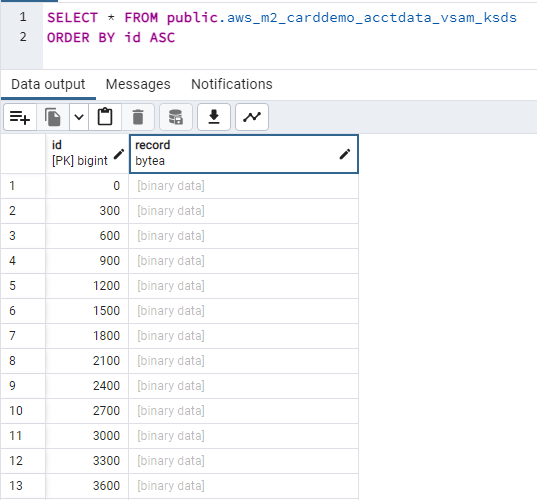
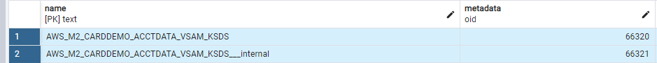
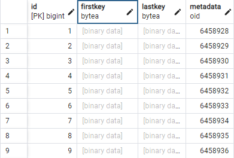
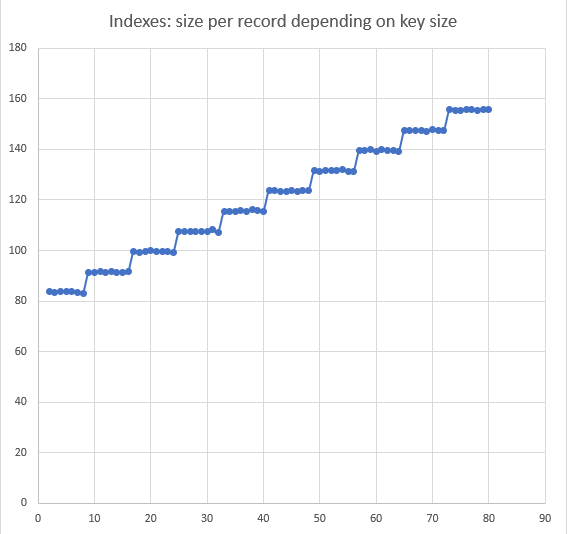

AWS Mainframe Modernization Service (Managed Runtime Environment experience) is no longer open to new customers. For
capabilities similar to AWS Mainframe Modernization Service (Managed Runtime Environment experience) explore AWS Mainframe Modernization Service (Self-Managed
Experience). Existing customers can continue to use the service as normal. For more information, see [AWS Mainframe Modernization
availability change](mainframe-modernization-availability-change.md "mainframe-modernization-availability-change.md").

# AWS Blu Age Blusam

On mainframe systems (referred to in the following topic as "legacy"), business data is often
stored using VSAM (Virtual Storage Access Method). The data is stored in "records" (byte arrays),
belonging to a "data set".

There are four data set organizations:

- **KSDS**: Key-Sequenced data sets - records are indexed by a
  primary key (no duplicate keys allowed) and optionally, additional "alternate" keys. All key
  values are subsets of the record byte array, each key being defined by:
  - an offset (0-based, 0 being the start of the record byte array content, measured in
    bytes)
  - a length (expressed in bytes)
  - whether it tolerates duplicate values or not

- **ESDS**: Entry-Sequenced data sets - records are accessed
  mostly sequentially (based on their insertion order in the data set) but can be accessed using
  additional alternate keys;
- **RRDS**: Relative Records data sets - records are accessed
  using "jumps", using relative record numbers; The jumps can be done either forward or
  backward;
- **LDS**: Linear data sets - no records there, simply a stream
  of bytes, organized in pages. Mainly used for internal purposes on legacy platforms.
  When modernizing legacy applications, using AWS Blu Age refactoring approach, modernized
  applications are no longer intended to access VSAM stored data, while preserving the data access
  logic. The Blusam component is the answer: it allows importing data from legacy VSAM data sets
  exports, provides an API for the modernized application to manipulate them along with a dedicated
  administration web application. See [AWS Blu Age Blusam Administration Console](ba-shared-bac-userguide.md "ba-shared-bac-userguide.md").

###### Note

Blusam only supports KSDS, ESDS, and RRDS.

The Blusam API makes it possible to preserve data access logic (sequential, random, and
relative reads; insert, update, and delete records), whereas the components architecture, relying
on a mix of caching strategies and RDBMS-based storage, permits high throughput I/O operations
with limited resources.

## Blusam infrastructure

Blusam relies on PostgreSQL RDBMS for data sets storage, both for raw records data and keys
indexes (when applicable). The favorite option is to use the Amazon Aurora PostgreSQL compatible engine.
The examples and illustrations in this topic are based on this engine.

###### Note

At server startup, the Blusam runtime checks for the presence of some mandatory technical
tables and create them if they cannot be found. As a consequence, the role used in the
configuration to access the Blusam database must be granted the rights to create, update, and
delete the database tables (both rows and the tables definitions themselves). For information
about how to disable Blusam, see [Blusam configuration](#ba-shared-blusam-configuration "#ba-shared-blusam-configuration").

### Caching

In addition to the storage itself, Blusam operates faster when coupled to a cache
implementation.

Two cache engines are currently supported, EhCache and Redis, each having its own
use-case:

- EhCache : Standalone embedded volatile local cache
  - **NOT** eligible for AWS Mainframe Modernization managed
    environment deployment.
  - Typically used when a single node, like a single Apache Tomcat server, is used to run the
    modernized applications. For instance, the node might be dedicated to host batch jobs
    tasks.
  - **Volatile**: The EhCache cache instance is volatile; its
    content will be lost on the server shutdown.
  - **Embedded**: The EhCache and the server share the same
    JVM Memory Space (to be taken into account when defining the specifications for the hosting
    machine).

- Redis: Shared persistent cache
  - Eligible for AWS Mainframe Modernization managed environment deployment.
  - Typically used in multi-nodes situations, in particular when several servers are behind
    a load-balancer. The cache content is shared amongst all nodes.
  - The Redis is persistent and not bound to the nodes life-cycles. It is running on its
    own dedicated machine or service (for example, Amazon ElastiCache). The cache is remote to all
    nodes.

### Locking

To deal with concurrent access to data sets and records, Blusam relies on a configurable
locking system. Locking can be applied to both levels: data sets and records:

- Locking a data set for write purpose will prevent all others clients from performing
  write operations to it, at any level (data set or record).
- Locking at the record level for write will prevent other clients from performing write
  operations on the given record only.

Configuring the Blusam locking system should be done accordingly to the cache
configuration:

- If EhCache is chosen as cache implementation, no further locking configuration is
  required as the default in-memory locking system should be used.
- If Redis is chosen as cache implementation, then a Redis-based locking configuration is
  required, to allow concurrent access from multiple nodes. The Redis cache used for locks does
  not have to be the same as the one used for data sets. For information about configuring a
  Redis-based locking system, see [Blusam configuration](#ba-shared-blusam-configuration "#ba-shared-blusam-configuration").

## Blusam intrinsics and data migration from

legacy

### Storing data sets: records and indexes

Each legacy data set, when imported to Blusam, will be stored to a dedicated table; each
row of the table represents a record, using two columns:

- The numeric ID column, big integer type, that is the table primary key, and is used to
  store the Relative Byte Address (RBA) of the record. The RBA represents the offset in bytes
  from the start of the data set, and begins at 0.
- The byte array record column, that is used to store the raw record's content.

See for example the content of a KSDS data set used in the CardDemo application:



- This particular data set has fixed length records, the length being 300 bytes (hence the
  collection of ids being multiples of 300).
- By default, the pgAdmin tool used to query PostgreSQL databases doesn't show byte array
  column contents, but prints a [binary data] label instead.
- The raw record content matches the raw data set export from the legacy, without any
  conversion. In particular, no character set conversion occurs; that implies that alphanumeric
  portions of the record will have to be decoded by modernized applications using the legacy
  character set, most likely an EBCDIC variant.

Regarding the data set metadata and keys indexes: each data set is associated with two rows
in the table named `metadata`. This is the default naming convention. To learn how to
customize it, see [Blusam configuration](#ba-shared-blusam-configuration "#ba-shared-blusam-configuration").



- The first row has the data set name as the value of the _name_ column. The _metadata_ column is a binary
  column that contains a binary serialization of the general metadata of the given data set. For
  details, see [General data set metadata attributes](#ba-shared-blusam-metadata "#ba-shared-blusam-metadata").
- The second row has the data set name with the suffix `__internal'` as the
  value of the _name_ column. The _metadata_ column binary content depends on the "weight" of the data set.
  - For small/medium data sets, the content is a compressed serialization of:
    - definition of the keys used by the data set; the primary key definition (for KSDS)
      and alternate keys definitions if applicable (for KSDS / ESDS)
    - the key indexes if applicable (KSDS / ESDS with alternate keys definitions): used for
      indexed browsing of records; the key index maps a key value to the RBA of a record;
    - records length map: used for sequential / relative browsing of records;

  - For Large/Very Large data sets, the content is a compressed serialization of:
    - definition of the keys used by the data set; the primary key definition (for KSDS)
      and alternate keys definitions if applicable (for KSDS / ESDS)

Additionally, large/very large data sets indexes (if applicable) are stored using a
pagination mechanism; index pages binary serializations are stored as rows of a dedicated table
(one table per data set key). Each page of indexes is stored in a row, having the following
columns:

- id: technical identifier of the indexes page (numeric primary key);
- firstkey: binary value of the first (lowest) key value stored in the indexes page;
- lastkey: binary value of the last (highest) key value stored in the indexes page;
- metadata: binary compressed serialization of the indexes page (mapping key values to
  records RBAs).



The table name is a concatenation of the data set name and the key internal name, which
contains information about the key, such as the key offset, whether the key accepts duplicates (set to true to allow duplicates), and the key length. For example, consider a data set named
"AWS_LARGE_KSDS" that has the following two defined keys:

- primary key [offset: 0, duplicates: false, length:18]
- alternate key [offset: 3, duplicates: true, length: 6]

In this case, the following tables store the indexes related to the two keys.


### Optimizing I/O throughput using write-behind

mechanism

To optimize insert / update / delete operations performances, the Blusam engine relies on a
configurable write-behind mechanism. The mechanism is built upon a pool of dedicated threads
that deal with persistence operations using bulk update queries, to maximize I/O throughput
towards the Blusam storage.

The Blusam engine collects all update operations done on
records by applications and build records lots that are being dispatched for treatment to the
dedicated threads. The lots are then being persisted to the Blusam storage, using bulk update
queries, avoiding the usage of atomic persistence operations, ensuring the best possible usage
of network bandwidth.

The mechanism uses a configurable delay (defaults to one
second) and a configurable lot size (defaults to 10000 records). The build persistence queries
are executed as soon as the first of the two following conditions is met:

- The configured delay has elapsed and the lot is not empty
- The number of records in the lot to be treated reaches the configured limit
  To learn how to configure the write-behind mechanism, see [Optional
  properties](#ba-shared-blusam-configuration-engine-optional-properties "#ba-shared-blusam-configuration-engine-optional-properties").

### Picking up the proper storage scheme

As shown in the previous section, the way data sets are being stored depends on their
"weight". But what is considered as small, medium or large for a data set? When to pick the
paginated storage strategy rather than the regular one?

The answer to that question depends on the following.

- The amount of available memory on each of the servers hosting the modernized applications
  that will use those data sets.
- The amount of available memory on cache infrastructure (if any).

When using non-paginated indexes storage scheme, the full key indexes and records sizes
collections will be loaded into the server memory at data set opening time, for each data set.
In addition, if caching is involved, all data set records might be pre-loaded into cache with
the regular approach, which might lead to memory resource exhaustion on the cache infrastructure
side.

Depending on the number of defined keys, the length of the key values, the number of
records and the number of data sets opened at the same time, the amount of consumed memory can
be roughly evaluated for the given known use-cases.

To learn more, see [Estimating the memory footprint for a given data
set](#ba-shared-blusam-memory "#ba-shared-blusam-memory").

### Blusam migration

Once the proper storage scheme has been selected for a given data set, the Blusam storage
must be populated by migrating legacy data sets.

To achieve this, one has to use **raw binary exports** of the
legacy data sets, without any charset conversion being used during the export process. When
transferring data set exports from the legacy system, make sure not to corrupt the
binary format. For example, enforce binary mode when using FTP.

The **raw binary exports** contain only the records. The
import mechanism does not need the keys/indexes exports as all keys/indexes are being
re-computed on the fly by the import mechanism.

Once a data set binary export is available, several options to migrate it to Blusam
exist:

On AWS Mainframe Modernization managed environment:

- Import data sets by using the dedicated feature. See [Import data sets for AWS Mainframe Modernization applications](applications-m2-dataset.md "applications-m2-dataset.md").

or

- Use the data set bulk import facility. See [AWS Mainframe Modernization data set definition reference](datasets-m2-definition.md "datasets-m2-definition.md") and
  [Sample data set request format for
  VSAM](datasets-m2-definition.md#datasets-m2-definition-vsam "datasets-m2-definition.md#datasets-m2-definition-vsam").

or

- Use a groovy script to import data sets, using dedicated loading services.

###### Note

Importing LargeKSDS and LargeESDS on Mainframe Modernization managed environments is only
possible using groovy scripts for now.

On AWS Blu Age Runtime on Amazon EC2:

- Import data set by using the [AWS Blu Age Blusam Administration Console](ba-shared-bac-userguide.md "ba-shared-bac-userguide.md").

or

- Use a groovy script to import data sets, using dedicated loading services.

#### Import data sets using Groovy

scripts

This section will help you writing groovy scripts to import legacy data sets into
Blusam.

It starts with some mandatory imports:

```
import com.netfective.bluage.gapwalk.bluesam.BluesamManager
import com.netfective.bluage.gapwalk.bluesam.metadata.Key;
import com.netfective.bluage.gapwalk.rt.provider.ServiceRegistry
import java.util.ArrayList; //used for alternate keys if any
```

After that, for each data set to import, the code is built upon the given pattern:

1. create or clear a map object
2. fill the map with required properties (this varies with data set kinds -- see below for
   details)
3. retrieve the proper loading service to be used for data set kind in the service
   registry
4. run the service, using the map as argument
   There are 5 service implementations that can be retrieved from the service
   registry, using the following identifiers:

- `"BluesamKSDSFileLoader"`: for small/medium sized KSDS
- `"BluesamESDSFileLoader"` for small/medium sized ESDS
- `"BluesamRRDSFileLoader"`: for RRDS
- `"BluesamLargeKSDSFileLoader"`: for large KSDS
- `"BluesamLargeESDSFileLoader"`: for large ESDS
  Whether to pick the regular vs large version of service for KSDS/ESDS
  depends on the size of the data sets and the storage strategy you want to apply for it. To
  learn how to pick the proper storage strategy, see [Picking up the proper storage scheme](#ba-shared-blusam-storage-scheme "#ba-shared-blusam-storage-scheme").

To be able to successfully import
the data set into Blusam, the proper properties must be provided to the loading
service.

Common properties:

- Mandatory (for all kinds of data sets)
  - "bluesamManager" : expected value is
    `applicationContext.getBean(BluesamManager.class)`
  - "datasetName" : name of the data set, as a String
  - "inFilePath" : path to the legacy data set export, as a String
  - "recordLength": the fixed record length or 0 for variable record length data set, as
    an integer

- Optional

      + **Not supported for Large data sets:**


      	- "isAppend" : a boolean flag, indicating that the import is happening in append mode
      	 (appending records to an existing Blusam data set).
      	- "useCompression" : a boolean flag, indicating that compression will be used to
      	 store metadata.
      + **Only for Large data sets:**


      	- "indexingPageSizeInMb" : the size in megabytes of each index page, for each of the
      	 keys of the data set, as a strictly positive integer

  Data set kind dependant properties:

- KSDS/Large KSDS:
  - mandatory
    - "primaryKey" : the primary key definition, using a
      `com.netfective.bluage.gapwalk.bluesam.metadata.Key` constructor
      call.

  - optional:
    - "alternateKeys" : a List ( `java.util.List` ) of alternate key
      definitions, built using `com.netfective.bluage.gapwalk.bluesam.metadata.Key`
      constructor calls.

- ESDS/Large ESDS:
  - optional:
    - "alternateKeys" : a List ( `java.util.List` ) of alternate key
      definitions, built using `com.netfective.bluage.gapwalk.bluesam.metadata.Key`
      constructor calls.

- RRDS:

      + none.

  Key constructor calls:

- `new Key(int offset, int length)`: creates a Key object, with given key
  attributes (offset and length) and no duplicates allowed. This variant should be used to
  define a primary key.
- `new Key(boolean allowDuplicates, int offset, int length)`: creates a Key
  object, with given key attributes (offset and length) and duplicates allowing flag.

The following Groovy samples illustrate various loading
scenarios.

Loading a large KSDS, with two alternate keys:

```
import com.netfective.bluage.gapwalk.bluesam.BluesamManager
import com.netfective.bluage.gapwalk.bluesam.metadata.Key;
import com.netfective.bluage.gapwalk.rt.provider.ServiceRegistry
import java.util.ArrayList;

// Loading a large KSDS into Blusam
def map = [:]
map.put("bluesamManager", applicationContext.getBean(BluesamManager.class));
map.put("datasetName", "largeKsdsSample");
map.put("inFilePath", "/work/samples/largeKsdsSampleExport");
map.put("recordLength", 49);
map.put("primaryKey", new Key(0, 18));
ArrayList altKeys = [new Key(true, 10, 8), new Key(false, 0, 9)]
map.put("alternateKeys", altKeys);
map.put("indexingPageSizeInMb", 25);
def service = ServiceRegistry.getService("BluesamLargeKSDSFileLoader");
service.runService(map);
```

Loading a variable record length ESDS, with no alternate keys:

```
import com.netfective.bluage.gapwalk.bluesam.BluesamManager
import com.netfective.bluage.gapwalk.bluesam.metadata.Key;
import com.netfective.bluage.gapwalk.rt.provider.ServiceRegistry

// Loading an ESDS into Blusam
def map = [:]
map.put("bluesamManager", applicationContext.getBean(BluesamManager.class));
map.put("datasetName", "esdsSample");
map.put("inFilePath", "/work/samples/esdsSampleExport");
map.put("recordLength", 0);
def service = ServiceRegistry.getService("BluesamESDSFileLoader");
service.runService(map);
```

Variable record length data sets exports will contain the mandatory Record Decriptor Word
(RDW) information to allow records splits at reading time.

Loading a fixed record length RRDS:

```
import com.netfective.bluage.gapwalk.bluesam.BluesamManager
import com.netfective.bluage.gapwalk.bluesam.metadata.Key;
import com.netfective.bluage.gapwalk.rt.provider.ServiceRegistry

// Loading a RRDS into Blusam
def map = [:]
map.put("bluesamManager", applicationContext.getBean(BluesamManager.class));
map.put("datasetName", "rrdsSample");
map.put("inFilePath", "/work/samples/rrdsSampleExport");
map.put("recordLength", 180);
def service = ServiceRegistry.getService("BluesamRRDSFileLoader");
service.runService(map);
```

Loading data sets in **Multi-schema mode**:

**Multi-schema mode**: In some legacy systems, VSAM files are
organized into file sets, allowing programs to access, and modify data within specified
partitions. Modern systems treat each file set as a schema, enabling similar data partitioning
and access control.

To enable **Multi-schema mode** in the
`application-main.yml` file refer to [Blusam configuration](#ba-shared-blusam-configuration "#ba-shared-blusam-configuration"). In this mode, data sets can be
loaded into a specific schema using a Shared Context which is an in-memory registry for
runtime information. To load a data set into a specific schema, prefix the data set name with
the relevant schema name.

Loading a KSDS file into a specific schema for **Multi-schema
mode**:

```
import com.netfective.bluage.gapwalk.bluesam.BluesamManager
import com.netfective.bluage.gapwalk.bluesam.metadata.Key;
import com.netfective.bluage.gapwalk.rt.provider.ServiceRegistry
import java.util.ArrayList;
import com.netfective.bluage.gapwalk.rt.shared.SharedContext;

// Loading a KSDS into Blusam
def map = [:]
String schema = "schema1";
String datasetName = schema+"|"+"ksdsSample";
SharedContext.get().setCurrentBlusamSchema(schema);
schema = SharedContext.get().getCurrentBlusamSchema();
map.put("bluesamManager", applicationContext.getBean(BluesamManager.class));
map.put("datasetName", datasetName);
map.put("inFilePath", "/work/samples/ksdsSampleExport");
map.put("recordLength", 49);
map.put("primaryKey", new Key(0, 18));
map.put("indexingPageSizeInMb", 25);
def service = ServiceRegistry.getService("BluesamKSDSFileLoader");
service.runService(map);
```

Loading a Large KSDS file into a specific schema for **Multi-schema mode**:

```
import com.netfective.bluage.gapwalk.bluesam.BluesamManager
import com.netfective.bluage.gapwalk.bluesam.metadata.Key;
import com.netfective.bluage.gapwalk.rt.provider.ServiceRegistry
import java.util.ArrayList;
import com.netfective.bluage.gapwalk.rt.shared.SharedContext;

// Loading a Large KSDS into Blusam
def map = [:]
String schema = "schema1";
String datasetName = schema+"|"+"largeKsdsSample";
SharedContext.get().setCurrentBlusamSchema(schema);
schema = SharedContext.get().getCurrentBlusamSchema();
map.put("bluesamManager", applicationContext.getBean(BluesamManager.class));
map.put("datasetName", datasetName);
map.put("inFilePath", "/work/samples/LargeKsdsSampleExport");
map.put("recordLength", 49);
map.put("primaryKey", new Key(0, 18));
map.put("indexingPageSizeInMb", 25);
def service = ServiceRegistry.getService("BluesamLargeKSDSFileLoader");
service.runService(map);
```

In addition, a configuration entry (to be set in the `application-main.yml` configuration
file) can be used to fine tune the import process:

- `bluesam.fileLoading.commitInterval`: a strictly positive integer,
  definining the commit interval for regular ESDS/KSDS/RRDS import mechanism. **Does not apply to Large data sets imports.** Defaults to

100000.

## Blusam configuration

Configuring Blusam happens in the `application-main.yml` configuration file (or in the
`application-bac.yml` configuration file for the stand-alone deployment of the Blusam
Administration Console -- BAC -- application).

Blusam has to be configured on two aspects:

- Blusam storage and caches access configuration
- Blusam engine configuration

### Blusam storage and caches access

configuration

For information about how to configure access to Blusam storage and caches using either
secrets managers or datasources, see [Set up configuration for AWS Blu Age Runtime](ba-runtime-config.md "ba-runtime-config.md").

###### Note

Regarding the access to the Blusam storage, the credentials used will point to a connection
role, with according privileges. For the Blusam engine be able to operate as expected, the
connection role must have the following privileges:

- connect to the database
- create / delete / alter / truncate tables and views
- select / insert / delete / update rows in tables and views
- execute functions or procedures

### Blusam engine configuration

#### Disabling Blusam support

First, let's mention that it is possible do completely disable Blusam support, by setting
the `bluesam.disabled` property to `true`. An information message will
be displayed in the server logs at application startup to remind Blusam disabling:

```
BLUESAM is disabled. No operations allowed.
```

No further configuration about Blusam is required in that case and any attempt to use
Blusam related features (either programmatically or through REST calls) will raise an
`UnsupportedOperationException` in the Java code execution, with a relevant
explanation message about Blusam being disabled.

#### Blusam engine

properties

The Blusam engine configuration properties are regrouped under the bluesam key
prefix:

##### Mandatory

properties

- `cache`: to be valued with the chosen cache implementation. Valid values
  are:
  - `ehcache`: For local embedded ehcache usage. See the related use case
    restrictions above.
  - `redis`: For shared remote redis cache usage. This is the preferred option
    for the AWS Mainframe Modernization managed use case.
  - `none`: To disable storage caching

- `persistence`: to be valued with pgsql (PostgreSQL engine: minimal version
  10.0 – recommended version >=14.0
- datasource reference: `<persistence engine>.dataSource` will point to
  the dataSource definition for the connection to the Blusam storage, defined elsewhere in the
  configuration file. Commonly it's being named `bluesamDs` .

###### Note

Whenever Redis is used as cache mechanism, either for data or locks (see below), access
to the Redis instances is to be configured. For details, see [Available Redis cache properties
in AWS Blu Age Runtime](ba-runtime-redis-configuration.md "ba-runtime-redis-configuration.md").

##### Optional

properties

Blusam Locks: the properties are prefixed with `locks`

- `cache`: only usable value is `redis` , to specify that the
  redis-based locking mechanism will be used (to be used when Blusam storage cache is
  redis-based as well). If the property is missing or not set to `redis` , the
  default in-memory locks mechanism will be used instead.
- `lockTimeOut`: a positive long integer value, giving the timeout expressed
  in milliseconds before an attempt to lock an already locked element is marked as failed.
  Defaults to `500` .
- `locksDeadTime`: a positive long integer value, representing the maximum
  time, expressed in milliseconds, an application can hold a lock. Locks are automatically
  marked as expired and released after that elapsed time. Defaults to `1000`
  ;
- `locksCheck`: a string, used to define the locking check strategy used by
  the current Blusam lock manager, about expired locks removal. To be picked amongst the
  following values:
  - `off`: no checks are performed. Discouraged, as dead locks might
    happen.
  - `reboot`: checks are performed at reboot or application start time. All
    expired locks are released at that time. This is the default.
  - `timeout`: checks are performed at reboot or application start time, or
    when a timeout expires during an attempt to lock a data set. Expired locks are released
    immediately.

Write-behind mechanism: the properties are prefixed with `write-behind`
key:

- `enabled`: `true` (default and recommended value) or
  `false` , to enable or disable the write-behind mechanism. Disabling the
  mechanism will greatly impact write performance and is discouraged.
- `maxDelay`: a maximal duration for the threads to be triggered. Defaults to
  `"1s"` (one second). Keeping the default value is generally a good idea, unless
  specific conditions require this value to be tuned. In any case the value should be kept low
  (under 3 seconds). The format for the delay string is: `<integer
value><optional whitespace><time unit>` where `<time
unit>` is to be picked amongst the following values:
  - `"ns"`: nanoseconds
  - `"µs"`: microseconds
  - `"ms"`: milliseconds
  - `"s"`: seconds

- `threads`: the number of dedicated write-behind threads. Default to
  `5` . You need to adjust this value according to the computing power of the host
  running the Blusam engine. It's not relevant to use a much higher value, hoping for
  performance increase as the limiting factor will become the storage RDBMS ability to deal
  with numerous concurrent batch queries. Recommended values are usually in the range
  4-8.
- `batchSize`: a positive integer representing the maximal number of records
  in a lot that will be dispatched for bulk treatment to a thread. Its value must be between 1
  and 32767. Defaults to `10000` . Using `1` as value defeats the
  purpose of the mechanism which is to avoid using atomic update queries; the suitable minimal
  value to use is around `1000` .

Embedded EhCache fine-tuning: the properties are prefixed with `ehcache`
key:

- `resource-pool`:
  - `size`: allocated memory size for the embedded cache, expressed as a
    string. Defaults to `"1024MB"` (1 gigabyte). To be adjusted with regards to the
    available memory of the machine hosting the Blusam engine and the size of the datasets
    being used by the application. The format of the size string is: `<integer
value><optional whitespace><memory unit>` where
    `<memory-unit>` is to be picked amongst the following values:
    - `B`: bytes
    - `KB`: kilobytes
    - `MB`: megabytes
    - `GB`: gigabytes
    - `TB`: terabytes

  - `heap`: `true` or `false` , to indicate whether the
    cache will consume JVM heap memory or not. Defaults to `true` (fastest option
    for cache performance, but cache storage consumes memory from the JVM on-heap RAM memory).
    Setting this property to `false` will switch to Off-Heap memory, which will be
    slower, due to required exchanges with the JVM heap.

- `timeToLiveMillis`: The duration (in Milliseconds) for which a cache entry
  remains in the cache before being considered expired and removed. If this property is not
  specified, cache entries will not automatically expire by default.

##### Optional properties for large data sets:

Localized in-memory caching for Paginated Indexes:

- `indexesPrefetchWindowSize`: This property applies to Blusam Large data sets using Redis cache enabled operations.
  It specifies the maximum in-memory cache size (in MB) available for storing paginated indexes.
  Default value is 0. This value may be adjusted depending on the available system memory and the size
  of the data sets being processed.

Sample configuration snippet:

```
dataSource:
  bluesamDs:
    driver-class-name: org.postgresql.Driver
    ...
    ...
bluesam:
  locks:
    lockTimeOut: 700
  cache: ehcache
  persistence: pgsql
  ehcache:
    resource-pool:
      size: 8GB
  write-behind:
    enabled: true
    threads: 8
    batchsize: 5000
    indexesPrefetchWindowSize: 25
  pgsql:
    dataSource : bluesamDs
```

##### Multi-schema configuration properties

- `multiSchema`: false (default value) or true, to disable or enable the
  Multi-schema mode for Blusam - Available starting version 4.4.0.
- `pgsql`:
  - `schemas`: A list of schema names that the application will utilize in Multi-schema
    mode for Blusam.
  - `fallbackSchema`: The fallback schema name for use in Multi-schema mode. If a data set
    is not found in the current schema context, this schema will be used for Blusam-related
    operations on that data set.

Sample configuration snippet (with Multi-schema mode enabled for Blusam):

```
dataSource:
  bluesamDs:
    driver-class-name: org.postgresql.Driver
    ...
    ...
bluesam:
  locks:
    lockTimeOut: 700
  cache: ehcache
  persistence: pgsql
  ehcache:
    resource-pool:
      size: 8GB
  write-behind:
    enabled: true
    threads: 8
    batchsize: 5000
  multiSchema: true
  pgsql:
    dataSource : bluesamDs
    schemas:
      - "schema1"
      - "schema2"
      - "schema3"
    fallbackSchema: schema3
```

###### Note

Blusam metadata schemas, including schemas listed in the
`application-main.yml` file for Multi-schema mode, are created in the
Blusam database if they don't exist and the user has sufficient privileges.

## Blusam DD File Configuration

These options can be used for Blusam file configuration (data definition in JCL) in groovy:

- `largeKSDS()`: indicates large KSDS nature. When used, if the specified file is a missing file and it should be created (depending
  on the OPEN mode and optional file option), a large KSDS file and its index table will be created.

```
.bluesam("TESTFILE").dataset("TESTFILE").largeKSDS().build()
```

- `indexPageSize(Integer param)`: specify the page size (in mb) of index table to be created.
  Applicable to file with `largeKSDS()` option. Value of `param` should be strictly positive.
  A default value of 15 will be used for invalid `param` value.

```
.bluesam("TESTFILE").dataset("TESTFILE").largeKSDS().indexPageSize(15).build()
```

You can set default file configurations in the `ds-config.yml` file, located at `entities/src/main/resources/ds-config.yml`
(or other locations for configuration files). These settings serve as fallback configurations when no specific file configuration
is provided to the run unit. All Bluesam file configuration options are supported in `ds-config.yml`.

```
TESTFILE:
 provider: Bluesam
 dataset: TESTFILE
 largeKSDS: true
 indexPageSize: 15
```

## Blusam Administration Console

The Blusam Administration Console (BAC) is a web-application, used to administrate the
Blusam storage. For information about the BAC, see [AWS Blu Age Blusam Administration Console](ba-shared-bac-userguide.md "ba-shared-bac-userguide.md").

## Appendix

### General data set metadata attributes

General data set metadata serialization attributes list:

- name (of the data set)
- type (KSDS, LargeKSDS, ESDS, LargeESDS or RRDS)
- cache warm-up flag (whether the data set should be preloaded in cache at server startup
  or not)
- compression usage flag (whether to store records in a compressed or raw format)
- creation date
- last modification date
- fixed length record flag (whether the data set records are all having the same length or
  not)
- record length -- only meaningful for fixed record length
- page size (used to customize the paginated sql queries used to preload cache when
  required)
- size (size of the data set - cumulated length of the records)
- last offset (offset i.e. RBA of the latest record added to the data set)
- next offset (next avaliable offset for adding a new record to the data set)
- if meaningful, definition of the keys used by the data set; each key being defined by its
  kind (primary or part of the alternate keys collection) and three attributes:
  - offset : position in the record of the starting byte of the key value;
  - length : length in bytes of the key value. Thus the key value is the byte array which
    is the subset of the record starting at `key offset` and ending at position
    `key offset + length - 1` ;
  - duplicates allowed flag: whether the key accepts duplicates or not (set to true to
    allow duplicates).

### Estimating the memory footprint for a given data

set

For small to medium sized data sets, the metadata (sizes and indexes for various keys) will
be fully loaded into memory. Allocating proper resources for the machine hosting the server used
to run modernized applications requires to figure out the memory consumption induced by the
Blusam data sets, in particular regarding metadata. This section give practical answers to
concerned operators.

The given formulas only apply to Blusam small to medium data sets, not using the "Large"
storage strategy.

#### Blusam data set metadata

For a Blusam data set, metadata are split into two parts:

- core metadata : holds global information about the data set. The memory footprint of
  this can be considered as negligeable compared to the internal metadata.
- internal metadata: holds information about the records sizes and key indexes; when a
  data set is not empty, this is what consumes memory when loaded into the application server
  hosting modernized applications. The sections below detail how the consumed memory grows with
  the number of records.

#### Calculating Internal Metadata

footprint

##### Records sizes map

First, the internal metadata stores a map to hold the size of every record (as an
integer) given its RBA (relative byte address — stored as a long number).

The memory footprint of that data structure is, in bytes: `80 * number of
 records`

This applies to all data set kinds.

##### Indexes

Regarding the indexes for either the primary key of KSDS or alternate keys on both ESDS
and KSDS, the calculation of the footprint depends on two factors:

- the number of records in the data set;
- the size of the key, in bytes.

The graphic below shows the size of the key index per record (y-axis) based on the size
of the key (x-axis).



The corresponding formula for evaluating the footprint for a given key index of a data
set is:

```
index footprint = number of records * ( 83 + 8 (key length / 8))
```

where ' / ' stands for the integer division.

Examples:

- data set 1:
  - number of records = 459 996
  - key length = 15 therefore (key length / 8) = 1
  - index footprint = 459 996 \* (83 + (8\*1)) = 41 859 636 bytes (= 39 MB approx.)

- data set 2:
  - number of records = 13 095 783
  - key length = 18 therefore (key length / 8) = 2
  - index footprint = 13 095 783 \* (83 + (8\*2)) = 1 296 482 517 bytes ( = 1.2 GB
    approx.)

The total footprint for a given data set is the sum of all the footprints for all keys
indexes and the footprint for the records sizes map.

For instance, taking the example data set 2, that has only a single key, the global
footprint is:

- Records sizes map: 13 095 783 \* 80 = 1 047 662 640 bytes
- Key Indexes : 1 296 482 517 bytes (see above)
- Total footprint = 2 344 145 157 bytes ( = 2.18 GB approx.)
