AWS Mainframe Modernization Service (Managed Runtime Environment experience) is no longer open to new customers. For
capabilities similar to AWS Mainframe Modernization Service (Managed Runtime Environment experience) explore AWS Mainframe Modernization Service (Self-Managed
Experience). Existing customers can continue to use the service as normal. For more information, see [AWS Mainframe Modernization
availability change](mainframe-modernization-availability-change.md "mainframe-modernization-availability-change.md").

# AWS Blu Age structure of a modernized application

This document provides details about the structure of modernized applications (using AWS Mainframe Modernization refactoring tools), so that developers can accomplish various tasks, such as:

- navigating into applications smoothly.
- developing custom programs that can be called from the modernized applications.
- safely refactoring modernized applications.
  We assume that you already have basic knowledge about the following:

- legacy common coding concepts, such as records, data sets and their access modes to records -- indexed, sequential --, VSAM, run units, jcl scripts, CICS concepts, and so on.
- java coding using the [Spring framework](https://spring.io/projects/spring-framework "https://spring.io/projects/spring-framework").
- Throughout the document, we use `short class names` for readability.
  For more information, see [AWS Blu Age fully qualified name mappings](#ba-shared-structure-fqn-table "#ba-shared-structure-fqn-table") to retrieve the corresponding fully qualified names for AWS Blu Age runtime elements
  and [Third party fully qualified name mappings](#ba-shared-structure-3pfqn-table "#ba-shared-structure-3pfqn-table") to retrieve the corresponding fully qualified names for third party elements.
- All artifacts and samples are taken from the modernization process outputs of the sample COBOL/CICS [CardDemo application](https://github.com/aws-samples/aws-mainframe-modernization-carddemo "https://github.com/aws-samples/aws-mainframe-modernization-carddemo").

###### Topics

- [Artifacts organization](#ba-shared-structure-org "#ba-shared-structure-org")
- [Running and calling programs](#ba-shared-structure-run-call "#ba-shared-structure-run-call")
- [Write your own program](#ba-shared-structure-write "#ba-shared-structure-write")
- [Fully qualified name mappings](#ba-shared-structure-fqn "#ba-shared-structure-fqn")

## Artifacts organization

AWS Blu Age modernized applications are packaged as java web applications (.war), that you can deploy on a JEE server.
Typically, the server is a [Tomcat](https://tomcat.apache.org/ "https://tomcat.apache.org/") instance that embeds the AWS Blu Age Runtime, which is currently built upon the
[Springboot](https://spring.io/projects/spring-boot "https://spring.io/projects/spring-boot") and
[Angular](https://angular.io/ "https://angular.io/") (for the UI part) frameworks.

The war aggregates several component artifacts (.jar).
Each jar is the result of the compilation (using the [maven](https://maven.apache.org/ "https://maven.apache.org/") tool) of a dedicated java project whose elements are the result of the modernization process.

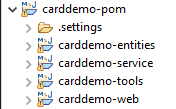

The basic organization relies on the following structure:

- Entities project: contains business model and context elements.
  The project name generally ends with "-entities".
  Typically, for a given legacy COBOL program, this corresponds to the modernization of the I/O section (data sets) and the data division.
  You can have more than one entities project.
- Service project: contains legacy business logic modernization elements.
  Typically, the procedure division of a COBOL program. You can have more than one service project.
- Utility project: contains shared common tools and utilities, used by other projects.
- Web project: contains the modernization of UI-related elements when applicable.
  Not used for batch-only modernization projects.
  These UI elements could come from CICS BMS maps, IMS MFS components, and other mainframe UI sources.
  You can have more than one Web project.

### Entities project contents

###### Note

The following descriptions only apply to COBOL and PL/I modernization outputs.
RPG modernization outputs are based on a different layout.

Before any refactoring, the packages organization in the entities project is tied to the modernized programs.
You can accomplish this in a couple of different ways.
The preferred way is to use the Refactoring toolbox, which operates before you trigger the code generation mechanism.
This is an advanced operation, which is explained in the BluAge trainings.
For more information, see [Refactoring workshop](https://catalog.workshops.aws/aws-blu-age-l3-certification-workshop/en-US/refactoring "https://catalog.workshops.aws/aws-blu-age-l3-certification-workshop/en-US/refactoring").
This approach allows you to preserve the capability to re-generate the java code later, to benefit from further improvements in the future, for instance).
The other way is to do regular java refactoring, directly on the generated source code, using any java refactoring approach you might like to apply -- at your own risk.

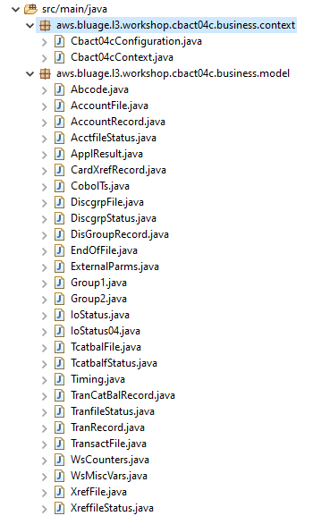

#### Program related classes

Each modernized program is related to two packages, a business.context and a business.model package.

- ``base package`.`program`.business.context`

The business.context sub-package contains two classes, a configuration class and a context class.

    + One configuration class for the program, which contains specific configuration details for the given program, such as the character set to use to represent character-based data elements, the default byte value for padding data structure elements and so on.
     The class name ends with "Configuration".
     It is marked with the `@org.springframework.context.annotation.Configuration` annotation and contains a single method that must return a properly setup `Configuration` object.


    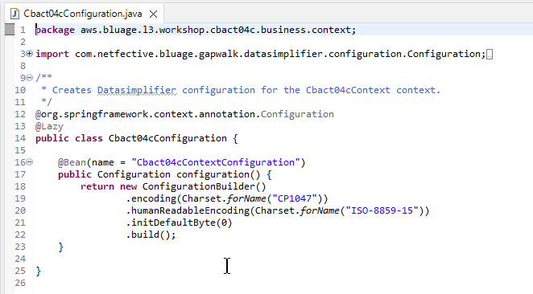
    + One context class, which serves as a bridge between the program service classes (see below) and the data structures (`Record`) and data sets (`File`) from the model sub-package (see below).
     The class name ends with "Context" and is a subclass of the `RuntimeContext` class.


    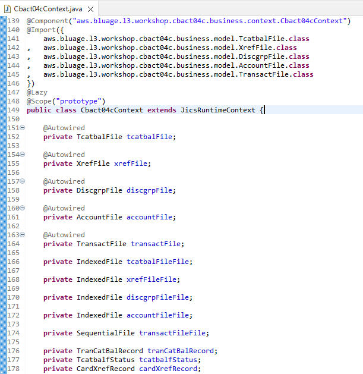

- ``base package`.`program`.business.model`

The model sub-package contains all the data structures that the given program can use.
For instance, any 01 level COBOL data structure corresponds to a class in the model sub-package (lower level data structures are properties of their owning 01 level structure).
For more information about how we modernize 01 data structures, see [What are data simplifiers in AWS Blu Age](ba-shared-data.md "ba-shared-data.md").

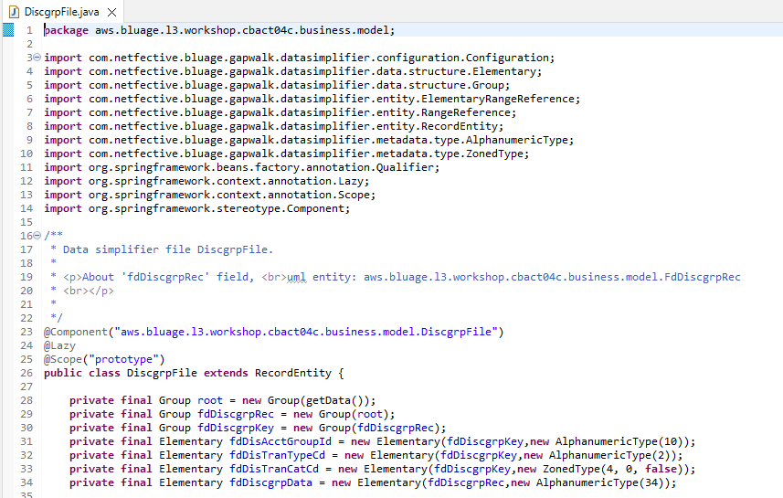

All classes extend the `RecordEntity` class, which represents the access to a business record representation.
Some of the records have a special purpose, as they're bound to a `File`.
The binding between a `Record` and a `File` is made in the corresponding \*FileHandler methods found in the context class when creating the file object.
For example, the following listing shows how the TransactfileFile `File` is bound to the transactFile `Record` (from the model sub-package).

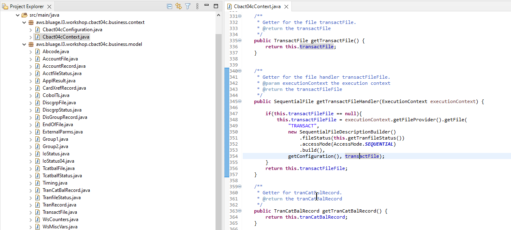

### Service project contents

Every service project comes with a dedicated [Springboot](https://spring.io/projects/spring-boot "https://spring.io/projects/spring-boot") application, which is used as the backbone of the architecture.
This is materialized through the class named `SpringBootLauncher`, located in the base package of the service java sources:

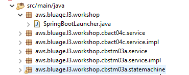

This class is notably responsible for:

- making the glue between the program classes and managed resources (datasources / transaction managers / data sets mappings / etc ...).
- providing a `ConfigurableApplicationContext` to programs.
- discovering all classes marked as spring components (`@Component`).
- ensuring programs are properly registered in the `ProgramRegistry` -- see the initialize method in charge of this registration.

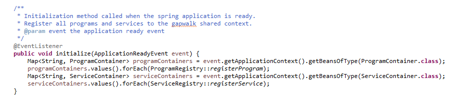

#### Program related artifacts

Without prior refactoring, the business logic modernization outputs are organized on a two or three packages per legacy program basis:

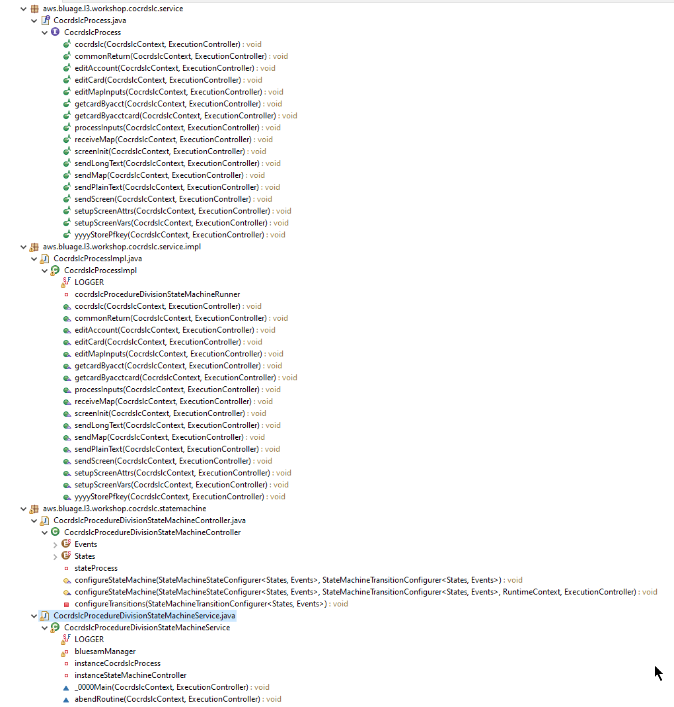

The most exhaustive case will have three packages:

- `*base package*.*program*.service`: contains an interface named *Program*Process, which has business methods to handle the business logic, preserving the legacy execution control flow.
- `*base package*.*program*.service.impl`: contains a class named *Program*ProcessImpl, which is the implementation of the Process interface described previously.
  This is where the legacy statements are "translated" to java statements, relying on the AWS Blu Age framework:

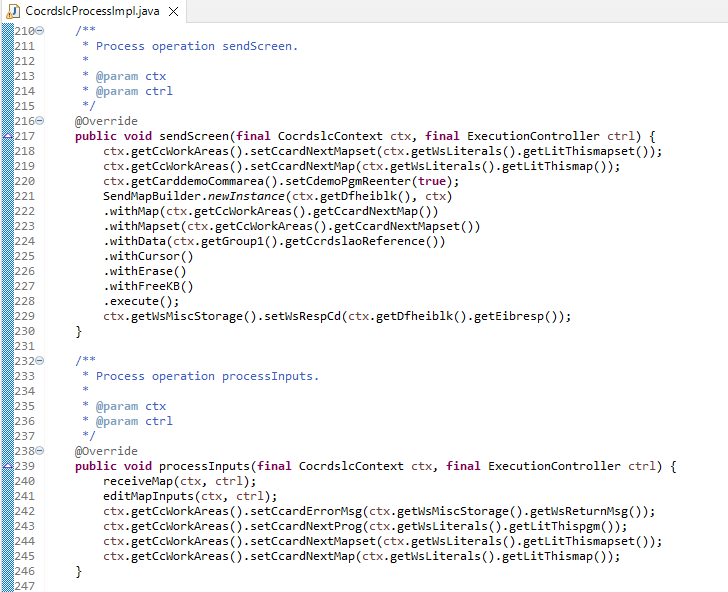

- `*base package*.*program*.statemachine`: this package might not always be present.
  It is required when the modernization of the legacy control flow has to use a state machine approach (namely using the [Spring StateMachine framework](https://spring.io/projects/spring-statemachine "https://spring.io/projects/spring-statemachine")) to properly cover the legacy execution flow.

In that case, the statemachine sub-package contains two classes:

    + `*Program*ProcedureDivisionStateMachineController`: a class that extends a class implementing the `StateMachineController` (define operations needed to control the execution of a state machine) and `StateMachineRunner` (define operations required to run a state machine) interfaces, used to drive the Spring state machine mechanics; for instance, the `SimpleStateMachineController` as in the sample case.


    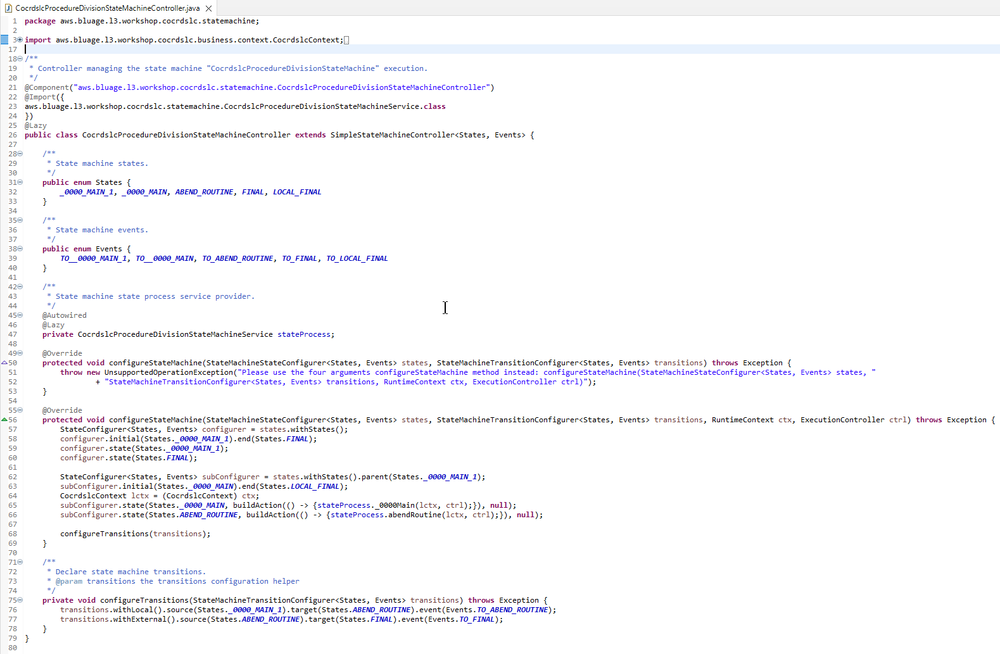

    The state machine controller defines the possible different states and the transitions between them, which reproduce the legacy execution control flow for the given program.


    When building the state machine, the controller refers to methods that are defined in the associated service class located in the state machine package and described below:


    ```

    subConfigurer.state(States._0000_MAIN, buildAction(() -> {stateProcess._0000Main(lctx, ctrl);}), null);
    subConfigurer.state(States.ABEND_ROUTINE, buildAction(() -> {stateProcess.abendRoutine(lctx, ctrl);}), null);

    ```
    + `*Program*ProcedureDivisionStateMachineService`: this service class represents some business logic that is required to be bound with the state machine that the state machine controller creates, as described previously.


    The code in the methods of this class use the Events defined in the state machine controller:


    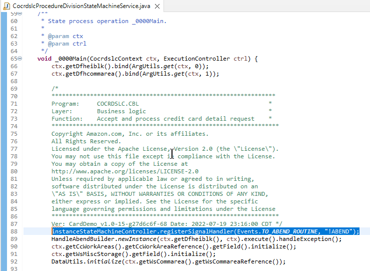


    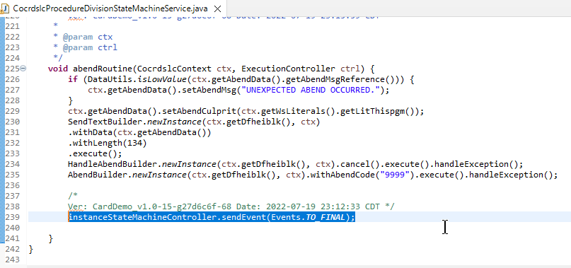

    The statemachine service also makes calls to the process service implementation described previously:


    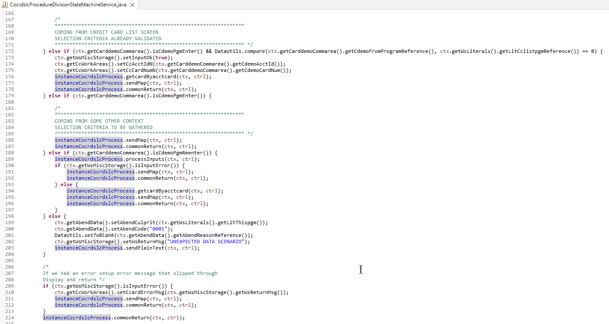

In addition to that, a package named `*base package*.program` plays a significant role, as it gathers one class per program, which will serve as the program entry point (more details about this later on).
Each class implements the `Program` interface, marker for a program entry point.

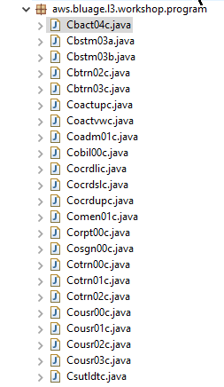

#### Other artifacts

- BMS MAPs companions

In addition to program related artifacts, the service project can contain other artifacts for various purposes.
In the case of the modernization of a CICS online application, the modernization process produces a json file and puts in the map folder of the /src/main/resources folder:

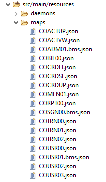

The Blu Age runtime consumes those json files to bind the records used by the SEND MAP statement with the screen fields.

- Groovy Scripts

If the legacy application had JCL scripts, those have been modernized as [groovy](https://groovy-lang.org/ "https://groovy-lang.org/") scripts, stored in the /src/main/resources/scripts folder (more on that specific location later on):

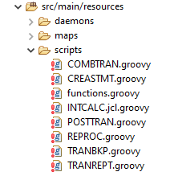

Those scripts are used to launch batch jobs (dedicated, non-interactive, cpu-intensive data processing workloads).

- SQL files

If the legacy application was using SQL queries, the corresponding modernized SQL queries have been gathered in dedicated properties files, with the naming pattern _program_.sql, where _program_ is the name of the program using those queries.

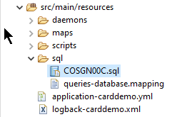

The contents of those sql files are a collection of (key=query) entries, where each query is associated to a unique key, that the modernized program uses to run the given query:

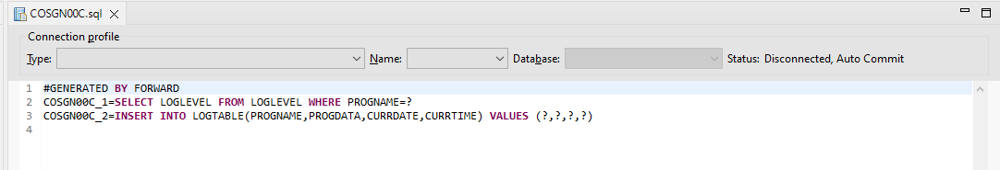

For instance, the COSGN00C program is executing the query with key "COSGN00C_1" (the first entry in the sql file):

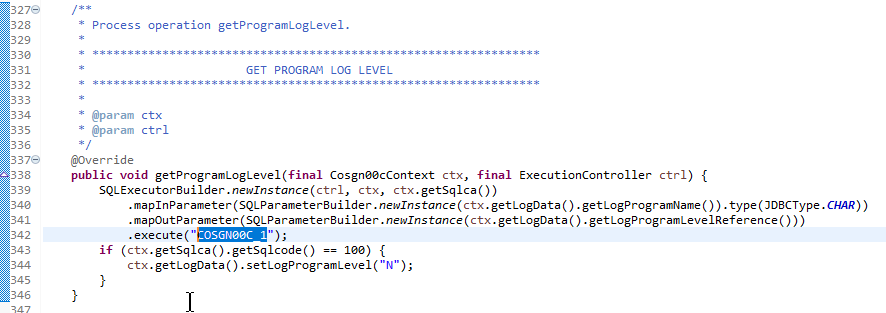

### Utilities project contents

The utilities project, whose name ends with "-tools", contains a set of technical utilities, which might be used by all the other projects.

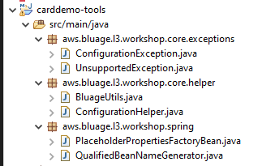

### Web project(s) contents

The web project is only present when modernizing legacy UI elements.
The modern UI elements used to build the modernized application front-end are based on [Angular](https://angular.io/ "https://angular.io/").
The sample application used to show the modernization artifacts is a COBOL/CICS application, running on a mainframe.
The CICS system uses MAPs to represent the UI screens.
The corresponding modern elements will be, for every map, a html file accompanied by [Typescript](https://www.typescriptlang.org/ "https://www.typescriptlang.org/") files:

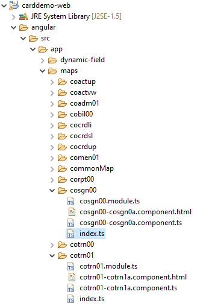

The web project only takes care of the front end aspect of the application
The service project, which relies on the utility and entities projects, provides the backend services.
The link between the front end and the backend is made through the web application named Gapwalk-Application, which is part of the standard AWS Blu Age runtime distribution.

## Running and calling programs

On legacy systems, programs are compiled as stand-alone executables that can call themselves through a CALL mechanism, such as the COBOL CALL statement, passing arguments when needed.
The modernized applications offer the same capability but use a different approach, because the nature of the involved artifacts differs from the legacy ones.

On the modernized side, program entry points are specific classes that implement the `Program` interface, are Spring components (@Component) and are located in service projects, in a package named `*base package*.program`.

### Programs registration

Each time the [Tomcat](https://tomcat.apache.org/ "https://tomcat.apache.org/") server that hosts modernized applications is started, the service Springboot application is also started, which triggers the programs registration.
A dedicated registry named `ProgramRegistry` is populated with program entries, each program being registered using its identifiers, one entry per known program identifier, which means that if a program is known by several different identifiers, the registry contains as many entries as there are identifiers.

The registration for a given program relies on the collection of identifiers returned by the getProgramIdentifiers() method:

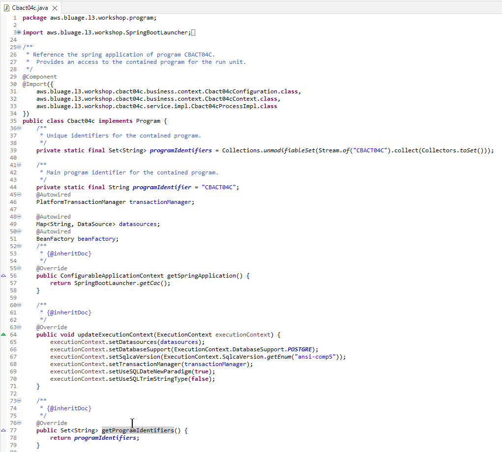

In this example, the program is registered once, under the name 'CBACT04C' (look at the contents of the programIdentifiers collection).
The tomcat logs show every program registration.
The program registration only depends on the declared program identifiers and not the program class name itself (though typically the program identifiers and program class names are aligned.

The same registration mechanism applies to utility programs brought by the various utility AWS Blu Age web applications, which are part of the AWS Blu Age runtime distribution.
For instance, the Gapwalk-Utility-Pgm webapp provides the functional equivalents of the z/OS system utilities (IDCAMS, ICEGENER, SORT,and so on) and can be called by modernized programs or scripts.
All available utility programs that are registered at Tomcat startup are logged in the Tomcat logs.

### Scripts and daemons registration

A similar registration process, at Tomcat startup time, occurs for groovy scripts that are located in the /src/main/resources/scripts folder hierarchy.
The scripts folder hierarchy is traversed, and all groovy scripts that are discovered (except the special functions.groovy reserved script) are registered in the `ScriptRegistry`, using their short name (the part of the script file name located before the first dot character) as the key for retrieval.

###### Note

- If several scripts have file names that will result in producing the same registration key, only the latest is registered, overwriting any previously encountered registration for that given key.
- Considering the above note, pay attention when using sub-folders as the registration mechanism flattens the hierarchy and could lead to unexpected overwrites.
  The hierarchy does not count in the registration process: typically /scripts/A/myscript.groovy and /scripts/B/myscript.groovy will lead to /scripts/B/myscript.groovy overwriting /scripts/A/myscript.groovy.

The groovy scripts in the /src/main/resources/daemons folder are handled a bit differently.
They're still registered as regular scripts, but in addition, they are launched once, directly at Tomcat startup time, asynchronously.

After scripts are registered in the `ScriptRegistry`, a REST call can launch them, using the dedicated endpoints that the Gapwalk-Application exposes.
For more information, see the corresponding documentation.

### Programs calling programs

Each program can call another program as a subprogram, passing parameters to it.
Programs use an implementation of the `ExecutionController` interface to do so (most of the time, this will be an `ExecutionControllerImpl` instance), along with a fluent API mechanism named the `CallBuilder` to build the program call arguments.

All programs methods take both a `RuntimeContext` and an `ExecutionController` as method arguments, so an `ExecutionController` is always available to call other programs.

See, for instance, the following diagram, which shows how the CBST03A program calls the CBST03B program as a sub-program, passing parameters to it:

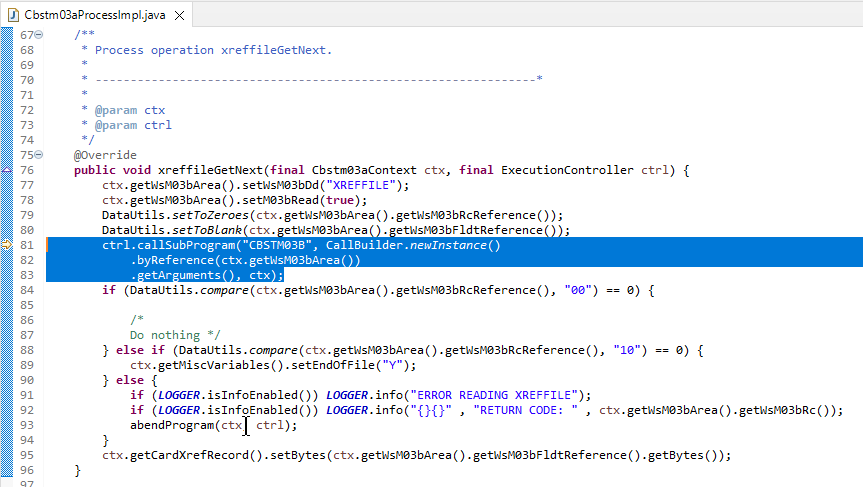

- The first argument of the `ExecutionController.callSubProgram` is an identifier of the program to call (that is, one of the identifiers used for the program registration -- see paragraphs above).
- The second argument, which is the result of the build on the `CallBuilder`, is an array of `Record`, corresponding to the data passed from caller to callee.
- The third and last argument is the caller `RuntimeContext` instance.

All three arguments are mandatory and cannot be null, but the second argument can be an empty array.

The callee will be able to deal with passed parameters only if it was originally designed to do so.
For a legacy COBOL program, that means having a LINKAGE section and a USING clause for the procedure division to make use of the LINKAGE elements.

For instance, see the corresponding [CBSTM03B.CBL](https://github.com/aws-samples/aws-mainframe-modernization-carddemo/blob/main/app/cbl/CBSTM03B.CBL "https://github.com/aws-samples/aws-mainframe-modernization-carddemo/blob/main/app/cbl/CBSTM03B.CBL") COBOL source file:

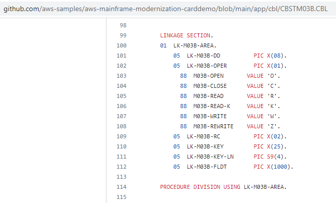

So the CBSTM03B program takes a single `Record` as a parameter (an array of size 1).
This is what the `CallBuilder` is building, using the byReference() and getArguments() methods chaining.

The `CallBuilder` fluent API class has several methods available to populate the array of arguments to pass to a callee:

- asPointer(RecordAdaptable) : add an argument of pointer kind, by reference. The pointer represents the address of a target data structure.
- byReference(RecordAdaptable): add an argument by reference. The caller will see the modifications that the callee performs.
- byReference(RecordAdaptable): varargs variant of the previous method.
- byValue(Object): add an argument, transformed to a `Record`, by value. The caller won't see the modifications the callee performs.
- byValue(RecordAdaptable): same as the previous method, but the argument is directly available as a `RecordAdaptable`.
- byValueWithBounds(Object, int, int): add an argument, transformed to a `Record`, extracting the byte array portion defined by the given bounds, by value.

Finally, the getArguments method will collect all added arguments and return them as an array of `Record`.

###### Note

It is the responsability of the caller to make sure the arguments array has the required size, that the items are properly ordered and compatible, in terms of memory layout with the expected layouts for the linkage elements.

### Scripts calling programs

Calling registered programs from groovy scripts require using a class instance implementing the `MainProgramRunner` interface.
Usually, getting such an instance is achieved through Spring's ApplicationContext usage:

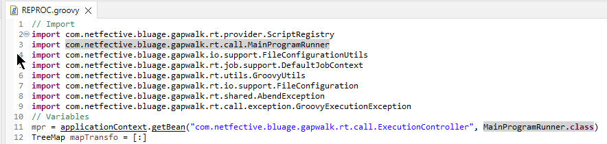

After a `MainProgramRunner` interface is available, use the runProgram method to call a program and pass the identifier of the target program as a parameter:

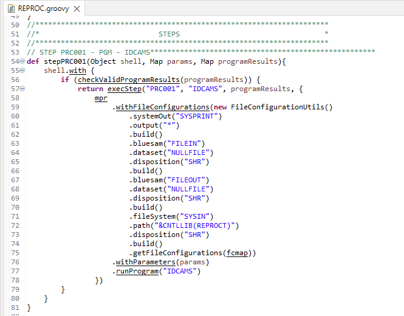

In the previous example, a job step calls IDCAMS (file handling utility program), providing a mapping between actual data set definitions and their logical identifiers.

When dealing with data sets, legacy programs mostly use logical names to identify data sets.
When the program is called from a script, the script must map logical names with actual physical data sets.
These data sets could be on the filesystem, in a Blusam storage or even defined by an inline stream, the concatenation of several data sets, or the generation of a GDG.

Use the withFileConfiguration method to build a logical to physical map of data sets and make it available to the called program.

## Write your own program

Writing your own program for scripts or other modernized programs to call is a common task.
Typically, on modernization projects, you write your own programs when an executable legacy program is written in a language that the modernization process doesn't support, or the sources have been lost (yes, that can happen), or the program is an utility whose sources are not available.

In that case, you might have to write the missing program, in java, by yourself (assuming you have enough knowledge about what the program expected behaviour should be, the memory layout of the program's arguments if any, and so on.)
Your java program must comply with the program mechanics described in this document, so that other programs and scripts can run it.

To make sure the program is usable, you must complete two mandatory steps:

- Write a class that implements the `Program` interface properly, so that it can be registered and called.
- Make sure your program is registered properly, so that it is visible from other programs/scripts.

### Writing the program implementation

Use your IDE to create a new java class that implements the `Program` interface:

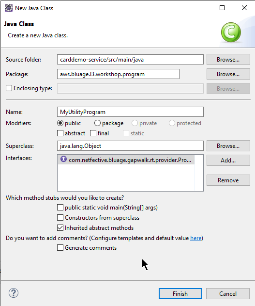

The following image shows the Eclipse IDE, which takes care of creating all mandatory methods to be implemented:

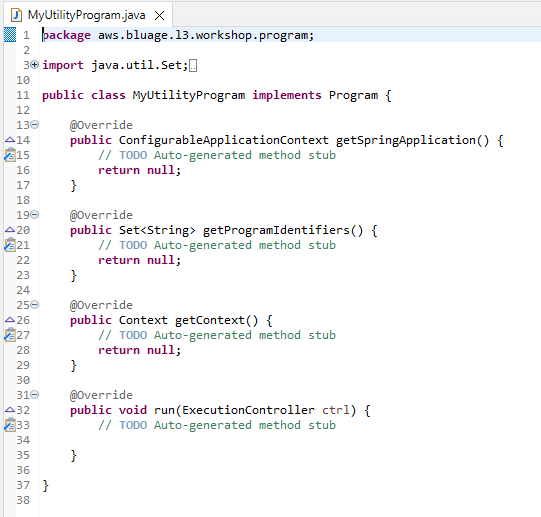

### Spring integration

First, the class must be declared as a Spring component.
Annotate the class with the `@Component` annotation:

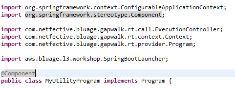

Next, implement the required methods properly.
In the context of this sample, we added the `MyUtilityProgram` to the package that already contains all modernized programs.
That placement permits the program to use the existing Springboot application to provide the required `ConfigurableApplicationContext` for the getSpringApplication method implementation:

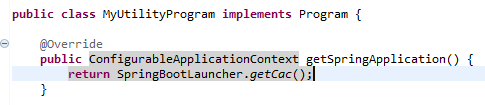

You might choose a different location for your own program.
For instance, you might locate the given program in another dedicated service project.
Make sure the given service project has its own Springboot application, which makes it possible to retrieve the ApplicationContext (that should be a `ConfigurableApplicationContext`).

### Giving an identity to the program

To be callable by other programs and scripts, the program must be given at least one identifier, which must not collide with any other existing registered program within the system.
The identifier choice might be driven by the need to cover an existing legacy program replacement; in that case, you'll have to use the expected identifier, as met in CALL occurrences found throughout the legacy programs.
Most of the program identifiers are 8 characters long in legacy systems.

Creating an unmodifiable set of identifiers in the program is one way of doing this.
The following example shows choosing "MYUTILPG" as the single identifier:

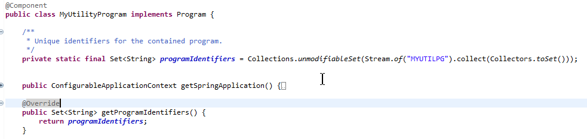

### Associate the program to a context

The program needs a companion `RuntimeContext` instance.
For modernized programs, AWS Blu Age automatically generates the companion context, using the data structures that are part of the legacy program.

If you're writing your own program, you must write the companion context as well.

Referring to [Program related classes](#ba-shared-structure-org-entities-program "#ba-shared-structure-org-entities-program"),
you can see that a program requires at least two companion classes:

- a configuration class.
- a context class that uses the configuration.

If the utility program uses any extra data structure, it should be written as well and used by the context.

Those classes should be in a package that is part of a package hierarchy that will be scanned at application startup, to make sure the context component and configuration will be handled by the Spring framework.

Let's write a minimal configuration and context, in the `*base package*.myutilityprogram.business.context` package, freshly created in the entities project:

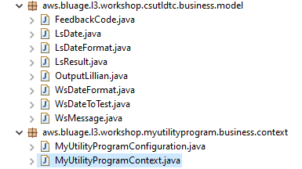

Here is the configuration content.
It is using a configuration build similar to other -- modernized -- programs nearby.
You'll probably have to customize this for your specific needs.

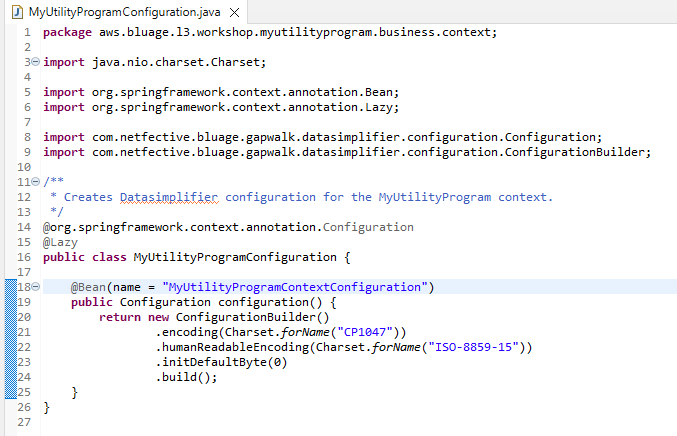

Notes:

- General naming convention is *ProgramName*Configuration.
- It must use the @org.springframework.context.annotation.Configuration and @Lazy annotations.
- The bean name usually follows the *ProgramName*ContextConfiguration convention, but this is not mandatory.
  Make sure to avoid bean name collisions across the project.
- The single method to implement must return a `Configuration` object.
  Use the `ConfigurationBuilder` fluent API to help you build one.

And the associated context:

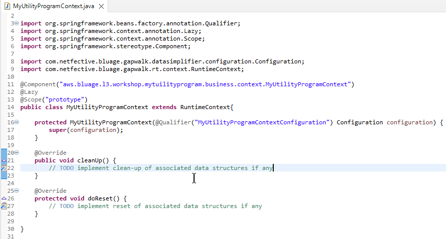

Notes

- The context class should extend an existing `Context` interface implementation (either `RuntimeContext` or `JicsRuntimeContext`, which is an enhanced `RuntimeContext` with JICS specifics items).
- General naming convention is *ProgramName*Context.
- You must declare it as a Prototype component, and use the @Lazy annotation.
- The constructor refers to the associated configuration, using the @Qualifier annotation to target the proper configuration class.
- If the utility program uses some extra data structures, they should be:
  - written and added to the `*base package*.business.model` package.
  - referenced in the context.
    Take a look at other existing context classes to see how to reference data strcutures classes and adapt the context methods (constructor / clean-up / reset) as needed.

Now that a dedicated context is available, let the new program use it:

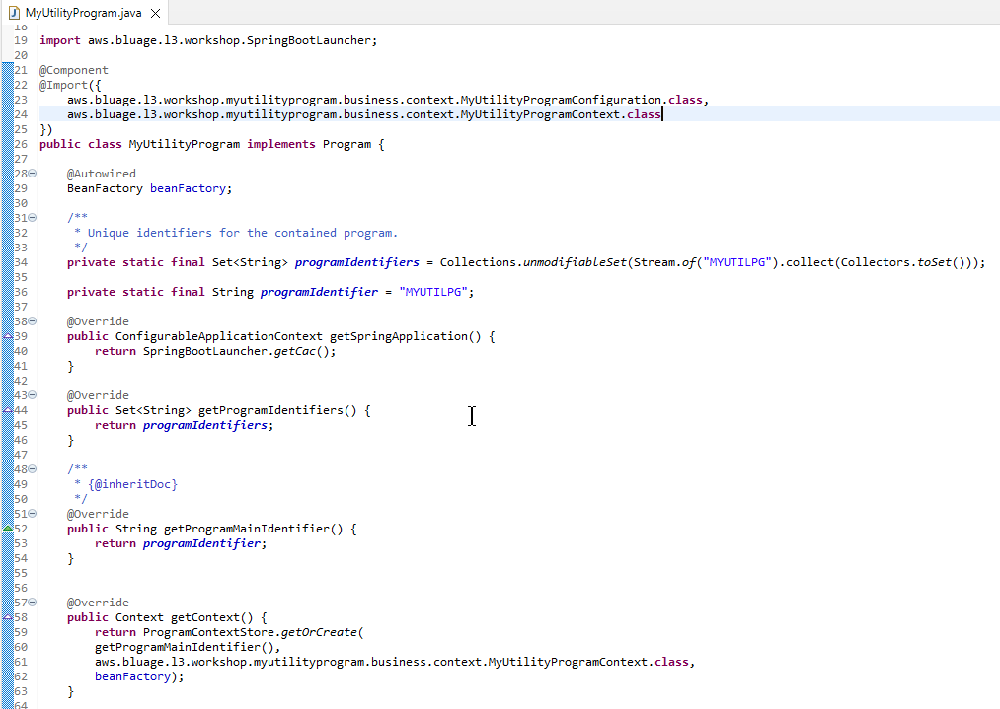

Notes:

- The getContext method must be implemented strictly as shown, using a delegation to the getOrCreate method of the
  `ProgramContextStore` class and the auto wired Spring `BeanFactory`.
  A single program identifier is used to store the program context in the `ProgramContextStore`; this identifier is referenced as being the 'program main identifier'.
- The companion configuration and context classes must be referenced using the `@Import` spring annotation.

### Implementing the business logic

When the program skeleton is complete, implement the business logic for the new utility program.

Do this in the `run` method of the program.
This method will be executed anytime the program is called, either by another program or by a script.

Happy coding!

### Handling the program registration

Finally, make sure the new program is properly registered in the `ProgramRegistry`.
If you added the new program to the package that already contains other programs, there's nothing more to be done.
The new program is picked up and registered with all its neighbour programs at application startup.

If you chose another location for the program, you must make sure the program is properly registered at Tomcat startup.
For some inspiration about how to do that, look at the initialize method of the generated SpringbootLauncher classes in the service project(s) (see
[Service project contents](#ba-shared-structure-org-service "#ba-shared-structure-org-service")).

Check the Tomcat startup logs.
Every program registration is logged.
If your program is successfully registered, you'll find the matching log entry.

When you're sure that your program is properly registered, you can start iterating on the business logic coding.

## Fully qualified name mappings

This section contains lists of the AWS Blu Age and third-party fully qualified name mappings for use in your modernized applications.

### AWS Blu Age fully qualified name mappings

| Short name                     | Fully qualified name                                                              |
| ------------------------------ | --------------------------------------------------------------------------------- |
| `CallBuilder`                  | `com.netfective.bluage.gapwalk.runtime.statements.CallBuilder`                    |
| `Configuration`                | `com.netfective.bluage.gapwalk.datasimplifier.configuration.Configuration`        |
| `ConfigurationBuilder`         | `com.netfective.bluage.gapwalk.datasimplifier.configuration.ConfigurationBuilder` |
| `ExecutionController`          | `com.netfective.bluage.gapwalk.rt.call.ExecutionController`                       |
| `ExecutionControllerImpl`      | `com.netfective.bluage.gapwalk.rt.call.internal.ExecutionControllerImpl`          |
| `File`                         | `com.netfective.bluage.gapwalk.rt.io.File`                                        |
| `MainProgramRunner`            | `com.netfective.bluage.gapwalk.rt.call.MainProgramRunner`                         |
| `Program`                      | `com.netfective.bluage.gapwalk.rt.provider.Program`                               |
| `ProgramContextStore`          | `com.netfective.bluage.gapwalk.rt.context.ProgramContextStore`                    |
| `ProgramRegistry`              | `com.netfective.bluage.gapwalk.rt.provider.ProgramRegistry`                       |
| `Record`                       | `com.netfective.bluage.gapwalk.datasimplifier.data.Record`                        |
| `RecordEntity`                 | `com.netfective.bluage.gapwalk.datasimplifier.entity.RecordEntity`                |
| `RuntimeContext`               | `com.netfective.bluage.gapwalk.rt.context.RuntimeContext`                         |
| `SimpleStateMachineController` | `com.netfective.bluage.gapwalk.rt.statemachine.SimpleStateMachineController`      |
| `StateMachineController`       | `com.netfective.bluage.gapwalk.rt.statemachine.StateMachineController`            |
| `StateMachineRunner`           | `com.netfective.bluage.gapwalk.rt.statemachine.StateMachineRunner`                |

### Third party fully qualified name mappings

| Short name                       | Fully qualified name                                         |
| -------------------------------- | ------------------------------------------------------------ |
| `@Autowired`                     | `org.springframework.beans.factory.annotation.Autowired`     |
| `@Bean`                          | `org.springframework.context.annotation.Bean`                |
| `BeanFactory`                    | `org.springframework.beans.factory.BeanFactory`              |
| `@Component`                     | `org.springframework.stereotype.Component`                   |
| `ConfigurableApplicationContext` | `org.springframework.context.ConfigurableApplicationContext` |
| `@Import`                        | `org.springframework.context.annotation.Import`              |
| `@Lazy`                          | `org.springframework.context.annotation.Lazy`                |
