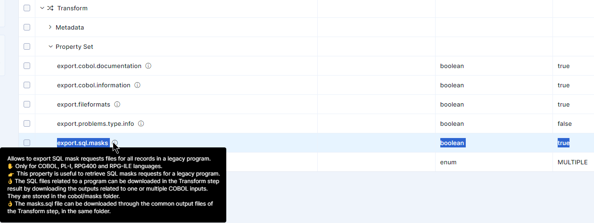
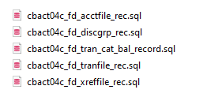

AWS Mainframe Modernization Service (Managed Runtime Environment experience) will no longer be open to new customers starting on November 7, 2025. If you would like to use the service, please sign up prior to November 7, 2025. For capabilities similar to AWS Mainframe Modernization Service (Managed Runtime Environment experience) explore AWS Mainframe Modernization Service (Self-Managed Experience). Existing customers can continue to use the service as normal. For more information, see
[AWS Mainframe Modernization availability change](mainframe-modernization-availability-change.md "mainframe-modernization-availability-change.md").

# Deploying the BAC

The BAC is available as a secured single web application, using the web-archive format
(.war). It is intended to be deployed alongside the BluAge Gapwalk-Application, in an Apache
Tomcat application server, but can also be deployed as a standalone application. The BAC inherits
the access to the Blusam storage from the Gapwalk-Application configuration if present.

The BAC has its own dedicated configuration file, named
`application-bac.yml`. For configuration details, see [BAC dedicated configuration file](#ba-shared-bac-configuration-file "#ba-shared-bac-configuration-file").

The BAC is secured. For details about security configuration, see [Configuring security for the BAC](#ba-shared-bac-securing "#ba-shared-bac-securing").

## BAC dedicated configuration file

Standalone deployment: If the BAC is deployed alone the Gapwalk-Application, the connection
to the Blusam storage must be configured in the application-bac.yml configuration file.

Default values for data sets configuration used to browse data set records must be set in
the configuration file. See [Browsing records from a data set](bac-usage.md#ba-shared-bac-read-dataset "bac-usage.md#ba-shared-bac-read-dataset"). The records browsing
page can use an optional mask mechanism that makes it possible to show a structured view on a
record's content. Some properties impact the records view when masks are used.

The following configurable properties must set in the configuration file. The BAC
application does not assume any default value for these properties.

| Key                            | Type    | Description                                                                                                                                                                                                                                                                                                                                              |
| ------------------------------ | ------- | -------------------------------------------------------------------------------------------------------------------------------------------------------------------------------------------------------------------------------------------------------------------------------------------------------------------------------------------------------- | ----------------------------------------------------------------------------------------------------------------------------------------------------------------------------------------------------------------------------------------------------------------------------------------------------------------------------------------------------------------------------------------------------------------------------------------------------------------------------------------------------------------------------------------------------------------------------------------------------------------------------------------------------------------------------------------------------------------------------------------------------------------------------------------------------------------------------------------------------------------------------------------------------------------------------------------------------------------------------------------------------------------------------------------------------------------------------------------------------------------------------------------------------------------------------------------------------------------------------------------------------------------------------------------------------------------------------------------------------------------------------------------------------------------------------------------------------------------------------------------------------------------------------------------------------------------------------------------------------------------------------------------------------------------------------------------------------------------------------------------------------------------------------------------------------------------------------------------------------------------------------------------------------------------------------------------------------------------------------------------------------------------------------------------------------------------------------------------------------------------------------------------------------------------------------------------------------------------------------------------------------------------------------------------------------------------------------------------------------------------------------------------------------------------------------------------------------------------------------------------------------------------------------------------------------------------------------------------------------------------------------------------------------------------------------------------------------------------------------------------------------------------------------------------------------------------------------------------------------------------------------------------------------------------------------------------------------------------------------------------------------------------------------------------------------------------------------------------------------------------------------------------------------------------------------------------------------------------------------------------------------------------------------------------------------------------------------------------------------------------------------------------------------------------------------------------------------------------------------------------------------------------------------------------------------------------------------------------------------------------------------------------------------------------------------------------------------------------------------------------------------------------------------------------------------------------------------------------------------------------------------------------------------------------------------------------------------------------------------------------------------------------------------------------------------------------------------------------------------------------------------------------------------------------------------------------------------------------------------------------------------------------------------------------------------------------------------------------------------------------------------------------------------------------------------------------------------------------------------------------------------------------------------------------------------------------------------------------------------------------------------------------------------------------------------------------------------------------------------------------------------------------------------------------------------------------------------------------------------------------------------------------------------------------------------------------------------------------------------------------------------------------------------------------------------------------------------------------------------------------------------------------------------------------------------------------------------------------------------------------------------------------------------------------------------------------------------------------------------------------------------------------------------------------------------------------------------------------------------------------------------------------------------------------------------------------------------------------------------------------------------------------------------------------------------------------------------------------------------------------------------------------------------------------------------------------------------------------------------------------------------------------------------------------------------------------------------------------------------------------------------------------------------------------------------------------------------------------------------------------------------------------------------------------------------------------------------------------------------------------------------------------------------------------------------------------------------------------------------------------------------------------------------------------------------------------------------------------------------------------------------------------------------------------------------------------------------------------------------------------------------------------------------------------------------------------------------------- |
| `bac.crud.limit`               | integer | A positive integer value giving the maximum number of records returned when browsing records. Using `0` means _unlimited_. Recommended value: `10` (then adjust the value data set by data set on the browsing page, to fit your needs).                                                                                                                 |
| `bac.crud.encoding`            | string  | The default character set name, used to decode records bytes as alphanumeric content. The provided charset name must be java compatible (please see the java documentation for supported charsets). Recommended value: the legacy charset used on the legacy platform where data sets are coming from; this will be an EBCDIC variant most of the times. |
| `bac.crud.initCharacter`       | string  | The default character (byte) used to init data items. Two special values can be used: `"LOW-VALUE"`, the 0x00 byte (recommended value) and `"HI-VALUE"`, the 0xFF byte. Used when masks are applied.                                                                                                                                                     |
| `bac.crud.defaultCharacter`    | string  | The default character (byte), as a one character string, used for padding records (on the right). Recommended value: `" "` (space). Used when masks are applied.                                                                                                                                                                                         |
| `bac.crud.blankCharacter`      | string  | The default character (byte), as a one character string, used to represent blanks in records.Recommended value: `" "` (space). Used when masks are applied.                                                                                                                                                                                              |
| `bac.crud.strictZoned`         | boolean | A flag to indicate which zoned mode is used for the record. If `true`, the Strict zone mode will be used; if `false`, the Modified zoned mode will be used. Recommended value: `true`. Used when masks are applied.                                                                                                                                      |
| `bac.crud.decimalSeparator`    | string  | The character used as decimal separator in numeric edited fields (used when masks are applied).                                                                                                                                                                                                                                                          |
| `bac.crud.currencySign`        | string  | The default character, as a one character string, used to represent currency in numeric edited fields, when formatting is applied (used when masks are applied).                                                                                                                                                                                         |
| `bac.crud.pictureCurrencySign` | string  | The default character, as a one character string, used to represent currency in numeric edited fields pictures (used when masks are applied).                                                                                                                                                                                                            | The following sample is a configuration file snippet. `bac.crud.limit: 10 bac.crud.encoding: ascii bac.crud.initCharacter: "LOW-VALUE" bac.crud.defaultCharacter: " " bac.crud.blankCharacter: " " bac.crud.strictZoned: true bac.crud.decimalSeparator: "." bac.crud.currencySign: "$" bac.crud.pictureCurrencySign: "$"` ## Configuring security for the BAC Configuring security for the BAC relies on the mechanisms detailed in this documentation page. The authentication scheme is OAuth2, and configuration details for Amazon Cognito or Keycloak are provided. While general setup can be applied, some specifics about the BAC need to be detailed here. The access to the BAC features is protected using a role-based policy and relies on the following roles.  • ROLE_USER: + Basic user role + No import, export, creation, or deletion of data sets allowed + No control over caching policies + No administration features allowed  • ROLE_ADMIN: + Inherits ROLE_USER permissions + All data set operations allowed + Caching policies administration allowed ## Installing the masks In Blusam storage, data sets records are stored in a byte array column in the database, for versatility and performance considerations. Having access to a structured view, using fields, of the business records, based on application point of view is a convenient feature of the BAC. This relies on the SQL masks produced during the BluAge driven modernization process. For the SQL masks to be generated, please make sure to set the relevant option (`export.SQL.masks`) in the configuration of the BluInsights Transformation Center to true:  The masks are part of the modernization artifacts that can be downloaded from BluInsights for a given project. They are SQL scripts, organized by modernized programs, giving the applicative point of view on data sets records. For example, using the [AWS CardDemo sample application](https://github.com/aws-samples/aws-mainframe-modernization-carddemo/tree/main/app/cbl "https://github.com/aws-samples/aws-mainframe-modernization-carddemo/tree/main/app/cbl"), you can find in the downloaded artifacts from the modernization result of this application, the following SQL masks for the program CBACT04C.cbl:  Each SQL mask name is the concatenation of the program name and the record structure name for a given data set within the program. For example, looking at the [[CBACT04C.cbl](https://github.com/aws-samples/aws-mainframe-modernization-carddemo/blob/main/app/cbl/CBACT04C.cbl "https://github.com/aws-samples/aws-mainframe-modernization-carddemo/blob/main/app/cbl/CBACT04C.cbl") program, the given file control entry: `FILE-CONTROL. SELECT TCATBAL-FILE ASSIGN TO TCATBALF ORGANIZATION IS INDEXED ACCESS MODE  IS SEQUENTIAL RECORD KEY   IS FD-TRAN-CAT-KEY FILE STATUS  IS TCATBALF-STATUS.` is associated with the given FD record definition `FILE SECTION. FD  TCATBAL-FILE. 01  FD-TRAN-CAT-BAL-RECORD. 05 FD-TRAN-CAT-KEY. 10 FD-TRANCAT-ACCT-ID             PIC 9(11). 10 FD-TRANCAT-TYPE-CD             PIC X(02). 10 FD-TRANCAT-CD                  PIC 9(04). 05 FD-FD-TRAN-CAT-DATA               PIC X(33).` The matching SQL mask named `cbact04c_fd_tran_cat_bal_record.SQL` is the mask that gives the point of view of the program CBACT04C.cbl on the FD record named `FD-TRAN-CAT-BAL-RECORD`. Its content is: `-- Generated by Blu Age Velocity -- Mask : cbact04c_fd_tran_cat_bal_record INSERT INTO mask (name, length) VALUES ('cbact04c_fd_tran_cat_bal_record', 50); INSERT INTO mask_item (name, c_offset, length, skip, type, options, mask_fk) VALUES ('fd_trancat_acct_id', 1, 11, false, 'zoned', 'integerSize=11!fractionalSize=0!signed=false', (SELECT MAX(id) FROM mask)); INSERT INTO mask_item (name, c_offset, length, skip, type, options, mask_fk) VALUES ('fd_trancat_type_cd', 12, 2, false, 'alphanumeric', 'length=2', (SELECT MAX(id) FROM mask)); INSERT INTO mask_item (name, c_offset, length, skip, type, options, mask_fk) VALUES ('fd_trancat_cd', 14, 4, false, 'zoned', 'integerSize=4!fractionalSize=0!signed=false', (SELECT MAX(id) FROM mask)); INSERT INTO mask_item (name, c_offset, length, skip, type, options, mask_fk) VALUES ('fd_fd_tran_cat_data', 18, 33, false, 'alphanumeric', 'length=33', (SELECT MAX(id) FROM mask));` Masks are stored in the Blusam storage using two tables:  • mask: used to identify masks. The columns of the mas table are: + name: used to store mask identification (used as primary key, so must be unique) + length: size in bytes of the record mask  • mask_item: used to store mask details. Every elementary field from a FD record definition will produce a row in the mask_item table, with details on how to interpret the given record part. The columns of the mask_item table are: + name: name of the record field, based on the elementary name, using lowercase and replacing dash with underscore + c_offset: 1-based offset of the record sub-part, used for the field content + length: length in bytes of the record sub-part, used for the field content + skip: flag to indicate whether the given record part should be skipped or not, in the view presentation + type: the field kind (based on its legacy picture clause) + options: additional type options -- type-dependant + mask_fk: reference to the mask identifier to attach this item to Note the following:  • SQL masks represent a point of view from a program on records from a data set: several programs might have a different point of view on a given data set; only install the masks that you find relevant for your purpose.  • A SQL mask can also represent the point of view from a program based on a 01 data structure from the WORKING STORAGE section, not only from a FD record. The SQL masks are organized into sub-folders according to their nature: + FD record based masks will be located in the sub-folder named `file` + 01 data structure based masks will be located in the sub-folder named `working` While FD records definitions always match the record content from a data set, 01 data structures might not be aligned or might only represent a subset from a data set record. Before you use them, inspect the code and understands the possible shortcomings. |
