AWS Mainframe Modernization Service (Managed Runtime Environment experience) will no longer be open to new customers starting on November 7, 2025. If you would like to use the service, please sign up prior to November 7, 2025. For capabilities similar to AWS Mainframe Modernization Service (Managed Runtime Environment experience) explore AWS Mainframe Modernization Service (Self-Managed Experience). Existing customers can continue to use the service as normal. For more information, see
[AWS Mainframe Modernization availability change](mainframe-modernization-availability-change.md "mainframe-modernization-availability-change.md").

# Using the BAC

Because the BAC is secured and delivers permissions to use features based on the user role,
the first step to access the application is to authenticate yourself. After the authentication
step, you'll be redirected to the home page. The home page presents the paginated list of data
sets found in the Blusam storage:

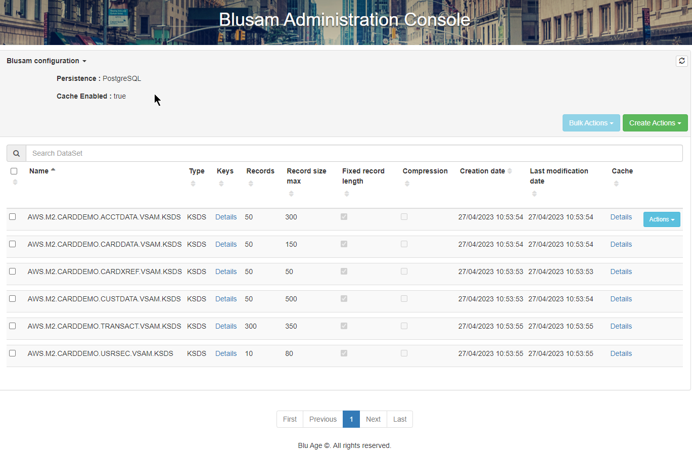
To return to the home page with the data sets listing, choose the Blu Age logo in the upper
left corner of any page of the application. The following image shows the logo.

The foldable header, labelled "Blusam configuration", contains information about the used
Blusam storage configuration:

- `Persistence`: the persistent storage engine (PostgreSQL)
- `Cache Enabled`: whether the storage cache is enabled
  On the right side of the header, two drop-down lists, each one listing operations related to
  data sets:

- **Bulk actions**
- **Create actions**
  To learn about the detailed contents of these lists, see [Existing data set operations](#ba-shared-bac-usage-datasets "#ba-shared-bac-usage-datasets").

The **Bulk Actions** button is disabled when no data set selection has
been made.

You can use the search field to filer the list based on the data sets names:

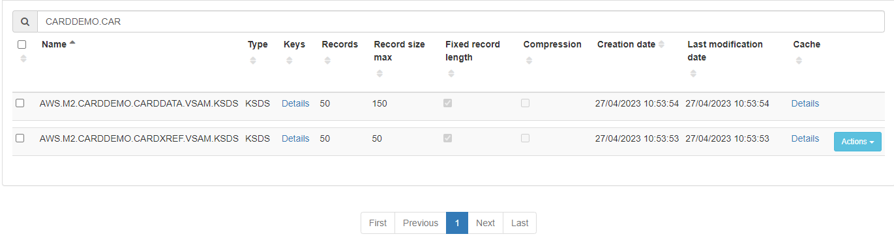
The paginated list that follows shows one data set per table row, with the following
columns:

- Selection checkbox: A checkbox to select the current data set.
- Name: The name of the data set.
- Type: The type of the data set, one of the following:
  - KSDS
  - ESDS
  - RRDS

- Keys: A link to show or hide details about the keys (if any). For example, the given KSDS
  has the mandatory primary key and one alternative key.

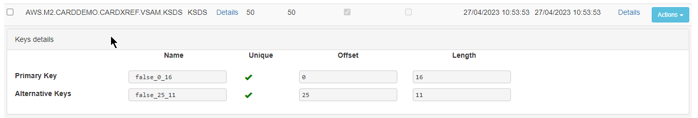

There is one row per key, with the following columns. None of the fields are
editable.

    + Key nature: either a primary key or an alternative key
    + Name: the name of the key
    + Unique: whether the key accepts duplicate entries
    + Offset: offset of the key start within the record
    + Length: length in bytes of the key portion in the record

- Records: The total number of records in the data set.
- Record size max: The maximal size for records, expressed in bytes.
- Fixed record length: A checkbox that indicates whether the records are fixed length
  (selected) or variable length (unselected).
- Compression: A checkbox that indicates whether compression is applied (selected) or not
  (unselected) to stored indexes.
- Creation date: The date when the data set was created in the Blusam storage.
- Last modification date: The date when the data set was last updated in the Blusam
  storage.
- Cache: A link to show or hide details about the caching strategy applied to this dataset.

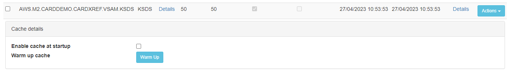

    + Enable cache at startup: A checkbox to specify the startup caching strategy for this
     data set. If selected, the data set will be loaded into cache at startup time.
    + Warm up cache: A button to load the given data set into cache, starting immediately (but
     hydrating the cache takes some time, depending on the data set size and number of keys).
     After the data set gets loaded into cache, a notification like the following one
     appears.

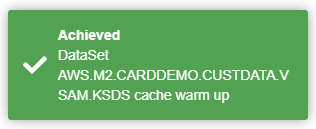

- Actions: A drop-down list of possible data sets operations. For details, see [Existing data set operations](#ba-shared-bac-usage-datasets "#ba-shared-bac-usage-datasets").
  At the bottom of the page, there is a regular paginated navigation widget for browsing
  through the pages of the list of data sets.

## Existing data set operations

For each data set in the paginated list, there is an **Actions** drop-down
list with the following content:

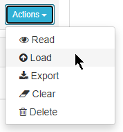

Each item in the list is an active link that makes it possible to perform the specified
action on the data set:

- Read: browse records from the data sets
- Load: import records from a legacy data set file
- Export: export records to a flat file (compatible with legacy systems)
- Clear: remove all records from the data set
- Delete: remove the data set from the storage

Details for each action are provided in the following sections.

### Browsing records from a data set

When you choose the **Read** action for a given data set, you get the
following page.

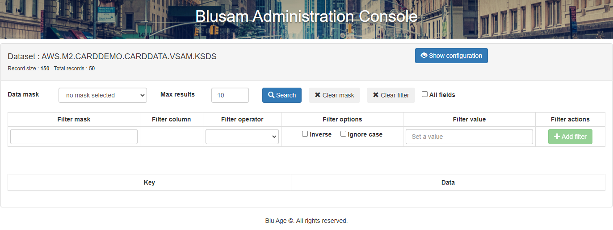

The page is made of:

- a header, with:
  - Dataset: the data set name
  - Record size: the fixed record length, expressed in bytes
  - Total Records: the total number of records stored for this data set
  - Show configuration button (on the right side): a toggle button to show/hide the data
    set configuration. At first, the configuration is hidden. When using the button, the
    configuration you see the configuration, as shown in the following image.

  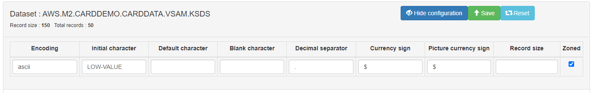

  When configuration is shown, two new buttons: Save and Reset, used respectively to:

      - save the configuration for this data set and current work session
      - reset the configuration to default values for all fields.

  - A list of configurable properties to tailor the browsing experience for the given data
    set.

The configurable properties match the configuration properties described in [BAC dedicated configuration file](bac-deployment.md#ba-shared-bac-configuration-file "bac-deployment.md#ba-shared-bac-configuration-file"). Refer to that section to understand the meaning
of each column and applicable values. Each value can be redefined here for the data set and
saved for the work session (using the Save button). After you save the configuration, a banner
similar to the one shown in the following image appears.

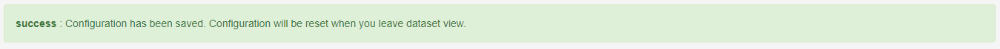

The banner states that the work session ends when you leave the current page.

There is an extra configurable property that is not documented in the configuration
section: Record size. This is used to specify a given record size, expressed in bytes, that
will filter the applicable masks to this data set: only masks whose total length matches the
given record size will be listed in the Data mask drop-down list.

Retrieving records from the data set is triggered by the Search button, using all options
and filters nearby.

First line of options:

- the Data mask drop-down list show applicable masks (respecting the record size). Please
  note that, matching the record size is not enough to be an effective applicable mask. The
  mask definition must also be compatible with the records contents. The Data mask picked here
  has
- Max results: limits the number of records retrieved by the search. Set to 0 for
  unlimited (paginated) results from the data set.
- Search button: launch the records retrieval using filters and options
- Clear mask button: will clear the used mask if any and switch back the results page to a
  raw key/data presentation.
- Clear filter button: will clear the used filter(s) if any and update the results page
  accordingly.
- All fields toggle: When selected, mask items defined with `skip = true` are
  shown anyway, otherwise mask items with `skip = true` are hidden.

Next lines of filters: It is possible to define a list of filters, based on the usage of
filtering conditions applied to fields (columns) from a given mask, as shown in the following
image.

- Filter mask: The name of the mask to pick the filtering column from. When you choose the
  field, the list of applicable masks appears. You can choose the mask you want from that
  list.

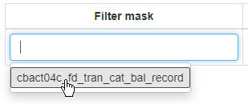

- Filter column: The name of the field (column) from the mask, used to filter records.
  When you choose the field, the list of mask columns appears. To fill the **Filter
  column** field, choose the desired cell.

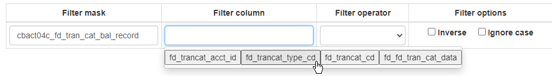

- Filter operator: An operator to apply to the selected column. The following operators
  are available.
  - equals to: the column value for the record must be equal to the filter value
  - starts with: the column value for the record must start with the filter value
  - ends with: the column value for the record must end with the filter value
  - contains: the column value for the record must contain the filter value

- Filter options:
  - Inverse: apply the inverse condition for the filter operator; for instance, 'equals
    to' is replaced by 'not equals to';
  - Ignore case: ignore case on alphanumeric comparisons for the filter operator

- Filter value: The value used for comparison by the filter operator with the filter
  column.

Once the minimal number of filter items are set (at least: Filter mask, filter column,
filter operator and Filter value must be set), the Add Filter button is enabled, and clicking
on it creates a new filter condition on the retrieved records. Another empty filter condition
row is added at the top and the added filter condition has a Remove filter button that can be
used to suppress the given filter condition:

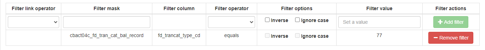

When you launch the search, the filtered results appear in a paginated table.

**Note**

- Successive filters are linked by an **and** or an
  **or**. Every new filter definition starts by setting the link operator, as
  shown in the following image.

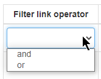

- There might not be any records that match the given filter conditions.

Otherwise, the results table looks like the one in the following image.

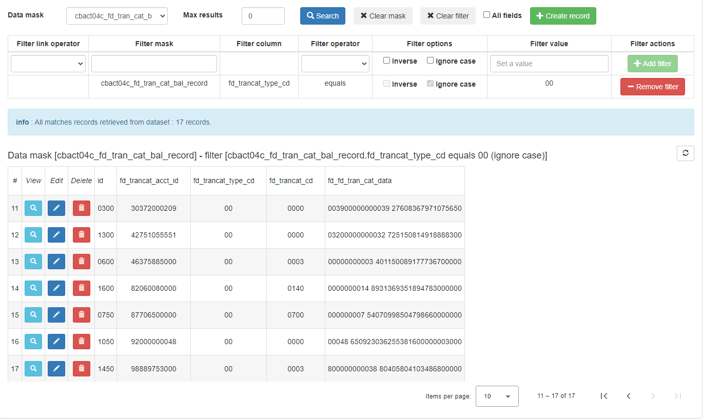

A header indicates the total number of records that match the filter conditions. After the
header, you see the following.

- Reminder of the used data mask (if any) and the filter conditions.
- A refresh button that you can use to trigger the refresh of the whole results table with
  latest values from the Blusam storage (as it might have been updated by another user for
  instance).

For each retrieved record, the table has a row that shows the result of applying the data
mask to the records' contents. Each column is the interpretation of the record sub-portion
according to the column's type (and using the selected encoding). To the left of each row,
there are three buttons:

- a magnifying glass button: leads to a dedicated page showing the detailed record's
  contents
- a pen button: leads to a dedicated edit page for the record's contents:
- a trashcan button: used to delete the given record from the blusam storage

Viewing the record's contents in detail:

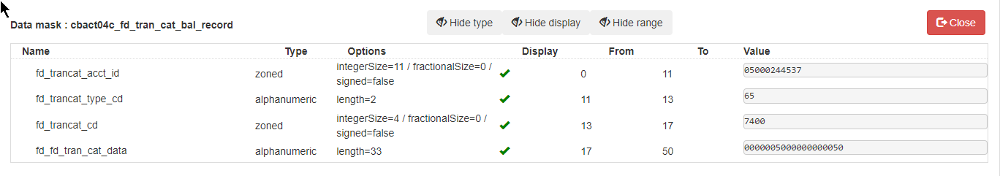

- Three toggle buttons for hiding or showing some columns:
  - Hide/show the type
  - Hide/show the display flag
  - Hide/show the range

- To leave this dedicated page and go back to the results table, choose
  **Close**.
- Each row represents a column from the data mask, with the following columns:
  - Name: the column's name
  - Type: the column's type
  - Display: the display indicator; a green check will be displayed if the matching mask
    item is defined with `skip = false`, otherwise a red cross will be
    displayed
  - From & To: the 0-based range for the record sub-portion
  - Value: the interpreted value of the record sub-portion, using type and encoding

Editing the record's contents:

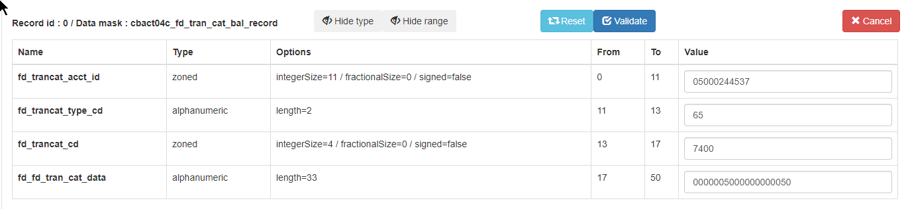

The editing page is similar to the view page described above, except that the mask items
values are editable. Three buttons control the update process:

- Reset: resets the editable values to the initial record values (prior to any
  edition);
- Validate: validates the input, with regards to the mask item type. For each mask item,
  the result of the validation will be printed using visual labels (`OK` and
  checkbox if validation succeeded, `ERROR` and red cross if validation failed,
  alongside an error message giving hints about the validation failure). If the validation
  succeeded, two new buttons will appear:
  - Save: attempt to update the existing record into Blusam storage
  - Save a copy: attempt to create a new record into Blusam storage

  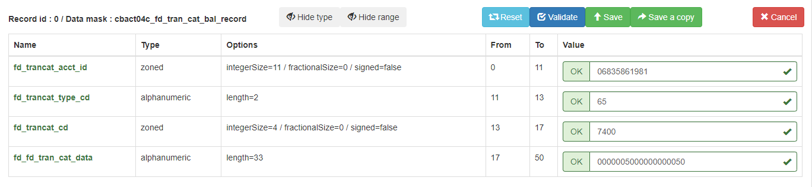
  - If saving the record to the storage is successful, a message is displayed and the page
    will switch to a read-only mode (mask items values cannot be edited anymore):

  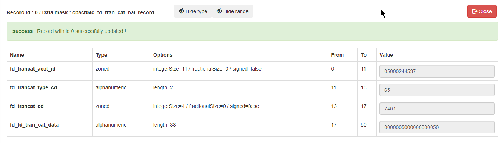
  - If for any reason the record persistence to the storage fails, an error message is
    displayed in red, providing a failure reason. The most common case of failures are that
    storing the record would lead to a key corruption (invalid or duplicate key). For an
    illustration, see the following note.
  - To exit, choose the **Close** button.

- Cancel: Ends the editing session, closes the page, and takes you back to the records
  list page.

**Note:**

- The validation mechanism only checks that the mask item value is formally compatible
  with the mask item type. For example, see this failed validation on a numeric mask
  item:

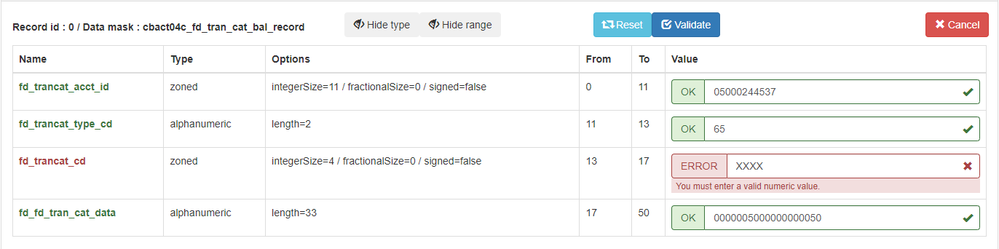

- The validation mechanism might try to auto-correct invalid input, displaying an
  informational message in blue to indicate that the value has been automatically corrected,
  according to its type. For example, inputting 7XX0 as the numeric value in the numeric
  `fd_trncat_cd` mask item:

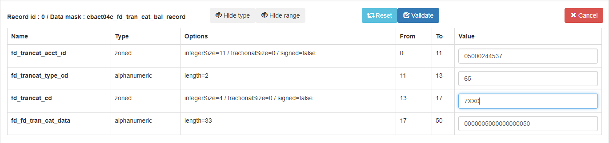

Calling validation leads to the following:

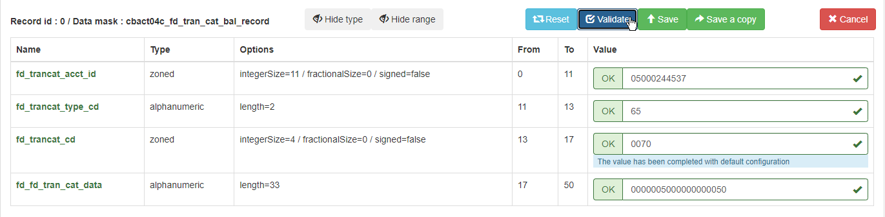

- The validation mechanism does not check whether the given value is valid in terms of key
  integrity (if any unique key is involved for the given data set). For instance, despite
  validation being successful, if provided values lead to an invalid or duplicate key
  situation, the persistence will fail and an error message will be displayed:

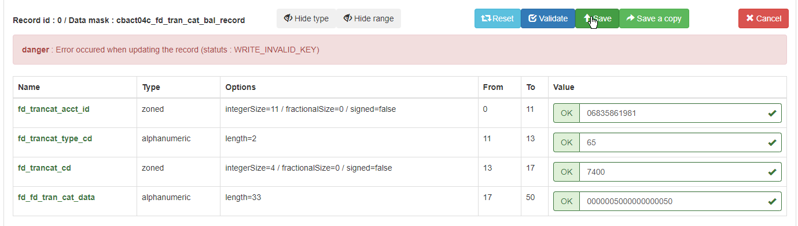

Deleting a record:

To delete a record, choose the trashcan button:

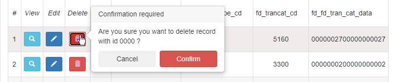

### Loading records into a data set

To loading records into a data set, choose **Actions**, then choose
**Load**.

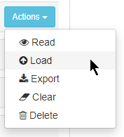

A window with load options appears.

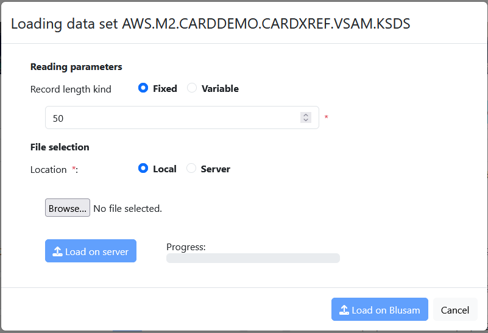

At first, both the **Load on server** and **Load on
Blusam** buttons are disabled.

Reading parameters:

- Record length kind:
  - Fixed or Variable record length: use the radio-button to specify whether the legacy
    data set export uses fixed length records or variable length records (the records are
    expected to start with RDW bytes). If you choose Fixed, the record length must be
    specified (in bytes) as a positive integer value in the input field. The value should be
    pre-filled by the information coming from the data set. If you choose Variable, the given
    input field disappears.
  - File selection:
    - Local: choose the data set file from your local computer, using the file selector
      below (Note: the file selector uses your browser's locale for printing its messages --
      here in french, but it might look different on your side, which is expected). After you
      make the selection, the window is updated with the data file name and the
      **Load on server** button is enabled:

    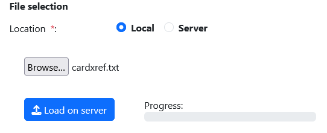

    Choose **Load on server**. After the progress bar reaches its
    end, the **Load on Blusam** button gets enabled:

    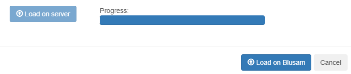

    To complete the load process to the Blusam storage, choose the **Load on
    Blusam**. Otherwise, choose **Cancel**. If you choose to
    go on with the load process, a notification will appear in the lower right corner after
    the loading process is completed:

    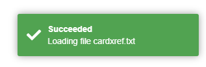
    - Server: choosing this option makes an input field appear while the **Load
      on server** button disappears. The input field is where you must specify the
      path to the data set file on the Blusam server (this assumes that you have transferred
      the given file to the Blusam server first). After you specify the path, **Load
      on Blusam** gets enabled:

    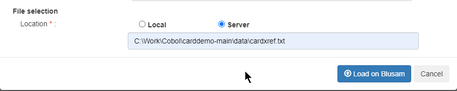

    To complete the loading process, Choose **Load on Blusam**.
    Otherwise, choose **Cancel**. If you choose to proceed with the
    loading, a notification appears after the loading process is complete. The notification
    is different from the load from the browser as it displays the data file server path
    followed by the words **from server**:

    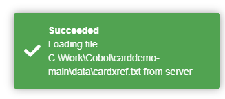

### Exporting records from a data set

To export data set records, choose **Actions** in the current data set
row, then choose **Export**:

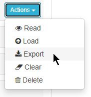

The following pop-up window appears.

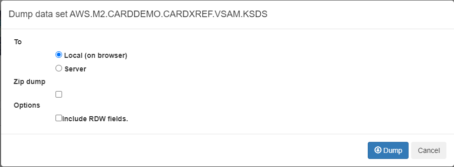

Options:

**To** : a radio button choice, to pick the export
destination, either as a download in the browser (**Local (on
browser)**) or to a given folder on the **Server**
hosting the BAC application. If you choose to export using the **Server** choice, a new input field will be displayed:

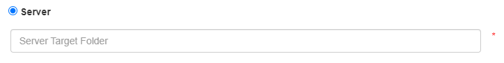

As the red asterisk on the right of the input field indicates, it is mandatory to provide
a valid folder location on the server (the Dump button will be inactive while no folder
location has been provided).

To export to the server, you must have the sufficient access rights for the server file
system, if you plan to manipulate the exported data set file after the export.

**Zip dump**: a checkbox that produces a zipped archive
instead of a raw file.

**Options**: To include a Record Descriptor Word (RDW) at the
beginning of each record in the exported data set in the case of variable length record data
set, choose **Include RDW fields**.

To launch the data set export process, choose **Dump**. If you choose
to export to browser, check the download folder for the export data set file. The file will
have the same name as the data set:

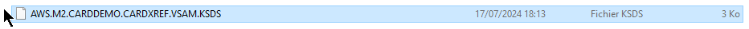

**Note:**

- For KSDS, the records will exported following the primary key order.
- For ESDS and RRDS, the records will be exported following the RBA (Relative Byte
  Address) order.
- For all data sets kinds, records will be exported as raw binary arrays (no conversion
  of any kind happening), ensuring direct compatibility with legacy platforms.

### Clearing records from a data set

To clear all records from a data set, choose **Actions**, then choose
**Clear**:

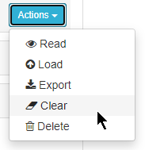

After all records are removed from a data set, the following notification appears.

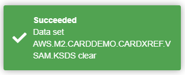

### Deleting a data set

To delete a data set, choose **Actions**, then choose
**Delete**:

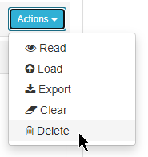

After you delete a data set, the following notification appears:

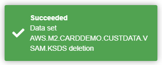

### Bulk operations

Three bulk operations are available on data sets:

- Export
- Clear
- Delete

Bulk operations can only be applied to a selection of data sets (at least one data set
needs to be selected); selecting data sets is done through ticking selection checkboxes on the
left of data sets rows, in the data sets list table. Selecting at least one data set will
enable the Bulk Actions drop down list:

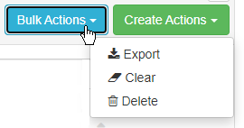

Apart from the fact that the given actions apply on a selection of data sets rather than
a single one, the actions are similar to those described above, so please refer to dedicated
actions documentation for details. The pop-up windows text contents will be slightly different
to reflect the bulk nature. For instance, when trying to delete several data sets, the pop-up
window will look like:

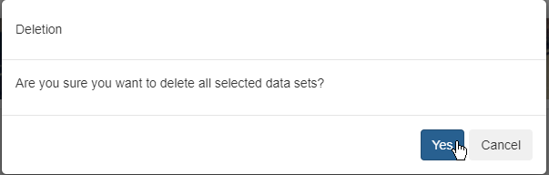

## Creating operations

### Create a single data set

Choose **Actions**, then choose **Create single data
set**:

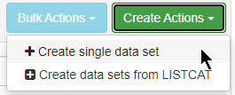

The data set creation form will then be displayed as a pop-up window:

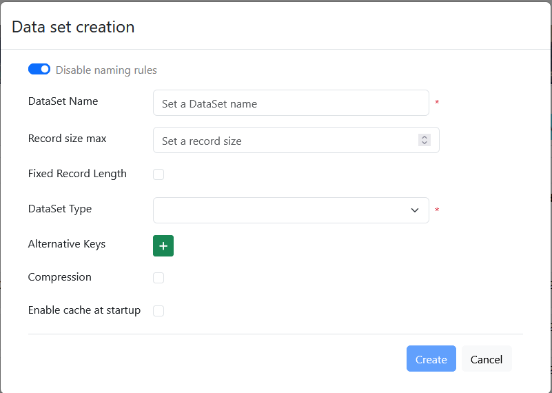

You can specify the following attributes for the data set definition:

- Enabling and disabling naming rules: Use the 'Disable naming rules / Enable naming
  rules' toggle widget to disable and enable data set naming conventions. We recommend that you
  leave the toggle on the default value, with enabled data set naming rules (the toggle widget
  should display "Disable naming rules"):

- Data Set name: The name for the data set. If you specify a name that is already in use,
  the following error message appears.

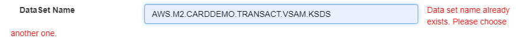

The name must also respect the naming convention if it is enabled:

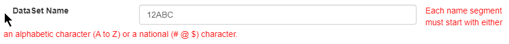

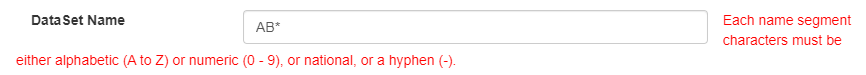

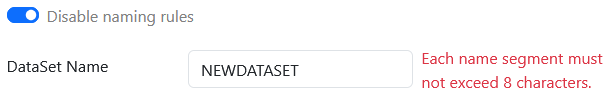

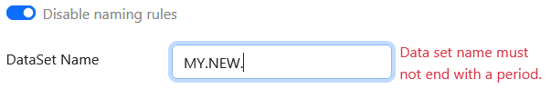

- Record size max: This must be a positive integer representing the record size for a data
  set with fixed-length records. You can leave it blank for data sets with variable-length
  records .
- Fixed length record: A check box to specify whether the record length is fixed or
  variable. If selected, the data set will have fixed-length records, otherwise the record
  length will be variable.

When you import legacy data to a variable length records data set, the provided legacy
records must contain the Record Descriptor Word (RDW) that gives the length of each
record.

- Data set Type: A drop-down list for specifying the current data set type. The following
  types are supported.

      + ESDS
      + LargeESDS
      + KSDS

  For KSDS, you must specify the primary key:

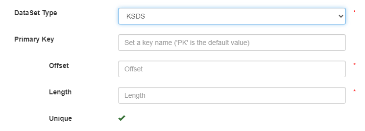

For the primary key, specify the following:

    + Name: This field is optional. The default is `PK`.
    + Offset: The 0-based offset of the primary key within the record. The offset must be a
     positive integer. This field is required.
    + Length: The length of the primary key. This length must be a positive integer. This
     field is required.

For KSDS and ESDS, you can optionally define a collection of alternate keys, by
choosing the Plus button in front of the Alternate Keys label. Each time you choose that
button, a new alternate key definition section appears in the data set creation form:

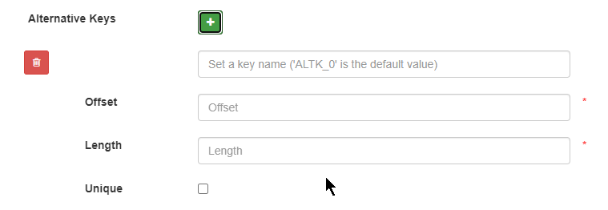

For each alternative key, you need to provide:

    + Name: This field is optional. The default value is `ALTK_#`,
     where # represents an auto-incremented counter that starts at 0.
    + Offset: The 0-based offset of the alternative key within the record. Must be a
     positive integer. This field is required.
    + Length: The length of the alternative key. This length must be a positive integer.
     This field is required.
    + Unique: A checkbox to indicate whether the alternative key will accept duplicate
     entries. If selected, the alternative key will be defined as unique (NOT accepting
     duplicate key entries). This field is required.

To remove the alternate key definition, use the trashcan button on the left.

- Compression: A checkbox to specify whether compression will be used to store the data
  set.
- Enable cache at startup: A checkbox to specify whether the data set should be loaded
  into cache at application startup.

After you specify the attribute definitions, choose **Create** to
proceed:

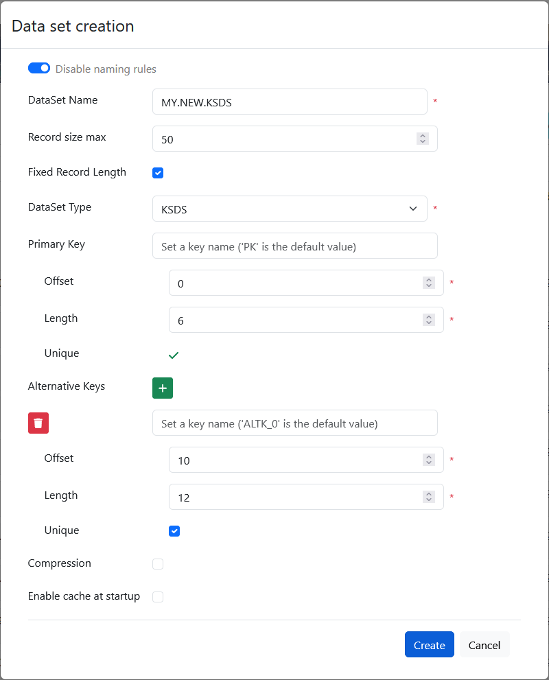

The creation window will be closed and the home page showing the list of data sets will be
displayed. You can view the details of the newly created data set.

### Create a single data set in Multi-schema mode

A data set can be created in a Multi-schema mode by prefixing the data set name with the
schema name followed by a pipe (|) symbol (e.g.,
`schema1|AWS.M2.CARDDEMO.ACCTDATA.VSAM.KSDS`).

###### Note

The Schema used for creating the data set should be specified in the `application-main.yml`
configuration. For more information, see [Multi-schema configuration properties](ba-shared-blusam.md#ba-shared-blusam-configuration-multi-schema "ba-shared-blusam.md#ba-shared-blusam-configuration-multi-schema") .

If no schema prefix is provided, the data set will get created in the default schema
specified in the Blusam datasource URL in [Blusam Datasource configuration](ba-shared-blusam.md#ba-shared-blusam-configuration-multi-schema "ba-shared-blusam.md#ba-shared-blusam-configuration-multi-schema").
If no schema is specified in the Blusam datasource URL, then 'public' schema is used by
default.

###### Note

In Multi-schema mode, BAC console displays the schema information of the data set in the
first column.

### Create data sets from

LISTCAT

This feature makes it possible to take advantage of the LISTCAT JSON files created during
the BluAge transformation process using BluInsights Transformation Center as the result of
parsing LISTCAT export from the legacy platforms: LISTCAT exports are parsed and transformed
into JSON files that hold the data set definitions (names, data set type, keys definitions, and
whether the record length is fixed or variable).

Having the LISTCAT JSON files makes it possible to create data sets directly without
having to manually enter all the information required for data sets. You can also create a
collection of data sets directly instead of having to create them one by one.

If no LISTCAT JON file is available for your project (for example, because no LISTCAT
export file was available at transformation time), you can always manually create one, provided
you adhere to the LISTCAT JSON format detailed in the appendix.

From the Create Actions drop-down list, choose **Create data sets from
LISTCAT**.

The following dedicated page will be displayed:

At this stage, the **Load** button is disabled, which is
expected.

Use the radio buttons to specify how you want to provide the LISTCAT JSON files. There are
two options:

- You can use your browser to upload the JSON files.
- You can select the JSON files from a folder location on the server. To choose this
  option, you must first copy the JSON files to the given folder path on the server with proper
  access rights.

###### To use JSON files on the server

1. Set the folder path on the server, pointing at the folder containing the LISTCAT JSON
   files:

 2. Choose the **Load** button. All recognized data set definitions will
be listed in a table:

Each row represents a data set definition. You can use trashcan button to remove a data
set definition from the list.

###### Important

The removal from the list is immediate, with no warning message. 3. The name on the left is a link. You can choose it to show or hide the details of the
data set definition, which is editable. You can freely modify the definition, starting on the
basis of the parsed JSON file.

 4. To create all data sets, choose **Create**. All data sets will be
created, and will be displayed on the data sets results page. The newly created data sets
will all have 0 records.

###### To upload files to the server

1. This option is similar to using the files from the server folder path, but in this case
   you must first upload the files using the file selector. Select all files to upload from your
   local machine, then choose **Load on server**.

 2. When the progress bar reaches the end, all files have been successfully uploaded to the
server and the **Load** button is enabled. Choose the
**Load** button and use the discovered data set definitions as explained
previously.
