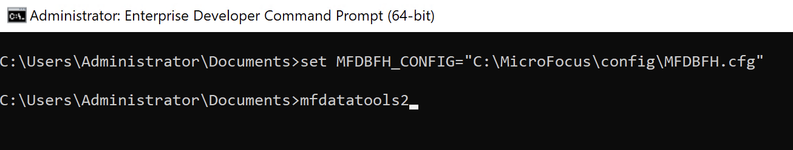
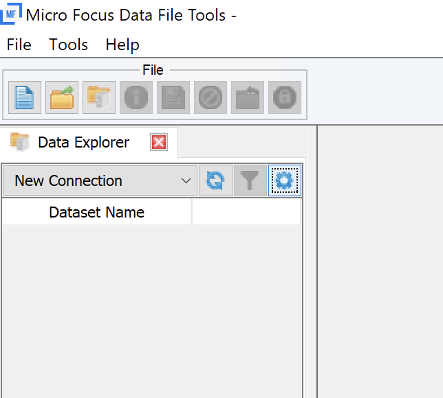
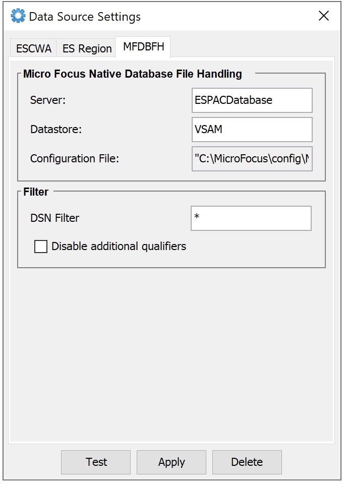
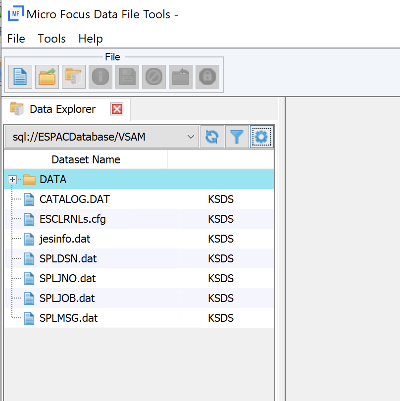
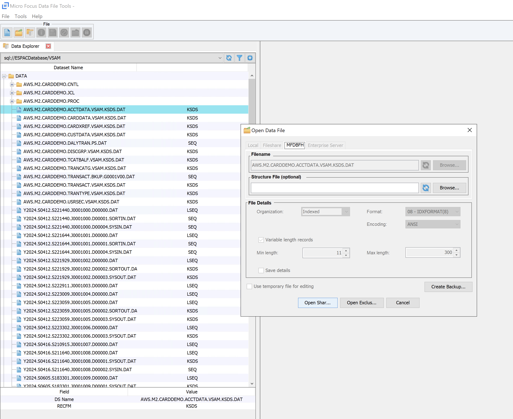
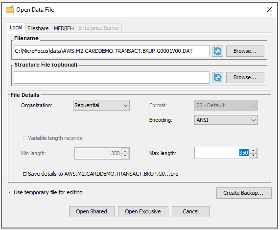

AWS Mainframe Modernization Service (Managed Runtime Environment experience) will no longer be open to new customers starting on November 7, 2025. If you would like to use the service, please sign up prior to November 7, 2025. For capabilities similar to AWS Mainframe Modernization Service (Managed Runtime Environment experience) explore AWS Mainframe Modernization Service (Self-Managed Experience). Existing customers can continue to use the service as normal. For more information, see
[AWS Mainframe Modernization availability change](mainframe-modernization-availability-change.md "mainframe-modernization-availability-change.md").

# Edit data sets using Rocket Software (formerly Micro Focus) Data File Tools

in Enterprise Developer

You can view and edit data sets in AWS Mainframe Modernization using the Rocket Software runtime for any migrated data
sets.
The steps in this document will guide you through the process of accessing data sets
using Data File Tools.
This allows you to view and edit the migrated data sets as
needed.

###### Topics

- [Prerequisites](#edit-datasets-m2.prereq "#edit-datasets-m2.prereq")
- [Launch Rocket Software(formerly Micro Focus) Data File
  Tools](#edit-datasets-m2-launch "#edit-datasets-m2-launch")
- [Edit VSAM data sets stored in the MFDBFH
  database](#edit-datasets-m2-vsam "#edit-datasets-m2-vsam")
- [Edit non-VSAM data sets stored in the MFDBFH
  database](#edit-datasets-m2-nonvsam "#edit-datasets-m2-nonvsam")
- [Edit VSAM and non-VSAM data sets stored in the
  File System (EFS/FSx)](#edit-datasets-m2-open "#edit-datasets-m2-open")

## Prerequisites

Before you start, you must have an application deployed with the data sets
imported
under the AWS Mainframe Modernization service using the Rocket Software engine.

To continue with editing the data sets, you must complete the Step 1, Step 2,
and
(optionally) Step 3 from the [View data sets as tables and columns in Rocket Enterprise Developer (formerly
Micro Focus Enterprise Developer)](view-datasets-tables-m2.md "view-datasets-tables-m2.md") page
to
configure the ODBC connection, and Micro Focus datastore (that is, `MFDBFH`).

###### Important

This guide assumes that you are using Amazon Aurora Postgres as Micro Focus datastore
(`MFDBFH`)
to store your application data.

## Launch Rocket Software(formerly Micro Focus) Data File

Tools

After completing the prerequisites, you launch the Micro Focus Data File Tools by setting up
the `MFDBFH_CONFIG` environment variable to access the data sets stored in
the database (`MFDBFH`).

To do this,

1. Log in to the Micro Focus Enterprise Developer desktop, and launch the **Enterprise Developer
   command prompt (64-bit)** from the **Start
   Menu**.
2. Set the `MFDBFH_CONFIG` environment variable with the full path to
   your `MFDBCH.cfg` file.

```
set MFDBFH_CONFIG="C:\MicroFocus\config\MFDBFH.cfg"
```

3. Launch Micro Focus Data File Tools from the Enterprise Developer command line using the following
   command.

```
mfdatatools2
```



This opens the Micro Focus Data File Tools in a separate window.

## Edit VSAM data sets stored in the MFDBFH

database

Once you launch the Micro Focus Data File Tools, you open a VSAM data set that is stored in
the Micro Focus datastore.

To do this,

1. From the **File menu** in the Micro Focus Data File
   Tools window, choose **Data Explorer**.
2. In the Data Explorer section, choose **Settings**
   (gear icon) to configure a new connection. This opens a **Data Source Settings** window.

 3. In the Data Source Settings window, choose the **MFDBFH** tab, and enter the following values:

    * Server: `ESPACDatabase`
    * Datastore: `VSAM`

Choose **Apply** to save the
configuration.



The Data Explorer now shows all data sets that are stored in `MFDBFH`.

 4. Expand the relative path `DATA` and double click on the VSAM data
set you want to open. 5. In the **Open Data File** window, choose
**Open Shared** or **Open
Exclusive** to open the data set.



You can now view or edit the open data set.

## Edit non-VSAM data sets stored in the MFDBFH

database

If you want to edit non-VSAM data sets, you open a non-VSAM data set that is stored in
the Micro Focus datastore.

To do this,

1. From the Enterprise Developer command prompt (64-bit) run the `dbfhdeploy data
extract` command to download the non-VSAM data set to your local file
   system.

###### Note

Before running this command, make sure you have set the `MFDBFH_CONFIG` environment
variable with the full path to your `MFDBFH.cfg` file.

```
dbfhdeploy data extract sql://ESPACDatabase/VSAM/AWS.M2.CARDDEMO.TRANSACT.BKUP.G0001V00.DAT?folder=/DATA C:\MicroFocus\data\AWS.M2.CARDDEMO.TRANSACT.BKUP.G0001V00.DAT
```

2. Launch Micro Focus Data File Tools from the **Start
   Menu**.
3. From the File Menu of Micro Focus Data File Tools, choose **Open**, and then choose **Data
   File**.
4. In the Open Data File window, browse the downloaded data set in your local
   file system. Edit the **File Details** as required.
   Then choose **Open Shared** or **Open Exclusive** to open the data set.



You can now view or edit the open data set.

The edited or updated data sets can be imported back to the Micro Focus datastore using steps
in [Import data sets for AWS Mainframe Modernization applications](applications-m2-dataset.md "applications-m2-dataset.md") or by using [The dbfhdeploy Command Line Utility](https://www.microfocus.com/documentation/enterprise-developer/ed90/ED-Eclipse/GUID-2A16851F-E475-42C9-B024-37567006B86D.html "https://www.microfocus.com/documentation/enterprise-developer/ed90/ED-Eclipse/GUID-2A16851F-E475-42C9-B024-37567006B86D.html").

## Edit VSAM and non-VSAM data sets stored in the

File System (EFS/FSx)

You can also open a data set stored in a file system.

To do this,

1. Mount the EFS/FSx file system in on the Enterprise Developer EC2 instance.
2. Use the Micro Focus Data File Tools to browse, and open the data sets from the file
   system.
