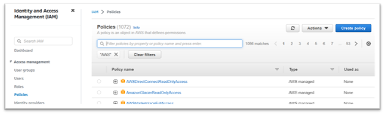
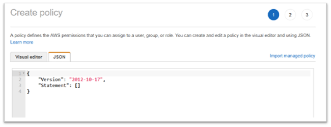
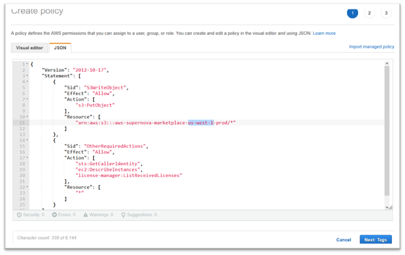
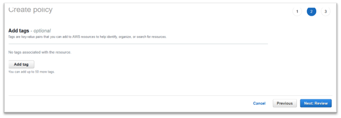
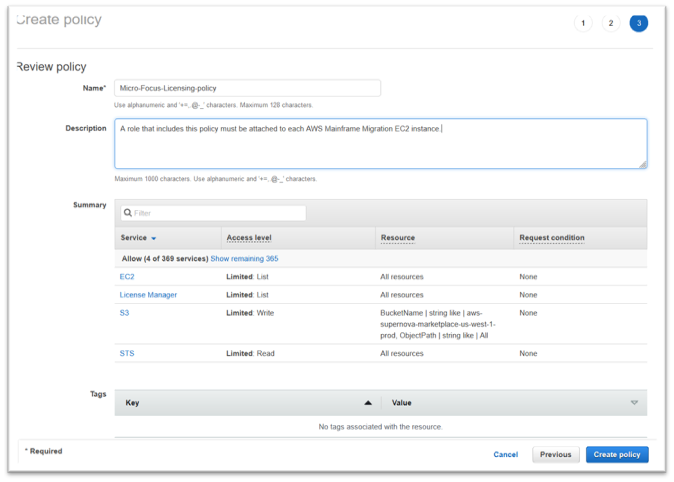
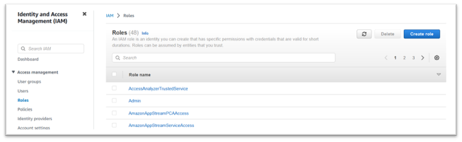
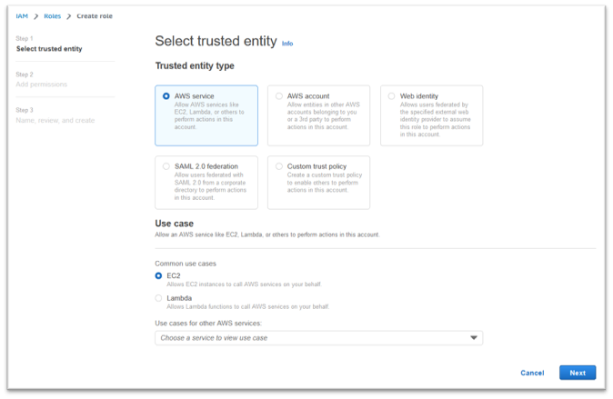
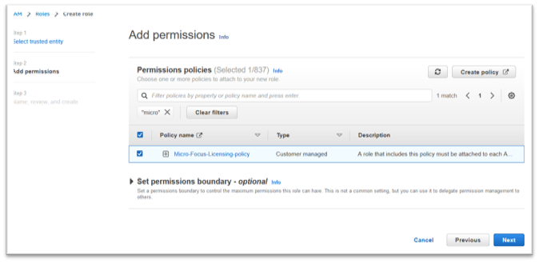
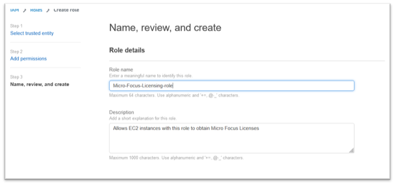
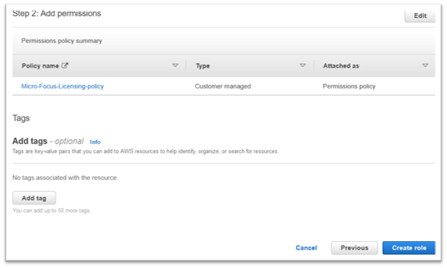

AWS Mainframe Modernization Service (Managed Runtime Environment experience) is no longer open to new customers. For
capabilities similar to AWS Mainframe Modernization Service (Managed Runtime Environment experience) explore AWS Mainframe Modernization Service (Self-Managed
Experience). Existing customers can continue to use the service as normal. For more information, see [AWS Mainframe Modernization
availability change](mainframe-modernization-availability-change.md "mainframe-modernization-availability-change.md").

# Create the AWS Identity and Access Management role

Create an AWS Identity and Access Management policy and role to be used by the AWS Mainframe Modernization Amazon EC2 instances. Creating the
role through the IAM console will create an associated instance profile of the same name.
Assigning this instance profile to the Amazon EC2 instances allows Rocket Software Licenses to be assigned. For
more information on instance profiles, see [Using an IAM role to grant
permissions to applications running on Amazon EC2 instances](../../../IAM/latest/UserGuide/id_roles_use_switch-role-ec2.md "../../../IAM/latest/UserGuide/id_roles_use_switch-role-ec2.md").

## Create an IAM policy

An IAM policy is created first and then attached to the role.

1. Navigate to AWS Identity and Access Management in the AWS Management Console.
2. Choose **Policies** and then **Create Policy**.

 3. Choose the **JSON** tab.

 4. Replace `us-west-1` in the following JSON with the AWS Region where the Amazon S3 endpoint was defined, then copy and paste the JSON into the policy editor.

JSON

```
`{
 "Version":"2012-10-17",
 "Statement": [
 {
 "Sid": "S3WriteObject",
 "Effect": "Allow",
 "Action": [
 "s3:PutObject"
 ],
 "Resource": [
 "arn:aws:s3:::aws-supernova-marketplace-us-west-1-prod/*"
 ]
 },
 {
 "Sid": "OtherRequiredActions",
 "Effect": "Allow",
 "Action": [
 "sts:GetCallerIdentity",
 "ec2:DescribeInstances",
 "license-manager:ListReceivedLicenses"
 ],
 "Resource": [
 "*"
 ]
 }
 ]
}`

```

###### Note

The Actions under the Sid `OtherRequiredActions` do not support resource-level permissions and must specify `*` in the resource element.

 5. Choose **Next: Tags**.

 6. Optionally enter any tags, then choose **Next: Review**. 7. Enter a name for the policy, for example “Micro-Focus-Licensing-policy”.
Optionally enter a description, for example “A role that includes this policy must be attached to each AWS Mainframe Modernization Amazon EC2 instance.”

 8. Choose **Create Policy**.

## Create the IAM role

After creating an IAM policy, you create an IAM role and attach it to the policy.

1. Navigate to IAM in the AWS Management Console.
2. Choose **Roles** and then **Create Role**.

 3. Leave **Trusted entity type** as **AWS service** and choose the **EC2** common use case.

 4. Choose **Next**. 5. Enter “Micro” into the filter and press enter to apply the filter. 6. Choose the policy that was just created, for example the “Micro-Focus-Licensing-policy”. 7. Choose **Next**.

 8. Enter the Role name, for example “Micro-Focus-Licensing-role”. 9. Replace the description with one of your own, for example “Allows Amazon EC2 instances with this role to obtain Micro Focus Licenses”.

 10. Under **Step 1: Select trusted entities** review the JSON and confirm it has the following values:

JSON

```
`{
 "Version":"2012-10-17",
 "Statement": [
 {
 "Effect": "Allow",
 "Action": [
 "sts:AssumeRole"
 ],
 "Principal": {
 "Service": [
 "ec2.amazonaws.com"
 ]
 }
 }
 ]
}`

```

###### Note

The order of the Effect, Action, and Principal are not significant. 11. Confirm that **Step 2: Add permissions** shows your Licensing policy.

 12. Choose **Create role**.

After the allowlist request is complete, continue with the following steps.
