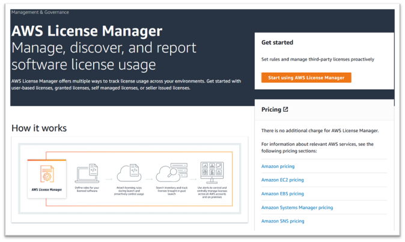
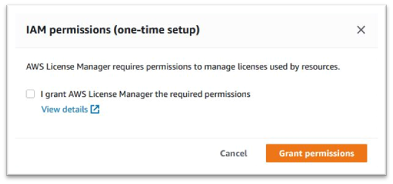

AWS Mainframe Modernization Service (Managed Runtime Environment experience) will no longer be open to new customers starting on November 7, 2025. If you would like to use the service, please sign up prior to November 7, 2025. For capabilities similar to AWS Mainframe Modernization Service (Managed Runtime Environment experience) explore AWS Mainframe Modernization Service (Self-Managed Experience). Existing customers can continue to use the service as normal. For more information, see
[AWS Mainframe Modernization availability change](mainframe-modernization-availability-change.md "mainframe-modernization-availability-change.md").

# Grant License Manager the required permissions

You need to grant permissions to your AWS License Manager to set up Rocket Software runtime engine (on
Amazon EC2).

1. Navigate to AWS License Manager in the AWS Management Console.

 2. Choose **Start using AWS License Manager**. 3. If you see the following pop-up, view the details, then choose the check-box and press **Grant Permissions**.

