AWS Mainframe Modernization Service (Managed Runtime Environment experience) is no longer open to new customers. For
capabilities similar to AWS Mainframe Modernization Service (Managed Runtime Environment experience) explore AWS Mainframe Modernization Service (Self-Managed
Experience). Existing customers can continue to use the service as normal. For more information, see [AWS Mainframe Modernization
availability change](mainframe-modernization-availability-change.md "mainframe-modernization-availability-change.md").

# Subnet or VPC with no internet access

Make these additional changes if the subnet or VPC does not have outbound Internet access.

The license manager requires access to the following AWS services:

- com.amazonaws.`region`.s3
- com.amazonaws.`region`.ec2
- com.amazonaws.`region`.license-manager
- com.amazonaws.`region`.sts
  The earlier steps defined the com.amazonaws.`region`.s3 service as a gateway endpoint.
  This endpoint needs a route table entry for any subnets without Internet access.

The additional three services will be defined as interface endpoints.

###### Topics

- [Add the Route table entry for the Amazon S3 endpoint](#mf-runtime-setup-no-access-route-table "#mf-runtime-setup-no-access-route-table")
- [Define the required security group](#mf-runtime-setup-no-access-security-group "#mf-runtime-setup-no-access-security-group")
- [Create the service endpoints](#mf-runtime-setup-no-access-endpoints "#mf-runtime-setup-no-access-endpoints")

## Add the Route table entry for the Amazon S3 endpoint

1. Navigate to **VPC** in the AWS Management Console and choose **Subnets**.
2. Choose the subnet where the Amazon EC2 instances will be created and choose the Route Table tab.
3. Note a few trailing digits of the Route table id. For example, the 6b39 in the image below.

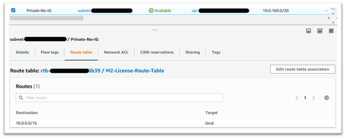 4. Choose **Endpoints** from the navigation pane. 5. Choose the endpoint created earlier and then **Manage Route tables**, either from the Route Tables tab for the endpoint, or from the Actions drop down. 6. Choose the Route table using the digits identified earlier and press Modify route tables.

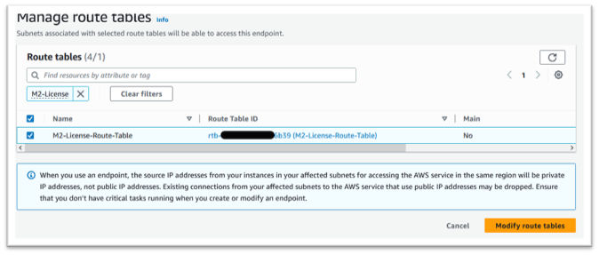

## Define the required security group

The Amazon EC2, AWS STS, and License Manager services communicate over HTTPS via port 443.
This communication is bi-directional and requires inbound and outbound rules to allow the instance to communicate with the services.

1. Navigate to Amazon VPC in the AWS Management Console.
2. Locate **Security Groups** in the navigation bar and choose **Create security group**.
3. Enter a Security group name and description, for example “Inbound-Outbound HTTPS”.
4. Press the X in the VPC selection area to **remove the default VPC**, and choose the VPC that contains the S3 endpoint.
5. Add an Inbound Rule that **allows TCP traffic on Port 443** from anywhere.

###### Note

The inbound (and outbound rules) can be restricted further by limiting the Source.
For more information, see [Control traffic to your AWS resources using security groups](../../../vpc/latest/userguide/vpc-security-groups.md "../../../vpc/latest/userguide/vpc-security-groups.md") in the _Amazon VPC User Guide_.

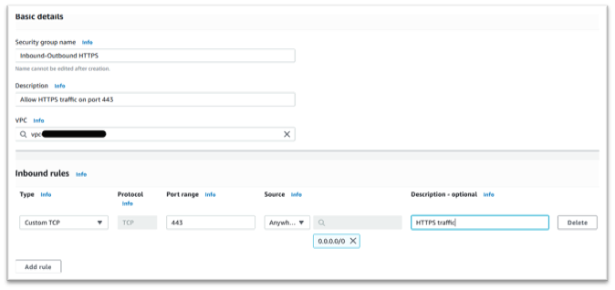 6. Press **Create security group**.

## Create the service endpoints

Repeat this process three times – once for each service.

1. Navigate to Amazon VPC in the AWS Management Console and choose **Endpoints**.
2. Press **Create endpoint**.
3. Enter a name, for example “Micro-Focus-License-EC2”, “Micro-Focus-License-STS”, or “Micro-Focus-License-Manager”.
4. Choose the **AWS Services** Service Category.

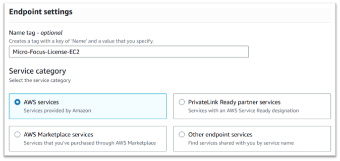 5. Under Services search for the matching Interface service which is one of:

    * “com.amazonaws.`region`.ec2”
    * “com.amazonaws.`region`.sts”
    * “com.amazonaws.`region`.license-manager”

For example:

    * “com.amazonaws.us-west-1.ec2”
    * “com.amazonaws.us-west-1.sts”
    * “com.amazonaws.us-west-1.license-manager”

6. Choose the matching Interface service.

**com.amazonaws.`region`.ec2**:

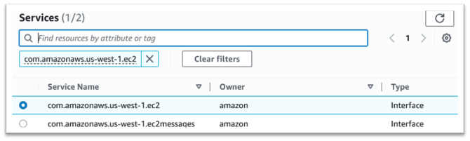

**com.amazonaws.`region`.sts:**

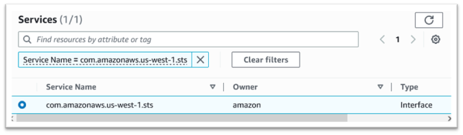

**com.amazonaws.`region`.license-manager:**

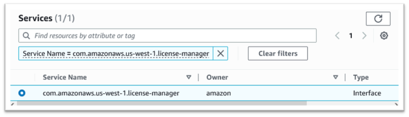 7. For VPC choose the VPC for the instance.

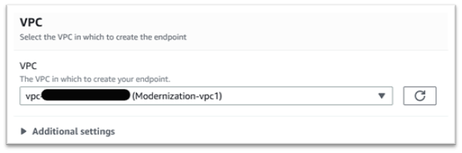 8. Choose the **Availability Zone** and the **Subnets** for the VPC.

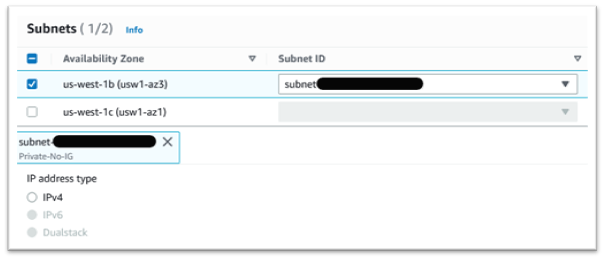 9. Choose the Security Group created earlier.

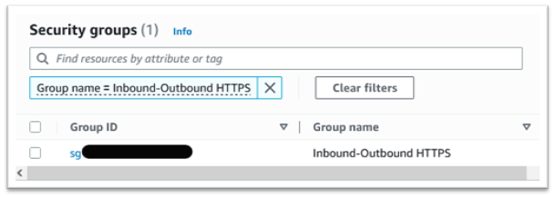 10. Under Policy choose **Full Access**.

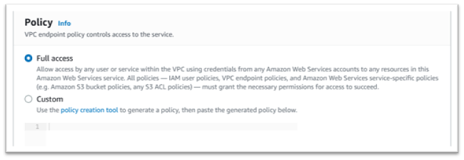 11. Choose **Create Endpoint**. 12. Repeat this process for the remaining interfaces.
