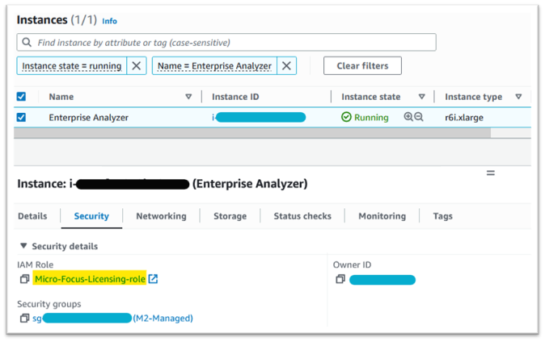

AWS Mainframe Modernization Service (Managed Runtime Environment experience) will no longer be open to new customers starting on November 7, 2025. If you would like to use the service, please sign up prior to November 7, 2025. For capabilities similar to AWS Mainframe Modernization Service (Managed Runtime Environment experience) explore AWS Mainframe Modernization Service (Self-Managed Experience). Existing customers can continue to use the service as normal. For more information, see
[AWS Mainframe Modernization availability change](mainframe-modernization-availability-change.md "mainframe-modernization-availability-change.md").

# Troubleshooting license issues for Rocket Software (formerly

Micro Focus)

This page describes how you can resolve license issues with the Rocket Software Runtime engine

- Engine: Rocket Software
- Component: Amazon EC2
  If you have trouble accessing or using the AMIs, the following information might help you.

###### Topics

- [Verify the Amazon EC2 instance has the
  IAM licensing role](#mf-runtime-setup-troubleshoot-verify-role "#mf-runtime-setup-troubleshoot-verify-role")
- [Use the reachability
  analyzer](#mf-runtime-setup-troubleshoot-reachability "#mf-runtime-setup-troubleshoot-reachability")
- [Run the license-daemon](#mf-runtime-setup-troubleshoot-license "#mf-runtime-setup-troubleshoot-license")
- [License issues with Enterprise Server or
  Enterprise Build Tools on Linux after OS patching](#mf-runtime-setup-troubleshoot-license-issues "#mf-runtime-setup-troubleshoot-license-issues")

## Verify the Amazon EC2 instance has the

IAM licensing role

This can be checked on the Security tab of the Amazon EC2 Instance Details. This can be changed
using the Security Option of the **Actions** drop down menu.



## Use the reachability

analyzer

Find the Reachability Analyzer on the AWS Network Manager Console page.

Create and analyze a path between the Amazon EC2 instance created from the AMI and the Amazon S3 VPC Endpoint.

If the Amazon EC2 Instance does not have internet access repeat the path analysis to all 4 endpoints.

For more information on the Reachability Analyzer, see [Getting started with Reachability Analyzer](../../../vpc/latest/reachability/getting-started.md "../../../vpc/latest/reachability/getting-started.md") in the Reachability Analyzer guide.

## Run the license-daemon

On Windows Enterprise Developer use the following command from a Command Prompt:

```
`“C:\Program Files (x86)\Micro Focus\Enterprise Developer\AdoptOpenJDK\bin\java” -jar "C:\Program Files (x86)\Micro Focus\Licensing\aws-license-daemon.jar"`
```

and examine the output. Ignore the SLF4J messages and look for the first exception.

On Enterprise Analyzer use the following command from a Command Prompt:

```
`"C:\Program Files (x86)\Micro Focus\AdoptOpenJDK\bin\java" -jar "C:\Program Files (x86)\Micro Focus\Licensing\aws-license-daemon.jar"`
```

and examine the output. Ignore the SLF4J messages and look for the first exception.

On Linux run:

```
`java -jar /var/microfocuslicensing/bin/aws-license-daemon.jar`
```

Ignore the SLF4J messages and look for the first exception.

For example, if the Amazon S3 resource is not available, the exception is as follows:

```

SLF4J: Failed to load class "org.slf4j.impl.StaticLoggerBinder".
SLF4J: Defaulting to no-operation (NOP) logger implementation
SLF4J: See http://www.slf4j.org/codes.html#StaticLoggerBinder for further details.

Exception in thread "main" software.amazon.awssdk.services.s3.model.S3Exception: Access Denied (Service: S3, Status Code: 403, Request ID: P6
```

The exception message indicates which resource is not available.
Compare the configuration values to those shown in this topic.

## License issues with Enterprise Server or

Enterprise Build Tools on Linux after OS patching

If you're having license issues with Enterprise Server or Enterprise Build Tools on Linux after OS
patching, update the license daemon by downloading and running a patch script. To do that,
use the following commands on the Command Prompt:

```
sudo curl https://d148y999krizvm.cloudfront.net/patch/v8/linux/patch.sh -o /var/microfocuslicensing/bin/patch.sh
sudo chmod +x /var/microfocuslicensing/bin/patch.sh
sudo /var/microfocuslicensing/bin/patch.sh
sudo ./startmfcesd.sh
```

###### Note

This patch script will also work with version 9 even if the download path is for
version 8.
