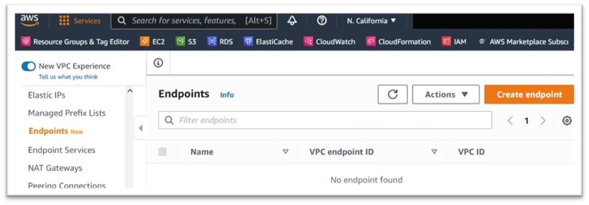
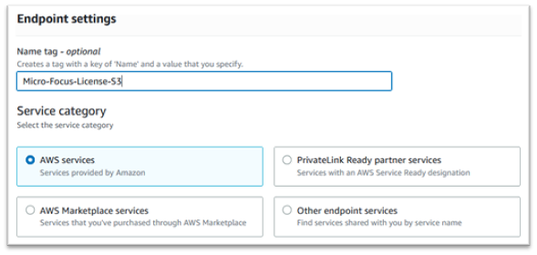
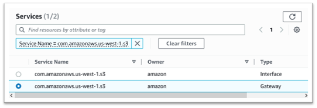
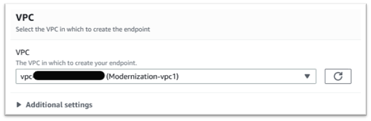
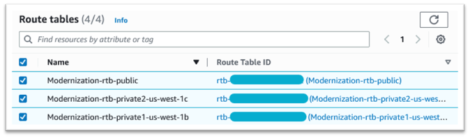
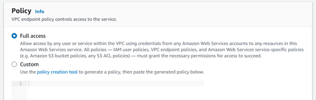

AWS Mainframe Modernization Service (Managed Runtime Environment experience) is no longer open to new customers. For
capabilities similar to AWS Mainframe Modernization Service (Managed Runtime Environment experience) explore AWS Mainframe Modernization Service (Self-Managed
Experience). Existing customers can continue to use the service as normal. For more information, see [AWS Mainframe Modernization
availability change](mainframe-modernization-availability-change.md "mainframe-modernization-availability-change.md").

# Create the Amazon VPC endpoint for Amazon S3

In this section, you create a Amazon VPC endpoint for Amazon S3 to use. Setting up this endpoint will
help you later when setting up internet access for VPC.

1. Navigate to Amazon VPC in the AWS Management Console.
2. In the navigation pane, choose **Endpoints**.
3. Choose **Create endpoint**.

 4. Enter a meaningful name tag, for example: “Micro-Focus-License-S3”. 5. Choose **AWS Services** as the Service Category.

 6. Under **Services** search for the Amazon S3 Gateway service: **com.amazonaws.[region].s3**.

For `us-west-1` this would be: `com.amazonaws.us-west-1.s3`. 7. Choose the **Gateway** service.

 8. For VPC choose the VPC you will be using.

 9. Choose all of the route tables for the VPC.

 10. Under **Policy** choose **Full Access**.

###### Note

If you decide to create a custom policy, make sure it has access to the Amazon S3 bucket
`s3://aws-supernova-marketplace-<region>-prod`. 11. Choose **Create Endpoint**.
