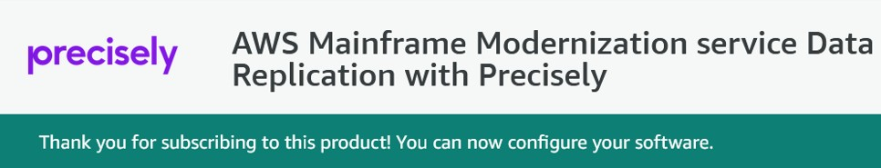

AWS Mainframe Modernization Service (Managed Runtime Environment experience) will no longer be open to new customers starting on November 7, 2025. If you would like to use the service, please sign up prior to November 7, 2025. For capabilities similar to AWS Mainframe Modernization Service (Managed Runtime Environment experience) explore AWS Mainframe Modernization Service (Self-Managed Experience). Existing customers can continue to use the service as normal. For more information, see
[AWS Mainframe Modernization availability change](mainframe-modernization-availability-change.md "mainframe-modernization-availability-change.md").

# AWS Mainframe Modernization data replication with Precisely

AWS Mainframe Modernization offers a variety of Amazon Machine Images (AMIs). These AMIs facilitate rapid
provisioning of Amazon EC2 instances, creating a tailored environment for data replication from
Mainframe systems to AWS using Precisely. This guide provides the steps required to access and use
these AMIs.

## Prerequisites

- Ensure that you have administrator access to an AWS account where you can create Amazon EC2
  instances.
- Verify that the AWS Mainframe Modernization service is available in the Region where you plan to create the Amazon EC2
  instances. See [List
  of AWS Services Available by Region](https://aws.amazon.com/about-aws/global-infrastructure/regional-product-services/ "https://aws.amazon.com/about-aws/global-infrastructure/regional-product-services/").
- Identify the Amazon Virtual Private Cloud (Amazon VPC) where the Amazon EC2 instances will
  be created.
- When creating Amazon EC2 instances in an Amazon VPC, ensure that the associated route table has an
  internet gateway or a NAT gateway.

###### Note

Successful data replication requires the AWS EC2 instance has communication access to the
AWS Marketplace. If there's a connectivity issue with the AWS Marketplace, the replication
process will fail.

## Subscribe to the Amazon Machine Image

When you subscribe to an AWS Marketplace product, you can launch an instance from the
product's AMI.

1. Sign in to the AWS Management Console and open the AWS Marketplace console at [https://console.aws.amazon.com/marketplace](https://console.aws.amazon.com/marketplace "https://console.aws.amazon.com/marketplace").
2. Choose **Manage subscriptions**.
3. Navigate to any of the following links based on your use case:
   - **Data Replication for IBM z/OS**: [https://aws.amazon.com/marketplace/pp/prodview-doe2lroefogia](https://aws.amazon.com/marketplace/pp/prodview-doe2lroefogia "https://aws.amazon.com/marketplace/pp/prodview-doe2lroefogia")
   - **Data Replication for IBM i**: [https://aws.amazon.com/marketplace/pp/prodview-iqrkflccxf7ko](https://aws.amazon.com/marketplace/pp/prodview-iqrkflccxf7ko "https://aws.amazon.com/marketplace/pp/prodview-iqrkflccxf7ko")

4. Choose **Continue to Subscribe**.
5. If the terms and conditions are acceptable, choose **Accept Terms**.
   The subscription might take a few minutes to process.
6. Wait for the thank you message to appear, as shown below. This message confirms that you
   have successfully subscribed to the product.

 7. In the left navigate pane, choose **Manage subscriptions**. This view
shows you all the subscriptions that you've subscribed to.

## Launch AWS Mainframe Modernization data replication with Precisely

1. Open the AWS Marketplace console at [https://console.aws.amazon.com/marketplace](https://console.aws.amazon.com/marketplace "https://console.aws.amazon.com/marketplace").
2. In the left navigation pane, choose **Manage subscriptions**.
3. Find the AMI that you want to launch, and choose **Launch new
   instance**.
4. Under **Region**, select the allow-listed Region.
5. Choose **Continue to launch through EC2**. This action takes you to the
   Amazon EC2 console.
6. Enter a name for the server.
7. Select an instance type that matches your project performance and cost requirements. The
   suggested starting point for instance size is `c5.2xLarge`.
8. Choose an existing key pair or create and save a new one. For information about key pairs,
   see [Amazon EC2 key pairs and Linux instances](../../../AWSEC2/latest/UserGuide/ec2-key-pairs.md "../../../AWSEC2/latest/UserGuide/ec2-key-pairs.md")
   in the Amazon EC2 User Guide.
9. Edit the network settings and choose the allow-listed VPC and appropriate subnet.
10. Choose an existing security group or create a new one. In addition to allowing SSH access
    (by default on port 22), for data replication with a Precisely server EC2 instance, it is
    typical to allow TCP traffic to its default port 2626.
11. Configure the storage for the Amazon EC2 instance.
12. Review the summary and choose **Launch instance**. For the launch to
    success, the instance type must be valid. If the launch fails, choose **Edit instance
    configuration** and choose a different instance type.
13. After you see the success message, choose **Connect to
    instance**.
14. Open the Amazon EC2 console at
    [https://console.aws.amazon.com/ec2/](https://console.aws.amazon.com/ec2/ "https://console.aws.amazon.com/ec2/").
15. In the left navigation pane, under the **Instances** menu, choose
    **Instances**.
16. In the main pane, check the status of your instance.

## Create an IAM policy

To successfully operate AWS Mainframe Modernization EC2 instances deployed via our AWS Marketplace listing, you must
configure an IAM role and policy. This specifically-tailored IAM setup is not optional; it
authorizes your Amazon EC2 instances to interact with the AWS Marketplace service. The IAM role and policy
allow AWS Mainframe Modernization to accurately record usage data, which is essential for precise billing. Failing to
implement this configuration may lead to unsuccessful data replication attempts and operational
disruptions.

1. Open the IAM console at
   [https://console.aws.amazon.com/iam/](https://console.aws.amazon.com/iam/ "https://console.aws.amazon.com/iam/").
2. In the navigation pane on the left, choose **Policies**.
3. If this is your first-time choosing **Policies**, the **Welcome
   to Managed Policies** page appears. Choose **Get Started**.
4. At the top of the page, choose **Create policy**.
5. In the **Policy** editor section, choose the **JSON**
   option.
6. Enter the following JSON policy.

JSON

```
`{
 "Version":"2012-10-17",
 "Statement": [
 {
 "Action": ["aws-marketplace:MeterUsage"],
 "Effect": "Allow",
 "Resource": "*"
 }
 ]
}`

```

## Create an IAM role

1. Open the IAM console at
   [https://console.aws.amazon.com/iam/](https://console.aws.amazon.com/iam/ "https://console.aws.amazon.com/iam/").
2. In the navigation pane, choose **Roles**, and then choose
   **Create role**.
3. In the **Trusted entity type** section, choose **AWS
   service**.
4. In the **Use case** section, under **Service or use
   case**, choose **Amazon EC2**.
5. Choose **Next**.
6. In the list of policies, select **Customer managed** from the
   **Filter by Type** drop-down and enter the name of the policy that you
   created. Select the check box next to the name of the policy.
7. Choose **Next**.
8. Enter a name and, optionally, a description for the role.
9. Review the trust policy and permissions, and then choose **Create
   role**.

## Attach the IAM role to the Amazon EC2 instance

1. Open the Amazon EC2 console at
   [https://console.aws.amazon.com/ec2/](https://console.aws.amazon.com/ec2/ "https://console.aws.amazon.com/ec2/").
2. In the navigation pane, choose **Instances**.
3. Select your Amazon EC2 instance.
4. From the **Actions** menu, choose **Security**, and then
   choose **Modify IAM role**.
5. Select the role to attach to your instance, and then choose **Update IAM
   role**.

For more information regarding getting started with AWS Data replication for IBM i, see
[Data replication overview](https://help.precisely.com/r/t/AMM-0002/2023-12-31/AWS-Mainframe-Modernization/pub/Latest/en-US/AWS-Mainframe-Modernization-Data-Replication-for-IBM-i/Data-replication-overview "https://help.precisely.com/r/t/AMM-0002/2023-12-31/AWS-Mainframe-Modernization/pub/Latest/en-US/AWS-Mainframe-Modernization-Data-Replication-for-IBM-i/Data-replication-overview").
