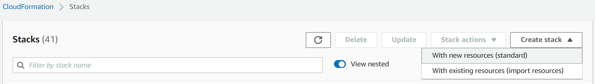
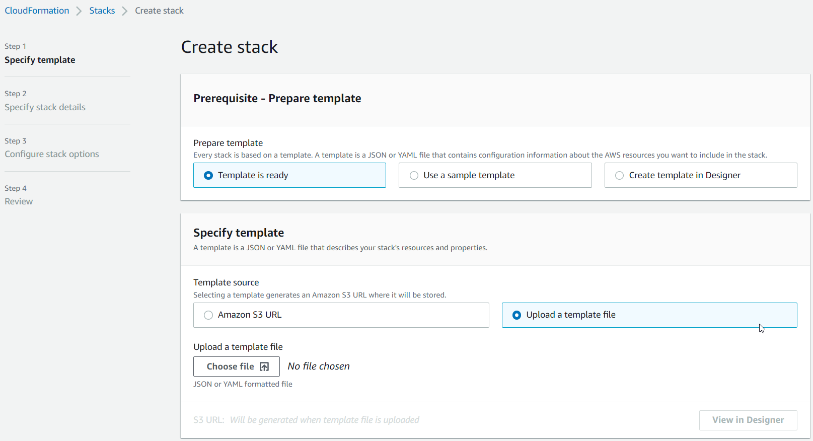
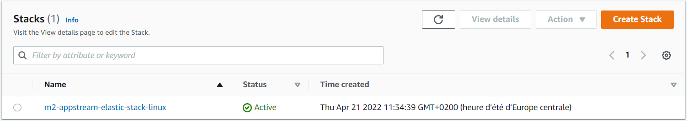

AWS Mainframe Modernization Service (Managed Runtime Environment experience) will no longer be open to new customers starting on November 7, 2025. If you would like to use the service, please sign up prior to November 7, 2025. For capabilities similar to AWS Mainframe Modernization Service (Managed Runtime Environment experience) explore AWS Mainframe Modernization Service (Self-Managed Experience). Existing customers can continue to use the service as normal. For more information, see
[AWS Mainframe Modernization availability change](mainframe-modernization-availability-change.md "mainframe-modernization-availability-change.md").

# Tutorial: Set up AppStream 2.0 for AWS Blu Age Developer IDE

AWS Mainframe Modernization provides several tools through Amazon AppStream 2.0. AppStream 2.0 is a fully managed, secure
application streaming service that lets you stream desktop applications to users without rewriting
applications. AppStream 2.0 provides users with instant access to the applications that they need with a
responsive, fluid user experience on the device of their choice. Using AppStream 2.0 to host runtime engine-specific tools gives customer application teams the ability to use the tools directly
from their web browsers, interacting with application files stored in either Amazon S3 buckets or CodeCommit
repositories.

For information about browser support in AppStream 2.0 see [System
Requirements and Feature Support (Web Browser)](../../../appstream2/latest/developerguide/requirements-and-features-web-browser-admin.md "../../../appstream2/latest/developerguide/requirements-and-features-web-browser-admin.md") in the _Amazon AppStream 2.0 Administration Guide_. If you have issues when you are using
AppStream 2.0 see [Troubleshooting AppStream
2.0 User Issues](../../../appstream2/latest/developerguide/troubleshooting-user-issues.md "../../../appstream2/latest/developerguide/troubleshooting-user-issues.md") in the _Amazon AppStream 2.0 Administration Guide_.

This document describes how to set up AWS Blu Age Developer IDE on an AppStream 2.0 fleet.

###### Topics

- [Prerequisites](#set-up-aas2-ba-prereqs "#set-up-aas2-ba-prereqs")
- [Step 1: Create an Amazon S3 bucket](#set-up-aas2-ba-create-bucket "#set-up-aas2-ba-create-bucket")
- [Step 2: Attach a policy to the S3
  bucket](#set-up-aas2-ba-create-bucket-policy "#set-up-aas2-ba-create-bucket-policy")
- [Step 3: Upload files to the Amazon S3 bucket](#set-up-aas2-ba-upload "#set-up-aas2-ba-upload")
- [Step 4: Download AWS CloudFormation templates](#set-up-aas2-ba-download-templates "#set-up-aas2-ba-download-templates")
- [Step 5: Create the fleet with AWS CloudFormation](#set-up-appstream-ba-cfn "#set-up-appstream-ba-cfn")
- [Step 6: Access an instance](#set-up-appstream-ba-access "#set-up-appstream-ba-access")
- [Clean up resources](#set-up-appstream-ba-clean "#set-up-appstream-ba-clean")

## Prerequisites

For first time users, do this:

1. Navigate to the AppStream 2.0 console at [https://console.aws.amazon.com/appstream2/home](https://console.aws.amazon.com/appstream2/home "https://console.aws.amazon.com/appstream2/home").
2. Choose **Get Started**.
3. Choose **Skip**.

###### Important

Amazon AppStream 2.0 uses IAM roles to manage your AppStream 2.0 resources and AWS will create
these roles when you do this.

Then, download the [archive file](https://d3lkpej5ajcpac.cloudfront.net/appstream/bluage/appstream-bluage-developer-ide.zip "https://d3lkpej5ajcpac.cloudfront.net/appstream/bluage/appstream-bluage-developer-ide.zip") that contains the artifacts that you need to set up AWS Blu Age Developer IDE
under AppStream 2.0.

###### Note

This is a large file. If you have problems with the operation timing out, we recommend
using an Amazon EC2 instance to improve the upload and download performance. For more
information on launching and connecting to an Amazon EC2 instance, see [Get started with Amazon EC2](../../../AWSEC2/latest/UserGuide/EC2_GetStarted.md "../../../AWSEC2/latest/UserGuide/EC2_GetStarted.md").

## Step 1: Create an Amazon S3 bucket

Create an Amazon S3 bucket in the same AWS Region as the AppStream 2.0 fleet that you will create.
This bucket will contain the artifacts that you need to complete this tutorial. For more
information on buckets, see [Creating a bucket](../../../AmazonS3/latest/userguide/create-bucket-overview.md "../../../AmazonS3/latest/userguide/create-bucket-overview.md").

## Step 2: Attach a policy to the S3

bucket

Attach the following policy to the bucket that you create for this tutorial. For more
information on attaching a policy to S3 bucket, see [Adding a bucket policy](../../../AmazonS3/latest/userguide/add-bucket-policy.md "../../../AmazonS3/latest/userguide/add-bucket-policy.md").

Make sure to replace `amzn-s3-demo-bucket` with the actual name of the bucket
that you create.

JSON

```
`{
 "Version":"2012-10-17",
 "Statement": [{
 "Sid": "AllowAppStream2.0ToRetrieveObjects",
 "Effect": "Allow",
 "Principal": {
 "Service": "appstream.amazonaws.com"
 },
 "Action": "s3:GetObject",
 "Resource": "arn:aws:s3:::`amzn-s3-demo-bucket`/*"
 }]
}`

```

## Step 3: Upload files to the Amazon S3 bucket

Unzip the files you downloaded in the Prerequisite and upload the
`appstream` folder to your bucket. Uploading this folder creates the
correct structure in your bucket. For more information, see [Uploading objects](../../../AmazonS3/latest/userguide/upload-objects.md "../../../AmazonS3/latest/userguide/upload-objects.md") in the
_Amazon S3 User Guide_.

## Step 4: Download AWS CloudFormation templates

Download the following AWS CloudFormation templates. You need these templates to create and populate the
AppStream 2.0 fleet.

- [cfn-m2-appstream-elastic-fleet-linux.yaml](https://d3lkpej5ajcpac.cloudfront.net/appstream/bluage/developer-ide/CloudFormation/cfn-m2-appstream-elastic-fleet-linux.yaml "https://d3lkpej5ajcpac.cloudfront.net/appstream/bluage/developer-ide/CloudFormation/cfn-m2-appstream-elastic-fleet-linux.yaml")
- [cfn-m2-appstream-bluage-dev-tools-linux.yaml](https://d3lkpej5ajcpac.cloudfront.net/appstream/bluage/developer-ide/CloudFormation/cfn-m2-appstream-bluage-dev-tools-linux.yaml "https://d3lkpej5ajcpac.cloudfront.net/appstream/bluage/developer-ide/CloudFormation/cfn-m2-appstream-bluage-dev-tools-linux.yaml")
- [cfn-m2-appstream-bluage-shared-linux.yaml](https://d3lkpej5ajcpac.cloudfront.net/appstream/bluage/developer-ide/CloudFormation/cfn-m2-appstream-bluage-shared-linux.yaml "https://d3lkpej5ajcpac.cloudfront.net/appstream/bluage/developer-ide/CloudFormation/cfn-m2-appstream-bluage-shared-linux.yaml")
- [cfn-m2-appstream-chrome-linux.yaml](https://d3lkpej5ajcpac.cloudfront.net/appstream/bluage/developer-ide/CloudFormation/cfn-m2-appstream-chrome-linux.yaml "https://d3lkpej5ajcpac.cloudfront.net/appstream/bluage/developer-ide/CloudFormation/cfn-m2-appstream-chrome-linux.yaml")
- [cfn-m2-appstream-eclipse-jee-linux.yaml](https://d3lkpej5ajcpac.cloudfront.net/appstream/bluage/developer-ide/CloudFormation/cfn-m2-appstream-eclipse-jee-linux.yaml "https://d3lkpej5ajcpac.cloudfront.net/appstream/bluage/developer-ide/CloudFormation/cfn-m2-appstream-eclipse-jee-linux.yaml")
- [cfn-m2-appstream-pgadmin-linux.yaml](https://d3lkpej5ajcpac.cloudfront.net/appstream/bluage/developer-ide/CloudFormation/cfn-m2-appstream-pgadmin-linux.yaml "https://d3lkpej5ajcpac.cloudfront.net/appstream/bluage/developer-ide/CloudFormation/cfn-m2-appstream-pgadmin-linux.yaml")

## Step 5: Create the fleet with AWS CloudFormation

In this step, you use the `cfn-m2-appstream-elastic-fleet-linux.yaml`
AWS CloudFormation template to create an AppStream 2.0 fleet and stack to host the AWS Blu Age Developer IDE. After you
create the fleet and stack, you will run the other AWS CloudFormation templates you downloaded in the
previous step to install the Developer IDE and other required tools.

1. Navigate to AWS CloudFormation in the AWS Management console, and choose
   **Stacks**.
2. In **Stacks**, choose **Create stack** and
   **With new Resources (standard)**:

 3. In **Create stack**, choose **Choose an existing
template** and **Upload a template file**:

 4. Choose **Choose file**, and navigate to file
`cfn-m2-appstream-elastic-fleet-linux.yaml`. Choose
**Next**. 5. In **Specify stack details**, provide the following
information:

    * A name for the stack.
    * Your default security group and two subnets of that security group.


    ###### Note

    The two subnets of security group need to be in different availability zones.

6. Choose **Next**.
7. Navigate down the page and choose **I acknowledge that AWS CloudFormation might create
   IAM resources with custom names.**.
8. Choose **Next**.
9. Review the details, and choose **Submit**.
10. After you create the fleet, create CloudFormation stacks with all the other downloaded
    templates to finish setting up the applications. Make sure to update
    **BucketName** each time to point to the correct S3 bucket. You can
    edit the **BucketName** in the CloudFormation console. Alternatively, you can
    edit the template files directly and update the `S3Bucket` property.

###### Note

The downloaded templates expect to find assets in an S3 bucket with a folder structure
called `appstream/bluage/developer-ide/`. The bucket must be in the
same AWS Region as the fleet that you created.

###### Important

Run all the CloudFormation scripts downloaded in step 4 to set up your application
correctly.

## Step 6: Access an instance

After you create and start the fleet, you can create a temporary link to access the fleet
through the native client.

1. Navigate to AppStream 2.0 in the AWS Management Console and choose the previously created stack:

 2. On the stack details page, choose the stack, and then choose **Associate
fleet**. 3. In the prompt, choose the fleet you created and started previously. 4. Choose **Associate**. 5. Choose the associated stack and from the **Actions** menu, choose
**Create Streaming URL**, enter an arbitrary User ID and a URL
expiration time, and then choose **Get URL**. You get an URL that you can
use to stream to a browser or into the native client. We recommend that you stream into
the native client.

## Clean up resources

For the procedure to clean up the created stack and fleets, see [Create an AppStream 2.0 Fleet
and Stack](../../../appstream2/latest/developerguide/set-up-stacks-fleets.md "../../../appstream2/latest/developerguide/set-up-stacks-fleets.md").

When you've deleted the AppStream 2.0 objects, you or the account administrator can also clean up
the S3 buckets for Application Settings and Home Folders.

###### Note

The home folder for a given user is unique across all fleets, so you might need to retain
it if other AppStream 2.0 stacks are active in the same account.

You can't use the AppStream 2.0 console to delete users. Instead, you must use the service API
with the AWS CLI. For more information, see [User Pool
Administration](../../../appstream2/latest/developerguide/user-pool-admin.md "../../../appstream2/latest/developerguide/user-pool-admin.md") in the _Amazon AppStream 2.0 Administration Guide_.
