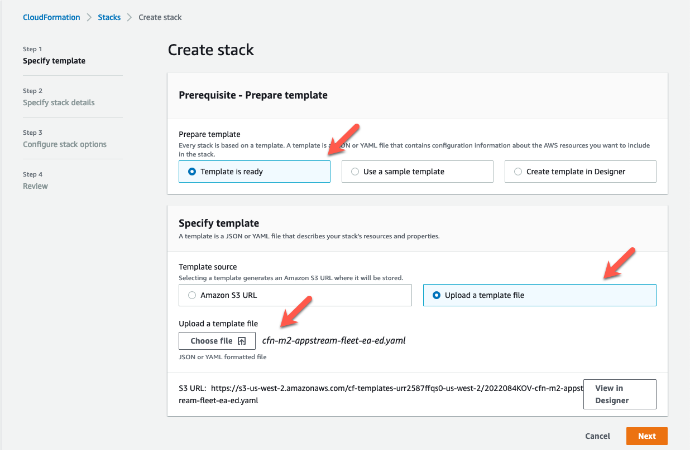
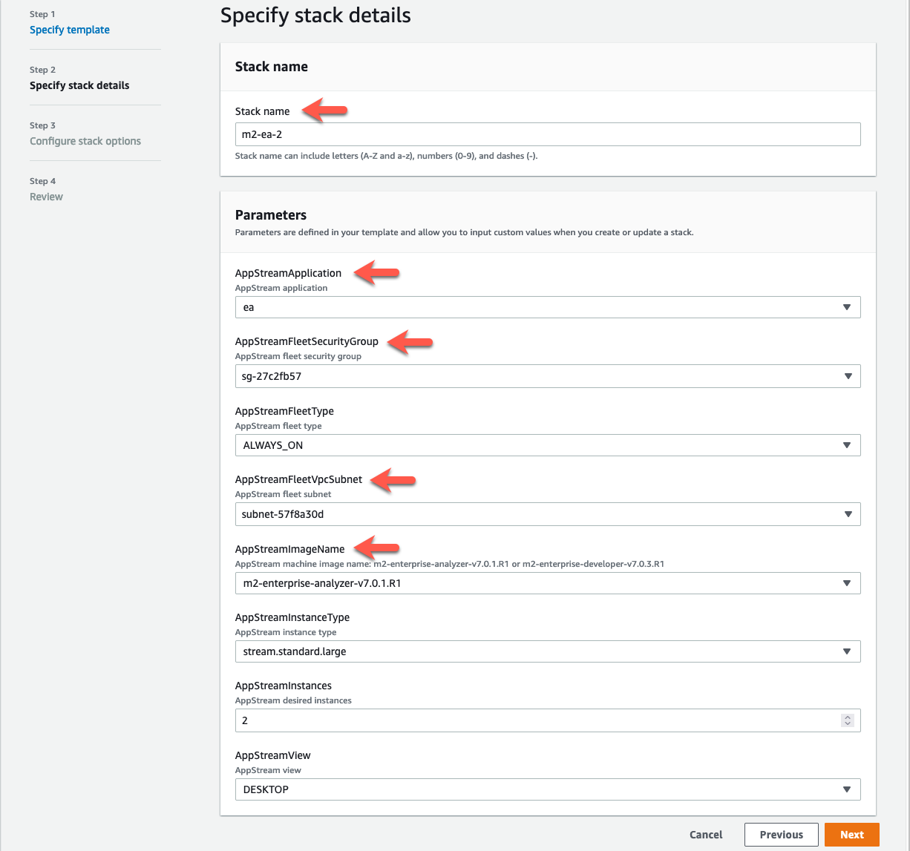
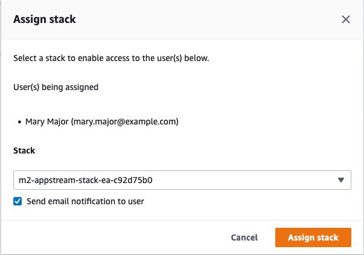
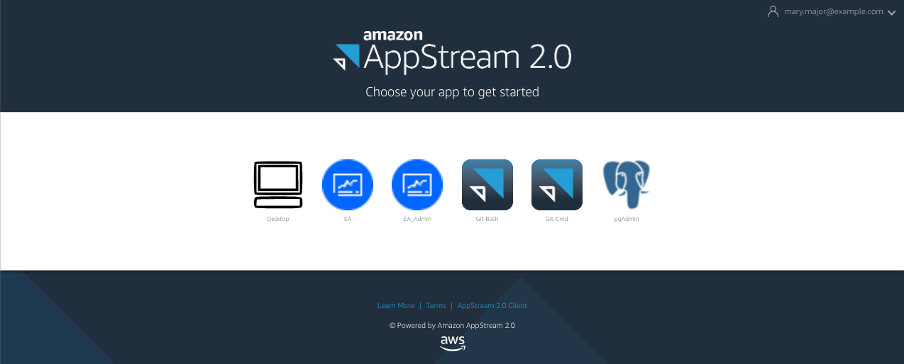

AWS Mainframe Modernization Service (Managed Runtime Environment experience) is no longer open to new customers. For
capabilities similar to AWS Mainframe Modernization Service (Managed Runtime Environment experience) explore AWS Mainframe Modernization Service (Self-Managed
Experience). Existing customers can continue to use the service as normal. For more information, see [AWS Mainframe Modernization
availability change](mainframe-modernization-availability-change.md "mainframe-modernization-availability-change.md").

# Tutorial: Set up WorkSpaces Applications for use with Rocket Enterprise Analyzer and

Rocket Enterprise Developer

AWS Mainframe Modernization provides several tools through Amazon WorkSpaces Applications. WorkSpaces Applications is a fully managed, secure
application streaming service that lets you stream desktop applications to users without rewriting
applications. WorkSpaces Applications provides users with instant access to the applications that they need with a
responsive, fluid user experience on the device of their choice. Using WorkSpaces Applications to host runtime engine-specific tools gives customer application teams the ability to use the tools directly
from their web browsers, interacting with application files stored in either Amazon S3 buckets or CodeCommit
repositories.

For information about browser support in WorkSpaces Applications see [System
Requirements and Feature Support (Web Browser)](../../../appstream2/latest/developerguide/requirements-and-features-web-browser-admin.md "../../../appstream2/latest/developerguide/requirements-and-features-web-browser-admin.md") in the _Amazon WorkSpaces Applications Administration Guide_. If you have issues when you are using
WorkSpaces Applications see [Troubleshooting AppStream
2.0 User Issues](../../../appstream2/latest/developerguide/troubleshooting-user-issues.md "../../../appstream2/latest/developerguide/troubleshooting-user-issues.md") in the _Amazon WorkSpaces Applications Administration Guide_.

This document is intended for members of the customer operations team. It describes how to
set up Amazon WorkSpaces Applications fleets and stacks to host the Rocket Enterprise Analyzer and Rocket Enterprise Developer tools used with AWS Mainframe Modernization. Rocket Enterprise Analyzer
is usually used during the Assess phase and Rocket Enterprise Developer is usually used during the Migrate and
Modernize phase of the AWS Mainframe Modernization approach. If you plan to use both Enterprise Analyzer and Enterprise Developer you must create
separate fleets and stacks for each tool. Each tool requires its own fleet and stack because
their licensing terms are different.

###### Important

The steps in this tutorial are based on the downloadable AWS CloudFormation template
[cfn-m2-appstream-fleet-ea-ed.yml](https://drm0z31ua8gi7.cloudfront.net/tutorials/mf/appstream/cfn-m2-appstream-fleet-ea-ed.yml "https://drm0z31ua8gi7.cloudfront.net/tutorials/mf/appstream/cfn-m2-appstream-fleet-ea-ed.yml").

###### Topics

- [Prerequisites](#tutorial-aas-prerequisites "#tutorial-aas-prerequisites")
- [Step 1: Get the WorkSpaces Applications images](#tutorial-aas-step1 "#tutorial-aas-step1")
- [Step 2: Create the stack using the AWS CloudFormation template](#tutorial-aas-step2 "#tutorial-aas-step2")
- [Step 3: Create a user in WorkSpaces Applications](#tutorial-aas-step3 "#tutorial-aas-step3")
- [Step 4: Log in to WorkSpaces Applications](#tutorial-aas-step4 "#tutorial-aas-step4")
- [Step 5: Verify buckets in Amazon S3 (optional)](#tutorial-aas-step5 "#tutorial-aas-step5")
- [Next steps](#tutorial-aas-next-steps "#tutorial-aas-next-steps")
- [Clean up resources](#tutorial-aas-cleanup "#tutorial-aas-cleanup")

## Prerequisites

- Download the template: [cfn-m2-appstream-fleet-ea-ed.yml](https://drm0z31ua8gi7.cloudfront.net/tutorials/mf/appstream/cfn-m2-appstream-fleet-ea-ed.yml "https://drm0z31ua8gi7.cloudfront.net/tutorials/mf/appstream/cfn-m2-appstream-fleet-ea-ed.yml").
- Get the ID of your default VPC and security group. For more information on the default
  VPC, see [Default
  VPCs](../../../vpc/latest/userguide/default-vpc.md "../../../vpc/latest/userguide/default-vpc.md") in the _Amazon VPC User Guide_. For more information on the
  default security group, see [Default and custom
  security groups](../../../AWSEC2/latest/UserGuide/default-custom-security-groups.md "../../../AWSEC2/latest/UserGuide/default-custom-security-groups.md") in the _Amazon EC2 User Guide_.
- Make sure you have the following permissions:
  - create stacks, fleets, and users in WorkSpaces Applications.
  - create stacks in AWS CloudFormation using a template.
  - create buckets and upload files to buckets in Amazon S3.
  - download credentials (`access_key_id` and
    `secret_access_key`) from IAM.

## Step 1: Get the WorkSpaces Applications images

In this step, you share the WorkSpaces Applications images for Enterprise Analyzer and Enterprise Developer with your AWS account.

1. Open the AWS Mainframe Modernization console at [https://console.aws.amazon.com/m2/](https://us-west-2.console.aws.amazon.com/m2/home?region=us-west-2#/ "https://us-west-2.console.aws.amazon.com/m2/home?region=us-west-2#/").
2. In the left navigation, choose **Tools**.
3. In **Analysis, development, and build assets**, choose **Share assets with my AWS account**.

## Step 2: Create the stack using the AWS CloudFormation template

In this step, you use the downloaded AWS CloudFormation template to create an WorkSpaces Applications stack and fleet
for running Rocket Enterprise Analyzer. You can repeat this step later to create another WorkSpaces Applications stack and fleet for
running Rocket Enterprise Developer, since each tool requires its own fleet and stack in WorkSpaces Applications. For more
information on AWS CloudFormation stacks, see [Working with stacks](../../../AWSCloudFormation/latest/UserGuide/stacks.md "../../../AWSCloudFormation/latest/UserGuide/stacks.md") in the
_AWS CloudFormation User Guide_.

###### Note

AWS Mainframe Modernization adds an additional fee to the standard WorkSpaces Applications pricing for the use of Enterprise Analyzer and
Enterprise Developer. For more information, see [AWS Mainframe Modernization Pricing](https://aws.amazon.com/mainframe-modernization/pricing/ "https://aws.amazon.com/mainframe-modernization/pricing/").

1. Download the [cfn-m2-appstream-fleet-ea-ed.yml](https://drm0z31ua8gi7.cloudfront.net/tutorials/mf/appstream/cfn-m2-appstream-fleet-ea-ed.yml "https://drm0z31ua8gi7.cloudfront.net/tutorials/mf/appstream/cfn-m2-appstream-fleet-ea-ed.yml") template, if necessary.
2. Open the AWS CloudFormation console and choose **Create Stack** and **with new resources (standard)**.
3. In **Prerequisite - Prepare template**, choose **Template is
   ready**.
4. In **Specify Template**, choose **Upload a template
   file**.
5. In **Upload a template file**, choose **Choose
   file** and upload the [cfn-m2-appstream-fleet-ea-ed.yml](https://drm0z31ua8gi7.cloudfront.net/tutorials/mf/appstream/cfn-m2-appstream-fleet-ea-ed.yml "https://drm0z31ua8gi7.cloudfront.net/tutorials/mf/appstream/cfn-m2-appstream-fleet-ea-ed.yml") template.
6. Choose **Next**.

 7. On **Specify stack details**, enter the following information:

    * In **Stack name**, enter a name of your choice. For example,
     `m2-ea`.
    * In **AppStreamApplication**, choose
     **ea**.
    * In **AppStreamFleetSecurityGroup**, choose your default VPC’s
     default security group.
    * In **AppStreamFleetVpcSubnet**, choose a subnet within your
     default VPC.
    * In **AppStreamImageName**, choose the image starting with
     `m2-enterprise-analyzer`. This image contains the currently supported
     version of the Rocket Enterprise Analyzer tool.
    * Accept the defaults for the other fields, then choose
     **Next**.

 8. Accept all defaults, then choose **Next** again. 9. On **Review**, make sure all the parameters are what you
intend. 10. Scroll to the bottom, choose **I acknowledge that AWS CloudFormation might
create IAM resources with custom names**, and choose **Create
Stack**.

It takes between 20 and 30 minutes for the stack and fleet to be created. You can choose
**Refresh** to see the AWS CloudFormation events as they occur.

## Step 3: Create a user in WorkSpaces Applications

While you are waiting for AWS CloudFormation to finish creating the stack, you can create one or more
users in WorkSpaces Applications. These users are those who will be using Enterprise Analyzer in WorkSpaces Applications. You will need to
specify an email address for each user, and ensure that each user has sufficient permissions to create buckets in Amazon S3, upload files to a bucket, and link to a
bucket to map its contents.

1. Open the WorkSpaces Applications console.
2. In the left navigation, choose **User pool**.
3. Choose **Create user**.
4. Provide an email address where the user can receive an email invitation to use WorkSpaces Applications,
   a first name and last name, and choose **Create user**.
5. Repeat if necessary to create more users. The email address for each user must be
   unique.

For more information on creating WorkSpaces Applications users, see [WorkSpaces Applications User Pools](../../../appstream2/latest/developerguide/user-pool.md "../../../appstream2/latest/developerguide/user-pool.md") in
the _Amazon WorkSpaces Applications Administration Guide_.

When AWS CloudFormation finishes creating the stack, you can assign the user you created to the stack,
as follows:

1. Open the WorkSpaces Applications console.
2. Choose the user name.
3. Choose **Action**, then **Assign stack**.
4. In **Assign stack**, choose the stack that begins with
   `m2-appstream-stack-ea`.
5. Choose **Assign stack**.

Assigning a user to a stack causes WorkSpaces Applications to send an email to the user at the address you
provided. This email contains a link to the WorkSpaces Applications login page.

## Step 4: Log in to WorkSpaces Applications

In this step, you log in to WorkSpaces Applications using the link in the email sent by WorkSpaces Applications to the user
you created in [Step 3: Create a user in WorkSpaces Applications](#tutorial-aas-step3 "#tutorial-aas-step3").

1. Log in to WorkSpaces Applications using the link provided in the email sent by WorkSpaces Applications.
2. Change your password, if prompted. The WorkSpaces Applications screen that you see is similar to the
   following:

 3. Choose **Desktop**. 4. On the task bar, choose **Search** and enter
`D:` to navigate to the Home Folder.

###### Note

If you skip this step, you might get a `Device not ready` error when you
try to access the Home Folder.

At any point, if you have trouble signing into WorkSpaces Applications, you can restart your WorkSpaces Applications fleet
and try to sign in again, using the following steps.

1. Open the WorkSpaces Applications console.
2. In the left navigation, choose **Fleets**.
3. Choose the fleet you are trying to use.
4. Choose **Action**, then choose **Stop**.
5. Wait for the fleet to stop.
6. Choose **Action**, then choose **Start**.

This process can take around 10 minutes.

## Step 5: Verify buckets in Amazon S3 (optional)

One of the tasks completed by the AWS CloudFormation template you used to create the stack was to
create two buckets in Amazon S3, which are necessary to save and restore user data and application
settings across work sessions. These buckets are as follows:

- Name starts with `appstream2-`. This bucket maps data to your Home Folder
  in WorkSpaces Applications (`D:\PhotonUser\My Files\Home Folder`).

###### Note

The Home Folder is unique for a given email address and is shared across all fleets
and stacks in a given AWS account. The name of the Home Folder is a SHA256 hash of the
user’s email address, and is stored on a path based on that hash.

- Name starts with `appstream-app-settings-`. This bucket contains user
  session information for WorkSpaces Applications, and includes settings such as browser favorites, IDE and
  application connection profiles, and UI customizations. For more information, see [How
  Application Settings Persistence Works](../../../appstream2/latest/developerguide/how-it-works-app-settings-persistence.md "../../../appstream2/latest/developerguide/how-it-works-app-settings-persistence.md") in the
  _Amazon WorkSpaces Applications Administration Guide_.

To verify that the buckets were created, follow these steps:

1. Open the Amazon S3 console.
2. In the left navigation, choose **Buckets**.
3. In **Find buckets by name**, enter `appstream`
   to filter the list.

If you see the buckets, no further action is necessary. Just be aware that the buckets
exist. If you do not see the buckets, then either the AWS CloudFormation template is not finished running,
or an error occurred. Go to the AWS CloudFormation console and review the stack creation messages.

## Next steps

Now that the WorkSpaces Applications infrastructure is set up, you can set up and start using Enterprise Analyzer. For
more information, see [Tutorial: Set up Enterprise Analyzer on WorkSpaces Applications](set-up-ea.md "set-up-ea.md"). You can also set
up Enterprise Developer. For more information, see [Tutorial: Set up Rocket Enterprise Developer on WorkSpaces Applications](set-up-ed.md "set-up-ed.md").

## Clean up resources

The procedure to clean up the created stack and fleets is described in [Create
an WorkSpaces Applications Fleet and Stack](../../../appstream2/latest/developerguide/set-up-stacks-fleets.md "../../../appstream2/latest/developerguide/set-up-stacks-fleets.md").

When the WorkSpaces Applications objects have been deleted, the account administrator can also, if
appropriate, clean up the Amazon S3 buckets for Application Settings and Home Folders.

###### Note

The home folder for a given user is unique across all fleets, so you might need to
retain it if other WorkSpaces Applications stacks are active in the same account.

Finally, WorkSpaces Applications does not currently allow you to delete users using the console. Instead,
you must use the service API with the CLI. For more information, see [User Pool
Administration](../../../appstream2/latest/developerguide/user-pool-admin.md "../../../appstream2/latest/developerguide/user-pool-admin.md") in the _Amazon WorkSpaces Applications Administration Guide_.
