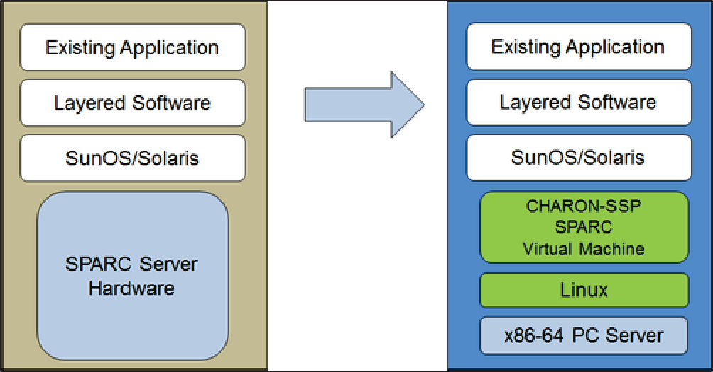
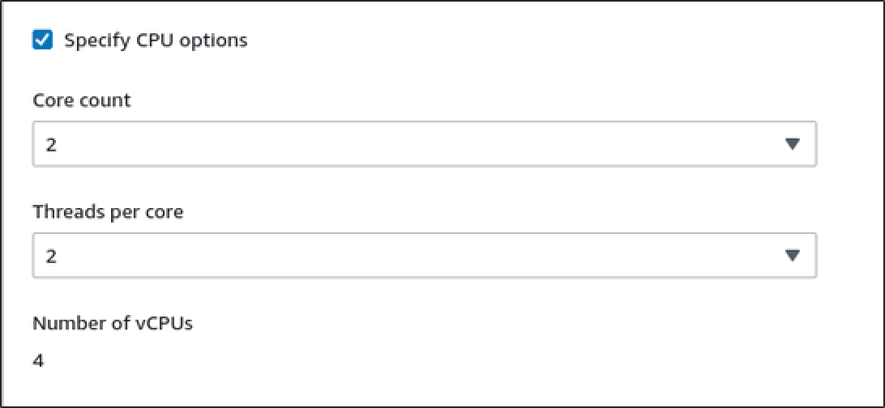
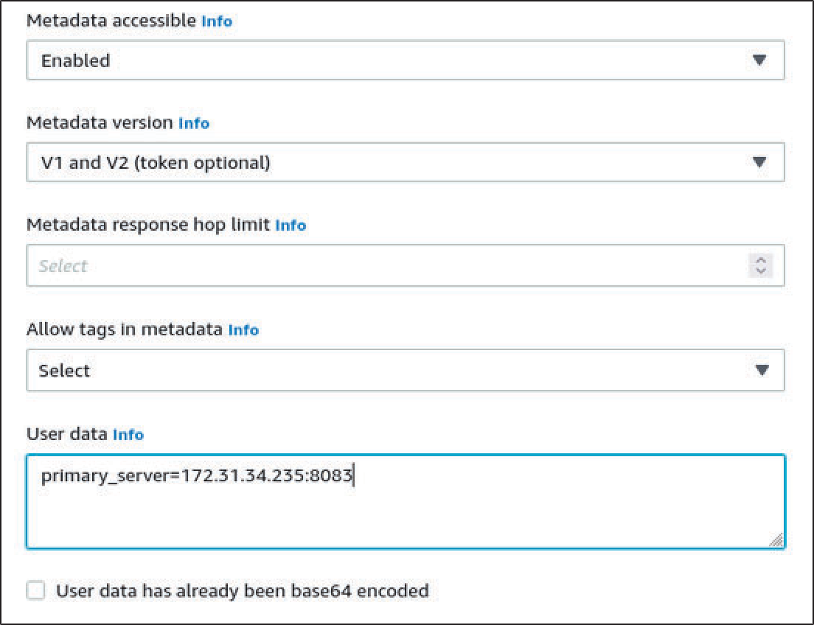
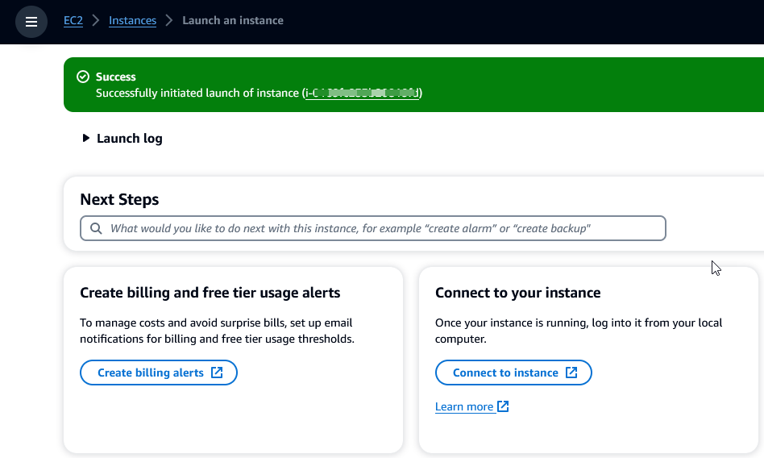

AWS Mainframe Modernization Service (Managed Runtime Environment experience) will no longer be open to new customers starting on November 7, 2025. If you would like to use the service, please sign up prior to November 7, 2025. For capabilities similar to AWS Mainframe Modernization Service (Managed Runtime Environment experience) explore AWS Mainframe Modernization Service (Self-Managed Experience). Existing customers can continue to use the service as normal. For more information, see
[AWS Mainframe Modernization availability change](mainframe-modernization-availability-change.md "mainframe-modernization-availability-change.md").

# Charon integration

## Introduction to Charon-SSP

In 1987, Sun Microsystems released the SPARC V7 processor, a 32-bit RISC processor. The
SPARC V8 followed in 1990 - a revision of the original SPARC V7, with the most notable inclusion
of hardware divide and multiply instructions. The SPARC V8 processors formed the basis for a
number of servers and workstations such as the SPARCstation 5, 10 and 20. In 1993, the SPARC V8
was followed by the 64-bit SPARC V9 processor. This too became the basis for a number of servers
and workstations, such as the Enterprise 250 and 450.

Due to hardware obsolescence and lack of spare or refurbished parts, software and systems
developed for these older SPARC-based workstations and servers have become harder to maintain. To
fill the continuous need for certain, end-of-life SPARC-based systems, Stromasys S.A. developed
the Charon-SSP line of SPARC emulator products. The following products are software-based,
virtual machine replacements for the specified native- hardware SPARC systems. The following is a
general overview of the emulated hardware families.

Charon-SSP/4M emulates the following SPARC hardware:

- Sun-4m family (represented by the Sun SPARCstation 20): originally, a multiprocessor Sun-4
  variant, based on the MBus processor module bus introduced in the SPARCServer 600MP series. The
  Sun-4m architecture later also encompassed non-MBus uniprocessor systems such as the SPAR
  Cstation 5, utilizing SPARC V8-architecture processors. Supported starting with SunOS 4.1.2 and
  by Solaris 2.1 to Solaris 9. SPARCServer 600MP support was dropped after Solaris 2.5.1.

Charon-SSP/4U(+) emulates the following SPARC hardware:

- Sun-4u family (represented by the Sun Enterprise 450): (U for UltraSPARC) - this variant
  introduced the 64-bit SPARC V9 processor architecture and UPA processor interconnect first used
  in the Sun Ultra series. Supported by 32-bit versions of Solaris starting from version 2.5.1.
  The first 64-bit Solaris release for Sun-4u was Solaris 7. UltraSPARC I support was dropped
  after Solaris 9. Solaris 10 supports Sun-4u implementations from UltraSP ARC II to UltraSPARC
  IV.

Charon-SSP/4V(+) emulates the following SPARC hardware:

- Sun-4v family (represented by the SPARC T2 and T4): this variation added hypervisor
  processor virtualization to the Sun-4u; introduced in the Ultra SPARC T1 multicore processor.
  Selected hardware was supported by Solaris version 10 starting from release 3/05 HW2 (most
  models - including the hardware emulated by Charon-SSP - require newer versions of Solaris 10).
  Several Solaris 11 versions are also supported.

The following image shows the basic concept of migrating physical hardware to an
emulator.

The Charon-SSP virtual machines allow users of Sun and Oracle SPARC-based computers to
replace their native hardware in a way that requires little or no change to the original system
configuration. This means you can continue to run your applications and data without the need to
switch or port to another platform. The Charon-SSP software runs on commodity, Intel 64-bit
systems ensuring the continued protection of your investment.

Charon-SSP/4U+ supports the same virtual SPARC platforms as Charon-SSP/4U, and
Charon-SSP/4V+ the same as Charon-SSP/4V. However, the 4U+ and 4V+ versions take advantage of
Intel's VTx/EPT and AMD's AMD-v/NPT hardware assisted virtualization technology in modern CPUs to
offer better virtual CPU performance. Charon-SSP/4U+ and Charon-SSP/4V+ require CPUs with
VT-x/EPT or AMD-v/NPT support and must be installed on a dedicated host system. Running these
product variants in a VM (e.g., on VMware) is not supported.

###### Note

If you plan to run Charon-SSP/4U+ or 4V+ in a cloud environment, contact Stromasys or a
Stromasys VAR to discuss your requirements.

## Supported guest operating systems

The Charon-SSP/4M virtual machines support the following guest operating system
releases:

- SunOS 4.1.3 - 4.1.4
- Solaris 2.3 to Solaris 9

The Charon-SSP/4U(+) virtual machines support the following guest operating system
releases:

- Solaris 2.5.1 to Solaris 10

The Charon-SSP/4V(+) virtual machines support the following guest operating system
releases:

- Solaris 10 (starting with update 4, 08/07) and Solaris 11.1 to Solaris 11.4

For Charon-SSP/4V(+), note the following:

- For the emulated SPARC T4, supported Solaris 10 versions are: Oracle Solaris 10 1/13,
  Oracle Solaris 10 8/11, and Solaris 10 9/10, or Solaris 10 10/09 with the Oracle Solaris 10
  8/11 patch set.
- The emulated SPARC T4 model is a prerequisite for running Solaris 11.4 in the
  emulator.
- Solaris kernel zones are not supported.

## Charon-SSP cloud instance prerequisites

By selecting an instance type or shape, you select the virtual hardware that will be used
for the Charon-SSP host instance in the cloud. Therefore, the selection of an instance type or
shape determines the hardware characteristics of the Charon-SSP virtual host hardware (e.g., how
many CPU cores and how much memory your virtual Charon host system will have).

###### Note

If you use a Charon-SSP marketplace image to launch your instance, all Linux host operating
system requirements are fulfilled.

The minimum hardware requirements are described below.

Important points regarding the sizing guidelines:

- The sizing guidelines below-in particular regarding number of host CPU cores and host
  memory-show the minimum requirements. Every deployment situation must be reviewed and the
  actual host sizing has to be adapted as necessary. For example, the number of CPU cores
  available for I/O must be increased if the guest applications produce a high I/O load. Also, a
  system with many emulated CPUs is typically able to create a higher I/O load and thus the
  number of CPU cores available for I/O may have to be increased. In a hyper-threading
  environment, for best performance, the number of CPU cores (that is, real/physical CPUs) must
  be sufficient to fulfill CPU requirements of the active emulators, thus avoiding high-workload
  threads sharing one physical CPU core.
- The CPU core allocation for emulated CPUs and CPU cores for I/O processing is determined
  by the configuration. See CPU Configuration in the general Charon-SSP User's Guide for more
  information about this and the default allocation of CPU cores for I/O processing.

###### Important general information

- To facilitate a fast transfer of emulator data from one cloud instance to another, it is
  strongly recommended to store all relevant emulator data on a separate disk volume that can
  easily be detached from the old instance and attached to a new instance.
- Make sure to dimension your instance correctly from the beginning (check the minimum
  requirements below). The Charon-SSP license for Charon-SSP AL is created when the instance is
  first launched. Changing later to another instance size/type and thereby changing the number
  of CPU cores will invalidate the license and thus prevent Charon instances from starting (new
  instance required). If planning to use the Charon-SSP AL instance in AutoVE mode, be sure to
  include the AutoVE server information before first launch, otherwise the public license
  servers will be used. The license for Charon-SSP VE is created based on the fingerprint taken
  on the license server. If the license server is run directly on the emulator host and the
  emulator host later requires, for example, a change in the number of CPU cores, the license
  will be invalidated (new license and possibly new instance required).

## Instance prerequisites

General CPU requirements: Charon-SSP supports modern x86-64 architecture processors based
Amazon EC2 instances.

Minimum requirements for Charon-SSP:

- Minimum number of host system CPU cores:
  - At least one CPU core for the host operating system, plus:
  - For each emulated SPARC system:
    - One CPU core for each emulated CPU of the instance, plus:
    - At least one additional CPU core for I/O processing (at least two, if server JIT
      optimization is used). See the CPU Configuration section mentioned above for configuration
      options. By default, Charon will assign 1/3 (min. 1; rounded down) of the number of CPUs
      visible to the Charon host to I/O processing.

- Minimum memory requirements:
  - 4GB or more of RAM for the Linux host operating system. The actual requirements may be
    higher and will depend on the requirements of the non- emulator services running on the Linux
    host. The previous recommendation of at least 2GB of RAM for the Linux host will still be
    valid for many systems, but the increasing requirements of the Linux operating system and
    applications have led to the updated recommendation for new installations. Plus:
  - For each emulated SPARC system:
    - The configured memory of the emulated instance, plus:
    - 2GB of RAM (6GB of RAM if server JIT is used) to allow for DIT optimization, emulator
      requirements, run-time buffers, SMP and graphics emulation.

- If hyper-threading is enabled on modern x86-64 CPUs, two threads can run on one physical
  CPU core providing two logical CPUs to the host operating system. If possible, disable
  hyper-threading on the Charon-SSP host. However, this is frequently not possible in VMware and
  cloud environments, or it is unclear whether hyper-threading is used or not. The Charon-SSP
  hyper-threading option enables Charon-SSP to adapt to such environments. See the CPU
  Configuration section in your general Charon-SSP User's Guide mentioned above for detailed
  configuration information. P lease note: for best performance, Charon-SSP threads should not
  share a physical CPU core - enough physical cores should be available on the host system to
  satisfy the requirements of the configured emulator(s).
- One or more network interfaces, depending on customer requirements.
- Charon-SSP/4U+ and Charon-SSP/4V+ must run on physical hardware supporting Intel VT-x/EPT
  or AMD-v/NPT (baremetal instances) and therefore cannot run in all cloud environments. Please
  check your cloud provider's documentation for the availability of such hardware. In addition,
  note the following points:
  - Charon-SSP/4U+ and Charon-SSP/4V+ are only available when using a Linux kernel supported
    by Stromasys.
  - If you need this type of emulated SPARC hardware, contact Stromasys or your Stromasys
    VAR to discuss your requirements in detail.

## Creating and configuring an AWS cloud

instance for Charon (New GUI)

This section reflects the AWS Management Console in spring 2022. If you still use the older console,
refer to the Appendix of the Charon-SSP AWS Getting Started guide.

### General prerequisites

This description shows the basic setup of a Linux instance in AWS. It does not list
specific prerequisites. However, depending on your use case, consider the following
prerequisites:

- Amazon account and AWS Marketplace subscriptions
  - To set up a Linux instance in AWS, you need an AWS account with administrator
    access.
  - Identify the AWS Region in which you plan to launch your instance. Ensure that AWS
    services that you plan to use are available in that Region. See [AWS Services by Region](https://aws.amazon.com/about-aws/global-infrastructure/regional-product-services/ "https://aws.amazon.com/about-aws/global-infrastructure/regional-product-services/").
  - Identify the VPC and subnet in which you plan to launch your instance.
  - If your instance requires internet access, ensure that the route table associated with
    your VPC has an internet gateway. If your instance requires VPN access to your on-premises
    network, ensure that a VPN gateway is available. The exact configuration of your VPC and its
    subnets will depend on your network design and application requirements.
  - To subscribe to a specific AWS Marketplace service, choose **AWS Marketplace
    Subscriptions** in the AWS Management Console and then choose **Manage
    subscriptions**.
  - Search for the service that you plan to use and subscribe to it. After a successful
    subscription, you will find the subscription in the **Manage
    subscriptions** section. From there you can directly launch a new
    instance.

- The instance hardware and software prerequisites will be different depending on the
  planned use of the instance:
  - Option 1: the instance is to be used as a Charon emulator host system:
    - Refer to the hardware and software prerequisite sections of the User's Guide and/or
      Getting Started guide of your Charon product to determine the exact hardware and software
      prerequisites that must be fulfilled by the Linux instance. The image you use to launch
      your instance and the instance type you chose determine the software and hardware of your
      cloud instance.
    - A Charon product license is required to run emulated legacy systems. Refer to the
      licensing information in the documentation of your Charon product, or contact your
      Stromasys representative or Stromasys VAR for additional information.

  - Option 2: the instance is to be used as a dedicated VE license server:
    - See the VE License Server Guide for detailed prerequisites.

- Certain legacy operating systems that can run in the emulated systems provided by Charon
  emulator products require a license of the original vendor of the operating system. The user
  is responsible for any licensing obligations related to the legacy operating system and has to
  provide the appropriate licenses.

### Using the AWS Management Console to launch a new instance

###### To create a new instance

1.  Sign in to the AWS Management Console and open the Amazon EC2 console at
    [https://console.aws.amazon.com/ec2/](https://console.aws.amazon.com/ec2/ "https://console.aws.amazon.com/ec2/").
2.  Choose **Launch instance**.
3.  Enter a name for the instance.
4.  Select an AMI. An AMI is a prepackaged image used to launch cloud instances. It includes
    the operating system and applicable application software. The choice of AMI depends on how you
    plan to use the instance:

        * If the instance is to be used as a Charon emulator host system several AMI choices are
         possible:

        	+ Installing the Charon host system from a prepackaged Charon marketplace image: they
        	 contain the underlying operating system and the preinstalled Charon software.

        		- Check with your Stromasys representative which options are currently available in
        		 your cloud providers marketplace.
        		- Depending on the cloud provider and the Stromasys product release plans, there can
        		 be two variants:

        			* Automatic licensing (AL) for use with a public, Stromasys-operated license
        			 server, or with a private, customer-operated AutoVE license server
        			* Virtual environment (VE) for use with a private, customer-operated VE license
        			 server
        	+ Installing the Charon host system using a conventional Charon emulator installation
        	 with the Charon emulator installation RPM packages for Linux:

        		- Choose a Linux AMI of a distribution supported by your selected Charon product and
        		 version. See the user guide for your product on the Stromasys documentation site.
        * If the instance is to be used as a dedicated VE license server, see the VE License
         Server Guide in Licensing Documentation for the requirements of the Linux instance.

    After you decide which AMI is required, select a matching Linux or Charon product AMI. If
    you don't see the AMI that you need, choose **Browse more AMIs**. Choose the
    Linux AMI that matches how you plan to use the instance. It can be one of the following:

        * A prepackaged Charon VE marketplace image. The name of the AMI will include the string
         "ve".
        * A prepackaged Charon AL marketplace image for Automatic Licensing or AutoVE.
        * A Linux version supported for an RPM product installation.
        * A Linux version supported for the VE license server.

5.  Select an instance type. Amazon EC2 offers instance types with varying combinations of CPU,
    memory, storage, and networking capacity. Select an instance type that matches the
    requirements of the Charon product that you want to use. Some marketplace images have a
    restricted selection of instance types.
6.  Select an existing key pair or create and save a new one. If you select an existing key
    pair, make sure you have the matching private key. Otherwise, you will not be able to connect
    to your instance.

###### Note

If your management system supports it, for RHEL 9.x, Rocky Linux 9.x, and Oracle Linux
9.x, use SSH key type ECDSA or ED25519. These types allow you to connect to these Charon host
Linux systems by using an SSH tunnel without needing to change the the default crypto-policy
settings on the Charon host to less secure settings. For example, this is important for the
Charon-SSP Manager. See [Using system-wide cryptographic policies](https://docs.redhat.com/en/documentation/red_hat_enterprise_linux/9/html/security_hardening/using-the-system-wide-cryptographic-policies_security-hardening "https://docs.redhat.com/en/documentation/red_hat_enterprise_linux/9/html/security_hardening/using-the-system-wide-cryptographic-policies_security-hardening") in the _Red Hat_
documentation. 7. In the **Network settings** section, choose **Edit**.
Choose the settings that correspond to your environment.

    * Specify a VPC.
    * Specify an existing subnet or create a new one.
    * Enable or disable the automatic assignment of a public IP address to the primary
     interface. Automatic assignment is only possible if the instance has a single network
     interface.
    * Assign an existing or new custom security group. The security group must allow at least
     SSH to access the instance. Any ports required by applications that you plan to run on the
     instance must also be allowed. You can modify the security group at any time after you
     create the instance.

8. In the **Storage** section, for the root volume (the system disk),
   choose a size that is appropriate for your environment. The recommended minimum system disk
   size for the Linux system is 30 GiB. To provide space for virtual disk containers and other
   storage requirements, you can add more storage now or after you launch the instance. But the
   system disk size must cover the Linux system requirements, including any applications and
   utilities that you plan to install.

###### Note

We recommend that you create separate storage volumes for Charon application data (e.g.,
disk images). If necessaryou, you can later migrate such volumes to another instance. 9. Expand the **Advanced details** section, scroll down, and select
**Specify CPU options**. Three that are more likely to be useful to a Charon
emulator environment are shown in the following image as examples.

 10. For a VE license server system with a version earlier than 1.1.23, you must assign the
required IAM role to the instance. It must be a role that allows the `ListUsers`
action. To assign a role, in the expanded **Advanced details** section either
select a role under **IAM instance profile**, or choose **Create a
new IAM profile**. For more information, see [IAM
roles for Amazon EC2](../../../AWSEC2/latest/UserGuide/iam-roles-for-amazon-ec2.md "../../../AWSEC2/latest/UserGuide/iam-roles-for-amazon-ec2.md"). 11. If your instance is based on a Charon AL AWS Marketplace image and you plan to use the
Stromasys-operated public license servers, you must add the corresponding information to the
instance configuration before you launch the instance.

Enter the information for the AutoVE license server as shown in the following
image.

The following are valid user data configuration options:

    * **`primary_server=`***`<ip-address>`*`[**:***<port>*]`
    * **`backup_server=`***`<ip-address>`*`[**:***<port>*]`

Where

    * *<ip-address>* stands for the IP address of the
     primary and the backup server as applicable.
    * *<port>* stands for a non-default TCP port used to
     communicate with the license server (default: TCP/8083).

###### Note

At least one license server must be configured at initial launch to enable AutoVE mode.
0therwise, the instance will bind to one of the public license servers operated by
Stromasys. 12. In the **Summary** section, choose **Launch
instance**. After a while, you will see the following success message:

 13. At the bottom-right corner of the screen, choose **View all
instances**. 14. To see the details of your instance, select the check box to the left of the row that
represents the instance in the **Instances** table. Your instance details
will appear in the bottom half of the screen. For information on how to connect to your
instance, see [Connect](../../../AWSEC2/latest/UserGuide/connect.md "../../../AWSEC2/latest/UserGuide/connect.md") in the Amazon EC2 User Guide.
