AWS Mainframe Modernization Service (Managed Runtime Environment experience) will no longer be open to new customers starting on November 7, 2025. If you would like to use the service, please sign up prior to November 7, 2025. For capabilities similar to AWS Mainframe Modernization Service (Managed Runtime Environment experience) explore AWS Mainframe Modernization Service (Self-Managed Experience). Existing customers can continue to use the service as normal. For more information, see
[AWS Mainframe Modernization availability change](mainframe-modernization-availability-change.md "mainframe-modernization-availability-change.md").

# Tutorial: Use AWS Blu Age Developer on AppStream 2.0

This tutorial shows you how to access AWS Blu Age Developer on AppStream 2.0 and use it with a sample
application so you can try out the features. When you finish this tutorial, you can use the same
steps with your own applications.

###### Topics

- [Step 1: Create a database](#tutorial-ba-developer-create-db "#tutorial-ba-developer-create-db")
- [Step 2: Access the environment](#tutorial-ba-developer-access-env "#tutorial-ba-developer-access-env")
- [Step 3: Set up the runtime](#tutorial-ba-developer-set-up-runtime "#tutorial-ba-developer-set-up-runtime")
- [Step 4: Start the Eclipse IDE](#tutorial-ba-developer-start-eclipse "#tutorial-ba-developer-start-eclipse")
- [Step 5: Set up a Maven project](#tutorial-ba-developer-set-up-maven "#tutorial-ba-developer-set-up-maven")
- [Step 6: Configure a Tomcat server](#tutorial-ba-developer-config-tomcat "#tutorial-ba-developer-config-tomcat")
- [Step 7: Deploy to Tomcat](#tutorial-ba-developer-deploy-tomcat "#tutorial-ba-developer-deploy-tomcat")
- [Step 8: Create the JICS database](#tutorial-ba-developer-create-jics "#tutorial-ba-developer-create-jics")
- [Step 9: Start and test the application](#tutorial-ba-developer-test-app "#tutorial-ba-developer-test-app")
- [Step 10: Debug the application](#tutorial-ba-developer-debug "#tutorial-ba-developer-debug")
- [Clean up resources](#tutorial-ba-developer-clean "#tutorial-ba-developer-clean")

## Step 1: Create a database

In this step, you use Amazon RDS to create a managed PostgreSQL database that the demo
application uses to store configuration information.

1. Open the Amazon RDS console.
2. Choose **Databases > Create database**.
3. Choose **Standard create > PostgreSQL**, leave the default version, and
   then choose **Free tier**.
4. Choose a DB instance identifier.
5. For **Credential Settings**, choose **Manage master credentials in
   AWS Secrets Manager**. For more information, see [Password management with Amazon RDS and
   AWS Secrets Manager](../../../AmazonRDS/latest/UserGuide/rds-secrets-manager.md "../../../AmazonRDS/latest/UserGuide/rds-secrets-manager.md") in the _Amazon RDS User Guide_.
6. Ensure that the VPC is the same as the one that you use for the AppStream 2.0 instance. You can
   ask your admin for this value.
7. For **VPC security group**, choose **Create
   New**.
8. Set **Public access** to **Yes**.
9. Leave all other default values. Review these values.
10. Choose **Create database**.

To make the database server accessible from your instance, select the database server in
Amazon RDS. Under **Connectivity & security**, choose the VPC security group for
the database server. This security group was previously created for you and should have a
description similar to the one in **Created by RDS management console**. Choose
**Action > Edit inbound rules**, choose **Add rule**, and
create a rule of type **PostgreSQL**. For rule source, use the security group
**default**You can start to type the source name in the
**Source** field and then accept the suggested ID. Finally, choose
**Save rules**.

## Step 2: Access the environment

In this step, you access the AWS Blu Age development environment on AppStream 2.0.

1. Contact your administrator for the proper way to access your AppStream 2.0 instance. For general
   information about possible clients and configurations, see [AppStream 2.0 Access Methods
   and Clients](../../../appstream2/latest/developerguide/clients-access-methods-user.md "../../../appstream2/latest/developerguide/clients-access-methods-user.md") in the _Amazon AppStream 2.0 Administration Guide_. Consider using the native
   client for the best experience.
2. In AppStream 2.0 choose **Desktop**.

## Step 3: Set up the runtime

In this step, you set up the AWS Blu Age runtime. You must set up the runtime at first launch and
again if you are notified of a runtime upgrade. This step populates your `.m2`
folder.

1. Choose **Applications**, from the menu bar, and then choose
   **Terminal**.
2. Enter the following command:

```
~/_install-velocity-runtime.sh
```

## Step 4: Start the Eclipse IDE

In this step, you start the Eclipse IDE and choose a location where you want to create a
workspace.

1. In AppStream 2.0 choose the Launch Application icon on the toolbar, and then choose **Eclipse JEE**.

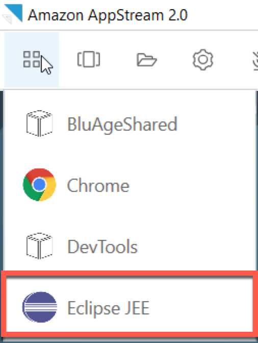 2. When the launcher opens, enter the location where you want to create your workspace, and
choose **Launch**.

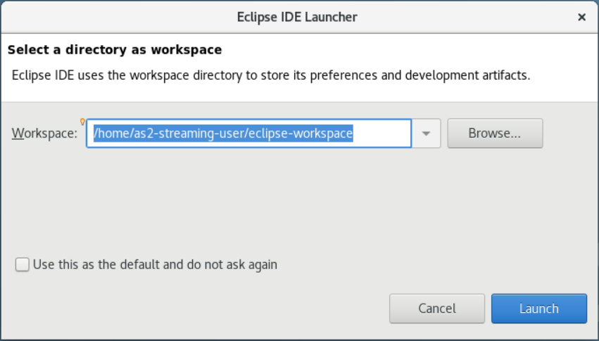

Optionally, you can launch Eclipse from the command line, as follows:

```
~/eclipse &
```

## Step 5: Set up a Maven project

In this step, you import a Maven project for the Planets demo application.

1. Upload [PlanetsDemo-pom.zip](https://d3lkpej5ajcpac.cloudfront.net/appstream/bluage/developer-ide/PlanetsDemo/PlanetsDemo-pom.zip "https://d3lkpej5ajcpac.cloudfront.net/appstream/bluage/developer-ide/PlanetsDemo/PlanetsDemo-pom.zip") to your Home folder. You can use the native client “My Files”
   feature to do this.
2. Use the `unzip` command line tool to extract the files.
3. Navigate inside the unzipped folder and open the root `pom.xml` of your
   project in a text editor.
4. Edit the `gapwalk.version` property so that it matches the installed
   AWS Blu Age runtime.

If you are unsure of the installed version, issue the following command in a
terminal:

```
cat ~/runtime-version.txt
```

This command prints the currently available runtime version, for example,
`3.1.0-b3257-dev`.

###### Note

Don't include the `-dev` suffix in `gapwalk.version`. For example,
a valid value would be
`<gapwalk.version>3.1.0-b3257</gapwalk.version>`. 5. In Eclipse, choose **File**, then **Import**.
In
the **Import**, dialog window,
expand **Maven** and choose **Existing Maven Projects**.
Choose **Next**. 6. In **Import Maven Projects**, provide the location of the extracted files
and choose **Finish**.

You can safely ignore the following popup. Maven downloads a local copy of
`node.js` to build the Angular
(\*-web)
part of the project:

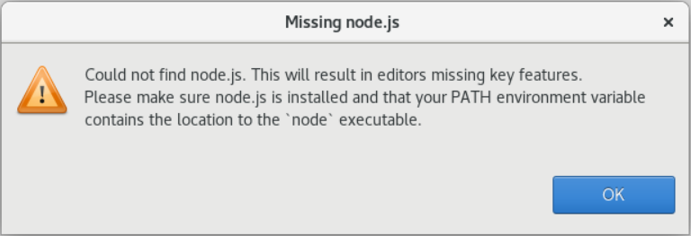

Wait until the end of the build. You can follow the build in the
**Progress** view. 7. In Eclipse, select the project and choose **Run as**. Then choose
**Maven install**. After the Maven installation succeeds, it creates the
`war` file under
`PlanetsDemoPom/PlanetsDemo-web/target/PlanetsDemo-web-1.0.0.war`.

## Step 6: Configure a Tomcat server

In this step, you configure a Tomcat server where you deploy and start your compiled
application.

1. In Eclipse, choose **Window > Show View > Servers** to show the
   **Servers** view:

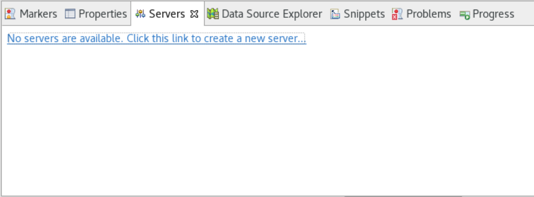 2. Choose **No servers are available. Click this link to create a new
server...**. The **New Server**wizard appears. In the
**Select the server type** field of the wizard, enter **tomcat
v9** , and choose **Tomcat v9.0 Server**. Then choose
**Next**.

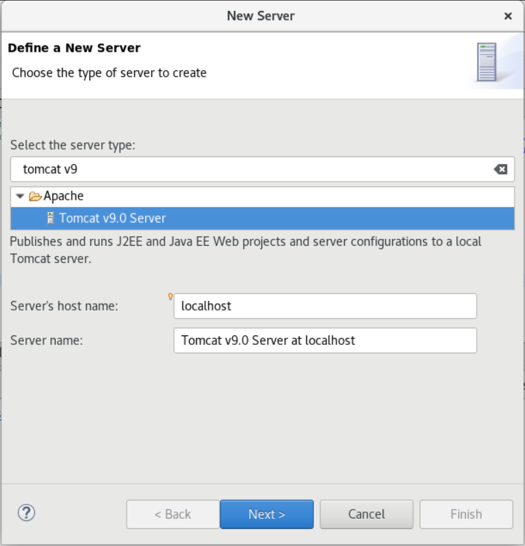 3. Choose **Browse**, and choose the **tomcat** folder at
the root of the Home folder. Leave the JRE at its default value and choose
**Finish**.

A **Servers** project is created in the workspace, and a Tomcat v9.0
server is now available in the **Servers** view. This is where the compiled
application will be deployed and started:

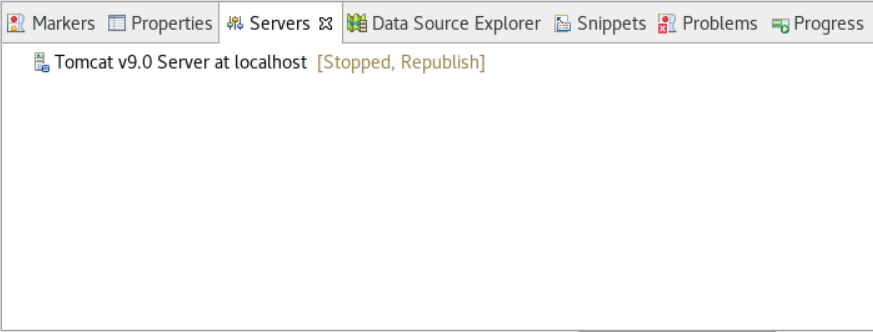

## Step 7: Deploy to Tomcat

In this step, you deploy the Planets demo application to the Tomcat server so you can run
the application.

1. Select the `PlanetsDemo-web` file and choose **Run As > Maven
   install**. Select `PlanetsDemo-web` again and choose
   **Refresh** to ensure that the npm-compiled frontend is properly compiled to
   a .war and noticed by Eclipse.
2. Upload the [PlanetsDemo-runtime.zip](https://d3lkpej5ajcpac.cloudfront.net/appstream/bluage/developer-ide/PlanetsDemo/PlanetsDemo-runtime.zip "https://d3lkpej5ajcpac.cloudfront.net/appstream/bluage/developer-ide/PlanetsDemo/PlanetsDemo-runtime.zip") to the instance, and unzip the file at an accessible
   location. This ensures that the demo application can access the configuration folders and
   files that it requires.
3. Copy the contents of `PlanetsDemo-runtime/tomcat-config` into the
   `Servers/Tomcat v9.0...` subfolder that you created for your Tomcat
   server:

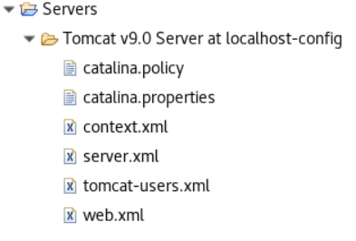 4. Open the `tomcat v9.0` server entry in the Servers view. The server
properties editor appears:

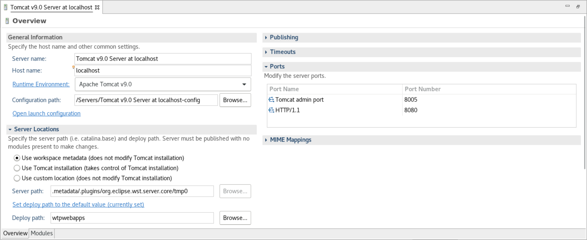 5. In the **Overview** tab, increase the **Timeouts**
values to 450 seconds for Start, and 150 seconds for Stop, as shown here:

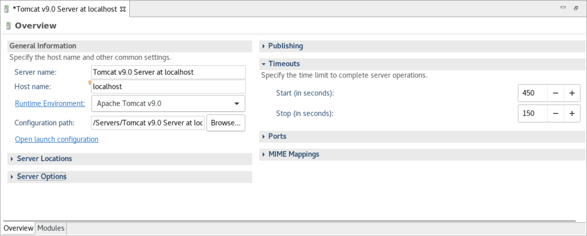 6. Choose **Open launch configuration**. A wizard appears. In the wizard,
navigate to the **Arguments** folder and, for **Working
directory**, choose **Other**.
Choose
**File System**, and navigate to the `PlanetsDemo-runtime`
folder unzipped earlier. This folder should contain a direct subfolder called
**config**.

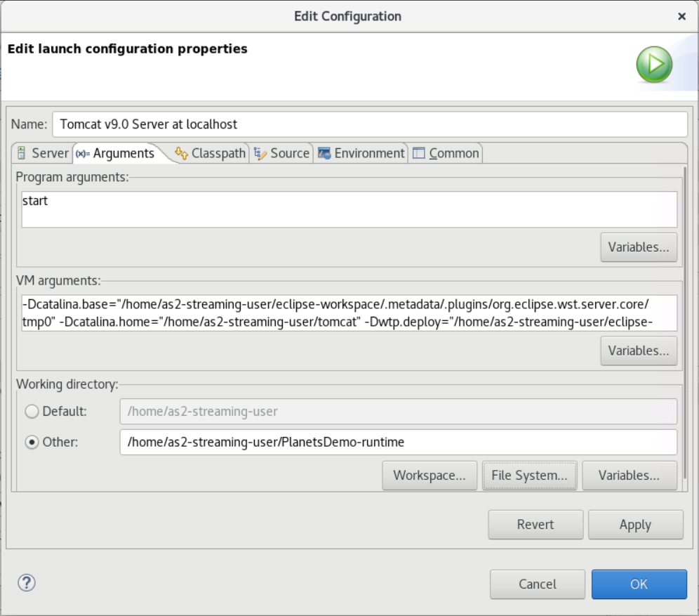 7. Choose the **Modules** tab of the server properties editor and make the
following changes:

    * Choose **Add Web Module** and add
     `PlanetsDemo-service`.
    * Choose **Add External Web Module**. The **Add Web
     Module** dialog window appears. Make the following changes:


    	+ In **Document base**, choose **Browse** and navigate
    	 to `~/webapps/gapwalk-application...war`
    	+ In **Path**, enter `/gapwalk-application`.
    * Choose OK.
    * Choose **Add External Web Module** again and make the following
     changes:


    	+ For **Document base**, enter the path to the frontend .war (in
    	 `PlanetsDemo-web/target`)
    	+ For **Path**, enter `/demo`
    * Choose OK
    * Save the editor modifications (Ctrl + S).

The editor content should now be similar to the following.

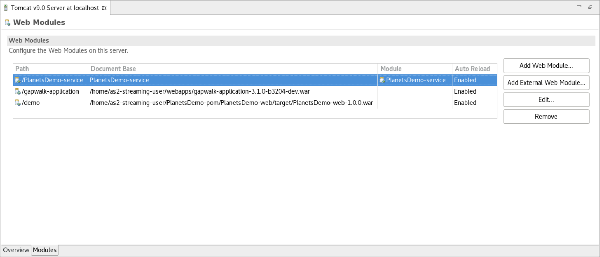

## Step 8: Create the JICS database

In this step, you connect to the database that you created in [Step 1: Create a database](#tutorial-ba-developer-create-db "#tutorial-ba-developer-create-db").

1. From the AppStream 2.0 instance, issue the following command in a terminal to launch
   `pgAdmin`:

```
./pgadmin-start.sh
```

2. Choose an email address and password as login identifiers. Take note of the provided URL
   (typically http://127.0.0.1:5050 ). Launch Google Chrome in the instance, copy and paste the
   URL into the browser, and log in with your identifiers.

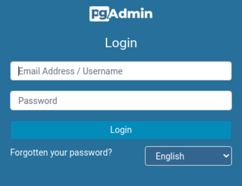 3. After you log in, choose **Add New Server** and enter the connection
information to the previously created database as follows.

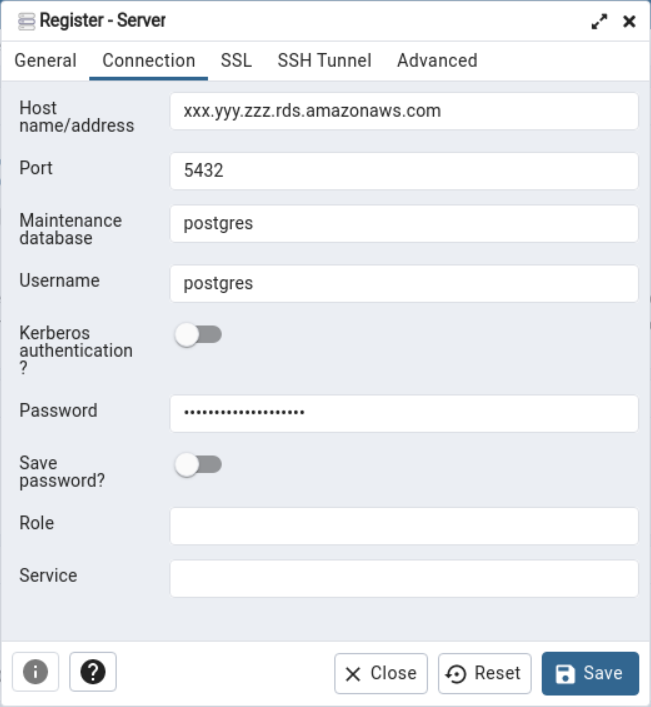 4. When you connect to the database server, use **Object > Create >
Database** and create a new database named **jics**. 5. Edit the database connection information that the demo app used. This information is
defined in `PlanetsDemo-runtime/config/application-main.yml`. Search for the
`jicsDs` entry. To retrieve the values for `username` and
`password`, in the Amazon RDS console, navigate to the database. On the
**Configuration** tab, under **Master Credentials ARN**,
choose **Manage in Secrets Manager**. Then, in the Secrets Manager console, in the secret, choose
**Retrieve secret value**.

## Step 9: Start and test the application

In this step, you start the Tomcat server and the demo application so that you can test
it.

1. To start the Tomcat server and the previously deployed applications, select the server
   entry in the Servers view and choose **Start**. A console appears that
   displays startup logs.
2. Check the server status in the **Servers** view, or wait for the
   **Server startup in [xxx] milliseconds** message in the console. After the
   server starts, check that gapwalk-application is properly deployed. To do this, access the
   **http://localhost:8080/gapwalk-application** URL in a Google Chrome browser.
   You should see the following.

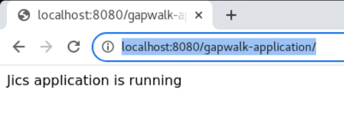 3. Access the deployed application frontend from Google Chrome at http://localhost:8080/demo.
The following **Transaction Launcher** page should appear.

 4. To start the application transaction, enter `PINQ` in the input field, and
choose **Run** (or press Enter).

The demo app screen should appear.

 5. Type a planet name in the corresponding field and press Enter.


## Step 10: Debug the application

In this step, you test using the standard Eclipse debugging features. These features are
available when you work on a modernized application.

1. To open the main service class, press Ctrl + Shift + T. Then enter
   `PlanetsinqProcessImpl`.

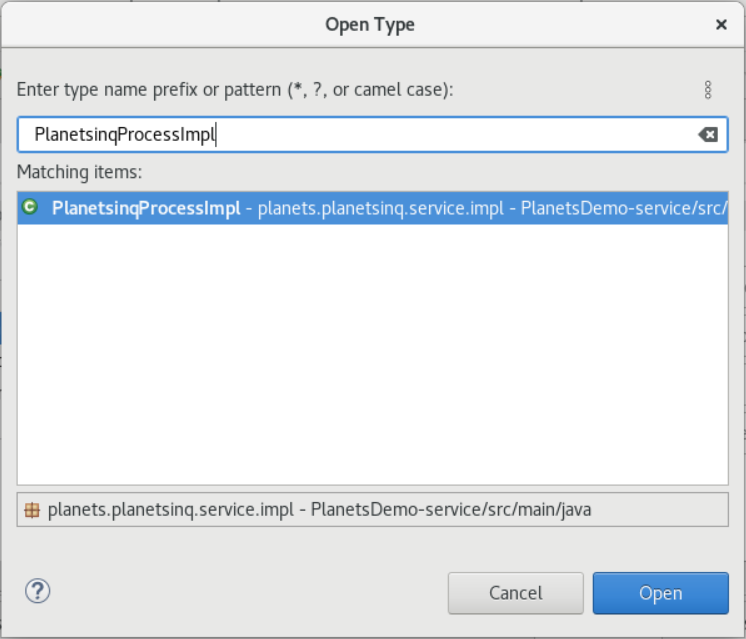 2. Navigate to the `searchPlanet` method, and put a breakpoint there. 3. Select the server name and select **Restart in Debug**. 4. Repeat the previous steps. That is, access the application, input a planet name, and press
Enter.

Eclipse will stop the application in the `searchPlanet` method. Now you can
examine it.

## Clean up resources

If you no longer need the resources that you created for this tutorial, delete them so that
you don't incur additional charges. Complete the following steps:

- If the Planets application is still running, stop it.
- Delete the database that you created in [Step 1: Create a database](#tutorial-ba-developer-create-db "#tutorial-ba-developer-create-db"). For more information, see [Deleting a DB
  instance](../../../AmazonRDS/latest/UserGuide/USER_DeleteInstance.md "../../../AmazonRDS/latest/UserGuide/USER_DeleteInstance.md").
