AWS Mainframe Modernization Service (Managed Runtime Environment experience) will no longer be open to new customers starting on November 7, 2025. If you would like to use the service, please sign up prior to November 7, 2025. For capabilities similar to AWS Mainframe Modernization Service (Managed Runtime Environment experience) explore AWS Mainframe Modernization Service (Self-Managed Experience). Existing customers can continue to use the service as normal. For more information, see
[AWS Mainframe Modernization availability change](mainframe-modernization-availability-change.md "mainframe-modernization-availability-change.md").

# Tutorial: Set up managed runtime for AWS Blu Age

You can deploy a AWS Blu Age modernized application into an AWS Mainframe Modernization runtime environment with a demo
application specified in this tutorial.

###### Topics

- [Prerequisites](#tutorial-runtime-ba-prerequisites "#tutorial-runtime-ba-prerequisites")
- [Step 1: Upload the demo application](#tutorial-runtime-ba-step1 "#tutorial-runtime-ba-step1")
- [Step 2: Create the application definition](#tutorial-runtime-ba-step2 "#tutorial-runtime-ba-step2")
- [Step 3: Create a runtime environment](#tutorial-runtime-ba-step3 "#tutorial-runtime-ba-step3")
- [Step 4: Create an application](#tutorial-runtime-ba-step4 "#tutorial-runtime-ba-step4")
- [Step 5: Deploy an application](#tutorial-runtime-ba-step5 "#tutorial-runtime-ba-step5")
- [Step 6: Start an application](#tutorial-runtime-ba-step6 "#tutorial-runtime-ba-step6")
- [Step 7: Access the application](#tutorial-runtime-ba-step7 "#tutorial-runtime-ba-step7")
- [Step 8: Test the application](#tutorial-runtime-ba-test "#tutorial-runtime-ba-test")
- [Clean up resources](#tutorial-runtime-ba-clean "#tutorial-runtime-ba-clean")

## Prerequisites

To complete this tutorial, download the demo application archive [PlanetsDemo-v4.zip](https://d2azvcayevmroy.cloudfront.net/tutorials/bluage/PlanetsDemo-v4.zip "https://d2azvcayevmroy.cloudfront.net/tutorials/bluage/PlanetsDemo-v4.zip").

The running demo application requires a modern browser for access. Whether you run this
browser from your desktop or from an Amazon Elastic Compute Cloud instance, for example, within the VPC, determines
your security settings.

## Step 1: Upload the demo application

Upload the demo application to an Amazon S3 bucket. Make sure that this bucket is in the same
AWS Region where you will deploy the application. The following example shows a bucket named
**planets-demo**, with a key prefix, or folder, named **v1**
and an archive named `planetsdemo-v4.zip`.

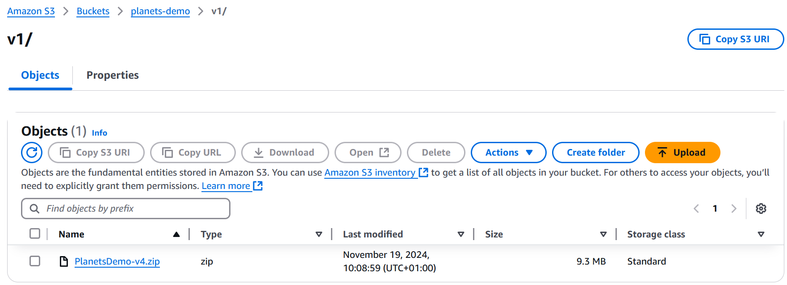

###### Note

The folder in the bucket is required.

## Step 2: Create the application definition

To deploy an application to the managed runtime, you need an AWS Mainframe Modernization application definition.
This definition is a JSON file that describes the application location and settings. The
following example is such an application definition for the demo application:

```
{
    "template-version": "2.0",
    "source-locations": [{
        "source-id": "s3-source",
        "source-type": "s3",
        "properties": {
            "s3-bucket": "planets-demo",
            "s3-key-prefix": "v1"
        }
    }],
    "definition": {
        "listeners": [{
            "port": 8196,
            "type": "http"
        }],
        "ba-application": {
            "app-location": "${s3-source}/PlanetsDemo-v4.zip"
        }
    }
}
```

Change the `s3-bucket` entry to the name of the sample application zip file
(e.g., `planets-demo`), and the `app-location` entry to the S3 path where you
stored the sample application zip file (e.g., `${s3-source}/PlanetsDemo-v4.zip`).

###### Note

Make sure to create the application definition file on your local as a text file.

For more information on the application definition, see [AWS Blu Age application definition
sample](applications-m2-definition.md#applications-m2-definition-ba "applications-m2-definition.md#applications-m2-definition-ba").

## Step 3: Create a runtime environment

To create the AWS Mainframe Modernization runtime environment, perform the following steps:

1. Open the [AWS Mainframe Modernization console](https://us-east-2.console.aws.amazon.com/m2/home?region=us-east-2#/landing "https://us-east-2.console.aws.amazon.com/m2/home?region=us-east-2#/landing").
2. In the AWS Region selector, choose the Region where you want to create the environment.
   This AWS Region must match the Region where you created the S3 bucket in [Step 1: Upload the demo application](#tutorial-runtime-ba-step1 "#tutorial-runtime-ba-step1").
3. Under **Modernize mainframe applications**, choose **Refactor
   with Blu Age**, and then choose **Get started**.

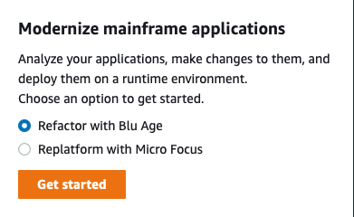 4. Under **How can AWS Mainframe Modernization help**, choose
**Deploy** and **Create runtime environment**.

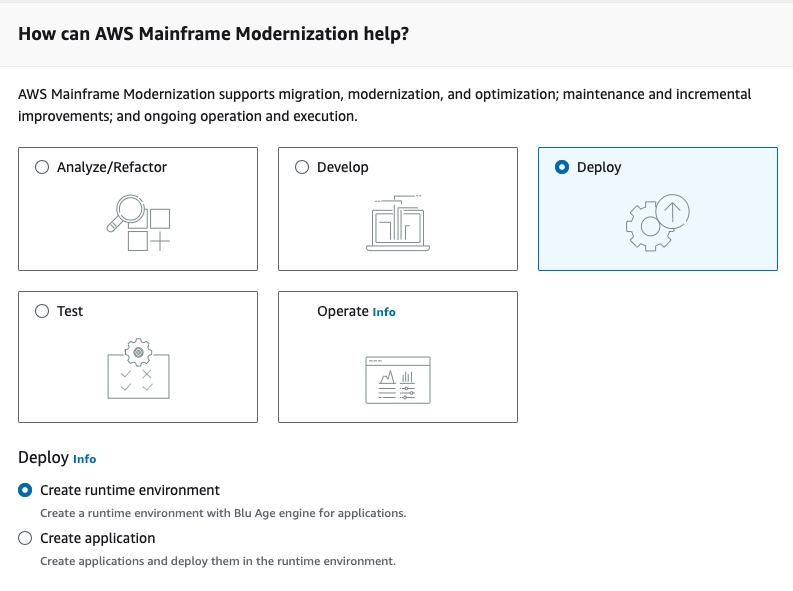 5. In the left navigation, choose **Environments**, then choose
**Create environment**. On the **Specify basic information**
page, enter a name and description for your environment, and then make sure **AWS Blu
Age** engine is selected. Optionally, you can add tags to the created resource. Then
choose **Next**.

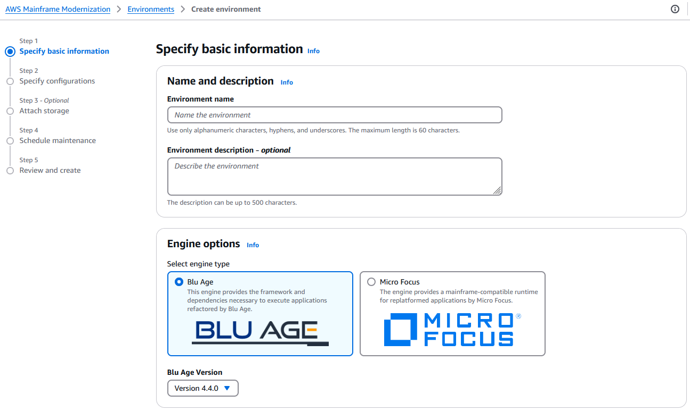 6. On the **Specify configurations** page, choose **Standalone
runtime environment**.

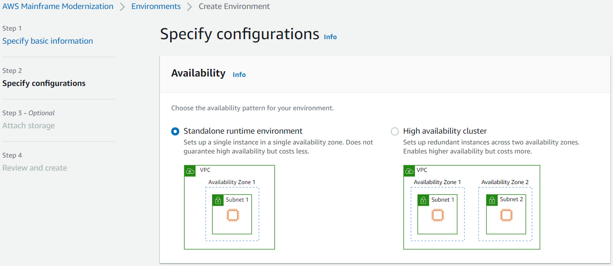 7. Under **Security and network**, make the following changes:

    * Choose **Allow applications deployed to this environment to be publicly
     accessible**. This option assigns a public IP address to the application so that
     you can access it from your desktop.
    * Choose a VPC. You can use the **Default**.
    * Choose two subnets. Make sure that the subnets allow the assignment of public IP
     addresses.
    * Choose a security group. You can use the **Default**. Make sure that
     the security group that you choose allows access from the browser IP address to the port you
     specified in the `listener` property of the application definition. For more
     information, see [Step 2: Create the application definition](#tutorial-runtime-ba-step2 "#tutorial-runtime-ba-step2").

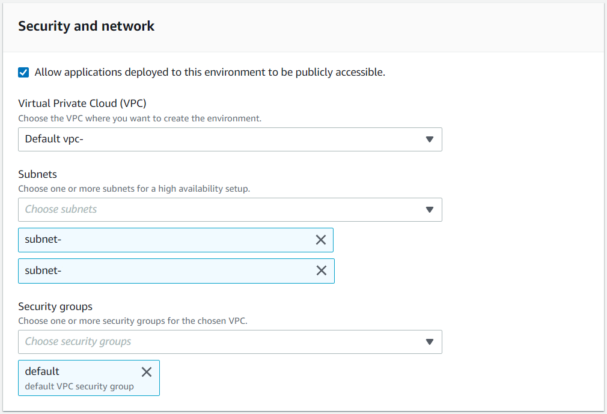

If you want to access the application from outside the VPC that you chose, make sure that
the inbound rules for that VPC are configured properly. For more information, see [Troubleshooting error: Cannot access an application URL](both-application-connectivity.md "both-application-connectivity.md"). 8. Choose **Next**. 9. In **Attach storage - Optional**, leave the default selections and choose
**Next**.

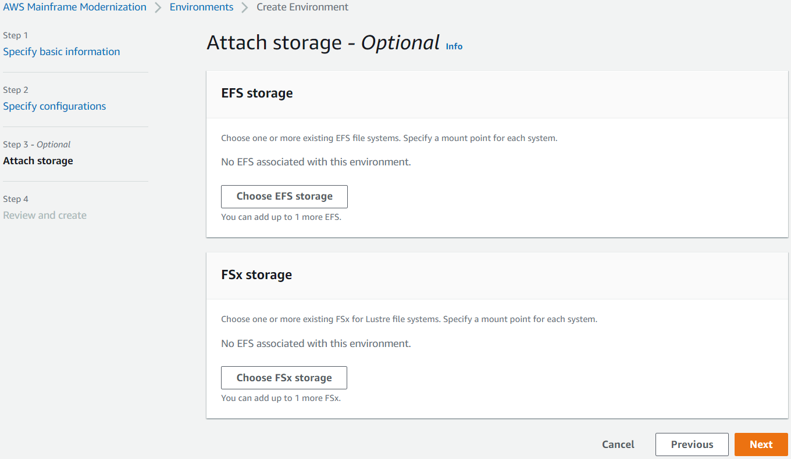 10. In **Schedule maintenance**, choose **No preference**,
and then choose **Next**. 11. In **Review and create**, review the information, and then choose
**Create environment**.

## Step 4: Create an application

1. Navigate to **AWS Mainframe Modernization** in the AWS Management Console.
2. In the navigation pane, choose **Applications**, and then choose
   **Create application**. On the **Specify basic information**
   page, enter a name and description for the application, and make sure that the **AWS
   Blu Age** engine is selected. Then choose **Next**.

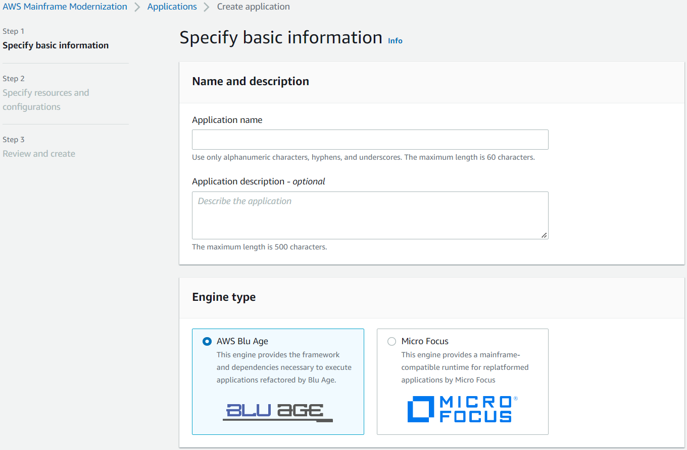 3. On the **Specify resources and configurations** page, copy and paste the
updated application definition JSON you created in [Step 2: Create the application definition](#tutorial-runtime-ba-step2 "#tutorial-runtime-ba-step2").

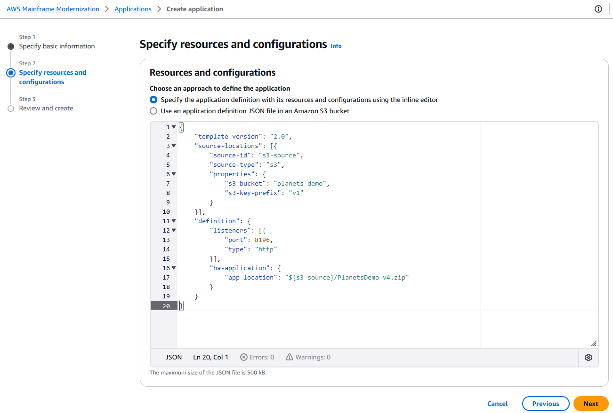 4. In **Review and create**, review your choices, and then choose
**Create application**.

###### Note

If your application creation fails, check the S3 path you entered since it's case
sensitive.

## Step 5: Deploy an application

After you successfully create both the AWS Mainframe Modernization runtime environment and application, and both
are in the **Available** state, you can deploy the application into the runtime
environment. To do this, complete the following steps:

1. Navigate to **AWS Mainframe Modernization** in the AWS Management
   Console. In the navigation pane, choose **Environments**. The Environments
   list page is displayed.

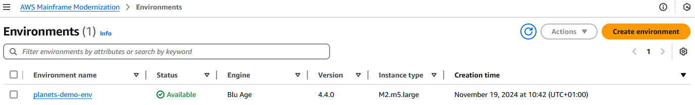 2. Choose the previously created runtime environment. The environment details page is
displayed. 3. Choose **Deploy application**.

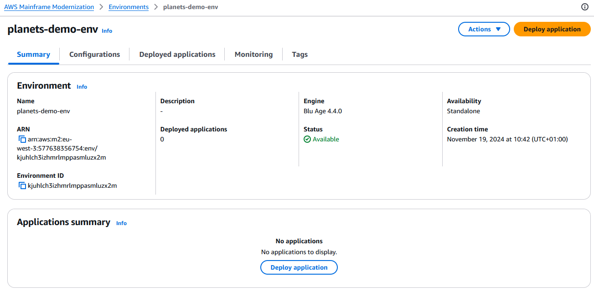 4. Choose the previously created application, then choose the version you want to deploy your
application to. Then choose **Deploy**.

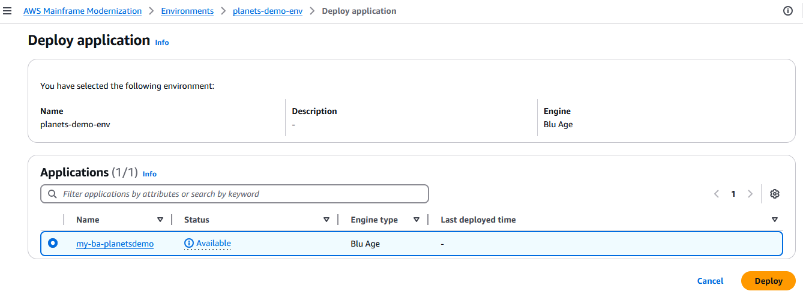 5. Wait until the application finishes its deployment. You'll see a banner with the message
**Application was deployed successfully**.

## Step 6: Start an application

1. Navigate to **AWS Mainframe Modernization** in the AWS Management Console and choose
   **Applications**.
2. Choose your application, and then go to **Deployments**. The status of
   the application should be **Succeeded**.

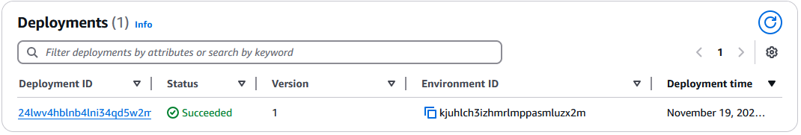 3. Choose **Actions**, and then choose **Start
application**.

## Step 7: Access the application

1.  Wait until the application is in the **Running** state. You'll see a
    banner with the message **Application was started successfully**.
2.  Copy the application DNS hostname. You can find this hostname in the **Application
    information** section of the application.
3.  In a browser, navigate to
    `http://{hostname}:{portname}/PlanetsDemo-web-1.0.0/`, where:

        * `hostname` is the DNS hostname copied previously.
        * `portname` is the Tomcat port defined in the application definition you
         created in [Step 2: Create the application definition](#tutorial-runtime-ba-step2 "#tutorial-runtime-ba-step2").

    The JICS screen appears.

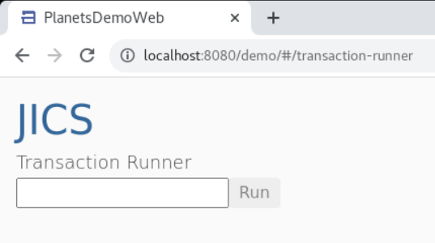

If you can't access the application, see [Troubleshooting error: Cannot access an application URL](both-application-connectivity.md "both-application-connectivity.md").

###### Note

If the application is not accessible, and the inbound rule on security group has 'My IP' selected on port 8196,
specify rule to allow traffic from LB i/p on port 8196.

## Step 8: Test the application

In this step, you run a transaction in the migrated application.

1. On the JICS screen, enter `PINQ` in the input field, and choose
   **Run** (or press Enter) to start the application transaction.

The demo app screen should appear.

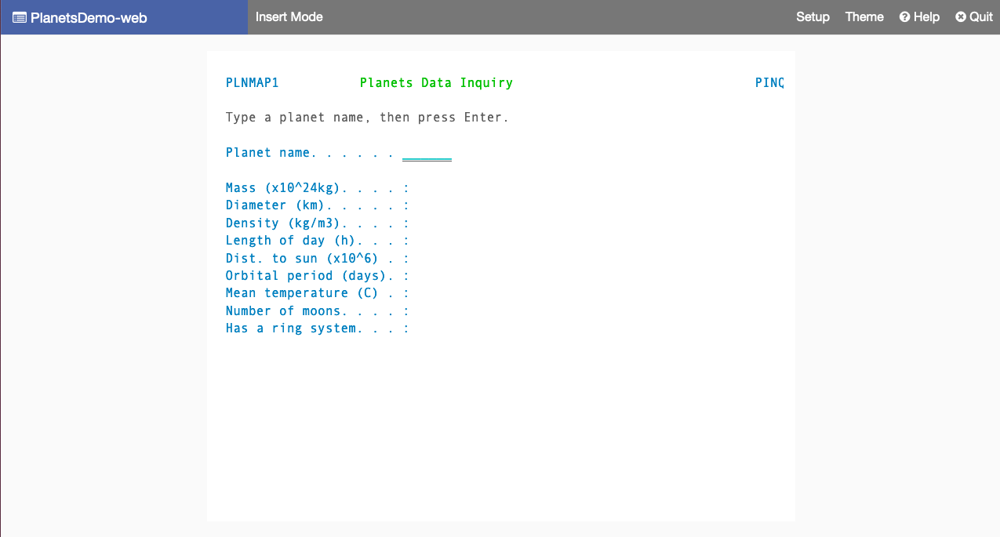 2. Type a planet name in the corresponding field and press Enter.

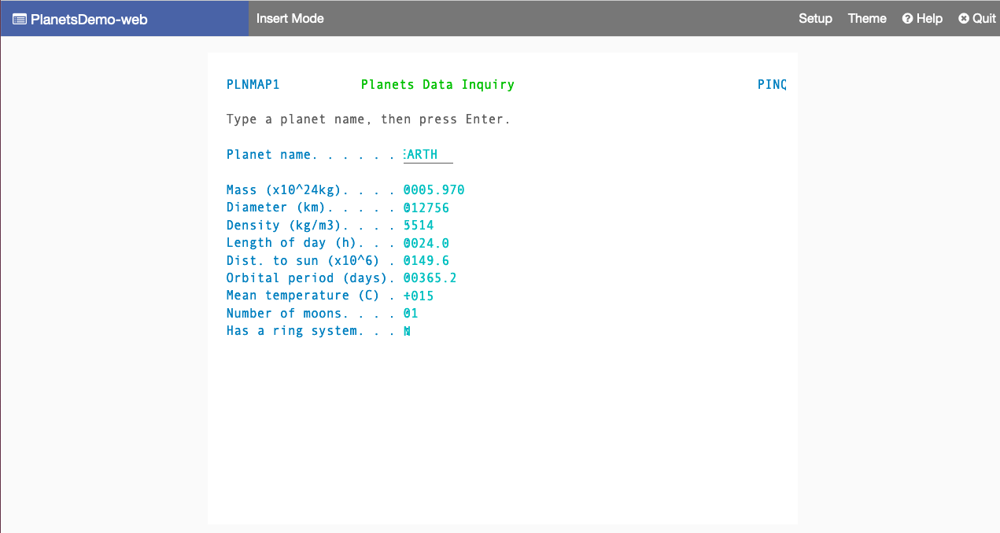

You should see details about the planet.

## Clean up resources

If you no longer need the resources that you created for this tutorial, delete them to avoid
additional charges. To do so, complete the following steps:

- If the AWS Mainframe Modernization application is still running, stop it.
- Delete the application. For more information, see [Delete an AWS Mainframe Modernization application](applications-m2-delete.md "applications-m2-delete.md").
- Delete the runtime environment. For more information, see [Delete an AWS Mainframe Modernization runtime environment](delete-environments-m2.md "delete-environments-m2.md").
