AWS Mainframe Modernization Service (Managed Runtime Environment experience) is no longer open to new customers. For
capabilities similar to AWS Mainframe Modernization Service (Managed Runtime Environment experience) explore AWS Mainframe Modernization Service (Self-Managed
Experience). Existing customers can continue to use the service as normal. For more information, see [AWS Mainframe Modernization
availability change](mainframe-modernization-availability-change.md "mainframe-modernization-availability-change.md").

# Tutorial: Set up managed runtime for Rocket Software (formerly

Micro Focus)

You can deploy and run an application in AWS Mainframe Modernization managed runtime environment with the
Rocket Software runtime engine. This tutorial shows how to deploy and run the CardDemo sample
application in an AWS Mainframe Modernization managed runtime environment with the Rocket Software runtime engine. The
CardDemo sample application is a simplified credit card application developed to test and
showcase AWS and partner technology for mainframe modernization use cases.

In the tutorial, you create resources in other AWS services. These include Amazon Simple Storage Service,
Amazon Relational Database Service, AWS Key Management Service, and AWS Secrets Manager.

###### Topics

- [Prerequisites](#tutorial-runtime-mf-prerequisites "#tutorial-runtime-mf-prerequisites")
- [Step 1: Create and load an Amazon S3 bucket](#tutorial-runtime-mf-s3 "#tutorial-runtime-mf-s3")
- [Step 2: Create and configure a database](#tutorial-runtime-mf-db "#tutorial-runtime-mf-db")
- [Step 3: Create and configure an
  AWS KMS key](#tutorial-runtime-mf-kms "#tutorial-runtime-mf-kms")
- [Step 4: Create and configure an AWS Secrets Manager
  database secret](#tutorial-runtime-mf-secret "#tutorial-runtime-mf-secret")
- [Step 5: Add the sslMode to the
  secret](#tutorial-runtime-mf-ssl-mode "#tutorial-runtime-mf-ssl-mode")
- [Step 6: Create a runtime environment](#tutorial-runtime-mf-env "#tutorial-runtime-mf-env")
- [Step 7: Create an application](#tutorial-runtime-mf-app "#tutorial-runtime-mf-app")
- [Step 8: Deploy an application](#tutorial-runtime-mf-deploy "#tutorial-runtime-mf-deploy")
- [Step 9: Import data sets](#tutorial-runtime-mf-import "#tutorial-runtime-mf-import")
- [Step 10: Start an application](#tutorial-runtime-mf-start "#tutorial-runtime-mf-start")
- [Step 11: Connect to the CardDemo CICS
  application](#tutorial-runtime-mf-connect "#tutorial-runtime-mf-connect")
- [Clean up resources](#tutorial-runtime-mf-clean "#tutorial-runtime-mf-clean")
- [Next steps](#tutorial-runtime-mf-next "#tutorial-runtime-mf-next")

## Prerequisites

- Make sure that you have access to a 3270 emulator to use the CICS connection.
  Free and trial 3270 emulators are available from third party websites.
  Alternatively, you can start an AWS Mainframe Modernization WorkSpaces Applications Rocket Software instance and use the Rumba 3270
  emulator (not available for free).

For information about WorkSpaces Applications, see [Tutorial: Set up WorkSpaces Applications for use with Rocket Enterprise Analyzer and
Rocket Enterprise Developer](set-up-appstream-mf.md "set-up-appstream-mf.md").

###### Note

When creating the stack, choose the Enterprise Developer (ED) option and
not Enterprise Analyzer (EA).

- Download the [CardDemo sample application](https://github.com/aws-samples/aws-mainframe-modernization-carddemo/blob/main/samples/m2/mf/CardDemo_runtime.zip "https://github.com/aws-samples/aws-mainframe-modernization-carddemo/blob/main/samples/m2/mf/CardDemo_runtime.zip") and unzip the downloaded file to any
  local directory. This directory will contain a subdirectory titled
  `CardDemo_runtime`.
- Identify a VPC in your account where you can define the resources created in
  this tutorial. The VPC will need subnets in at least two Availability Zones. For
  more information about Amazon VPC, see [How
  Amazon VPC works](../../../vpc/latest/userguide/how-it-works.md "../../../vpc/latest/userguide/how-it-works.md").

## Step 1: Create and load an Amazon S3 bucket

In this step, you create an Amazon S3 bucket and upload CardDemo files to this bucket.
Later in this tutorial, you use these files to deploy and run the CardDemo sample
application in an AWS Mainframe Modernization Rocket Software Managed Runtime environment.

###### Note

You do not have to create a new S3 bucket but the bucket that you choose must be
in the same Region as other resources used in this tutorial.

###### To create an Amazon S3 bucket

1. Open the [Amazon S3
   console](https://s3.console.aws.amazon.com/s3/home "https://s3.console.aws.amazon.com/s3/home"), and choose **Create
   bucket**.
2. In **General configuration**, choose the
   **AWS Region** where you want to build the AWS Mainframe Modernization
   Rocket Software Managed Runtime.
3. Enter a **Bucket name**, for example,
   `yourname-aws-region-carddemo`. Keep the default
   settings, and choose **Create bucket**.
   Alternatively, you can also copy settings from an existing Amazon S3 bucket and then
   choose **Create bucket**.
4. Choose the bucket that you just created, and then choose **Upload**.
5. In the **Upload** section, choose **Add Folder**, and then browse to the
   `CardDemo_runtime` directory from you local
   computer.
6. Choose **Upload** to start the upload process.
   Upload times vary based on your connection speeds.
7. When the upload completes, confirm that all files have been successfully
   uploaded, and then choose **Close**.

Your Amazon S3 bucket now contains the `CardDemo_runtime` folder.

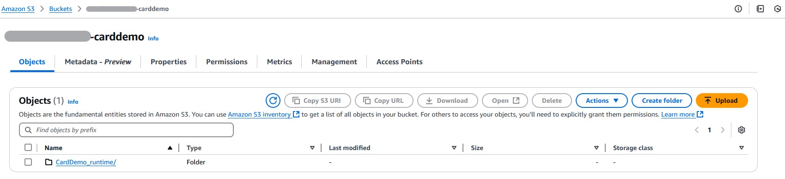

For information about S3 buckets, see [Creating, configuring, and working with Amazon S3 buckets](../../../AmazonS3/latest/userguide/creating-buckets-s3.md "../../../AmazonS3/latest/userguide/creating-buckets-s3.md").

## Step 2: Create and configure a database

In this step, you create a PostgreSQL database in Amazon Relational Database Service (Amazon RDS). For the tutorial,
this database contains the data sets that the CardDemo sample application uses for
customer tasks regarding credit card transactions.

###### To create a database in Amazon RDS

1. Open the [Amazon RDS
   console](https://console.aws.amazon.com/rds/ "https://console.aws.amazon.com/rds/").
2. Choose the AWS Region in which you want to create the database
   instance.
3. From the navigation pane, choose **Databases**.
4. Choose **Create database**, and then choose
   **Standard create**.
5. For **Engine type**, choose **PostgreSQL**.
6. Choose an **Engine version** of 15 or
   higher.

###### Note

Save the engine version because you need it later in this tutorial. 7. In **Templates**, choose **Free tier**. 8. Change the **DB instance identifier** to
something meaningful, for example,
`MicroFocus-Tutorial`. 9. Refrain from managing master credentials in AWS Secrets Manager. Instead, enter a
_master_ password and confirm it.

###### Note

Save the username and password that you use for the database. You will
store them securely in the next steps of this tutorial. 10. Under **Connectivity**, choose the **VPC** where you want to create the AWS Mainframe Modernization managed runtime
environment. 11. Choose **Create database**.

###### To create a custom parameter group in Amazon RDS

1. In the Amazon RDS console navigation pane, choose **Parameter
   groups**, and then choose **Create parameter
   group**.
2. In the **Create parameter group** window, for
   **Parameter group family**, select the
   **Postgres** option that matches your database
   version.

###### Note

Some Postgres versions require a **Type**.
Select **DB Parameter Group** if needed. Enter
a **Group name** and **Description** for the parameter group. 3. Choose **Create**.

###### To configure the custom parameter group

1. Choose the newly created parameter group.
2. Choose **Actions**, and then choose **Edit**.
3. Filter on `max_prepared_transactions` and change the
   parameter value to 100.
4. Choose **Save Changes**.

###### To associate the custom parameter group with the database

1. In the Amazon RDS console navigation pane, choose **Databases**, and then choose the database instance that you want
   to modify.
2. Choose **Modify**. The **Modify DB instance** page appears.

###### Note

The **Modify** option is not available until
the database has finished creating and backing-up, which might take several
minutes. 3. On the **Modify DB instance** page, navigate to
**Additional configuration**, and change the
**DB parameter group** to your parameter group.
If your parameter group is not available in the list, check if it was created
with the correct database version. 4. Choose **Continue**, and check the summary of
modifications. 5. Choose **Apply immediately** to apply the changes
instantly. 6. Choose **Modify DB instance** to save your
changes.

For more information on parameter groups, see [Working with parameter groups](../../../AmazonRDS/latest/UserGuide/USER_WorkingWithParamGroups.md "../../../AmazonRDS/latest/UserGuide/USER_WorkingWithParamGroups.md").

###### Note

You can also use an Amazon Aurora PostgreSQL database with AWS Mainframe Modernization but there is no free tier
option. For more information, see [Working with Amazon Aurora postgreSQL](../../../AmazonRDS/latest/AuroraUserGuide/Aurora.md "../../../AmazonRDS/latest/AuroraUserGuide/Aurora.md").

## Step 3: Create and configure an

AWS KMS key

To store credentials securely for the Amazon RDS instance, first create an
AWS KMS key.

###### To create an AWS KMS key

1. Open the [Key Management
   Service console](https://console.aws.amazon.com/kms/home "https://console.aws.amazon.com/kms/home").
2. Choose **Create Key**.
3. Leave the defaults of **Symmetric** for key type
   and **Encrypt and decrypt** for key usage.
4. Choose **Next**.
5. Give the key an **Alias** such as
   `MicroFocus-Tutorial-RDS-Key` and an optional
   description.
6. Choose **Next**.
7. Assign a key administrator by checking the box next to your user or
   role.
8. Choose **Next** .
9. Assign key usage permission by checking the box next to your user or
   role.
10. Choose **Next**.
11. On the review screen, edit the **Key policy**,
    then enter the following **inside the existing "Statement"
    array**:

```
{
     "Sid" : "Allow access for Mainframe Modernization Service",
     "Effect" : "Allow",
        "Principal" : {
           "Service" : "m2.amazonaws.com"
                 },
      "Action" : "kms:Decrypt",
      "Resource" : "*"
},
```

This policy grants AWS Mainframe Modernization decrypt permissions using this specific key
policy. 12. Choose **Finish** to create the key.

For more information, see [Creating keys](../../../kms/latest/developerguide/create-keys.md "../../../kms/latest/developerguide/create-keys.md") in the AWS Key Management Service Developer Guide.

## Step 4: Create and configure an AWS Secrets Manager

database secret

Now store the database credentials securely using the AWS Secrets Manager and
AWS KMS key.

###### To create and configure an AWS Secrets Manager database secret

1. Open the [Secrets
   Manager console](https://console.aws.amazon.com/secretsmanager/ "https://console.aws.amazon.com/secretsmanager/").
2. In the navigation pane, choose **Secrets**.
3. In **Secrets**, choose **Store a new secret**.
4. Set the **Secret type** to **Credentials for Amazon RDS database**.
5. Enter the **Credentials** that you specified when
   you created the database.
6. Under **Encryption key**, select the key that you
   created in step 3.
7. In the **Database** section, select the database
   that you created for this tutorial, and then choose **Next**.
8. Under **Secret name**, enter a name such as
   `MicroFocus-Tutorial-RDS-Secret` and an optional
   description.
9. In the **Resource permissions** section, choose
   **Edit permissions**, and replace the contents
   with the following policy:

JSON

```
`{
 "Version":"2012-10-17",
 "Statement": [
 {
 "Effect" : "Allow",
 "Principal" : {
 "Service" : "m2.amazonaws.com"
 },
 "Action" : "secretsmanager:GetSecretValue",
 "Resource" : "*"
 }
 ]
}`

```

10. Choose **Save**.
11. Choose **Next** for the subsequent screens, and
    then choose **Store**.

## Step 5: Add the sslMode to the

secret

###### To add the sslMode to the secret

1. Refresh the secrets list to see the new secret.
2. Choose the newly created secret in step 4, and note the `Secret
ARN` because you need it later in the tutorial.
3. In the **Overview** tab of the secret, choose
   **Retrieve secret value**.
4. Choose **Edit**, and then choose **Add row**.
5. Add a **Key** for `sslMode`
   with a **Value** of
   `verify-full`:

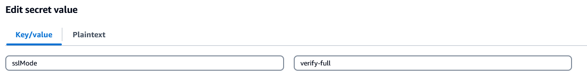 6. Choose **Save**.

## Step 6: Create a runtime environment

###### To create a runtime environment

1. Open the [AWS Mainframe Modernization console](https://us-east-2.console.aws.amazon.com/m2/home?region=us-east-2#/landing "https://us-east-2.console.aws.amazon.com/m2/home?region=us-east-2#/landing").
2. In the navigation pane, choose **Environments**.
   Then choose **Create environment.**

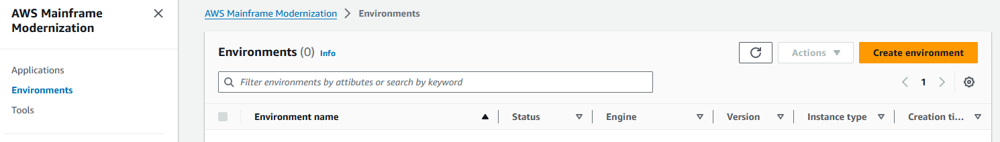 3. Under **Specify basic information**,

    1. Enter `MicroFocus-Environment` for the environment
     name.
    2. Under engine options, make sure **Micro Focus
     (Rocket)** is selected.
    3. Choose the latest **Micro Focus (Rocket)
     Version**.
    4. Choose **Next**.

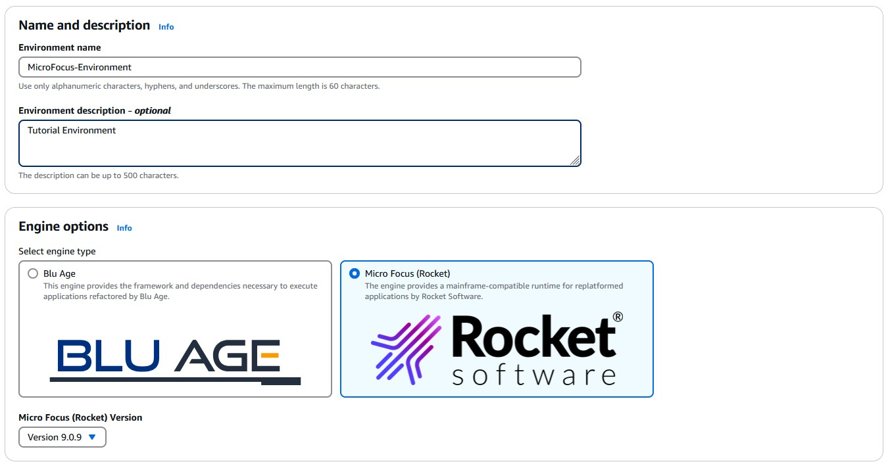 4. Configure the environment

    1. Under **Availability**, choose **High availability cluster**.
    2. Under **Resources**, choose either
     **M2.c5.large** or **M2.m5.large** for the
     instance type, and the number of instances that you want. Specify up to
     two instances.
    3. Under **Security and network**, choose
     **Allow applications deployed to this
     environment to be publicly accessible** and choose at least
     two public subnets.
    4. Choose **Next**.

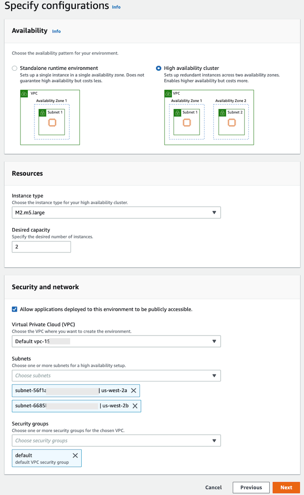 5. On the **Attach storage** page, choose **Next**. 6. On the **Schedule maintenance** page, choose
**No preference** and then choose **Next**.

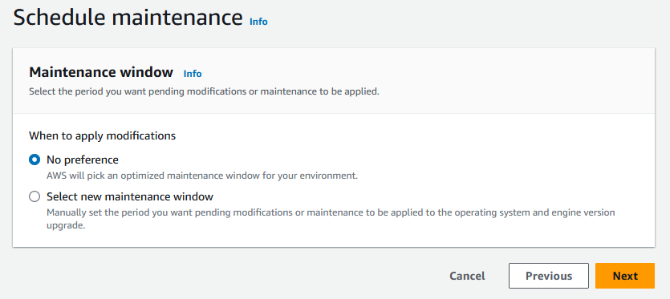 7. On the **Review and create** page, review all the
configurations that you provided for the runtime environment, and then choose
**Create environment**.

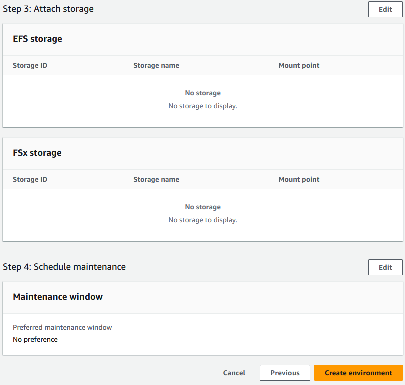

When you've created your environment, a banner appears that says `Environment
 *name* was created successfully`, and the
**Status** field changes to **Available**. The
environment creation process takes several minutes but you can continue with the next
steps while it runs.

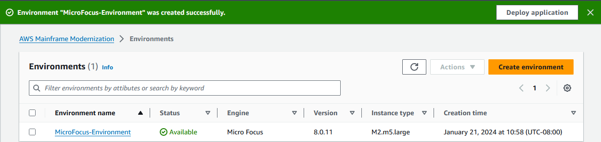

## Step 7: Create an application

###### To create an application

1. In the navigation pane, choose **Applications**. Then choose
   **Create application**.

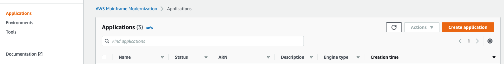 2. On the **Create application** page, under **Specify
basic information**, enter `MicroFocus-CardDemo` for the
application name and under **Engine type** make sure
**Micro Focus (Rocket)** is selected. Then choose
**Next**.

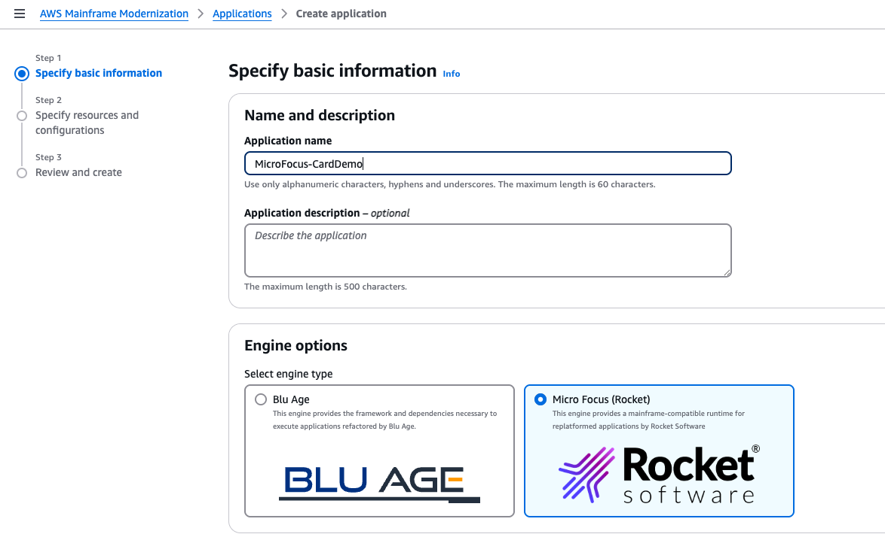 3. Under **Specify resources and configurations**, choose the
option to specify the application definition with its resources and
configurations using the inline editor.

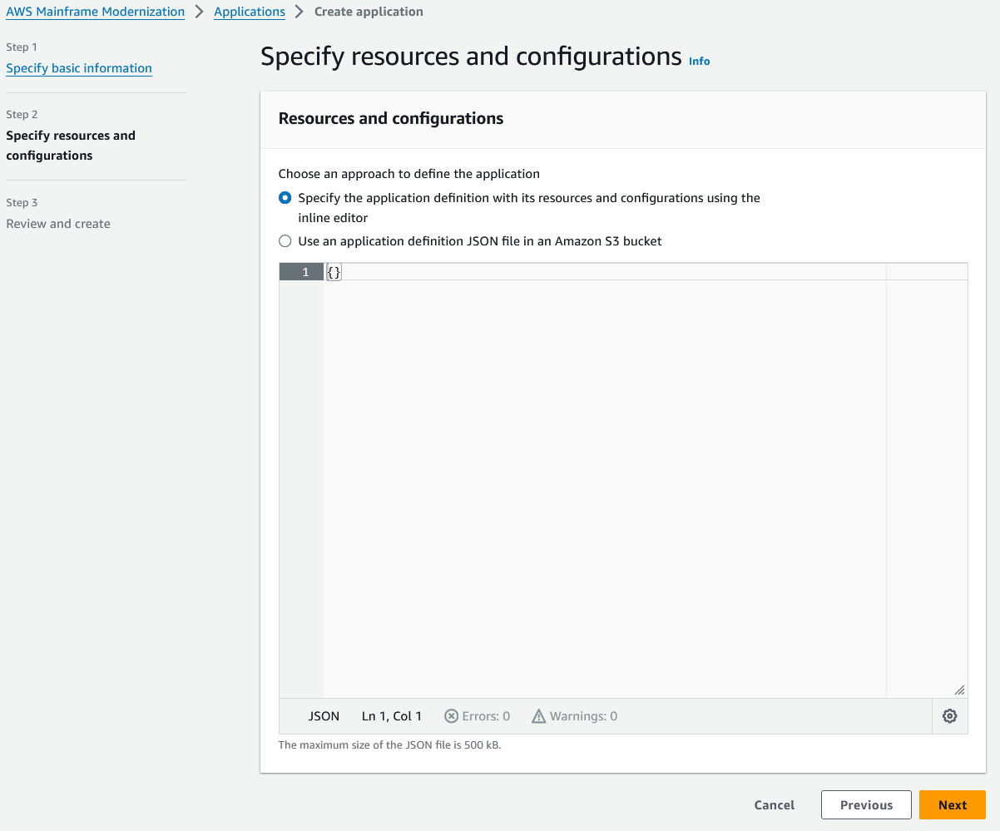

Enter the following application definition in the editor:

```
{
  "template-version": "2.0",
  "source-locations": [
    {
      "source-id": "s3-source",
      "source-type": "s3",
      "properties": {
        "s3-bucket": "`yourname-aws-region-carddemo`",
        "s3-key-prefix": "`CardDemo_runtime`"
      }
    }
  ],
  "definition": {
    "listeners": [
      {
        "port": 6000,
        "type": "tn3270"
      }
    ],
    "dataset-location": {
      "db-locations": [
        {
          "name": "Database1",
          "secret-manager-arn": "arn:aws:secretsmanager:Region:`123456789012`:secret:MicroFocus-Tutorial-RDS-Secret-xxxxxx"
        }
      ]
    },
    "batch-settings": {
      "initiators": [
        {
          "classes": [
               "A",
               "B"
            ],
          "description": "initiator_AB...."
        },
        {
          "classes": [
                "C",
                "D"
             ],
          "description": "initiator_CD...."
        }
      ],
      "jcl-file-location": "${s3-source}/catalog/jcl"
    },
    "cics-settings": {
      "binary-file-location": "${s3-source}/loadlib",
      "csd-file-location": "${s3-source}/rdef",
      "system-initialization-table": "CARDSIT"
    },
    "xa-resources": [
      {
        "name": "XASQL",
        "secret-manager-arn": "arn:aws:secretsmanager:Region:`123456789012`:secret:MicroFocus-Tutorial-RDS-Secret-xxxxxx",
        "module": "${s3-source}/xa/ESPGSQLXA64.so"
      }
    ]
  }
}
```

###### Note

This file is subject to change. 4. Edit the application JSON in the **properties**
object of **source-locations** as follows:

    1. Replace the value for `s3_bucket` with the name of
     the Amazon S3 bucket that you created in Step 1.
    2. Replace the value for `s3-key-prefix` with the
     folder (key prefix) where you uploaded the CardDemo sample files. If you
     uploaded the `CardDemo` directory directly to an Amazon S3
     bucket, then the `s3-key-prefix` doesn’t need to be
     changed.
    3. Replace both `secret-manager-arn` values with the ARN for
     the database secret that you created in Step 4.

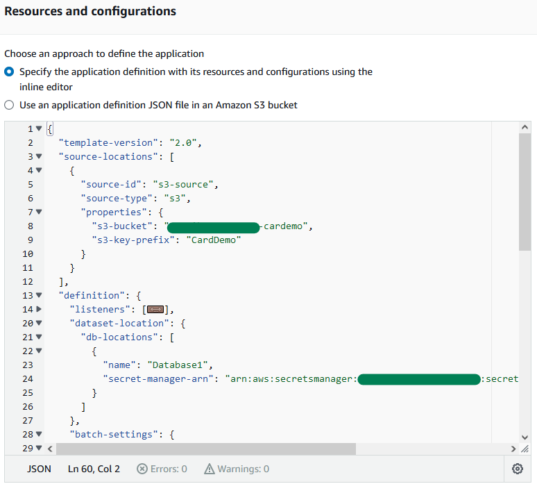

For more information on the application definition, see [Rocket Software (formerly Micro Focus) application
definition](applications-m2-definition.md#applications-m2-definition-mf "applications-m2-definition.md#applications-m2-definition-mf"). 5. Choose **Next** to continue. 6. On the **Review and create** page, review the
information that you provided, and then choose **Create
application**.

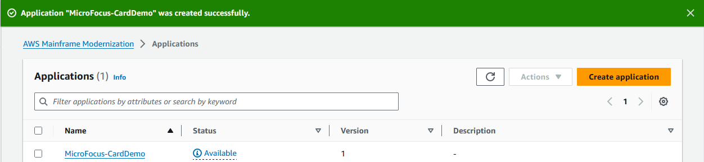

When you've created your application, a banner appears that says `Application
 *name* was created successfully`. And the **Status** field changes to **Available**.

## Step 8: Deploy an application

###### To deploy an application

1. In the navigation pane, choose **Applications**, and then
   choose `MicroFocus-CardDemo`.
2. Under **Deploy application**, choose
   **Deploy**.

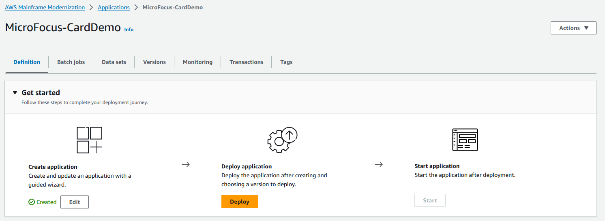 3. Choose the latest version of the application and the environment that you
created previously, and then choose **Deploy**.

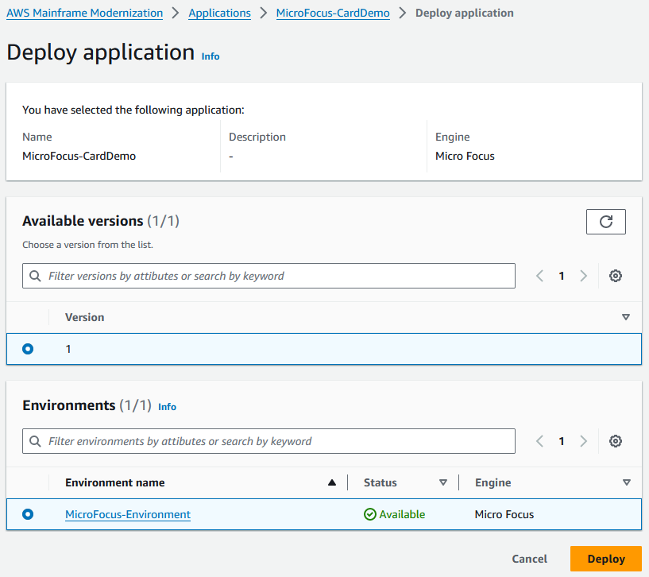

When the CardDemo application deploys successfully, the status changes to
**Ready**.

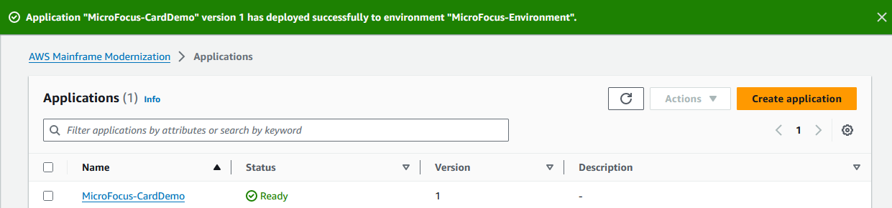

## Step 9: Import data sets

###### To import data sets

1. In the navigation pane, choose **Applications**, and then
   choose the application.
2. Choose the **Data sets** tab. Then choose **Import**.
3. Choose **Import and Edit JSON configuration**,
   and then choose the **Copy and paste your own
   JSON** option.

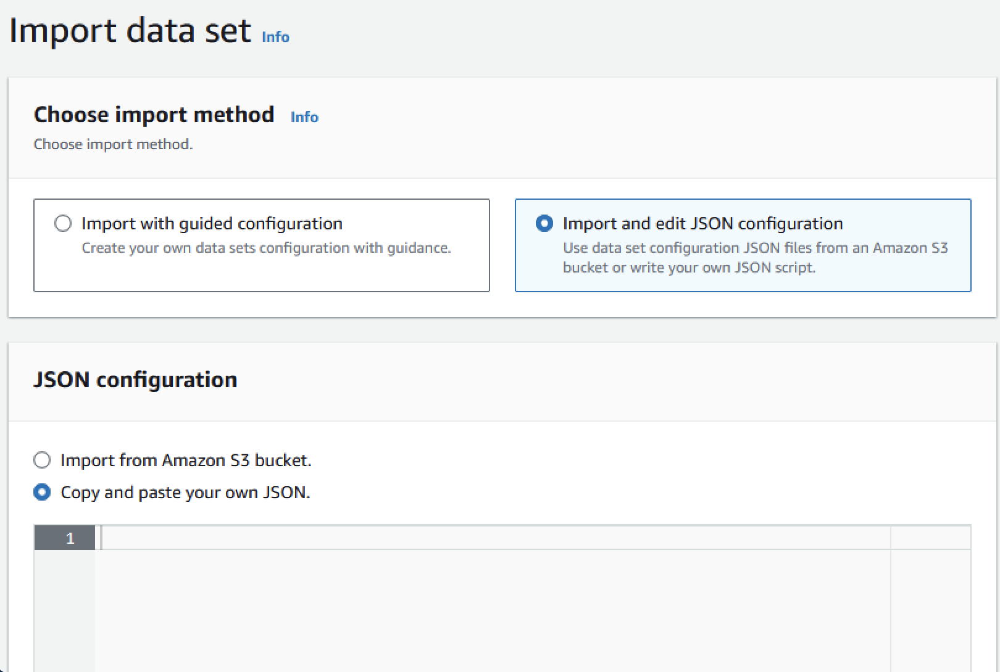 4. Copy and paste the following JSON but don't choose "Submit" yet. This JSON
contains all the data sets required for the demo application but needs your Amazon S3
bucket details.

```
{
    "dataSets": [
        {
            "dataSet": {
                "storageType": "Database",
                "datasetName": "AWS.M2.CARDDEMO.ACCTDATA.VSAM.KSDS",
                "relativePath": "DATA",
                "datasetOrg": {
                    "vsam": {
                        "format": "KS",
                        "encoding": "A",
                        "primaryKey": {
                            "length": 11,
                            "offset": 0
                        }
                    }
                },
                "recordLength": {
                    "min": 300,
                    "max": 300
                }
            },
            "externalLocation": {
                "s3Location": "s3://<s3-bucket-name>/CardDemo_runtime/catalog/data/AWS.M2.CARDDEMO.ACCTDATA.VSAM.KSDS.DAT"
            }
        },
        {
            "dataSet": {
                "storageType": "Database",
                "datasetName": "AWS.M2.CARDDEMO.CARDDATA.VSAM.AIX.PATH",
                "relativePath": "DATA",
                "datasetOrg": {
                    "vsam": {
                        "format": "KS",
                        "encoding": "A",
                        "primaryKey": {
                            "length": 11,
                            "offset": 16
                        }
                    }
                },
                "recordLength": {
                    "min": 150,
                    "max": 150
                }
            },
            "externalLocation": {
                "s3Location": "s3://<s3-bucket-name>/CardDemo_runtime/catalog/data/AWS.M2.CARDDEMO.CARDDATA.VSAM.KSDS.DAT"
            }
        },
        {
            "dataSet": {
                "storageType": "Database",
                "datasetName": "AWS.M2.CARDDEMO.CARDDATA.VSAM.KSDS",
                "relativePath": "DATA",
                "datasetOrg": {
                    "vsam": {
                        "format": "KS",
                        "encoding": "A",
                        "primaryKey": {
                            "length": 16,
                            "offset": 0
                        }
                    }
                },
                "recordLength": {
                    "min": 150,
                    "max": 150
                }
            },
            "externalLocation": {
                "s3Location": "s3://<s3-bucket-name>/CardDemo_runtime/catalog/data/AWS.M2.CARDDEMO.CARDDATA.VSAM.KSDS.DAT"
            }
        },
        {
            "dataSet": {
                "storageType": "Database",
                "datasetName": "AWS.M2.CARDDEMO.CARDXREF.VSAM.KSDS",
                "relativePath": "DATA",
                "datasetOrg": {
                    "vsam": {
                        "format": "KS",
                        "encoding": "A",
                        "primaryKey": {
                            "length": 16,
                            "offset": 0
                        }
                    }
                },
                "recordLength": {
                    "min": 50,
                    "max": 50
                }
            },
            "externalLocation": {
                "s3Location": "s3://<s3-bucket-name>/CardDemo_runtime/catalog/data/AWS.M2.CARDDEMO.CARDXREF.VSAM.KSDS.DAT"
            }
        },
        {
            "dataSet": {
                "storageType": "Database",
                "datasetName": "AWS.M2.CARDDEMO.CUSTDATA.VSAM.KSDS",
                "relativePath": "DATA",
                "datasetOrg": {
                    "vsam": {
                        "format": "KS",
                        "encoding": "A",
                        "primaryKey": {
                            "length": 9,
                            "offset": 0
                        }
                    }
                },
                "recordLength": {
                    "min": 500,
                    "max": 500
                }
            },
            "externalLocation": {
                "s3Location": "s3://<s3-bucket-name>/CardDemo_runtime/catalog/data/AWS.M2.CARDDEMO.CUSTDATA.VSAM.KSDS.DAT"
            }
        },
        {
            "dataSet": {
                "storageType": "Database",
                "datasetName": "AWS.M2.CARDDEMO.CARDXREF.VSAM.AIX.PATH",
                "relativePath": "DATA",
                "datasetOrg": {
                    "vsam": {
                        "format": "KS",
                        "encoding": "A",
                        "primaryKey": {
                            "length": 11,
                            "offset": 25
                        }
                    }
                },
                "recordLength": {
                    "min": 50,
                    "max": 50
                }
            },
            "externalLocation": {
                "s3Location": "s3://<s3-bucket-name>/CardDemo_runtime/catalog/data/AWS.M2.CARDDEMO.CARDXREF.VSAM.KSDS.DAT"
            }
        },
        {
            "dataSet": {
                "storageType": "Database",
                "datasetName": "AWS.M2.CARDDEMO.TRANSACT.VSAM.KSDS",
                "relativePath": "DATA",
                "datasetOrg": {
                    "vsam": {
                        "format": "KS",
                        "encoding": "A",
                        "primaryKey": {
                            "length": 16,
                            "offset": 0
                        }
                    }
                },
                "recordLength": {
                    "min": 350,
                    "max": 350
                }
            },
            "externalLocation": {
                "s3Location": "s3://<s3-bucket-name>/CardDemo_runtime/catalog/data/AWS.M2.CARDDEMO.TRANSACT.VSAM.KSDS.DAT"
            }
        },
        {
            "dataSet": {
                "storageType": "Database",
                "datasetName": "AWS.M2.CARDDEMO.USRSEC.VSAM.KSDS",
                "relativePath": "DATA",
                "datasetOrg": {
                    "vsam": {
                        "format": "KS",
                        "encoding": "A",
                        "primaryKey": {
                            "length": 8,
                            "offset": 0
                        }
                    }
                },
                "recordLength": {
                    "min": 80,
                    "max": 80
                }
            },
            "externalLocation": {
                "s3Location": "s3://<s3-bucket-name>/CardDemo_runtime/catalog/data/AWS.M2.CARDDEMO.USRSEC.VSAM.KSDS.DAT"
            }
        }
    ]
}
```

5. Replace each occurrence of `<s3-bucket-name>` (there are
   eight) with the name of the Amazon S3 bucket that contains the CardDemo folder, for
   example, `your-name-aws-region-carddemo`.

###### Note

To copy the Amazon S3 URI for the folder in Amazon S3, select the folder, and then
choose **Copy Amazon S3 URI**. 6. Choose **Submit**.

When the import finishes, a banner appears with the following message: `Import task with resource
 identifier *name* was completed successfully.` A list of the
imported datasets is shown.

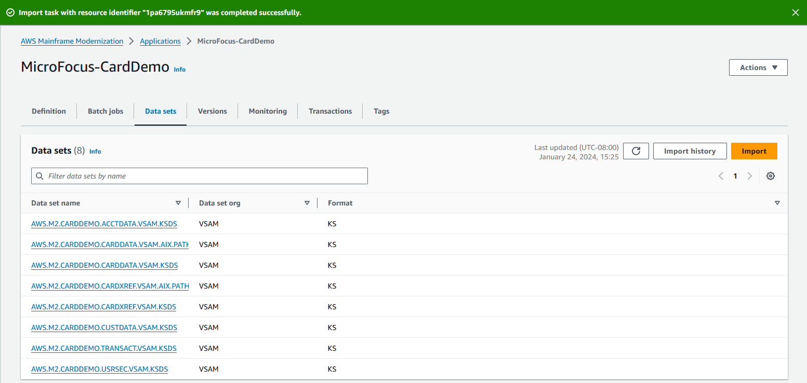

You can also view the status of all data set imports by choosing **Import History** on the **Data sets**
tab.

## Step 10: Start an application

###### To start an application

1. In the navigation pane, choose **Applications**, and then
   choose the application.
2. Choose **Start application**.

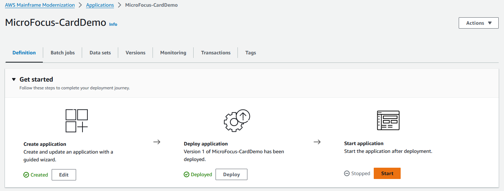

When the CardDemo application starts to run successfully, a banner appears with the
following message: `Application *name*  was started
 successfully`. The **Status** field changes to
**Running**.

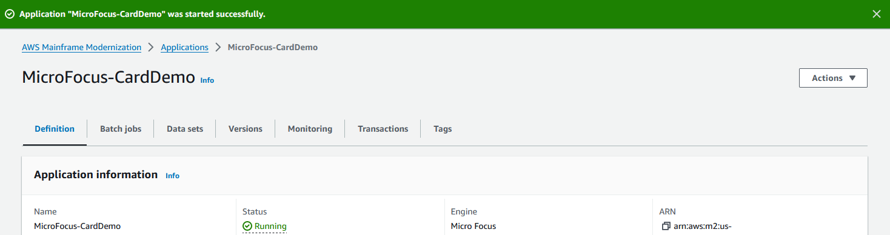

## Step 11: Connect to the CardDemo CICS

application

Before you connect, make sure that the VPC and security group that you specified for
the application are the same as the ones that you applied for your network interface
that you will connect from.

To configure the TN3270 connection, you also need the DNS hostname and the port of the
application.

###### To configure and connect an application to mainframe using terminal

emulator

1. Open the AWS Mainframe Modernization console and choose **Applications**, and then
   choose `MicroFocus-CardDemo`.
2. Choose the copy icon to copy the **DNS
   Hostname**. Also make sure to note the **Ports** number.
3. Start a terminal emulator. This tutorial uses Micro Focus Rumba+.

###### Note

The configuration steps vary by emulator. 4. Choose **Mainframe Display**.

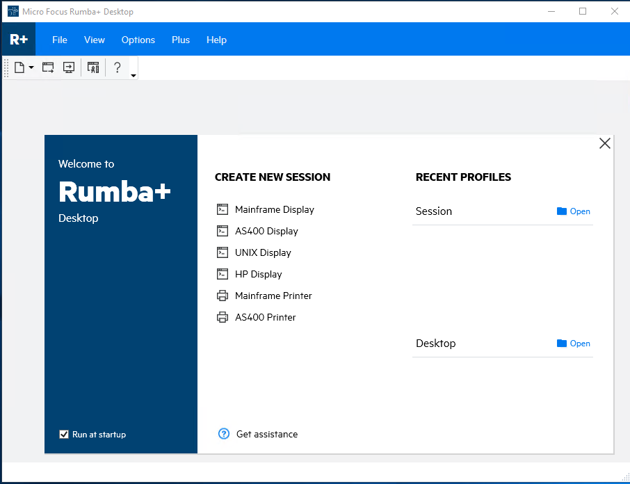 5. Choose **Connection**, and then choose **Configure.**

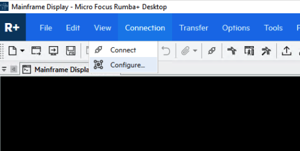 6. Under **Installed Interfaces**, choose
`TN3270`, and then choose `TN3270`
again under the **Connection** menu.

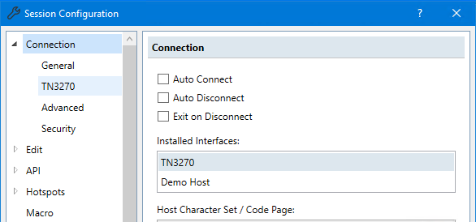 7. Choose **Insert**, and paste the `DNS
 Hostname` for the Application. Specify `6000` for the
**Telnet Port**.

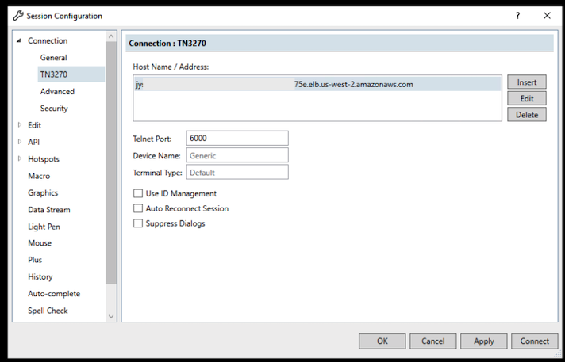

###### Note

If you are using AWS AppStream 2.0 in a browser and having difficulties
with pasting values, please refer to [Troubleshooting AppStream 2.0 User Issues](../../../appstream2/latest/developerguide/troubleshooting-user-issues.md#copy-paste-doesnt-work "../../../appstream2/latest/developerguide/troubleshooting-user-issues.md#copy-paste-doesnt-work"). 8. Under **Connection**, choose **Advanced**, and then choose **Send Keep
Alive** and **Send NOP**, and enter
**180** for the **Interval.**

###### Note

Configuring the keep alive setting on your TN3270 terminal to at least 180
seconds helps ensure that the Network Load Balancer doesn’t drop your
connection.

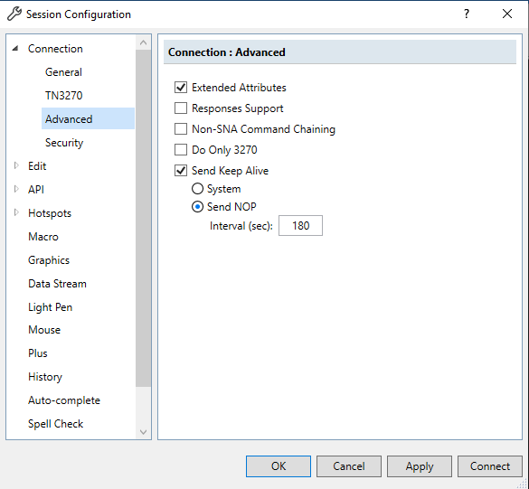 9. Choose **Connect**.

###### Note

If the connection fails:

    * If you are using AppStream 2.0, confirm that the VPC and security
     group specified for the application's environment are the same as the
     AppStream 2.0 fleet.
    * Use the VPC Reachability Analyzer to analyze the connection. You
     can access the Reachability Analyzer through the [console](https://console.aws.amazon.com/networkinsights/home#ReachabilityAnalyzer "https://console.aws.amazon.com/networkinsights/home#ReachabilityAnalyzer").
    * As a diagnostic step, try adding or changing the Security Group
     inbound rules for the application to allow traffic for port 6000
     from anywhere (i.e. CIDR Block 0.0.0.0/0). If you successfully
     connect, then you know the security group was blocking your traffic.
     Change the security group source to something more specific. For
     more information on security groups, see [Security group basics](../../../vpc/latest/userguide/vpc-security-groups.md#security-group-basics "../../../vpc/latest/userguide/vpc-security-groups.md#security-group-basics").

10. Enter `USER0001` for the username and `password` for the
    password.

###### Note

In Rumba, the default for Clear is ctrl-shift-z, and the default for Reset
is ctrl-r.

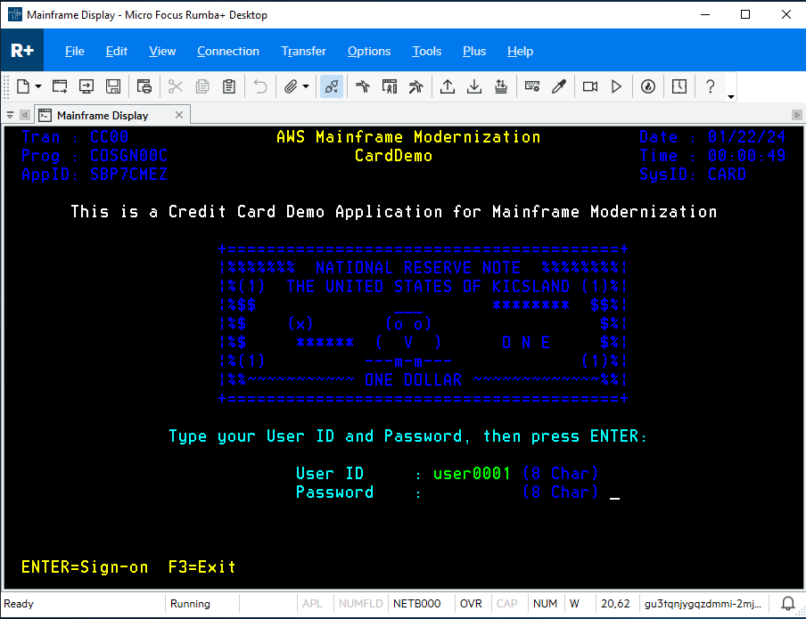 11. After you log in successfully, you can navigate through the CardDemo
application. 12. Enter `01` for the Account View.

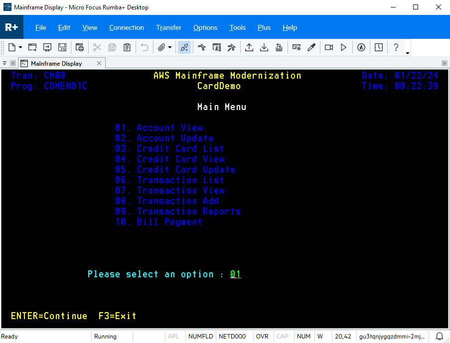 13. Enter `00000000010` for the Account Number and press **Enter** on your keyboard.

###### Note

Other valid accounts are `0000000011` and
`00000000020`.

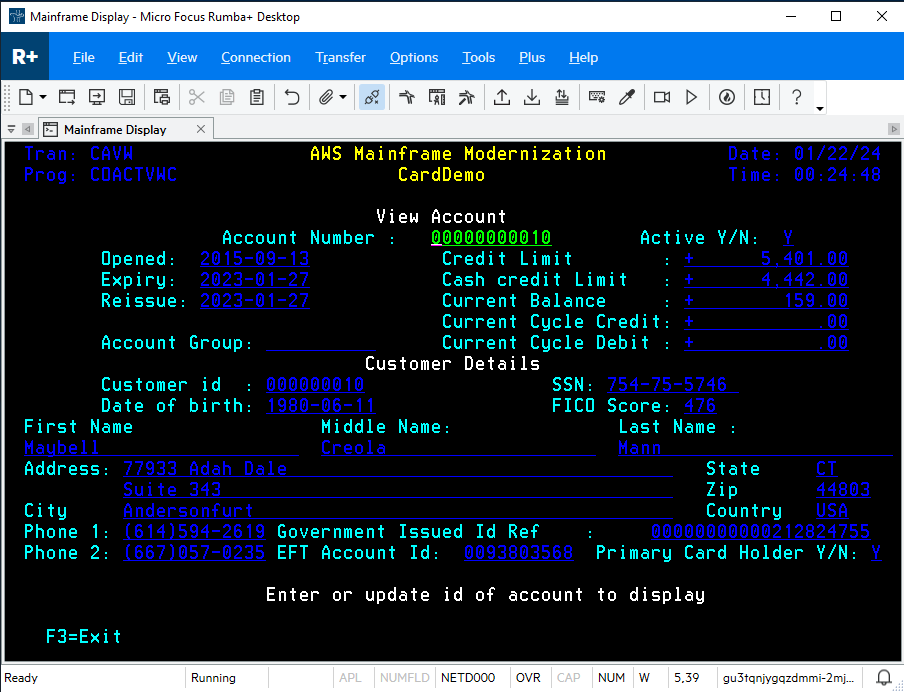 14. Press **F3** to Exit to the menu, and **F3** to
exit the transaction.

## Clean up resources

If you no longer need the resources that you created for this tutorial, delete them to
avoid additional charges. To do so, complete the following steps:

- If necessary, stop the application.
- Delete the application. For more information, see [Delete an AWS Mainframe Modernization application](applications-m2-delete.md "applications-m2-delete.md").
- Delete the runtime environment. For more information, see [Delete an AWS Mainframe Modernization runtime environment](delete-environments-m2.md "delete-environments-m2.md").
- Delete the Amazon S3 buckets that you created for this tutorial. For more
  information, see [Deleting a bucket](../../../AmazonS3/latest/userguide/delete-bucket.md "../../../AmazonS3/latest/userguide/delete-bucket.md") in the _Amazon S3 User Guide_.
- Delete the AWS Secrets Manager secret that you created for this tutorial. For more
  information, see [Delete a secret](../../../secretsmanager/latest/userguide/manage_delete-secret.md "../../../secretsmanager/latest/userguide/manage_delete-secret.md").
- Delete the KMS key that you created for this tutorial. For more information,
  see [Deleting AWS KMS keys](../../../kms/latest/developerguide/deleting-keys.md "../../../kms/latest/developerguide/deleting-keys.md").
- Delete the Amazon RDS database that you created for this tutorial. For more
  information, see [Delete the EC2 instance and DB instance](../../../AmazonRDS/latest/UserGuide/CHAP_GettingStarted.CreatingConnecting.md#CHAP_GettingStarted.Deleting.PostgreSQL "../../../AmazonRDS/latest/UserGuide/CHAP_GettingStarted.CreatingConnecting.md#CHAP_GettingStarted.Deleting.PostgreSQL") in the
  _Amazon RDS User Guide_.
- If you added a Security Group rule for port 6000, delete the rule.

## Next steps

To learn how to set up a development environment for your modernized
applications, see [Tutorial: Set up AppStream 2.0 for use with Rocket Enterprise Analyzer
and Rocket Enterprise Developer](set-up-appstream-mf.md "set-up-appstream-mf.md").
