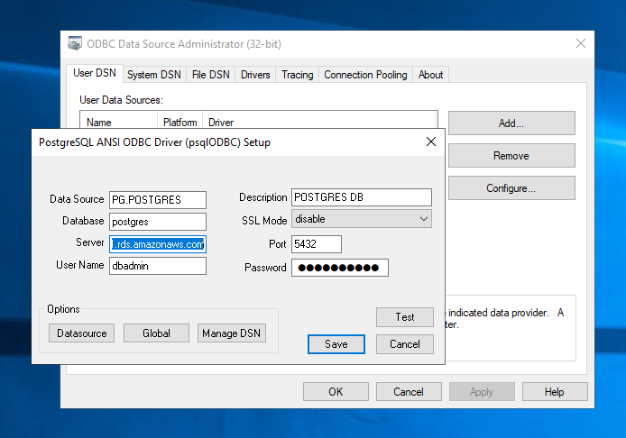
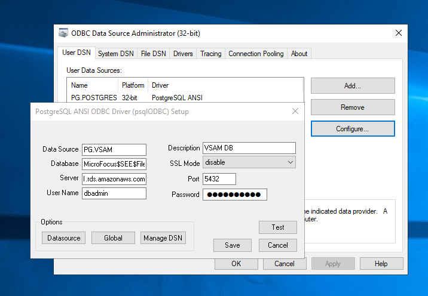
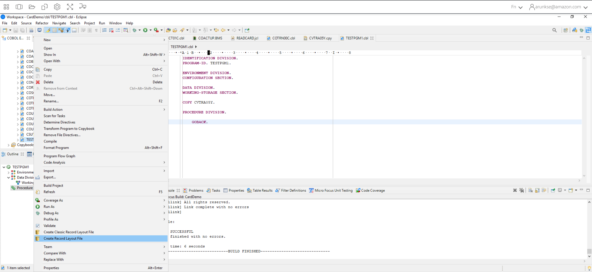
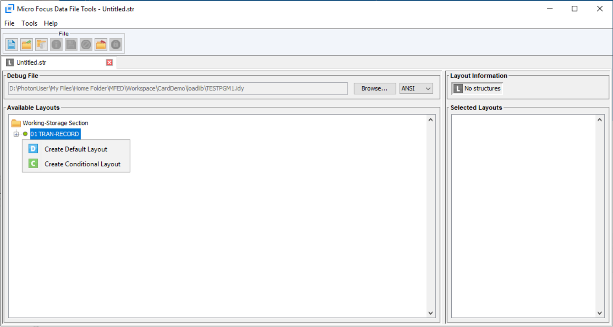
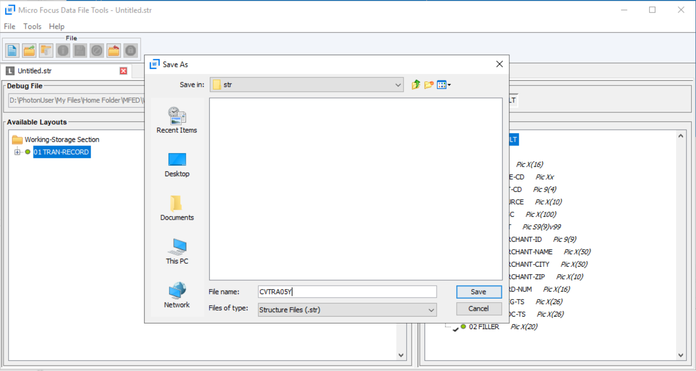
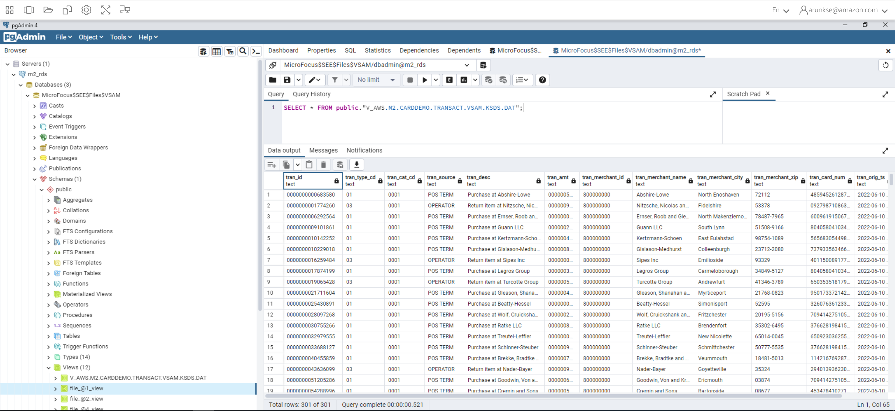

AWS Mainframe Modernization Service (Managed Runtime Environment experience) is no longer open to new customers. For
capabilities similar to AWS Mainframe Modernization Service (Managed Runtime Environment experience) explore AWS Mainframe Modernization Service (Self-Managed
Experience). Existing customers can continue to use the service as normal. For more information, see [AWS Mainframe Modernization
availability change](mainframe-modernization-availability-change.md "mainframe-modernization-availability-change.md").

# View data sets as tables and columns in Rocket Enterprise Developer (formerly

Micro Focus Enterprise Developer)

You can access mainframe datasets that are deployed in AWS Mainframe Modernization using the Rocket Software (formerly Micro Focus)
runtime. You can view the migrated data sets as tables and columns from an Rocket Enterprise Developer instance. Viewing
data sets this way allows you to:

- Perform `SQL SELECT` operations on the migrated data files.
- Expose data outside the migrated mainframe application without changing the application.
- Easily filter data and save as CSV or other file formats.

###### Note

Steps 1 and 2 are one time activities. Repeat steps 3 and 4 for each data set to create the database views.

###### Topics

- [Prerequisites](#view-datasets-tables-m2.prereq "#view-datasets-tables-m2.prereq")
- [Step 1: Set up ODBC Connection to Rocket Software datastore
  (Amazon RDS database)](#view-datasets-tables-m2.odbc "#view-datasets-tables-m2.odbc")
- [Step 2: Create the MFDBFH.cfg file](#view-datasets-tables-m2.config "#view-datasets-tables-m2.config")
- [Step 3: Create a structure (STR) file for your copybook layout](#view-datasets-tables-m2.str "#view-datasets-tables-m2.str")
- [Step 4: Create a database view using the structure (STR) file](#view-datasets-tables-m2.dbview "#view-datasets-tables-m2.dbview")
- [Step 5: View Rocket Software (formerly Micro Focus) data sets as
  tables and columns](#view-datasets-tables-m2.cols "#view-datasets-tables-m2.cols")

## Prerequisites

- You must have access to Rocket Enterprise Developer Desktop via WorkSpaces Applications.
- You must have an application deployed and running under AWS Mainframe Modernization using the Rocket Software runtime
  engine.
- You are storing your application data in Aurora PostgreSQL-Compatible Edition.

## Step 1: Set up ODBC Connection to Rocket Software datastore

(Amazon RDS database)

In this step, you set up an ODBC connection to the database that contains the data you want to view as tables and columns.
This is a one-time only step.

1. Log in to Rocket Enterprise Developer Desktop using WorkSpaces Applications streaming URL.
2. Open **ODBC Data Source Administrator**, choose **User DSN** and then choose **Add**.
3. In **Create New Data Source**, choose **PostgreSQL ANSI** and then choose **Finish**.
4. Create a data source for `PG.POSTGRES` by providing the necessary database information, as follows:

```
Data Source : PG.POSTGRES
Database    : postgres
Server      : `rds_endpoint`.rds.amazonaws.com
Port        : 5432
User Name   : `user_name`
Password    : `user_password`
```

 5. Choose **Test** to make sure the connection works.
You should see the message `Connection successful` if the test succeeds.

If the test doesn't succeed, review the following information.

    * [Troubleshooting for Amazon RDS](../../../AmazonRDS/latest/UserGuide/CHAP_Troubleshooting.md "../../../AmazonRDS/latest/UserGuide/CHAP_Troubleshooting.md")
    * [How do I resolve problems when connecting to my Amazon RDS DB instance?](https://repost.aws/knowledge-center/rds-cannot-connect "https://repost.aws/knowledge-center/rds-cannot-connect")

6. Save the data source.
7. Create a data source for `PG.VSAM`, test the connection, and save the data source.
   Provide the following database information:

```
Data Source : PG.VSAM
Database    : MicroFocus$SEE$Files$VSAM
Server      : `rds_endpoint`.rds.amazonaws.com
Port        : 5432
User Name   : `user_name`
Password    : `user_password`
```



## Step 2: Create the MFDBFH.cfg file

In this step, you create a configuration file that describes the Micro Focus data store. This is a
one-time only configuration step.

1. In your Home Folder, for example, in `D:\PhotonUser\My Files\Home Folder\MFED\cfg\MFDBFH.cfg`, create the MFDBFH.cfg file with the following content.

```
<datastores>
       <server name="ESPACDatabase" type="postgresql" access="odbc">
        <dsn name="PG.POSTGRES" type="database" dbname="postgres"/>
        <dsn name="PG.VSAM" type="datastore" dsname="VSAM"/>
       </server>
      </datastores>
```

2. Verify the MFDBFH configuration by running the following commands to query the Micro Focus datastore:

```
*##*
*## Test the connection by running the following commands*
*##*

set MFDBFH_CONFIG="D:\PhotonUser\My Files\Home Folder\MFED\cfg\MFDBFH.cfg"

dbfhdeploy list sql://ESPACDatabase/VSAM?folder=/DATA
```

## Step 3: Create a structure (STR) file for your copybook layout

In this step, you create a structure file for your copybook layout so that you can use it later to create database views from the data sets.

1. Compile the program that is associated with your copybook.
   If no program is using the copybook, create and compile a simple program like the following with a COPY statement for your copybook.

```
IDENTIFICATION DIVISION.
      PROGRAM-ID. TESTPGM1.

      ENVIRONMENT DIVISION.
      CONFIGURATION SECTION.

      DATA DIVISION.
      WORKING-STORAGE SECTION.

      **COPY CVTRA05Y.**

      PROCEDURE DIVISION.

      GOBACK.
```

2. After successful compilation, right click on the program and choose **Create Record Layout File**.
   This will open the Micro Focus Data File Tools using the .idy file generated during the compilation.

 3. Right click on the Record structure and choose **Create Default Layout** (single structure) or **Create Conditional Layout** (multi structure) depending on the layout.

For more information, see [Creating Structure Files and Layouts](https://www.microfocus.com/documentation/enterprise-developer/ed60/ES-WIN/GUID-6EDDA4C3-F09E-4CEC-9CF8-281D9D7453C3.html "https://www.microfocus.com/documentation/enterprise-developer/ed60/ES-WIN/GUID-6EDDA4C3-F09E-4CEC-9CF8-281D9D7453C3.html") in the Micro Focus documentation.

 4. After creating the layout, choose **File** from the menu and then choose **Save As**.
Browse and save the file under your Home Folder with same file name as your copybook.
You can choose to create a folder called `str` and save all your structure files there.



## Step 4: Create a database view using the structure (STR) file

In this step, you use the previously created structure file to create a database view for a data set.

- Use the `dbfhview` command to create a database view for a data set that is already in the Micro Focus datastore as shown in the following example.

```
##
      ## The below command creates database view for VSAM file AWS.M2.CARDDEMO.TRANSACT.VSAM.KSDS
      ## using the STR file CVTRA05Y.str
      ##

      dbfhview -create -struct:"D:\PhotonUser\My Files\Home Folder\MFED\str\CVTRA05Y.str" -name:V_AWS.M2.CARDDEMO.TRANSACT.VSAM.KSDS.DAT -file:sql://ESPACDatabase/VSAM/AWS.M2.CARDDEMO.TRANSACT.VSAM.KSDS.DAT?folder=/DATA

      ##
      ## Output:
      ##

      Micro Focus Database File Handler - View Generation Tool Version 8.0.00
      Copyright (C) 1984-2022 Micro Focus. All rights reserved.

      VGN0017I Using structure definition 'TRAN-RECORD-DEFAULT'
      VGN0022I View 'V_AWS.M2.CARDDEMO.TRANSACT.VSAM.KSDS.DAT' installed in datastore 'sql://espacdatabase/VSAM'
      VGN0002I The operation completed successfully
```

## Step 5: View Rocket Software (formerly Micro Focus) data sets as

tables and columns

In this step, connect to the database using `pgAdmin` so you can run queries to view the datasets like tables and columns.

- Connect to the database `MicroFocus$SEE$Files$VSAM` using pgAdmin and query the database view you created in step 4.

```
SELECT * FROM public."V_AWS.M2.CARDDEMO.TRANSACT.VSAM.KSDS.DAT";
```


