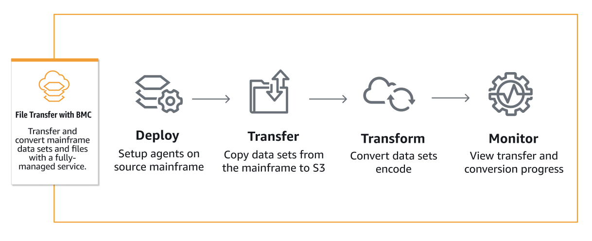
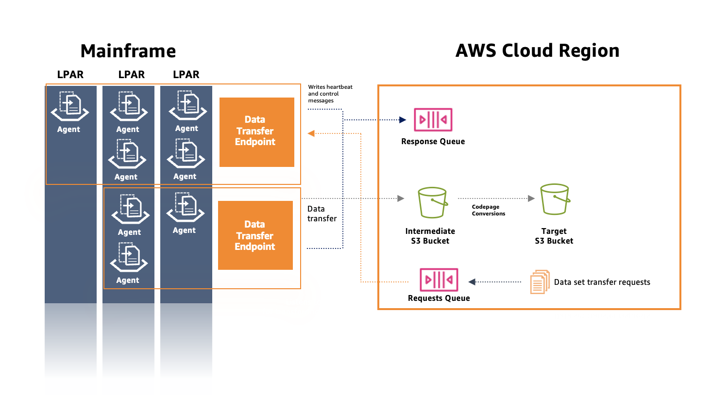

AWS Mainframe Modernization Service (Managed Runtime Environment experience) will no longer be open to new customers starting on November 7, 2025. If you would like to use the service, please sign up prior to November 7, 2025. For capabilities similar to AWS Mainframe Modernization Service (Managed Runtime Environment experience) explore AWS Mainframe Modernization Service (Self-Managed Experience). Existing customers can continue to use the service as normal. For more information, see
[AWS Mainframe Modernization availability change](mainframe-modernization-availability-change.md "mainframe-modernization-availability-change.md").

# What is AWS Mainframe Modernization File Transfer?

With AWS Mainframe Modernization File Transfer, you can transfer and convert datasets and files with a fully managed
service to accelerate and simplify modernization, migration, and augmentation use cases to
the AWS Mainframe Modernization service and Amazon S3.

###### Topics

- [Benefits of AWS Mainframe Modernization File Transfer](#filetransfer-benefit-overview "#filetransfer-benefit-overview")
- [How AWS Mainframe Modernization File Transfer works](#filetransfer-how "#filetransfer-how")

## Benefits of AWS Mainframe Modernization File Transfer

AWS Mainframe Modernization File Transfer helps you transfer datasets from mainframe to Amazon S3. Some benefits
include:

- Discovery of source mainframe datasets and artifacts
- Automated transfers and datasets conversion
- Scalability, efficiency, and speed to achieve faster dataset transfers to
  AWS

## How AWS Mainframe Modernization File Transfer works

The following figure is an overview of how AWS Mainframe Modernization File Transfer works on a conceptual
level.

The following figure is an architectural overview of AWS Mainframe Modernization File Transfer feature.

