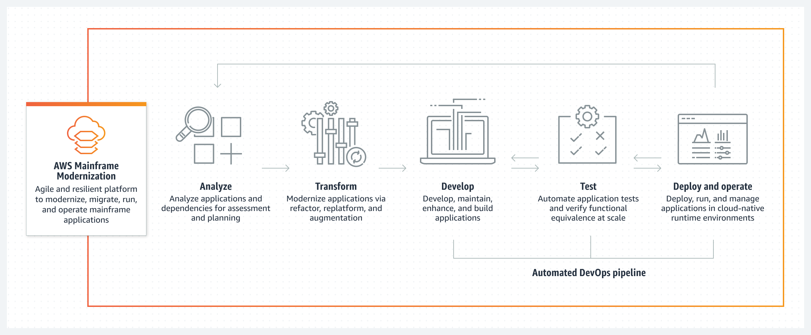

AWS Mainframe Modernization Service (Managed Runtime Environment experience) is no longer open to new customers. For
capabilities similar to AWS Mainframe Modernization Service (Managed Runtime Environment experience) explore AWS Mainframe Modernization Service (Self-Managed
Experience). Existing customers can continue to use the service as normal. For more information, see [AWS Mainframe Modernization
availability change](mainframe-modernization-availability-change.md "mainframe-modernization-availability-change.md").

# What is AWS Mainframe Modernization?

AWS Mainframe Modernization helps you modernize your mainframe applications to AWS managed runtime
environments. It provides tools and resources to help you plan and implement migration and
modernization. You can analyze your existing mainframe applications, develop or update them using
COBOL or PL/I, and implement an automated pipeline for continuous integration and continuous
delivery (CI/CD) of the applications. You can choose between automated refactoring and
replatforming patterns, depending on your clients' needs. If you are a consultant helping a client
migrate their mainframe workloads, you can use AWS Mainframe Modernization tools for all phases of the migration and
modernization journey, from initial planning to post-migration cloud operations.

You can use AWS Mainframe Modernization to help you efficiently create and manage the runtime environment on AWS
for your mainframe applications, as well as to manage and monitor your modernized
applications.

###### Topics

- [Features of AWS Mainframe Modernization](#servicename-feature-overview "#servicename-feature-overview")
- [Patterns](#servicename-feature-overview.patterns "#servicename-feature-overview.patterns")
- [How to get started with AWS Mainframe Modernization](#servicename-how-to-get-started "#servicename-how-to-get-started")
- [Related services](#related-services "#related-services")
- [Accessing AWS Mainframe Modernization](#accessing-servicename "#accessing-servicename")
- [Are you a first-time AWS Mainframe Modernization user?](#first-time-user "#first-time-user")
- [Pricing for AWS Mainframe Modernization](#m2-pricing "#m2-pricing")

###### Note

Have you engaged with AWS Mainframe Migration Competency Partners or AWS Professional
Services for your mainframe modernization project? If not, we highly recommend that you engage
experts for your project.

- [AWS Mainframe Modernization Competency Partners](https://aws.amazon.com/mainframe/partner-solutions/ "https://aws.amazon.com/mainframe/partner-solutions/")
- [AWS
  Professional Services](https://aws.amazon.com/professional-services/ "https://aws.amazon.com/professional-services/")
  The features and use cases of AWS Mainframe Modernization support an evolutionary modernization approach, which
  provides short-term wins by improving agility and plenty of opportunities to optimize and innovate
  later on. For more information, see [Modernization approach](modernization-m2.md "modernization-m2.md").

## Features of AWS Mainframe Modernization

AWS Mainframe Modernization features support the following use cases:

- Assess: AWS Mainframe Modernization's assessment capability can help you assess, scope, and plan a migration and
  modernization project.
- Refactor: powered by AWS Blu Age, you can use refactoring to convert legacy application
  programming languages, to create macroservices or microservices, and to modernize user
  interfaces (UIs) and application software stacks.

AWS Blu Insights is now available from the AWS Management Console through single sign-on.
You do not have to manage separate AWS Blu Insights credentials any longer.
You can access both the AWS AWS Blu Age Codebase and Transformation Center features directly from the AWS Management Console.

- Replatform: powered by the Micro Focus Enterprise solution, you can port the application where
  much of the application source code is recompiled without changes.
- Developer IDE: AWS Mainframe Modernization offers an on-demand integrated development environment (IDE) so
  developers can write code quicker with smart editing and debugging, instant code compilation,
  and unit testing.
- Managed runtime: The AWS Mainframe Modernization managed runtime environment continually monitors your clusters
  to keep enterprise workloads running with self-healing compute and automated scaling.
- Continuous integration and delivery (CI/CD): AWS Mainframe Modernization's CI/CD feature helps application
  development teams deliver code changes more frequently and reliably, which accelerates
  migration speed, increases quality, and helps reduce time-to-market for releasing new business
  functions.
- Integrations with other AWS services: AWS Mainframe Modernization supports AWS CloudFormation, AWS PrivateLink, and
  AWS Key Management Service for repeatable deployment and greater security and compliance.
- Expanded availability: AWS Mainframe Modernization is now available in US East (Ohio), US West (N. California), Asia Pacific (Mumbai), Asia Pacific (Seoul),
  Asia Pacific (Singapore), Asia Pacific (Tokyo), Europe (London), and
  Europe (Paris).

For more information, see [AWS Mainframe Modernization features](https://aws.amazon.com/mainframe-modernization/features/ "https://aws.amazon.com/mainframe-modernization/features/").

## Patterns

The Automated Refactoring pattern, powered by AWS Blu Age, is focused on accelerating
modernization by converting the complete legacy application stack and its data layer into a
modern Java-based application while preserving functional equivalence. During this automated
transformation, it creates a multi-tier application with an Angular-based front-end, an
API-enabled Java backend and a data layer accessing modern data stores. The refactoring process
provides equivalent functionality to the legacy stack to increase project automation resulting
in speed, quality, and lower cost for achieving business benefits quicker. For more information,
see [AWS Mainframe Modernization Automated Refactor](https://aws.amazon.com/mainframe-modernization/patterns/refactor/?mainframe-blogs.sort-by=item.additionalFields.createdDate&mainframe-blogs.sort-order=desc "https://aws.amazon.com/mainframe-modernization/patterns/refactor/?mainframe-blogs.sort-by=item.additionalFields.createdDate&mainframe-blogs.sort-order=desc").

The Replatforming pattern, powered by Rocket Software formerly Micro Focus) Enterprise suite, is
focused on preserving the application language, code, and artifacts in order to minimize the
impact to the application assets and teams. It helps customers maintain the application knowledge
and skills. While the application changes are limited, this pattern also facilitates a
modernization of the infrastructure and the processes. The infrastructure is changed to a modern
cloud-based managed service while the processes are changed to follow best practices for
application development and IT operations. For more information, see [AWS Mainframe Modernization
Replatform](https://aws.amazon.com/mainframe-modernization/patterns/replatform/ "https://aws.amazon.com/mainframe-modernization/patterns/replatform/").

## How to get started with AWS Mainframe Modernization

Try it! We offer tutorials and sample applications to help you get a sense of what AWS Mainframe Modernization
offers. Choose either the [Tutorial: Set up managed runtime for AWS Blu Age](tutorial-runtime-ba.md "tutorial-runtime-ba.md") or the [Tutorial: Set up managed runtime for Rocket Software (formerly
Micro Focus)](tutorial-runtime-mf.md "tutorial-runtime-mf.md") for a complete,
step-by-step tutorial.

If you are interested in automated refactoring, check out the AWS Blu Age tools at [BluInsights](https://bluinsights.aws/ "https://bluinsights.aws/"). You can also set up WorkSpaces Applications to access the
AWS Blu Age Developer IDE, or the Rocket Enterprise Analyzer (formerly Micro Focus Enterprise Analyzer) and Rocket Enterprise Developer (formerly Micro Focus Enterprise Developer) tools.

The tutorials and sample applications only give you a sense of what AWS Mainframe Modernization provides. When you
are ready to start a modernization project, see [Modernization approach](modernization-m2.md "modernization-m2.md") for details about the stages and tasks of a modernization
project.

The following diagram shows the workflow of the AWS Mainframe Modernization service to analyze, transform,
develop, test, and deploy and operate mainframe applications.

## Related services

In addition to Blu Insights for automated refactoring, you can use the following AWS services with
AWS Mainframe Modernization.

- Amazon RDS for hosting your migrated databases
- Amazon S3 for storing application binaries and definition files
- Amazon FSx or Amazon EFS for storing application data
- Amazon AppStream for access to the Rocket Enterprise Analyzer and Rocket Enterprise Developer tools
- AWS CloudFormation for the automated DevOps pipeline that you can use to set up CI/CD for your migrated
  applications
- AWS Migration Hub
- AWS DMS for migrating your databases

## Accessing AWS Mainframe Modernization

Currently, you can access AWS Mainframe Modernization through the console at [https://console.aws.amazon.com/m2/](https://console.aws.amazon.com/m2/ "https://console.aws.amazon.com/m2/"). For a list of regions where AWS Mainframe Modernization is available, see [AWS Mainframe Modernization endpoints and
quotas](../../../general/latest/gr/m2.md "../../../general/latest/gr/m2.md") in the _Amazon Web Services General Reference_.

## Are you a first-time AWS Mainframe Modernization user?

If you are a first-time user of AWS Mainframe Modernization, we recommend that you begin by reading the following
sections:

- [Get started with AWS Mainframe Modernization](getting-started.md "getting-started.md")
- [Set up for AWS Mainframe Modernization](setting-up.md "setting-up.md")

## Pricing for AWS Mainframe Modernization

AWS Mainframe Modernization charges for the usage of instances supporting the managed runtime environments. In
addition, AWS Mainframe Modernization offers some tools without additional charges. You are responsible for fees
incurred for other AWS services that you use in connection with AWS Mainframe Modernization. AWS will provide 30
days' notice before any pricing changes take effect for use of AWS Mainframe Modernization. For more information, see
[Mainframe Modernization with AWS](https://aws.amazon.com/mainframe/ "https://aws.amazon.com/mainframe/").

With AWS Blu Insights, you pay for Transformation Center usage.
For more information, see [AWS Mainframe Modernization pricing](https://aws.amazon.com/mainframe-modernization/pricing/ "https://aws.amazon.com/mainframe-modernization/pricing/").
