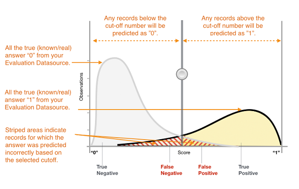

We are no longer updating the Amazon Machine Learning service or accepting
new users for it. This documentation is available for existing users, but we are
no longer updating it. For more information, see [What is Amazon Machine Learning](what-is-amazon-machine-learning.md "what-is-amazon-machine-learning.md").

# Binary Classification

The actual output of many binary classification algorithms is a prediction score. The score indicates the
system’s certainty that the given observation belongs to the positive class. To make the decision about
whether the observation should be classified as positive or negative, as a consumer of this score, you will
interpret the score by picking a classification threshold (cut-off) and compare the score against it.
Any observations with scores higher than the threshold are then predicted as the positive class and scores lower
than the threshold are predicted as the negative class.

Figure 1: Score Distribution for a Binary Classification Model

The predictions now fall into four groups based on the actual known answer and the predicted answer:
correct positive predictions (true positives), correct negative predictions (true negatives), incorrect positive
predictions (false positives) and incorrect negative predictions (false negatives).

Binary classification accuracy metrics quantify the two types of correct predictions and two types of errors.
Typical metrics are accuracy (ACC), precision, recall, false positive rate, F1-measure. Each metric
measures a different aspect of the predictive model. Accuracy (ACC) measures the fraction of correct
predictions. Precision measures the fraction of actual positives among those examples that are predicted as
positive. Recall measures how many actual positives were predicted as positive. F1-measure is the
harmonic mean of precision and recall.

AUC is a different type of metric. It measures the ability of the model to predict a higher score for positive
examples as compared to negative examples. Since AUC is independent of the selected threshold, you can
get a sense of the prediction performance of your model from the AUC metric without picking a threshold.

Depending on your business problem, you might be more interested in a model that performs well for a
specific subset of these metrics. For example, two business applications might have very different
requirements for their ML models:

- One application might need to be extremely sure about the positive predictions actually being
  positive (high precision) and be able to afford to misclassify some positive examples as negative
  (moderate recall).
- Another application might need to correctly predict as many positive examples as possible (high recall) and will accept some negative examples being misclassified as positive (moderate precision).
  In Amazon ML, observations get a predicted score in the range [0,1]. The score threshold to
  make the decision of classifying examples as 0 or 1 is set by default to be 0.5. Amazon ML
  allows you to review the implications of choosing different score thresholds and allows you to pick an
  appropriate threshold that matches your business need.
