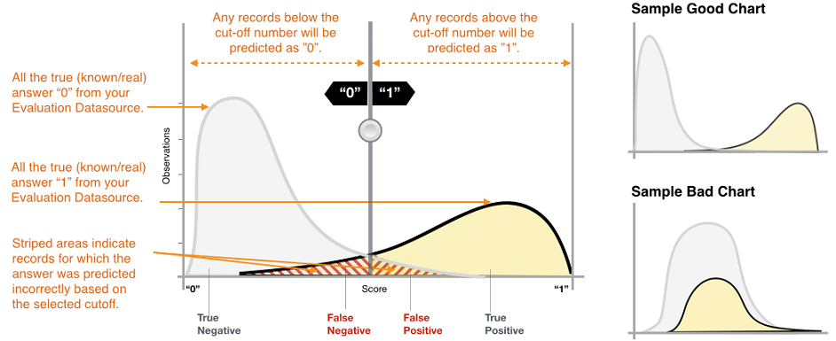

We are no longer updating the Amazon Machine Learning service or accepting
new users for it. This documentation is available for existing users, but we are
no longer updating it. For more information, see [What is Amazon Machine Learning](what-is-amazon-machine-learning.md "what-is-amazon-machine-learning.md").

# Binary Model Insights

## Interpreting the Predictions

The actual output of many binary classification algorithms is a
prediction _score_. The score indicates the system's certainty that the
given observation belongs to the positive class (the actual target value
is 1). Binary classification models in Amazon ML output a score that
ranges from 0 to 1. As a consumer of this score, to make the decision
about whether the observation should be classified as 1 or 0, you
interpret the score by picking a classification threshold, or _cut-off,_
and compare the score against it. Any observations with scores higher
than the cut-off are predicted as target= 1, and scores lower than the
cut-off are predicted as target= 0.

In Amazon ML, the default score cut-off is 0.5. You can choose to update
this cut-off to match your business needs. You can use the
visualizations in the console to understand how the choice of cut-off
will affect your application.

### Measuring ML Model Accuracy

Amazon ML provides an industry-standard accuracy metric for binary
classification models called Area Under the (Receiver Operating
Characteristic) Curve (AUC). AUC measures the ability of the model to
predict a higher score for positive examples as compared to negative
examples. Because it is independent of the score cut-off, you can get a
sense of the prediction accuracy of your model from the AUC metric
without picking a threshold.

The AUC metric returns a decimal value from 0 to 1. AUC values near 1
indicate an ML model that is highly accurate. Values near 0.5 indicate
an ML model that is no better than guessing at random. Values near 0 are
unusual to see, and typically indicate a problem with the data.
Essentially, an AUC near 0 says that the ML model has learned the
correct patterns, but is using them to make predictions that are flipped
from reality ('0's are predicted as '1's and vice versa). For more
information about AUC, go to the [Receiver operating
characteristic](http://en.wikipedia.org/wiki/Receiver_operating_characteristic "http://en.wikipedia.org/wiki/Receiver_operating_characteristic")
page on Wikipedia.

The baseline AUC metric for a binary model is 0.5. It is the value for a
hypothetical ML model that randomly predicts a 1 or 0 answer. Your
binary ML model should perform better than this value to begin to be
valuable.

### Using the Performance Visualization

To explore the accuracy of the ML model, you can review the graphs on
the **Evaluation** page on the Amazon ML console. This page shows you
two histograms: a) a histogram of the scores for the actual positives
(the target is 1) and b) a histogram of scores for the actual negatives
(the target is 0) in the evaluation data.

An ML model that has good predictive accuracy will predict higher scores
to the actual 1s and lower scores to the actual 0s. A perfect model will
have the two histograms at two different ends of the x-axis showing that
actual positives all got high scores and actual negatives all got low
scores. However, ML models make mistakes, and a typical graph will show
that the two histograms overlap at certain scores. An extremely poor
performing model will be unable to distinguish between the positive and
negative classes, and both classes will have mostly overlapping
histograms.

Using the visualizations, you can identify the number of predictions
that fall into the two types of correct predictions and the two types of
incorrect predictions.

**Correct Predictions**

- True positive (TP): Amazon ML predicted the value as 1, and the true
  value is 1.
- True negative (TN): Amazon ML predicted the value as 0, and the true
  value is 0.

**Erroneous Predictions**

- False positive (FP): Amazon ML predicted the value as 1, but the true
  value is 0.
- False negative (FN): Amazon ML predicted the value as 0, but the true
  value is 1.

###### Note

The number of TP, TN, FP, and FN depends on the selected score
threshold, and optimizing for any of one of these numbers would mean
making a tradeoff on the others. A high number of TPs typically
results in a high number of FPs and a low number of TNs.

### Adjusting the Score Cut-off

ML models work by generating numeric prediction scores, and then
applying a cut-off to convert these scores into binary 0/1 labels. By
changing the score cut-off, you can adjust the model's behavior when it
makes a mistake. On the **Evaluation** page in the Amazon ML console,
you can review the impact of various score cut-offs, and you can save
the score cut-off that you would like to use for your model.

When you adjust the score cut-off threshold, observe the trade-off
between the two types of errors. Moving the cut-off to the left captures
more true positives, but the trade-off is an increase in the number of
false positive errors. Moving it to the right captures less of the false
positive errors, but the trade-off is that it will miss some true
positives. For your predictive application, you make the decision which
kind of error is more tolerable by selecting an appropriate cut-off
score.

### Reviewing Advanced Metrics

Amazon ML provides the following additional metrics to measure the
predictive accuracy of the ML model: accuracy, precision, recall, and
false positive rate.

#### Accuracy

_Accuracy_ (ACC) measures the fraction of correct predictions. The range
is 0 to 1. A larger value indicates better predictive accuracy:

#### Precision

_Precision_ measures the fraction of actual positives among those
examples that are predicted as positive. The range is 0 to 1. A larger
value indicates better predictive accuracy:

#### Recall

_Recall_ measures the fraction of actual positives that are predicted as
positive. The range is 0 to 1. A larger value indicates better
predictive accuracy:

#### False Positive Rate

The _false positive rate_ (FPR) measures the false alarm rate or the
fraction of actual negatives that are predicted as positive. The range
is 0 to 1. A smaller value indicates better predictive accuracy:

Depending on your business problem, you might be more interested in a
model that performs well for a specific subset of these metrics. For
example, two business applications might have very different
requirements for their ML model:

- One application might need to be extremely sure about the positive
  predictions actually being positive (high precision), and be able to
  afford to misclassify some positive examples as negative (moderate
  recall).
- Another application might need to correctly predict as many positive
  examples as possible (high recall), and will accept some negative
  examples being misclassified as positive (moderate precision).

Amazon ML allows you to choose a score cut-off that corresponds to a
particular value of any of the preceding advanced metrics. It also shows
the tradeoffs incurred with optimizing for any one metric. For example,
if you select a cut-off that corresponds to a high precision, you
typically will have to trade that off with a lower recall.

###### Note

You have to save the score cut-off for it to take effect on
classifying any future predictions by your ML model.
