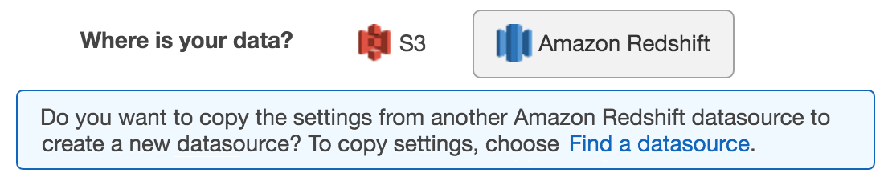

We are no longer updating the Amazon Machine Learning service or accepting
new users for it. This documentation is available for existing users, but we are
no longer updating it. For more information, see [What is Amazon Machine Learning](what-is-amazon-machine-learning.md "what-is-amazon-machine-learning.md").

# Creating a Datasource with Amazon Redshift

Data (Console)

The Amazon ML console provides two ways to create a datasource using Amazon Redshift data. You can create
a datasource by completing the Create Datasource wizard, or, if you already have a datasource
created from Amazon Redshift data, you can copy the original datasource and modify its settings. Copying
a datasource allows you to easily create multiple similar datasources.

For information about creating a datasource using the API, see [CreateDataSourceFromRedshift](../APIReference/API_CreateDataSourceFromRedshift.md "../APIReference/API_CreateDataSourceFromRedshift.md").

For more information about the parameters in the following procedures, see [Required Parameters for the Create Datasource
Wizard](redshift-parameters.md "redshift-parameters.md").

###### Topics

- [Creating a Datasource (Console)](#create-redshift-datasource "#create-redshift-datasource")
- [Copying a Datasource (Console)](#copy-redshift-datasource "#copy-redshift-datasource")

## Creating a Datasource (Console)

To unload data from Amazon Redshift into an Amazon ML datasource, use the Create Datasource wizard.

###### To create a datasource from data in Amazon Redshift

1. Open the Amazon Machine Learning console at
   [https://console.aws.amazon.com/machinelearning/](https://console.aws.amazon.com/machinelearning/ "https://console.aws.amazon.com/machinelearning/").
2. On the Amazon ML dashboard, under **Entities**, choose **Create
   new...**, and then choose **Datasource**.
3. On the **Input data** page, choose **Amazon Redshift**.
4. In the Create Datasource wizard, for **Cluster identifier**, type
   the name of your cluster.
5. For **Database name**, type the name of the Amazon Redshift database.
6. For **Database user name**, type your database username.
7. For **Database password**, type your database password.
8. For **IAM role**, choose your IAM role. If you don't already have
   one, choose **Create a new role**. Amazon ML creates an IAM Amazon Redshift role for
   you.
9. To test your Amazon Redshift settings, choose **Test Access** (next to
   **IAM role**). If Amazon ML can't connect to Amazon Redshift with the provided
   settings, you can't continue creating a datasource. For troubleshooting help, see [Troubleshooting Errors](troubleshooting.md#trouble-errors "troubleshooting.md#trouble-errors").
10. For **SQL query**, type your SQL query.
11. For **Schema location**, choose whether you want Amazon ML to create a
    schema for you. If you have created a schema yourself, type the Amazon S3 path to your schema
    file.
12. For **Amazon S3 staging location**, type the Amazon S3 path to the
    bucket where you want Amazon ML to put the data it unloads from Amazon Redshift.
13. (Optional) For **Datasource name**, type a name for your
    datasource.
14. Choose **Verify**. Amazon ML verifies that it can connect to your Amazon Redshift
    database.
15. On the **Schema** page, review the data types for all attributes
    and correct them, as necessary.
16. Choose **Continue**.
17. If you want to use this datasource to create or evaluate an ML model, for
    **Do you plan to use this dataset to create or evaluate an ML
    model?**, choose **Yes**. If you choose
    **Yes**, choose your target row. For information about targets, see
    [Using the targetAttributeName
    Field](creating-a-data-schema-for-amazon-ml.md#using-the-targetattributename-field "creating-a-data-schema-for-amazon-ml.md#using-the-targetattributename-field").

If you want to use this datasource along with a model that you have already created
to create predictions, choose **No**. 18. Choose **Continue**. 19. For **Does your data contain an identifier?**, if your data doesn't
contain a row identifier, choose **No**.

If your data does contain a row identifier, choose **Yes**. For
information about row identifiers, see [Using the rowID Field](creating-a-data-schema-for-amazon-ml.md#using-the-rowid-field "creating-a-data-schema-for-amazon-ml.md#using-the-rowid-field"). 20. Choose **Review**. 21. On the **Review** page, review your settings, and then choose
**Finish**.

After you have created a datasource, you can use it to [create an ML model](creating-ml-model-on-the-amazon-ml-console.md "creating-ml-model-on-the-amazon-ml-console.md"). If you
have already created a model, you can use the datasource to [evaluate an ML model](evaluating_models.md "evaluating_models.md") or [generate predictions](interpreting_predictions.md "interpreting_predictions.md").

## Copying a Datasource (Console)

When you want to create a datasource that is similar to an existing datasource, you can
use the Amazon ML console to copy the original datasource and modify its settings. For example,
you might choose to start with an existing datasource, and then modify the data schema to
match your data more closely; change the SQL query used to unload data from Amazon Redshift; or specify
a different AWS Identity and Access Management (IAM) user to access the Amazon Redshift cluster.

###### To copy and modify an Amazon Redshift datasource

1. Open the Amazon Machine Learning console at
   [https://console.aws.amazon.com/machinelearning/](https://console.aws.amazon.com/machinelearning/ "https://console.aws.amazon.com/machinelearning/").
2. On the Amazon ML dashboard, under **Entities**, choose **Create
   new...**, and then choose **Datasource**.
3. On the **Input data** page, for **Where is your
   data?**, choose **Amazon Redshift**. If you already have a datasource
   created from Amazon Redshift data, you have the option of copying settings from another datasource.

If you don't already have a datasource created from Amazon Redshift data, this option doesn't
appear. 4. Choose **Find a datasource**. 5. Select the datasource that you want to copy, and choose **Copy
settings**. Amazon ML auto-populates most of the datasource settings with settings
from the original datasource. It doesn't copy the database password, schema location, or
datasource name from the original datasource. 6. Modify any of the auto-populated settings that you want to change. For example, if
you want to change the data that Amazon ML unloads from Amazon Redshift, change the SQL query. 7. For **Database password**, type your database password. Amazon ML
doesn't store or reuse your password, so you must always provide it. 8. (Optional) For **Schema location**, Amazon ML pre-selects **I
want Amazon ML to generate a recommended schema** for you. If you have already
created a schema, choose **I want to use the schema that I created and stored in
Amazon S3** and type the path to your schema file in Amazon S3. 9. (Optional) For **Datasource name**, type a name for your
datasource. Otherwise, Amazon ML generates a new datasource name for you. 10. Choose **Verify**. Amazon ML verifies that it can connect to your Amazon Redshift
database. 11. (Optional) If Amazon ML inferred the schema for you, on the **Schema**
page, review the data types for all attributes and correct them, as necessary. 12. Choose **Continue**. 13. If you want to use this datasource to create or evaluate an ML model, for
**Do you plan to use this dataset to create or evaluate an ML
model?**, choose **Yes**. If you choose
**Yes**, choose your target row. For information about targets, see
[Using the targetAttributeName
Field](creating-a-data-schema-for-amazon-ml.md#using-the-targetattributename-field "creating-a-data-schema-for-amazon-ml.md#using-the-targetattributename-field").

If you want to use this datasource along with a model that you have already created
to create predictions, choose **No**. 14. Choose **Continue**. 15. For **Does your data contain an identifier?**, if your data doesn't
contain a row identifier, choose **No**.

If your data contains a row identifier, choose **Yes**, and select
the row that you want to use as an identifier. For information about row identifiers,
see [Using the rowID Field](creating-a-data-schema-for-amazon-ml.md#using-the-rowid-field "creating-a-data-schema-for-amazon-ml.md#using-the-rowid-field"). 16. Choose **Review**. 17. Review your settings, and then choose **Finish**.

After you have created a datasource, you can use it to [create an ML model](creating-ml-model-on-the-amazon-ml-console.md "creating-ml-model-on-the-amazon-ml-console.md"). If you
have already created a model, you can use the datasource to [evaluate an ML model](evaluating_models.md "evaluating_models.md") or [generate predictions](interpreting_predictions.md "interpreting_predictions.md").
