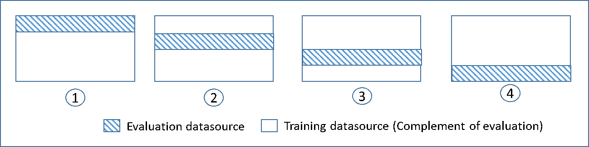

We are no longer updating the Amazon Machine Learning service or accepting
new users for it. This documentation is available for existing users, but we are
no longer updating it. For more information, see [What is Amazon Machine Learning](what-is-amazon-machine-learning.md "what-is-amazon-machine-learning.md").

# Cross-Validation

Cross-validation is a technique for evaluating ML models by training several ML models on subsets of the available
input data and evaluating them on the complementary subset of the data. Use cross-validation to detect
overfitting, ie, failing to generalize a pattern.

In Amazon ML, you can use the k-fold cross-validation method to perform cross-validation. In k-fold
cross-validation, you split the input data into k subsets of data (also known as folds).

You train an ML model on all but one (k-1) of the subsets, and then
evaluate the model on the subset that was not used for training. This process is repeated k times, with a
different subset reserved for evaluation (and excluded from training) each time.

The following diagram shows an example of the training subsets and complementary evaluation subsets
generated for each of the four models that are created and trained during a 4-fold cross-validation. Model one
uses the first 25 percent of data for evaluation, and the remaining 75 percent for training. Model two uses
the second subset of 25 percent (25 percent to 50 percent) for evaluation, and the remaining three subsets
of the data for training, and so on.


Each model is trained and evaluated using complementary datasources - the data in the evaluation datasource
includes and is limited to all of the data that is not in the training datasource. You create datasources for
each of these subsets with the `DataRearrangement` parameter in the
`createDatasourceFromS3`,
`createDatasourceFromRedShift`, and `createDatasourceFromRDS` APIs. In
the `DataRearrangement` parameter, specify which subset of data to include in a datasource by specifying
where to begin and end each segment. To create the complementary
datasources required for a 4k-fold cross validation, specify the `DataRearrangement`
parameter as shown in the following example:

**Model one:**

Datasource for evaluation:

```
{"splitting":{"percentBegin":0, "percentEnd":25}}
```

Datasource for training:

```
{"splitting":{"percentBegin":0, "percentEnd":25, "complement":"true"}}
```

**Model two:**

Datasource for evaluation:

```
{"splitting":{"percentBegin":25, "percentEnd":50}}
```

Datasource for training:

```
{"splitting":{"percentBegin":25, "percentEnd":50, "complement":"true"}}
```

**Model three:**

Datasource for evaluation:

```
{"splitting":{"percentBegin":50, "percentEnd":75}}
```

Datasource for training:

```
{"splitting":{"percentBegin":50, "percentEnd":75, "complement":"true"}}
```

**Model four:**

Datasource for evaluation:

```
{"splitting":{"percentBegin":75, "percentEnd":100}}
```

Datasource for training:

```
{"splitting":{"percentBegin":75, "percentEnd":100, "complement":"true"}}
```

Performing a 4-fold cross-validation generates four models, four datasources to train the models, four
datasources to evaluate the models, and four evaluations, one for each model.
Amazon ML generates a model performance metric for each evaluation. For example, in a 4-fold cross-validation
for a binary classification problem, each of the evaluations reports an area under curve (AUC) metric.
You can get the overall performance measure by computing the average of the four AUC metrics.
For information about the AUC metric, see [Measuring ML Model Accuracy](binary-model-insights.md#measuring-ml-model-accuracy "binary-model-insights.md#measuring-ml-model-accuracy").

For sample code that
shows how to create a cross-validation and average the model scores, see
the [Amazon ML sample
code](https://github.com/awslabs/machine-learning-samples "https://github.com/awslabs/machine-learning-samples").

## Adjusting Your Models

After you have cross-validated the models, you can adjust the settings
for the next model if your model does not perform to your standards. For more information about overfitting, see [Model Fit: Underfitting vs. Overfitting](model-fit-underfitting-vs-overfitting.md "model-fit-underfitting-vs-overfitting.md"). For more information about
regularization, see [Regularization](training-parameters1.md#regularization "training-parameters1.md#regularization"). For more
information on changing the regularization settings, see [Creating an ML Model with Custom
Options](creating-ml-model-on-the-amazon-ml-console.md#creating-ml-model-using-custom-settings "creating-ml-model-on-the-amazon-ml-console.md#creating-ml-model-using-custom-settings").
