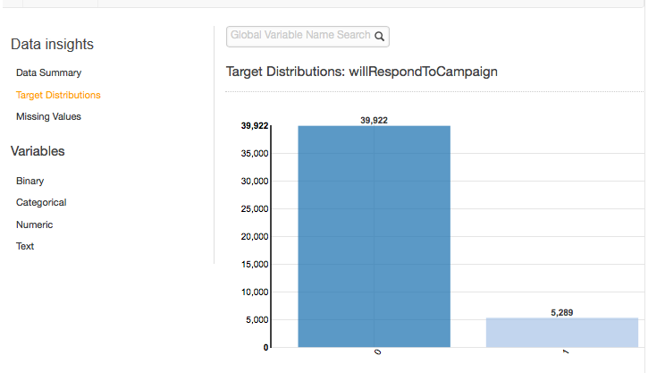
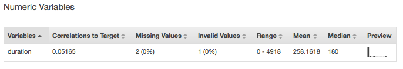
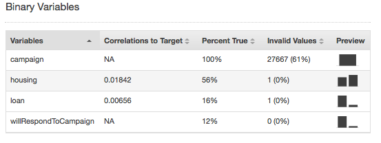
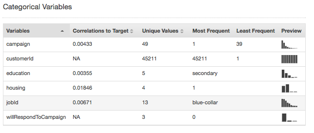
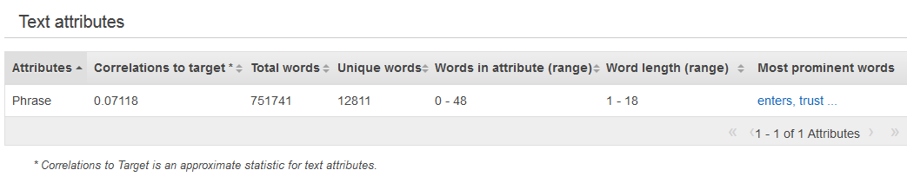
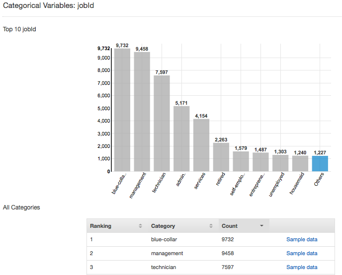
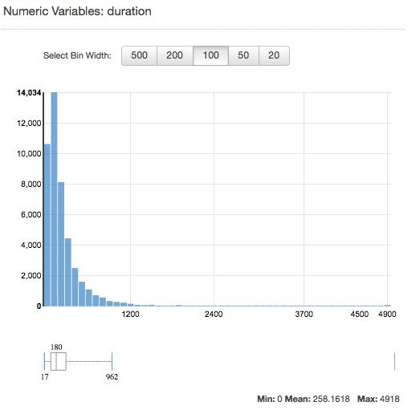
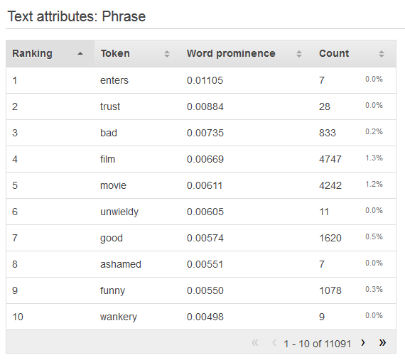

We are no longer updating the Amazon Machine Learning service or accepting
new users for it. This documentation is available for existing users, but we are
no longer updating it. For more information, see [What is Amazon Machine Learning](what-is-amazon-machine-learning.md "what-is-amazon-machine-learning.md").

# Data Insights

Amazon ML computes descriptive statistics on your input data that you can use to understand your
data.

## Descriptive Statistics

Amazon ML computes the following descriptive statistics for different attribute types:

Numeric:

- Distribution histograms
- Number of invalid values
- Minimum, median, mean, and maximum values

Binary and categorical:

- Count (of distinct values per category)
- Value distribution histogram
- Most frequent values
- Unique values counts
- Percentage of true value (binary only)
- Most prominent words
- Most frequent words

Text:

- Name of the attribute
- Correlation to target (if a target is set)
- Total words
- Unique words
- Range of the number of words in a row
- Range of word lengths
- Most prominent words

## Accessing Data Insights on the Amazon ML console

On the Amazon ML console, you can choose the name or ID of any datasource to view its
**Data Insights** page. This page provides metrics and
visualizations that enable you to learn about the input data associated with the datasource,
including the following information:

- Data summary
- Target distributions
- Missing values
- Invalid values
- Summary statistics of variables by data type
- Distributions of variables by data type

The following sections describe the metrics and visualizations in greater detail.

### Data Summary

The data summary report of a datasource displays summary information, including the
datasource ID, name, where it was completed, current status, target attribute, input data
information (S3 bucket location, data format, number of records processed and number of bad
records encountered during processing) as well as the number of variables by data type.

### Target Distributions

The target distributions report shows the distribution of the target attribute of the
datasource. In the following example, there are 39,922 observations where the
willRespondToCampaign target attribute equals 0. This is the number of customers who did not
respond to the email campaign. There are 5,289 observations where willRespondToCampaign
equals 1. This is the number of customers who responded to the email campaign.



### Missing Values

The missing values report lists the attributes in the input data for which values are
missing. Only attributes with numeric data types can have missing values. Because missing
values can affect the quality of training an ML model, we recommend that missing values be
provided, if possible.

During ML model training, if the target attribute is missing, Amazon ML rejects the
corresponding record. If the target attribute is present in the record, but a value for
another numeric attribute is missing, then Amazon ML overlooks the missing value. In this case,
Amazon ML creates a substitute attribute and sets it to 1 to indicate that this attribute is
missing. This allows Amazon ML to learn patterns from the occurrence of missing values.

### Invalid Values

Invalid values can occur only with Numeric and Binary data types. You can find invalid
values by viewing the summary statistics of variables in the data type reports. In the
following examples, there is one invalid value in the duration Numeric attribute and two
invalid values in the Binary data type (one in the housing attribute and one in the loan
attribute).





### Variable-Target Correlation

After you create a datasource, Amazon ML can evaluate the datasource and identify the
correlation, or impact, between variables and the target. For example, the price of a
product might have a significant impact on whether or not it is a best seller, while the
dimensions of the product might have little predictive power.

It is generally a best practice to include as many variables in your training data as
possible. However, the noise introduced by including many variables with little predictive
power might negatively affect the quality and accuracy of your ML model.

You might be able to improve the predictive performance of your model by removing
variables that have little impact when you train your model. You can define which variables
are made available to the machine learning process in a _recipe_, which
is a transformation mechanism of Amazon ML. To learn more about recipes, see [Data Transformation for Machine Learning](transforming_data.md "transforming_data.md").

### Summary Statistics of Attributes by Data Type

In the data insights report, you can view attribute summary statistics by the following
data types:

- Binary
- Categorical
- Numeric
- Text

Summary statistics for the Binary data type show all binary attributes. The **Correlations to target** column shows the information shared
between the target column and the attribute column. The **Percent
true** column shows the percentage of observations that have value 1. The
**Invalid values** column shows the number of invalid
values as well as the percentage of invalid values for each attribute. The
**Preview** column provides a link to a graphical distribution for each
attribute.


Summary statistics for the Categorical data type show all Categorical attributes with
the number of unique values, most frequent value, and least frequent value. The
**Preview** column provides a link to a graphical distribution for each
attribute.



Summary statistics for the Numeric data type show all Numeric attributes with the number
of missing values, invalid values, range of values, mean, and median. The
**Preview** column provides a link to a graphical distribution for each
attribute.


Summary statistics for the Text data type show all of the Text attributes, the total number
of words in that attribute, the number of unique words in that attribute, the range of words
in an attribute, the range of word lengths, and the most prominent words. The
**Preview** column provides a link to a graphical distribution for each
attribute.



The next example shows the Text data type statistics for a text variable called review,
with four records.

```
1. The fox jumped over the fence.
2. This movie is intriguing.
3.
4. Fascinating movie.
```

The columns for this example would show the following information.

- The **Attributes** column shows the name of the variable. In this
  example, this column would say "review."
- The **Correlations to target** column exists only if a target is
  specified. Correlation measures the amount of information this attribute provides about
  the target. The higher the correlation, the more this attribute tells you about the
  target. Correlation is measured in terms of mutual information between a simplified
  representation of the text attribute and the target.
- The **Total words** column shows the number of words generated from
  tokenizing each record, delimiting the words by white space. In this example, this
  column would say "12".
- The **Unique words** column shows the number of unique words for an
  attribute. In this example, this column would say "10."
- The **Words in attribute (range)** column shows the number of words
  in a single row in the attribute. In this example, this column would say "0-6."
- The **Word length (range)** column shows the range of how many
  characters are in the words. In this example, this column would say "2-11."
- The **Most prominent words** column shows a ranked list of words
  that appear in the attribute. If there is a target attribute, words are ranked by their
  correlation to the target, meaning that the words that have the highest correlation are
  listed first. If no target is present in the data, then the words are ranked by their
  entropy.

### Understanding the Distribution of Categorical and Binary Attributes

By clicking the **Preview** link associated with a categorical or
binary attribute, you can view that attribute's distribution as well as the sample data from
the input file for each categorical value of the attribute.

For example, the following screenshot shows the distribution for the categorical
attribute jobId. The distribution displays the top 10 categorical values, with all other
values grouped as "other". It ranks each of the top 10 categorical values with the
number of observations in the input file that contain that value, as well as a link to view
sample observations from the input data file.



### Understanding the Distribution of Numeric Attributes

To view the distribution of a numeric attribute, click the **Preview**
link of the attribute. When viewing the distribution of a numeric attribute, you can choose
bin sizes of 500, 200, 100, 50, or 20. The larger the bin size, the smaller number of bar
graphs that will be displayed. In addition, the resolution of the distribution will be
coarse for large bin sizes. In contrast, setting the bucket size to 20 increases the
resolution of the displayed distribution.

The minimum, mean, and maximum values are also displayed, as shown in the following
screenshot.



### Understanding the

Distribution of Text Attributes

To view the distribution of a text attribute, click the **Preview**
link of the attribute. When viewing the distribution of a text attribute, you will see the
following information.



**Ranking**

Text tokens are ranked by the amount of information they convey, most informative
to least informative.

**Token**

Token shows the word from the input text that the row of statistics is
about.

**Word prominence**

If there is a target attribute, words are ranked by their correlation to the
target, so that words that have the highest correlation are listed first. If no
target is present in the data, then the words are ranked by their entropy, ie,
the amount of information they can communicate.

**Count number**

Count number shows the number of input records that the token appeared in.

**Count percentage**

Count percentage shows the percentage of input data rows the token appeared
in.
