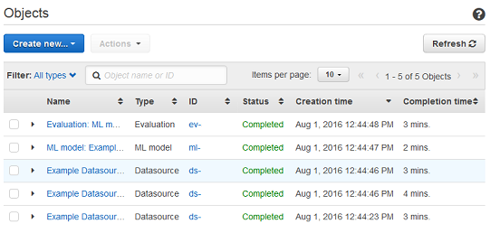

We are no longer updating the Amazon Machine Learning service or accepting
new users for it. This documentation is available for existing users, but we are
no longer updating it. For more information, see [What is Amazon Machine Learning](what-is-amazon-machine-learning.md "what-is-amazon-machine-learning.md").

# Listing Objects

For in-depth information about your Amazon Machine Learning (Amazon ML) datasources, ML models, evaluations,
and batch predictions, list them. For each object, you will see its name, type, ID, status code,
and creation time. You can also see details that are specific to a particular object type. For
example, you can see the Data insights for a datasource.

## Listing Objects (Console)

To see a list of the last 1,000 objects that you've created, in the Amazon ML console, open
the **Objects** dashboard. To display the **Objects**
dashboard, log into the Amazon ML console.

To see more details about an object, including details that are specific to that object
type, choose the object's name or ID.

For example, to see the **Data insights** for a datasource, choose the
datasource name.

The columns on the **Objects** dashboard show the following information
about each object.

**Name**

The name of the object.

**Type**

The type of object. Valid values include **Datasource**,
**ML model**, **Evaluation**, and **Batch
prediction**.

###### Note

To see whether a model is set up to support real-time predictions, go to the
**ML model summary** page by choosing the name or model ID.

**ID**

The ID of the object.

**Status**

The status of the object. Values include **Pending**, **In
Progress**, **Completed**, and **Failed**.
If the status is **Failed**, check your data and try again.

**Creation time**

The date and time when Amazon ML finished creating this object.

**Completion time**

The length of time it took Amazon ML to create this object. You can use the completion
time of a model to estimate the training time for a new model.

**Datasource ID**

For objects that were created using a datasource, such as models and evaluations,
the ID of the datasource. If you delete the datasource, you can no longer use ML models
created with that datasource to create predictions.

Sort by any column by choosing the double-triangle icon next to the column header.

## Listing Objects (API)

In the [Amazon ML API](../APIReference.md "../APIReference.md"), you can list objects, by type, by using
the following operations:

- `DescribeDataSources`
- `DescribeMLModels`
- `DescribeEvaluations`
- `DescribeBatchPredictions`

Each operation includes parameters for filtering, sorting, and paginating through a long
list of objects. There is no limit to the number of objects that you can access through the
API. To limit the size of the list, use the `Limit` parameter, which can take a
maximum value of 100.

The API response to a `Describe*` command includes a pagination token
(`nextPageToken`), if appropriate, and brief descriptions of each object. The
object descriptions include the same information
for each of the object types that is displayed in the console, including details that are
specific to an object type.

###### Note

Even if the response includes fewer objects than the specified limit, it might include a
`nextPageToken` that indicates that more results are available. Even a response
that contains 0 items might contain a `nextPageToken`.

For more information, see the [Amazon ML API Reference](../APIReference.md "../APIReference.md").
