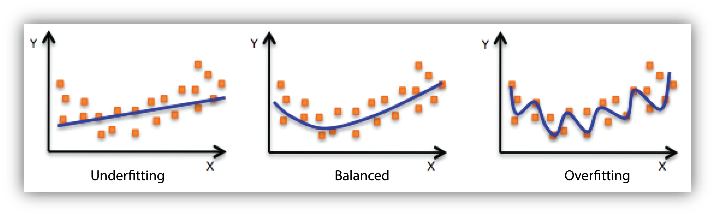

We are no longer updating the Amazon Machine Learning service or accepting
new users for it. This documentation is available for existing users, but we are
no longer updating it. For more information, see [What is Amazon Machine Learning](what-is-amazon-machine-learning.md "what-is-amazon-machine-learning.md").

# Model Fit: Underfitting vs. Overfitting

Understanding model fit is important for understanding the root cause for poor model accuracy. This
understanding will guide you to take corrective steps. We can determine whether a predictive model is
underfitting or overfitting the training data by looking at the prediction error on the training data and the
evaluation data.

Your model is _underfitting_ the training data when the model performs poorly on the training data. This is
because the model is unable to capture the relationship between the input examples (often called X) and the
target values (often called Y). Your model is _overfitting_ your training data when you see that the model
performs well on the training data but does not perform well on the evaluation data. This is because the
model is memorizing the data it has seen and is unable to generalize to unseen examples.

Poor performance on the training data could be because the model is too simple (the input features are not
expressive enough) to describe the target well. Performance can be improved by increasing model
flexibility. To increase model flexibility, try the following:

- Add new domain-specific features and more feature Cartesian products, and change the types of
  feature processing used (e.g., increasing n-grams size)
- Decrease the amount of regularization used
  If your model is overfitting the training data, it makes sense to take actions that reduce model flexibility. To
  reduce model flexibility, try the following:

- Feature selection: consider using fewer feature combinations, decrease n-grams size, and decrease
  the number of numeric attribute bins.
- Increase the amount of regularization used.
  Accuracy on training and test data could be poor because the learning algorithm did not have enough data
  to learn from. You could improve performance by doing the following:

- Increase the amount of training data examples.
- Increase the number of passes on the existing training data.
