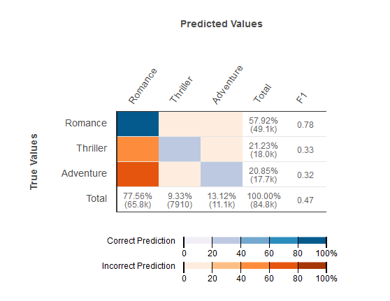

We are no longer updating the Amazon Machine Learning service or accepting
new users for it. This documentation is available for existing users, but we are
no longer updating it. For more information, see [What is Amazon Machine Learning](what-is-amazon-machine-learning.md "what-is-amazon-machine-learning.md").

# Multiclass Classification

Unlike the process for binary classification problems, you do not need to choose a score threshold to make
predictions. The predicted answer is the class (i.e., label) with the highest predicted score. In some cases,
you might want to use the predicted answer only if it is predicted with a high score. In this case, you might
choose a threshold on the predicted scores based on which you will accept the predicted answer or not.

Typical metrics used in multiclass are the same as the metrics used in the binary classification case. The
metric is calculated for each class by treating it as a binary classification problem after grouping all the
other classes as belonging to the second class. Then the binary metric is averaged over all the classes to get
either a macro average (treat each class equally) or weighted average (weighted by class frequency) metric.
In Amazon ML, the macro average F1-measure is used to evaluate the predictive success of
a multiclass classifier.

Figure 2: Confusion Matrix for a multiclass classification model

It is useful to review the _confusion matrix_ for multiclass problems. The confusion matrix is a table that shows each class in the evaluation data and the number or percentage of correct predictions and incorrect
predictions.
