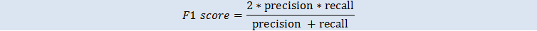
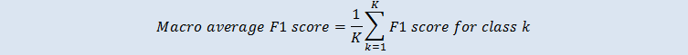

We are no longer updating the Amazon Machine Learning service or accepting
new users for it. This documentation is available for existing users, but we are
no longer updating it. For more information, see [What is Amazon Machine Learning](what-is-amazon-machine-learning.md "what-is-amazon-machine-learning.md").

# Multiclass Model Insights

## _Interpreting the Predictions_

The actual output of a multiclass classification algorithm is a set of
prediction _scores_. The scores indicate the model's certainty that the
given observation belongs to each of the classes. Unlike for binary
classification problems, you do not need to choose a score cut-off to
make predictions. The predicted answer is the class (for example, label)
with the highest predicted score.

### Measuring ML Model Accuracy

Typical metrics used in multiclass are the same as the metrics used in
the binary classification case after averaging them over all classes. In
Amazon ML, the macro-average F1 score is used to evaluate the predictive
accuracy of a multiclass metric.

#### Macro Average F1 Score

F1 score is a binary classification metric that considers both binary
metrics precision and recall. It is the harmonic mean between precision
and recall. The range is 0 to 1. A larger value indicates better
predictive accuracy:

The macro average F1 score is the unweighted average of the F1-score
over all the classes in the multiclass case. It does not take into
account the frequency of occurrence of the classes in the evaluation
dataset. A larger value indicates better predictive accuracy. The
following example shows K classes in the evaluation datasource:

Baseline Macro Average F1 Score

Amazon ML provides a baseline metric for multiclass models. It is the
macro average F1 score for a hypothetical multiclass model that would
always predict the most frequent class as the answer. For example, if
you were predicting the genre of a movie and the most common genre in
your training data was Romance, then the baseline model would always
predict the genre as Romance. You would compare your ML model against
this baseline to validate if your ML model is better than an ML model
that predicts this constant answer.

### Using the Performance Visualization

Amazon ML provides a _confusion matrix_ as a way to visualize the
accuracy of multiclass classification predictive models. The confusion
matrix illustrates in a table the number or percentage of correct and
incorrect predictions for each class by comparing an observation's
predicted class and its true class.

For example, if you are trying to classify a movie into a genre, the
predictive model might predict that its genre (class) is Romance.
However, its true genre actually might be Thriller. When you evaluate
the accuracy of a multiclass classification ML model, Amazon ML
identifies these misclassifications and displays the results in the
confusion matrix, as shown in the following illustration.

The following information is displayed in a confusion matrix:

- **Number of correct and incorrect predictions for each class:** Each
  row in the confusion matrix corresponds to the metrics for one of the
  true classes. For example, the first row shows that for movies that
  are actually in the Romance genre, the multiclass ML model gets the
  predictions right for over 80% of the cases. It incorrectly predicts
  the genre as Thriller for less than 20% of the cases, and Adventure
  for less than 20% of the cases.
- **Class-wise F1-score**: The last column shows the F1-score for each
  of the classes.
- **True class-frequencies in the evaluation data**: The second to last
  column shows that in the evaluation dataset, 57.92% of the
  observations in the evaluation data is Romance, 21.23% is Thriller,
  and 20.85% is Adventure.
- **Predicted class-frequencies for the evaluation data**: The last row
  shows the frequency of each class in the predictions. 77.56% of the
  observations is predicted as Romance, 9.33% is predicted as Thriller,
  and 13.12% is predicted as Adventure.

The Amazon ML console provides a visual display that accommodates up to
10 classes in the confusion matrix, listed in order of most frequent to
least frequent class in the evaluation data. If your evaluation data has
more than 10 classes, you will see the top 9 most frequently occurring
classes in the confusion matrix, and all other classes will be collapsed
into a class called "others." Amazon ML also provides the ability to
download the full confusion matrix through a link on the multiclass
visualizations page.
