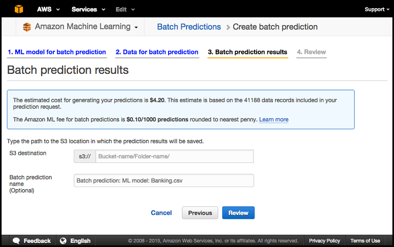
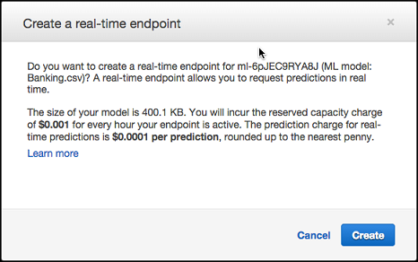

We are no longer updating the Amazon Machine Learning service or accepting
new users for it. This documentation is available for existing users, but we are
no longer updating it. For more information, see [What is Amazon Machine Learning](what-is-amazon-machine-learning.md "what-is-amazon-machine-learning.md").

# Pricing for Amazon ML

With AWS services, you pay only for what you use. There are no minimum fees and no upfront
commitments.

Amazon Machine Learning (Amazon ML) charges an hourly rate for the compute time used to compute data statistics
and train and evaluate models, and then you pay for the number of predictions generated for your
application. For real-time predictions, you also pay an hourly reserved capacity charge based on
the size of your model.

Amazon ML estimates the costs for predictions only in the [Amazon ML console](https://console.aws.amazon.com/machinelearning/ "https://console.aws.amazon.com/machinelearning/").

For more information about Amazon ML pricing, see [_Amazon Machine Learning
Pricing_](https://aws.amazon.com/machine-learning/pricing/ "https://aws.amazon.com/machine-learning/pricing/").

###### Topics

- [Estimating Batch Prediction Cost](#w2aab7c20c14 "#w2aab7c20c14")
- [Estimating Real-Time Prediction Cost](#w2aab7c20c16 "#w2aab7c20c16")

## Estimating Batch Prediction Cost

When you request batch predictions from an Amazon ML model using the Create Batch Prediction
wizard, Amazon ML estimates the cost of these predictions. The method to compute the estimate
varies based on the type of data that is available.

### Estimating Batch Prediction Cost When Data Statistics Are Available

The most accurate cost estimate is obtained when Amazon ML has already computed summary
statistics on the datasource used to request predictions. These statistics are always
computed for datasources that have been created using the Amazon ML console. API users must set
the `ComputeStatistics` flag to `True` when creating datasources
programmatically using the [CreateDataSourceFromS3](../APIReference/API_CreateDataSourceFromS3.md "../APIReference/API_CreateDataSourceFromS3.md"), [CreateDataSourceFromRedshift](../APIReference/API_CreateDataSourceFromRedshift.md "../APIReference/API_CreateDataSourceFromRedshift.md"), or the [CreateDataSourceFromRDS](../APIReference/API_CreateDataSourceFromRDS.md "../APIReference/API_CreateDataSourceFromRDS.md") APIs. The datasource must be in the `READY`
state for the statistics to be available.

One of the statistics that Amazon ML computes is the number of data records. When the number
of data records is available, the Amazon ML Create Batch Prediction wizard estimates the number
of predictions by multiplying the number of data records by the [fee for batch
predictions](https://aws.amazon.com/machine-learning/pricing/ "https://aws.amazon.com/machine-learning/pricing/").

Your actual cost may vary from this estimate for the following reasons:

- Some of the data records might fail processing. You are not billed for predictions
  from failed data records.
- The estimate doesn't take into account pre-existing credits or other adjustments
  that are applied by AWS.

### Estimating Batch Prediction Cost When Only Data Size Is Available

When you request a batch prediction and the data statistics for the request datasource
are not available, Amazon ML estimates the cost based on the following:

- The total data size that is computed and persisted during datasource
  validation
- The average data record size, which Amazon ML estimates by reading and parsing the first
  100 MB of your data file

To estimate the cost of your batch prediction, Amazon ML divides the total data size by the
average data record size. This method of cost prediction is less precise than the method
used when the number of data records is available because the first records of your data
file might not accurately represent the average record size.

### Estimating Batch Prediction Cost When Neither Data Statistics nor Data Size Are

Available

When neither data statistics nor the data size are available, Amazon ML cannot estimate the
cost of your batch predictions. This is commonly the case when the data source you are using
to request batch predictions has not yet been validated by Amazon ML. This can happen when you
have created a datasource that is based on an Amazon Redshift (Amazon Redshift) or Amazon Relational Database Service (Amazon RDS) query,
and the data transfer has not yet completed, or when datasource creation is queued up behind
other operations in your account. In this case, the Amazon ML console informs you about the fees
for batch prediction. You can choose to proceed with the batch prediction request without an
estimate, or to cancel the wizard and return after the datasource used for predictions is in
the INPROGRESS or READY state.

## Estimating Real-Time Prediction Cost

When you create a real-time prediction endpoint using the Amazon ML console, you will be shown
the estimated reserve capacity charge, which is an ongoing charge for reserving the endpoint
for prediction processing. This charge varies based on the size of the model, as explained on
the [service pricing
page](https://aws.amazon.com/machine-learning/pricing/ "https://aws.amazon.com/machine-learning/pricing/"). You will also be informed about the standard Amazon ML real-time prediction charge.

