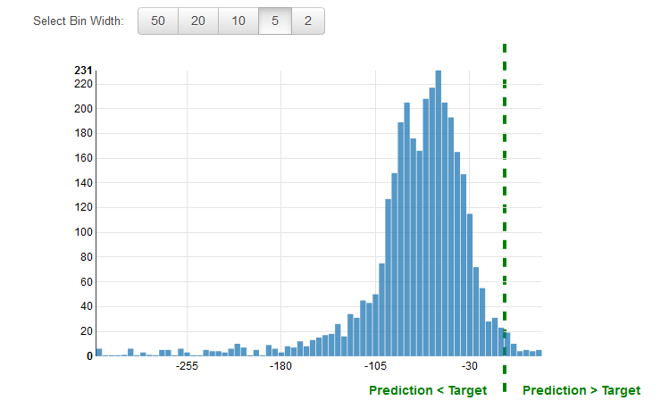

We are no longer updating the Amazon Machine Learning service or accepting
new users for it. This documentation is available for existing users, but we are
no longer updating it. For more information, see [What is Amazon Machine Learning](what-is-amazon-machine-learning.md "what-is-amazon-machine-learning.md").

# Regression Model Insights

## _Interpreting the Predictions_

The output of a regression ML model is a numeric value for the model's
prediction of the target. For example, if you are predicting housing
prices, the prediction of the model could be a value such as 254,013.

###### Note

The range of predictions can differ from the range of the target in
the training data. For example, let's say you are predicting housing
prices, and the target in the training data had values in a range
from 0 to 450,000. The predicted target need not be in the same
range, and might take any positive value (greater than 450,000) or
negative value (less than zero). It is important to plan how to
address prediction values that fall outside a range that is
acceptable for your application.

### Measuring ML Model Accuracy

For regression tasks, Amazon ML uses the industry standard root mean
square error (RMSE) metric. It is a distance measure between the
predicted numeric target and the actual numeric answer (ground truth).
The smaller the value of the RMSE, the better is the predictive accuracy
of the model. A model with perfectly correct predictions would have an
RMSE of 0. The following example shows evaluation data that contains N
records:

Baseline RMSE

Amazon ML provides a baseline metric for regression models. It is the
RMSE for a hypothetical regression model that would always predict the
mean of the target as the answer. For example, if you were predicting
the age of a house buyer and the mean age for the observations in your
training data was 35, the baseline model would always predict the answer
as 35. You would compare your ML model against this baseline to validate
if your ML model is better than a ML model that predicts this constant
answer.

### Using the Performance Visualization

It is common practice to review the _residuals_ for regression problems.
A residual for an observation in the evaluation data is the difference
between the true target and the predicted target. Residuals represent
the portion of the target that the model is unable to predict. A
positive residual indicates that the model is underestimating the target
(the actual target is larger than the predicted target). A negative
residual indicates an overestimation (the actual target is smaller than
the predicted target). The histogram of the residuals on the evaluation
data when distributed in a bell shape and centered at zero indicates
that the model makes mistakes in a random manner and does not
systematically over or under predict any particular range of target
values. If the residuals do not form a zero-centered bell shape, there
is some structure in the model's prediction error. Adding more variables
to the model might help the model capture the pattern that is not
captured by the current model. The following illustration shows
residuals that are not centered around zero.

